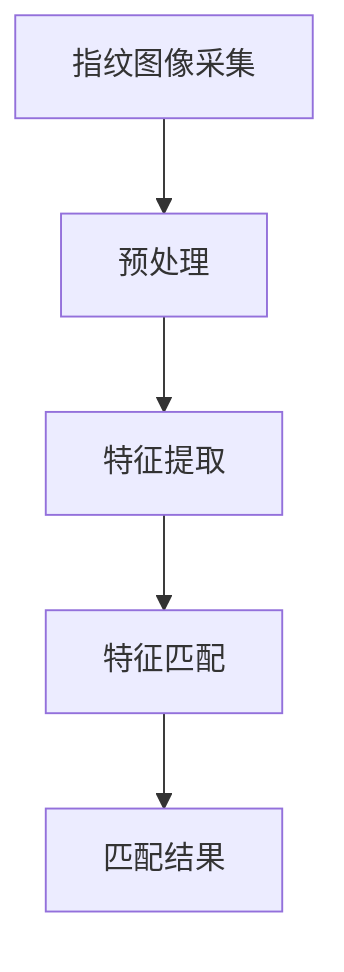
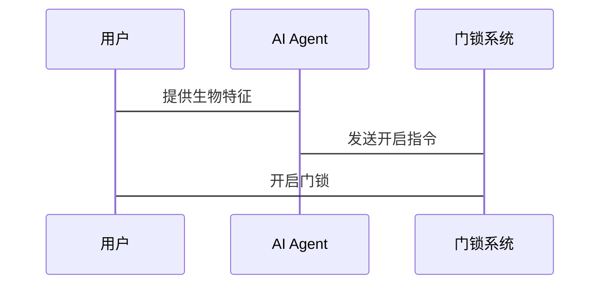

                 

# 智能门锁：AI Agent的生物识别技术

> 关键词：智能门锁, AI Agent, 生物识别技术, 指纹识别, 人脸识别, 虹膜识别

> 摘要：本文深入探讨了智能门锁中AI Agent与生物识别技术的结合，分析了生物识别技术的核心算法原理，展示了系统架构设计，并通过项目实战详细讲解了实现过程。文章还讨论了优化与安全、未来趋势等内容，为读者提供了全面的技术视角。

---

# 第一部分: 智能门锁与AI Agent的背景介绍

## 第1章: 智能门锁的发展历程

### 1.1 传统门锁的局限性

#### 1.1.1 传统门锁的功能与不足
传统门锁主要依赖机械结构进行开关控制，存在以下不足：
- **安全性**：容易被暴力破坏或技术开启。
- **便利性**：钥匙丢失或损坏后，开门需要专业人员处理。
- **维护成本**：需要定期维护和更换零件。

#### 1.1.2 传统门锁的安全性问题
传统门锁的安全性依赖于物理结构的复杂性，容易被暴力破坏或技术手段绕过。例如，通过万能钥匙或暴力撬锁等方式，传统的机械锁安全性能较低。

#### 1.1.3 传统门锁的维护成本
传统门锁需要定期维护，如钥匙更换、锁芯调整等，增加了使用成本和维护复杂性。

### 1.2 智能门锁的定义与特点

#### 1.2.1 智能门锁的定义
智能门锁是一种结合了电子技术和机械结构的门禁系统，能够通过电子信号控制门锁的开关状态。

#### 1.2.2 智能门锁的核心特点
- **电子控制**：通过电子信号进行控制，支持远程操作。
- **智能化**：集成传感器和处理器，能够识别用户身份。
- **安全性**：采用生物识别技术，提高安全性。

#### 1.2.3 智能门锁与传统门锁的对比
| 特性             | 传统门锁                 | 智能门锁                 |
|------------------|--------------------------|--------------------------|
| 开启方式         | 机械钥匙               | 电子信号（如指纹、人脸识别） |
| 安全性           | 较低                    | 较高                    |
| 维护成本         | 高                     | 低                     |

### 1.3 生物识别技术的引入

#### 1.3.1 生物识别技术的定义
生物识别技术是指通过测量和分析生物特征（如指纹、人脸、虹膜等）来识别人体身份的技术。

#### 1.3.2 生物识别技术的分类
- **指纹识别**：通过采集和分析指纹图像特征进行身份识别。
- **人脸识别**：基于面部特征的识别技术。
- **虹膜识别**：通过虹膜的结构特征进行识别。

#### 1.3.3 生物识别技术在智能门锁中的应用
生物识别技术在智能门锁中的应用主要体现在用户身份识别和权限管理方面，提高了门锁的安全性和便利性。

---

## 第2章: AI Agent在智能门锁中的作用

### 2.1 AI Agent的定义与特点

#### 2.1.1 AI Agent的定义
AI Agent（人工智能代理）是指能够感知环境、自主决策并执行任务的智能体。

#### 2.1.2 AI Agent的核心特点
- **自主性**：能够自主决策和行动。
- **反应性**：能够实时感知环境并做出反应。
- **学习能力**：通过数据学习和优化。

#### 2.1.3 AI Agent与传统门锁的结合
AI Agent通过与智能门锁的结合，实现了远程控制、用户识别和异常检测等功能。

### 2.2 AI Agent在智能门锁中的应用场景

#### 2.2.1 智能门锁的远程控制
AI Agent通过网络连接实现对门锁的远程控制，用户可以通过手机APP或其他设备进行操作。

#### 2.2.2 AI Agent的用户识别与权限管理
AI Agent通过生物识别技术进行用户身份识别，并根据权限设置控制门锁的开启。

#### 2.2.3 AI Agent的异常检测与报警
AI Agent能够实时监测门锁的状态，发现异常情况（如强行撬锁）时触发报警机制。

---

## 第3章: 智能门锁与生物识别技术的结合

### 3.1 生物识别技术的分类与应用

#### 3.1.1 指纹识别技术
指纹识别是通过采集和分析指纹图像特征进行身份识别的技术。

#### 3.1.2 人脸识别技术
人脸识别是基于面部特征的识别技术，通常使用摄像头采集人脸图像进行分析。

#### 3.1.3 虹膜识别技术
虹膜识别是通过分析虹膜的结构特征进行身份识别的技术。

### 3.2 AI Agent与生物识别技术的结合方式

#### 3.2.1 生物识别数据的采集与处理
AI Agent通过传感器采集生物特征数据，并进行预处理和特征提取。

#### 3.2.2 AI Agent对生物识别数据的分析与决策
AI Agent利用机器学习算法对生物特征数据进行分析，生成识别结果并做出决策。

#### 3.2.3 AI Agent与生物识别技术的协同工作
AI Agent与生物识别技术协同工作，实现用户身份识别、权限管理等功能。

---

# 第二部分: 生物识别技术的核心原理

## 第4章: 生物识别技术的算法原理

### 4.1 指纹识别算法

#### 4.1.1 指纹特征提取的数学模型
指纹特征提取模型可以表示为：
$$
L_{i} = f(I_{i}, P_{i})
$$
其中，$L_{i}$ 表示第 $i$ 个指纹的特征向量，$I_{i}$ 是输入的指纹图像，$P_{i}$ 是预处理参数。

#### 4.1.2 指纹匹配的流程图

---

## 第5章: 人脸识别算法

### 5.1 人脸识别的数学模型
人脸识别的数学模型可以表示为：
$$
y = f(x; \theta)
$$
其中，$x$ 是输入的面部图像，$y$ 是输出的识别结果，$\theta$ 是模型参数。

---

## 第6章: 虹膜识别算法

### 6.1 虹膜识别的数学模型
虹膜识别的数学模型可以表示为：
$$
p(y|x) = \text{softmax}(f(x; \theta))
$$
其中，$x$ 是输入的虹膜图像，$y$ 是输出的识别结果，$f$ 是特征提取函数。

---

# 第三部分: 系统架构设计

## 第7章: 系统架构设计

### 7.1 系统功能设计
系统功能设计包括用户身份识别、权限管理、远程控制等功能。

### 7.2 系统架构图

---

## 第8章: 系统接口设计

### 8.1 系统接口设计
系统接口设计包括与传感器、网络和用户界面的交互接口。

### 8.2 系统交互流程图

---

## 第9章: 项目实战

### 9.1 环境搭建
项目实战需要搭建开发环境，安装必要的工具和库。

### 9.2 核心实现
核心实现包括生物特征采集、处理和识别算法的实现。

### 9.3 测试与优化
测试生物识别算法的性能，并进行优化。

---

## 第10章: 优化与安全

### 10.1 性能优化
优化生物识别算法的性能，提高识别速度和准确性。

### 10.2 安全性提升
增强系统的安全性，防止数据泄露和攻击。

---

## 第11章: 未来趋势

### 11.1 新技术的影响
未来生物识别技术的发展趋势，如3D人脸识别、AI芯片的优化等。

### 11.2 挑战与机遇
分析智能门锁在生物识别技术应用中的挑战和机遇。

---

## 第12章: 总结与注意事项

### 12.1 总结
总结全文，强调智能门锁与AI Agent结合的重要性。

### 12.2 注意事项
提醒读者在实际应用中需要注意的安全和维护问题。

---

## 第13章: 推荐资源与扩展阅读

### 13.1 推荐资源
推荐相关的书籍、论文和技术博客，供读者进一步学习。

### 13.2 拓展阅读
探讨生物识别技术的其他应用场景和未来发展方向。

---

作者：AI天才研究院/AI Genius Institute & 禅与计算机程序设计艺术 /Zen And The Art of Computer Programming

---

通过以上目录结构和内容的详细说明，您可以根据需要进一步扩展每个部分的具体内容，确保文章的深度和广度符合要求。

