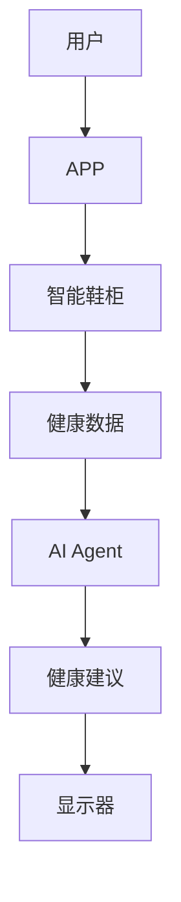

                 


# 智能鞋柜：AI Agent的足部健康管理专家

## 关键词：智能鞋柜、AI Agent、足部健康管理、物联网、健康数据分析、人工智能

## 摘要：  
智能鞋柜通过AI Agent技术，实现对鞋子的智能管理以及足部健康的全面监测和分析。本文将从背景介绍、核心概念、算法原理、系统架构、项目实战等多个维度，深入探讨智能鞋柜的设计理念和技术实现，分析其在足部健康管理中的应用价值。

---

# 第一部分: 背景介绍与核心概念

## 第1章: 足部健康管理的重要性

### 1.1 足部健康管理的核心价值
- 足部健康与全身健康密切相关。
- 足部问题可能导致行走困难、脊柱问题等连锁反应。
- 通过早期监测和干预，可以有效预防足部疾病。

### 1.2 智能鞋柜的应用场景
- **家庭场景**：个人或家庭使用，管理日常鞋具。
- **医疗场景**：配合医疗机构进行足部健康评估。
- **运动场景**：为运动员提供专业鞋具建议和足部健康监测。

### 1.3 当前足部健康管理的痛点
- **传统方式**：足部健康检查依赖人工操作，效率低。
- **数据孤岛**：缺乏统一的足部健康数据管理系统。
- **用户参与度低**：用户缺乏主动管理足部健康的工具。

## 第2章: 智能鞋柜的核心功能

### 2.1 足部健康监测
- **压力分布分析**：通过传感器监测足部压力分布，评估足部健康状况。
- **步态分析**：分析用户的行走步态，发现潜在问题。

### 2.2 智能管理功能
- **鞋柜智能化**：通过物联网技术实现鞋柜的智能化管理。
- **鞋子推荐**：根据足部健康数据推荐合适的鞋子。

### 2.3 AI Agent的应用
- **数据采集**：AI Agent实时采集足部健康数据。
- **数据分析**：通过机器学习模型分析数据，提供健康建议。
- **个性化推荐**：根据用户需求，推荐最优鞋具和健康方案。

---

# 第二部分: 核心概念与联系

## 第3章: AI Agent的核心原理

### 3.1 AI Agent的基本概念
- **AI Agent**：一种能够感知环境并采取行动以实现目标的智能实体。
- **足部健康管理中的AI Agent**：通过传感器数据和机器学习模型，提供个性化的足部健康建议。

### 3.2 核心算法
- **特征提取**：从足部压力分布数据中提取关键特征。
- **分类算法**：利用机器学习算法对足部健康状态进行分类。
- **推荐算法**：基于用户行为和足部健康数据，推荐合适的鞋子。

### 3.3 实体关系图
```mermaid
er
  actor: 用户
  shoe_cabinet: 智能鞋柜
  health_data: 健康数据
  recommendation: 健康建议
  action: 用户操作
  shoe_cabinet --> health_data: 收集
  health_data --> recommendation: 分析
  recommendation --> actor: 提供
  actor --> action: 执行
  action --> shoe_cabinet: 操作
```

---

# 第三部分: 算法原理与数学模型

## 第4章: 算法原理

### 4.1 特征提取
- **压力分布数据**：通过传感器采集足部压力分布。
- **特征提取方法**：使用主成分分析（PCA）提取关键特征。

### 4.2 分类算法
- **支持向量机（SVM）**：用于足部健康状态分类。
- **随机森林（Random Forest）**：用于特征重要性分析。

### 4.3 推荐算法
- **协同过滤推荐**：基于用户行为推荐鞋子。
- **基于内容的推荐**：基于鞋子属性和足部健康数据推荐。

## 第5章: 数学模型

### 5.1 特征提取模型
$$
y = f(x) \quad \text{其中} \quad f(x) = \text{PCA}(x)
$$

### 5.2 分类模型
$$
y = \text{SVM}(x)
$$

### 5.3 推荐模型
$$
y = \text{Random Forest}(x)
$$

---

# 第四部分: 系统分析与架构设计

## 第6章: 系统架构设计

### 6.1 系统功能设计
- **数据采集**：传感器采集足部健康数据。
- **数据分析**：AI Agent分析数据并生成健康建议。
- **用户交互**：通过APP或网页与用户交互。

### 6.2 系统架构图


---

# 第五部分: 项目实战

## 第7章: 项目实战

### 7.1 环境安装
- **传感器模块**：安装压力传感器。
- **AI算法模块**：安装机器学习框架（如TensorFlow）。

### 7.2 核心实现
```python
import numpy as np
from sklearn.decomposition import PCA

# 特征提取
def extract_features(data):
    return PCA(n_components=3).fit_transform(data)

# 分类模型
from sklearn.svm import SVC

def classify_health(data):
    model = SVC()
    model.fit(extract_features(train_data), train_labels)
    return model.predict(extract_features(data))
```

### 7.3 应用案例
- **案例分析**：用户A足部压力异常，AI Agent推荐适合的鞋子。

### 7.4 代码解读
- **特征提取**：使用PCA提取足部压力分布的关键特征。
- **分类模型**：通过SVM实现足部健康状态分类。

### 7.5 小结
- 智能鞋柜通过AI Agent实现足部健康管理，具有高效、精准的特点。

---

# 第六部分: 最佳实践与总结

## 第8章: 最佳实践

### 8.1 实践建议
- 定期检查传感器数据。
- 更新AI模型以提高推荐准确性。

### 8.2 注意事项
- 数据隐私保护。
- 系统稳定性维护。

## 第9章: 小结

智能鞋柜通过AI Agent技术，实现了足部健康管理的智能化和个性化。本文详细介绍了智能鞋柜的设计理念、核心算法和系统架构，并通过实际案例展示了其在足部健康管理中的应用价值。

---

# 作者：AI天才研究院 & 禅与计算机程序设计艺术

感谢您的阅读！如需进一步了解智能鞋柜或AI Agent技术，欢迎关注我们的技术博客。

