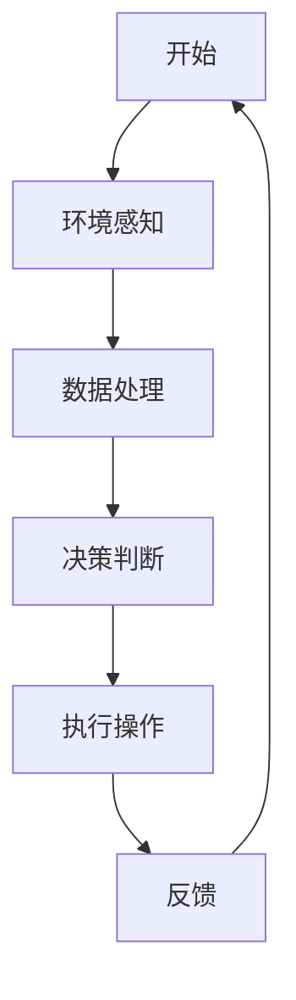
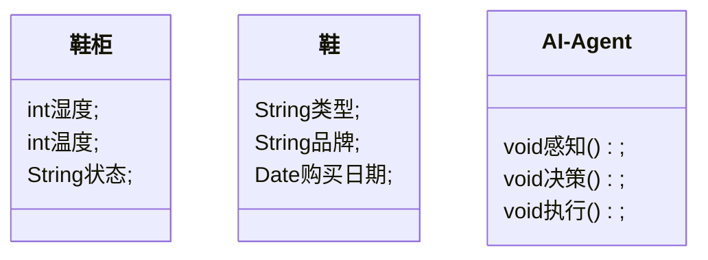
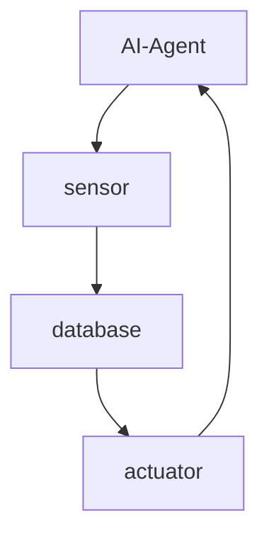
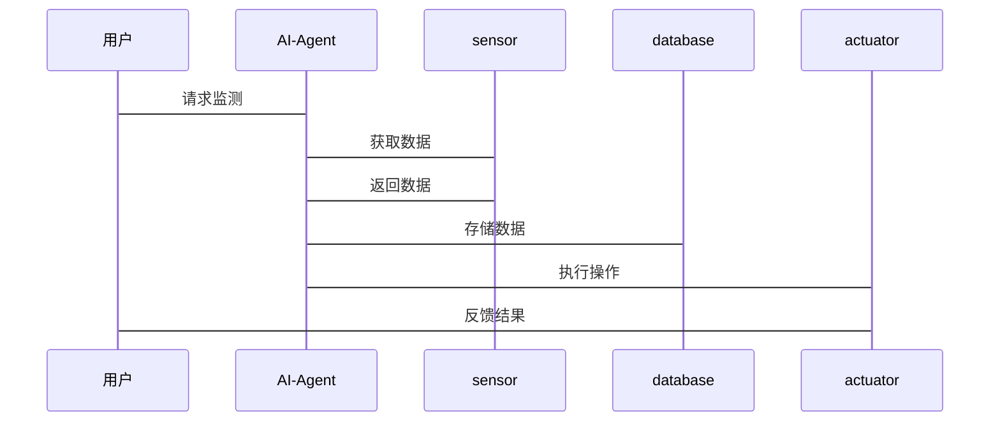

                 


# 《智能鞋柜：AI Agent的鞋履保养专家》

## 关键词：智能鞋柜，AI Agent，鞋履保养，环境感知，算法原理，系统架构

## 摘要：本文深入探讨了智能鞋柜的设计与应用，重点介绍了AI Agent在鞋履保养中的作用。从背景到算法，从系统架构到实战案例，全面解析智能鞋柜的核心技术与实际应用，为读者提供系统的知识和见解。

---

# 第一部分：智能鞋柜的背景与概念

## 第1章：智能鞋柜的背景介绍

### 1.1 问题背景与描述

#### 1.1.1 鞋履保养的痛点与挑战
鞋履保养是一个长期被忽视的问题，潮湿、灰尘和不当存放导致鞋损坏，传统鞋柜功能单一，无法满足保养需求。

#### 1.1.2 智能化鞋柜的需求与目标
用户对鞋柜的智能化需求日益增长，智能鞋柜应运而生，目标是通过AI技术实现自动化保养。

#### 1.1.3 边界与外延
智能鞋柜专注于鞋的存放与保养，不涉及其他物品，边界清晰。

### 1.2 问题解决与核心概念

#### 1.2.1 AI Agent在鞋柜中的应用
AI Agent通过环境感知、决策和执行，实现鞋柜的智能化管理。

#### 1.2.2 智能鞋柜的核心功能与价值
- **环境感知**：湿度、温度监测，防止鞋损坏。
- **智能决策**：AI算法优化存储策略。
- **自动化执行**：自动调整存储条件。

#### 1.2.3 系统的组成与核心要素
- **传感器**：采集环境数据。
- **AI Agent**：处理数据并决策。
- **执行机构**：调整存储条件。

## 第2章：智能鞋柜的核心概念与联系

### 2.1 AI Agent的核心原理

#### 2.1.1 感知与数据采集
通过传感器获取环境数据，如湿度和温度。

#### 2.1.2 决策与算法
AI Agent根据数据做出决策，优化存储策略。

#### 2.1.3 执行与反馈
执行机构调整存储条件，反馈系统优化。

### 2.2 核心概念对比

#### 2.2.1 传统鞋柜与智能鞋柜的功能对比
| 功能 | 传统鞋柜 | 智能鞋柜 |
|------|-----------|-----------|
| 存储 | 基本存储 | 智能存储 |
| 保养 | 无 | 自动保养 |
| 管理 | 手动 | 智能管理 |

#### 2.2.2 AI Agent与其他智能设备的差异
AI Agent具备自主决策能力，而传统设备仅执行预设指令。

### 2.3 实体关系图
```mermaid
er
    shoeCabinet
    shoe
    user
    sensor
    actuator
    database
    AI-Agent
    shoeCondition
    maintenanceRecord
    shoeType
    maintenancePlan
    notification
    ruleEngine
    statusUpdate
    feedback
```

---

# 第二部分：AI Agent的算法与数学模型

## 第3章：AI Agent的算法原理

### 3.1 算法流程


### 3.2 算法实现
```python
class AI-Agent:
    def __init__(self):
        self.sensors = []
        self actuators = []
        self.data = {}

    def感知(self):
        # 获取环境数据
        self.data = [传感器读取]

    def决策(self):
        # 数据处理和决策
        if湿度>60:
            返回调整湿度
        else:
            返回无需调整

    def执行(self):
        # 执行操作
        actuator调整湿度

# 示例
agent = AI-Agent()
agent.感知()
agent.决策()
agent.执行()
```

### 3.3 数学模型

#### 3.3.1 概率模型
$$P(A|B) = \frac{P(B|A)P(A)}{P(B)}$$

#### 3.3.2 贝叶斯定理
$$P(B|A) = \frac{P(A|B)P(B)}{P(A)}$$

---

## 第4章：数学模型与公式

### 4.1 概率模型
- **条件概率**：$$P(A|B)$$
- **联合概率**：$$P(A,B)$$
- **边缘概率**：$$P(A)$$

### 4.2 案例分析
假设湿度超过60%的概率为0.7，AI Agent调整湿度的概率为0.8，最终湿度降低的概率为：
$$P(湿度降低) = P(AI Agent调整湿度 | 湿度>60\%) \times P(湿度>60\%) = 0.8 \times 0.7 = 0.56$$

---

# 第三部分：系统分析与架构设计方案

## 第5章：系统分析与架构设计

### 5.1 问题场景介绍
用户希望智能鞋柜自动监测并调整存储环境，延长鞋的使用寿命。

### 5.2 领域模型


### 5.3 系统架构设计


### 5.4 接口设计
- **输入接口**：传感器数据。
- **输出接口**：执行机构指令。

### 5.5 交互序列图


---

# 第四部分：项目实战

## 第6章：项目实战

### 6.1 环境搭建
安装Python和必要的库，如paho-mqtt用于通信。

### 6.2 核心代码实现

```python
import paho.mqtt.client as mqtt

class Sensor:
    def读取湿度(self):
        return 65

class Actuator:
    def调整湿度(self, value):
        print(f"调整湿度到{value}%")

class AI-Agent:
    def __init__(self):
        self.sensor = Sensor()
        self.actuator = Actuator()

    def感知(self):
        return self.sensor.读取湿度()

    def决策(self, 湿度):
        if湿度 > 60:
            return "调整湿度到50%"
        else:
            return "无需调整"

    def执行(self, 指令):
        if指令 == "调整湿度到50%":
            self.actuator.调整湿度(50)

# 实例化并运行
agent = AI-Agent()
湿度 = agent.感知()
指令 = agent.决策(湿度)
agent.执行(指令)
```

### 6.3 案例分析
湿度65%，AI Agent调整到50%，降低鞋子损坏风险。

### 6.4 小结
通过代码实现AI Agent的基本功能，验证了算法的有效性。

---

# 第五部分：最佳实践

## 第7章：最佳实践

### 7.1 小结
智能鞋柜通过AI Agent实现自动化保养，显著提升用户体验。

### 7.2 注意事项
- 数据准确性：传感器数据需精确。
- 系统稳定性：确保长期稳定运行。
- 用户隐私：保护用户数据安全。

### 7.3 未来展望
- 更多传感器：如紫外线杀菌功能。
- AI优化：增强学习算法提升决策能力。
- 多设备协同：与智能家居联动。

### 7.4 拓展阅读
推荐书籍：《人工智能：一种现代的方法》和《Python机器学习实战》。

---

# 结语

智能鞋柜通过AI Agent实现鞋履保养的智能化，解决了传统鞋柜的痛点，提升了用户体验。本文详细介绍了其背景、算法、系统架构和实际应用，为读者提供了系统的知识和见解。

---

**作者：AI天才研究院 & 禅与计算机程序设计艺术**

