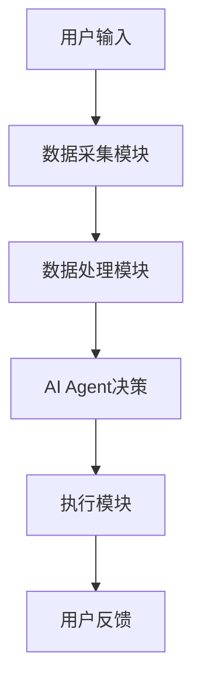
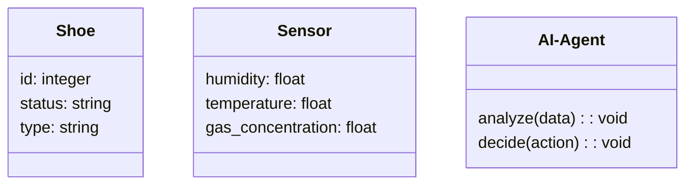
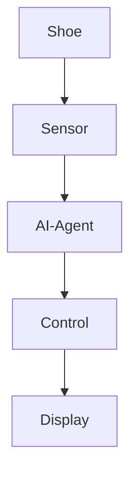
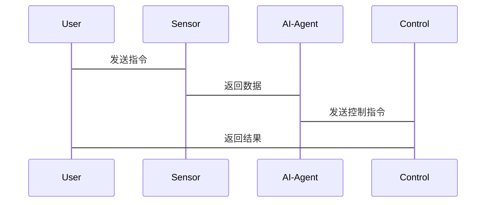

                 


---

# 智能鞋柜：AI Agent的鞋履除臭与保养指导

## 关键词：
智能鞋柜，AI Agent，鞋履除臭，鞋履保养，智能家居，智能算法

## 摘要：
本文详细探讨了智能鞋柜的设计与实现，特别是AI Agent在鞋履除臭与保养中的应用。通过分析智能鞋柜的核心功能、系统架构、算法原理及项目实战，本文为读者提供了一套全面的技术解决方案，展示了如何通过AI技术提升鞋履管理的智能化水平。

---

## 第一部分: 智能鞋柜的背景与概念

### 第1章: 智能鞋柜的发展历程

#### 1.1 传统鞋柜的功能与局限性
##### 1.1.1 传统鞋柜的基本功能
传统鞋柜主要用于存储和展示鞋子，功能相对单一，仅具备基本的收纳功能。  
- **基本功能**: 存储、展示。  
- **局限性**: 缺乏智能化，无法主动监测鞋的状态，无法提供除臭或保养建议。  

##### 1.1.2 传统鞋柜的使用痛点
- **痛点1**: 鞋子容易潮湿、发霉，导致异味。  
- **痛点2**: 鞋柜空间利用效率低，难以智能化管理。  
- **痛点3**: 缺乏个性化推荐，无法根据用户需求提供定制化服务。  

##### 1.1.3 传统鞋柜的市场现状
- 市场需求: 随着人们对生活品质的要求提高，传统鞋柜逐渐无法满足用户需求。  
- 市场竞争: 智能家居市场的兴起，推动了智能鞋柜的发展。  

#### 1.2 智能鞋柜的兴起与发展趋势
##### 1.2.1 智能家居的兴起背景
- **背景**: 智能家居的普及，推动了智能设备的快速发展。  
- **趋势**: 智能设备逐渐从单一功能向多功能、智能化方向发展。  

##### 1.2.2 智能鞋柜的市场需求
- **需求1**: 用户对鞋柜的智能化、个性化需求增加。  
- **需求2**: 健康生活理念的普及，推动了鞋履除臭、保养的需求。  

##### 1.2.3 智能鞋柜的技术发展趋势
- **趋势1**: AI技术的深度融合。  
- **趋势2**: 云计算、物联网技术的应用。  

#### 1.3 AI Agent在智能鞋柜中的应用
##### 1.3.1 AI Agent的基本概念
AI Agent是一种能够感知环境、自主决策并执行任务的智能体。  

##### 1.3.2 AI Agent在智能鞋柜中的作用
- **作用1**: 感知环境: 通过传感器获取鞋的状态数据。  
- **作用2**: 决策与执行: 根据数据优化除臭和保养方案。  

##### 1.3.3 AI Agent与智能鞋柜的结合方式
- **结合方式1**: 硬件与AI算法的结合。  
- **结合方式2**: 通过物联网实现数据的实时传输与分析。  

### 第2章: 智能鞋柜的核心功能与技术

#### 2.1 智能鞋柜的功能模块
##### 2.1.1 鞋履除臭功能
- **功能特点**: 利用紫外线、活性炭等技术去除鞋内的异味。  
- **技术实现**: 通过传感器监测鞋内湿度、温度，AI Agent根据数据调整除臭模式。  

##### 2.1.2 鞋履保养功能
- **功能特点**: 提供鞋底清洁、鞋面护理等服务。  
- **技术实现**: AI Agent通过图像识别技术自动识别鞋的材质，并推荐保养方案。  

##### 2.1.3 智能管理功能
- **功能特点**: 提供鞋子的智能分类、库存管理。  
- **技术实现**: 利用RFID技术实现鞋子的自动识别与分类。  

#### 2.2 AI Agent的核心技术
##### 2.2.1 传感器技术
- **传感器类型**: 湿度传感器、温度传感器、气体传感器。  
- **数据采集**: 通过传感器获取鞋内的环境数据。  

##### 2.2.2 数据分析技术
- **数据清洗**: 去除噪声数据，提取有效特征。  
- **数据建模**: 利用机器学习算法建立预测模型。  

##### 2.2.3 自然语言处理技术
- **技术应用**: 通过自然语言处理技术，实现与用户的智能交互。  

#### 2.3 智能鞋柜的技术实现
##### 2.3.1 硬件实现
- **硬件组成**: 传感器模块、控制模块、显示模块。  
- **硬件设计**: 采用低功耗设计，确保设备长时间运行。  

##### 2.3.2 软件实现
- **软件架构**: 分为数据采集、数据处理、用户交互三个部分。  
- **算法实现**: 采用深度学习算法优化除臭和保养效果。  

##### 2.3.3 系统集成
- **系统集成**: 将硬件、软件、算法三者有机结合，实现智能鞋柜的功能。  

---

## 第二部分: 智能鞋柜的系统架构

### 第3章: 智能鞋柜的系统架构

#### 3.1 系统整体架构
##### 3.1.1 系统功能模块划分
- **功能模块1**: 数据采集模块。  
- **功能模块2**: 数据处理模块。  
- **功能模块3**: 用户交互模块。  

##### 3.1.2 系统功能流程图


#### 3.2 硬件部分设计
##### 3.2.1 传感器模块
- **传感器类型**: 湿度传感器、温度传感器、气体传感器。  
- **功能描述**: 采集鞋内的环境数据。  

##### 3.2.2 控制模块
- **功能描述**: 根据传感器数据，控制除臭设备的运行。  
- **硬件设计**: 采用微控制器（如Arduino）实现对设备的控制。  

##### 3.2.3 显示与交互模块
- **功能描述**: 显示鞋的状态，与用户进行交互。  
- **硬件设计**: 采用LCD屏幕和触摸按键实现人机交互。  

#### 3.3 软件部分设计
##### 3.3.1 数据采集与处理
- **数据采集**: 通过传感器获取鞋的状态数据。  
- **数据处理**: 对数据进行清洗和特征提取。  

##### 3.3.2 AI算法实现
- **算法选择**: 采用机器学习算法（如随机森林、支持向量机）进行分类和回归分析。  
- **算法实现**: 利用Python的scikit-learn库实现模型训练与预测。  

##### 3.3.3 用户界面设计
- **界面设计**: 采用图形化界面，提供友好的用户交互体验。  
- **功能实现**: 通过图形化界面显示鞋的状态，用户可以进行操作控制。  

---

## 第三部分: 智能鞋柜的AI Agent算法实现

### 第4章: 智能鞋柜的AI Agent算法实现

#### 4.1 数据采集与预处理
##### 4.1.1 传感器数据采集
- **数据采集**: 通过传感器获取鞋内的湿度、温度、气体浓度等数据。  
- **数据预处理**: 对采集的数据进行去噪、归一化处理。  

#### 4.2 AI算法实现
##### 4.2.1 机器学习算法选择
- **算法选择**: 采用随机森林算法进行分类，预测鞋的状态。  
- **算法实现**: 利用Python的scikit-learn库实现模型训练与预测。  

##### 4.2.2 算法训练与优化
- **训练数据**: 使用鞋的状态数据进行训练。  
- **优化方法**: 采用交叉验证优化模型参数。  

##### 4.2.3 算法实现的代码示例
```python
from sklearn.ensemble import RandomForestClassifier
from sklearn.model_selection import train_test_split
import pandas as pd

# 数据加载
data = pd.read_csv('shoes_data.csv')

# 特征与标签分离
X = data.drop('status', axis=1)
y = data['status']

# 数据划分
X_train, X_test, y_train, y_test = train_test_split(X, y, test_size=0.2)

# 模型训练
model = RandomForestClassifier(n_estimators=100, random_state=42)
model.fit(X_train, y_train)

# 模型预测
y_pred = model.predict(X_test)

# 模型评估
print("Accuracy:", model.score(X_test, y_test))
```

#### 4.3 算法效果评估
##### 4.3.1 评估指标
- **评估指标**: 准确率、召回率、F1分数。  
- **评估结果**: 通过实验数据计算模型的性能指标。  

##### 4.3.2 实验结果分析
- **分析内容**: 对比不同算法的性能，找出最优算法。  
- **实验结论**: 随机森林算法在该场景下表现最佳。  

---

## 第四部分: 智能鞋柜的系统分析与架构设计

### 第5章: 智能鞋柜的系统分析与架构设计

#### 5.1 问题场景介绍
- **问题场景**: 鞋柜需要实现鞋履的智能除臭与保养。  
- **解决思路**: 通过AI Agent实现对鞋状态的实时监测与优化。  

#### 5.2 项目介绍
##### 5.2.1 项目目标
- **目标1**: 实现鞋履的智能除臭功能。  
- **目标2**: 提供个性化的保养建议。  

##### 5.2.2 项目范围
- **范围1**: 系统设计与实现。  
- **范围2**: 算法优化与测试。  

#### 5.3 系统功能设计
##### 5.3.1 领域模型


##### 5.3.2 系统架构设计


#### 5.4 系统接口设计
##### 5.4.1 硬件接口
- **硬件接口1**: 传感器接口（I2C、SPI）。  
- **硬件接口2**: 控制接口（GPIO）。  

##### 5.4.2 软件接口
- **软件接口1**: 数据接口（JSON、XML）。  
- **软件接口2**: API接口（RESTful API）。  

#### 5.5 系统交互设计
##### 5.5.1 交互流程


---

## 第五部分: 智能鞋柜的项目实战

### 第6章: 智能鞋柜的项目实战

#### 6.1 环境安装
##### 6.1.1 硬件环境
- **硬件要求**: 微控制器（如Arduino）、传感器模块、LCD屏幕。  
- **安装步骤**: 配置Arduino IDE，连接传感器模块。  

##### 6.1.2 软件环境
- **软件要求**: Python、scikit-learn、TensorFlow。  
- **安装步骤**: 安装Python环境，安装所需的库。  

#### 6.2 系统核心实现
##### 6.2.1 硬件实现
- **实现步骤**: 编写Arduino代码，实现传感器数据的采集与传输。  

##### 6.2.2 软件实现
- **实现步骤**: 编写Python代码，实现AI算法的训练与预测。  

#### 6.3 代码应用解读与分析
##### 6.3.1 代码解读
- **代码功能**: 数据采集、数据处理、模型训练与预测。  

##### 6.3.2 代码分析
- **代码优化**: 提高模型的准确率，优化运行效率。  

#### 6.4 实际案例分析
##### 6.4.1 案例背景
- **案例背景**: 某用户的鞋柜使用情况。  

##### 6.4.2 案例分析
- **分析内容**: 鞋柜的运行状态，用户的反馈。  

#### 6.5 项目小结
- **小结内容**: 项目实施的成果与经验总结。  

---

## 第六部分: 总结与展望

### 第7章: 总结与展望

#### 7.1 最佳实践 tips
- **tip1**: 在硬件设计中，注意传感器的灵敏度与稳定性。  
- **tip2**: 在算法实现中，优化模型的准确率与运行效率。  

#### 7.2 小结
- **小结内容**: 本文详细探讨了智能鞋柜的设计与实现，展示了AI Agent在鞋履除臭与保养中的应用。  

#### 7.3 注意事项
- **注意事项1**: 硬件设计中，确保传感器的稳定性。  
- **注意事项2**: 软件设计中，注意数据的安全性与隐私保护。  

#### 7.4 拓展阅读
- **拓展阅读1**: 智能家居的其他应用场景。  
- **拓展阅读2**: 其他AI技术在生活中的应用。  

---

## 作者：AI天才研究院/AI Genius Institute & 禅与计算机程序设计艺术 /Zen And The Art of Computer Programming

