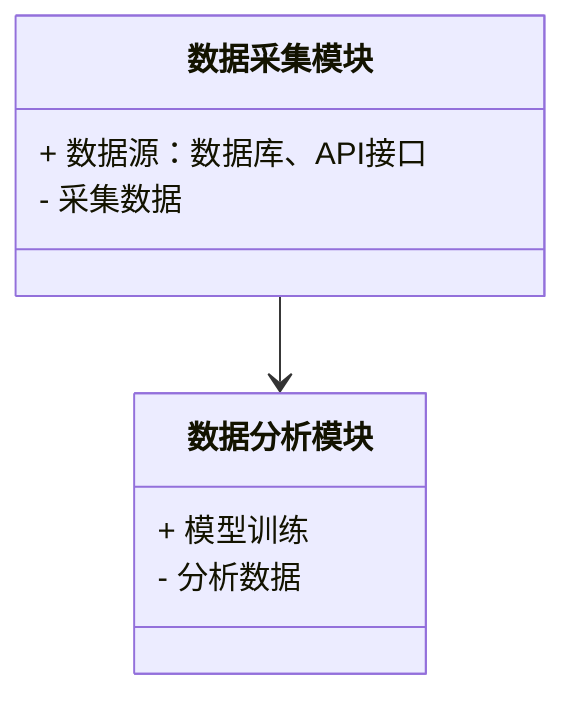

                 


# 智能风险评估AI Agent：LLM在金融领域的应用

## 关键词：智能风险评估，AI Agent，LLM，金融，风险管理系统，机器学习

## 摘要：本文探讨了大语言模型（LLM）在金融风险评估中的应用，详细介绍了智能风险评估的基本概念、技术原理、系统设计、项目实战以及高级主题。通过分析LLM的优势与挑战，本文为读者提供了从理论到实践的全面指导。

---

# 第1章: 智能风险评估与AI Agent概述

## 1.1 智能风险评估的背景与意义

### 1.1.1 风险评估的传统方法与局限性

传统金融风险评估主要依赖于统计模型和专家经验，但存在以下问题：
- 数据依赖性强，难以处理非结构化数据。
- 计算复杂，难以实时处理。
- 易受人为因素影响。

### 1.1.2 AI Agent在风险评估中的优势

AI Agent（智能代理）通过自动化数据处理和决策优化，显著提升了风险评估的效率和准确性：
- 自动化数据处理：AI Agent能够快速分析大量数据，识别潜在风险。
- 实时监控：通过实时数据分析，及时发现并应对风险。
- 智能决策：结合历史数据和当前情况，提供优化决策建议。

### 1.1.3 智能风险评估的定义与核心要素

智能风险评估是一种结合人工智能技术的评估方法，其核心要素包括：
- 数据来源：结构化和非结构化数据。
- 分析方法：机器学习、自然语言处理。
- 决策机制：基于分析结果的自动化决策。

## 1.2 大语言模型（LLM）的基本概念

### 1.2.1 什么是大语言模型

大语言模型（LLM）是基于深度学习的自然语言处理模型，具有以下特点：
- 大规模参数：通常包含 billions 量级的参数。
- 多任务能力：能够处理多种语言理解和生成任务。

### 1.2.2 LLM的核心特点与优势

- 高准确性：通过大量数据训练，模型具有较高的预测准确性。
- 可扩展性：适用于多种应用场景，如文本生成和问答系统。

### 1.2.3 LLM在金融领域的应用潜力

在金融领域，LLM可以用于风险评估、智能投顾和 fraud detection 等方面，提升金融服务的智能化水平。

## 1.3 本章小结

本章介绍了智能风险评估的背景和意义，以及大语言模型的基本概念和优势，为后续章节奠定了基础。

---

# 第2章: 大语言模型（LLM）的原理

## 2.1 LLM的基本原理

### 2.1.1 概率论基础

概率论是LLM的基础，常用概率公式包括：
- 贝叶斯定理：用于条件概率计算。
- 马尔可夫假设：假设当前状态仅依赖于前一状态。

### 2.1.2 统计学习方法

常用统计学习方法包括：
- 最大似然估计：用于参数估计。
- 贝叶斯估计：用于概率分布建模。

### 2.1.3 变压器模型（Transformer）的结构

Transformer模型由编码器和解码器组成，其核心结构包括：
- 自注意力机制：捕捉序列中的依赖关系。
- 前馈神经网络：进行非线性变换。

## 2.2 LLM的训练与优化

### 2.2.1 监督学习与无监督学习

- 监督学习：使用有标签数据进行训练。
- 无监督学习：利用未标记数据进行自监督学习。

### 2.2.2 模型训练的数学公式

训练目标是最小化损失函数，常用交叉熵损失：
$$ \mathcal{L} = -\sum_{i=1}^{n} y_i \log p(y_i) $$

优化算法通常采用Adam优化器：
$$ \theta_{t+1} = \theta_t - \eta \frac{\partial \mathcal{L}}{\partial \theta_t} $$

### 2.2.3 模型优化算法（如Adam）

Adam优化器结合了动量和自适应学习率，优化效果更佳。

## 2.3 LLM的应用与挑战

### 2.3.1 模型的可解释性问题

模型的黑箱特性使得结果难以解释。

### 2.3.2 模型的泛化能力

模型在特定领域内的泛化能力有待提升。

## 2.4 本章小结

本章详细讲解了LLM的基本原理和训练优化方法，分析了其在金融应用中的优势与挑战。

---

# 第3章: 智能风险评估的理论基础

## 3.1 概率论与统计学基础

### 3.1.1 概率分布

常用概率分布包括：
- 正态分布：用于描述连续型数据。
- 二项分布：用于描述二分类问题。

### 3.1.2 风险评估中的概率计算

使用贝叶斯定理计算条件概率：
$$ P(A|B) = \frac{P(B|A)P(A)}{P(B)} $$

### 3.1.3 回归分析

线性回归模型：
$$ y = \beta_0 + \beta_1 x + \epsilon $$

## 3.2 金融学中的风险评估方法

### 3.2.1 风险值（VaR）

VaR定义为在给定置信水平下，可能的最大损失。

### 3.2.2 信用评分模型

常用信用评分模型包括：
- FICO评分：基于信用历史和还款能力。
- 精算模型：基于概率论和统计学方法。

## 3.3 本章小结

本章介绍了智能风险评估所需的概率论、统计学和金融学基础，为后续章节的应用提供了理论支持。

---

# 第4章: AI Agent的设计与实现

## 4.1 AI Agent的设计原则

### 4.1.1 模块化设计

将系统划分为数据采集、分析和决策模块，便于维护和扩展。

### 4.1.2 可扩展性

确保系统能够适应新的数据源和应用场景。

## 4.2 系统架构设计

### 4.2.1 类图设计

使用mermaid绘制类图，展示系统模块之间的关系。



### 4.2.2 交互设计

使用mermaid绘制交互序列图，展示系统交互流程。

```mermaid
sequenceDiagram
    participant 用户
    participant 数据采集模块
    participant 数据分析模块
    用户 -> 数据采集模块：请求数据
    数据采集模块 -> 数据分析模块：传递数据
    数据分析模块 -> 用户：返回分析结果
```

## 4.3 本章小结

本章详细讲解了AI Agent的设计原则和系统架构，为实现智能风险评估系统提供了指导。

---

# 第5章: 项目实战——基于LLM的信用风险评估系统

## 5.1 项目背景与目标

### 5.1.1 项目背景

信用风险评估是金融领域的重要组成部分，传统方法存在效率低、成本高的问题。

### 5.1.2 项目目标

构建一个基于LLM的信用风险评估系统，实现自动化数据处理和风险预测。

## 5.2 系统核心实现

### 5.2.1 环境配置

安装必要的库：
```bash
pip install numpy pandas transformers torch
```

### 5.2.2 数据预处理

将文本数据转换为数值表示，使用词嵌入技术。

### 5.2.3 模型训练

训练LLM模型，优化损失函数。

### 5.2.4 风险评估

基于模型预测结果，生成风险评分。

## 5.3 代码实现

### 5.3.1 数据加载与预处理

```python
import pandas as pd
from transformers import AutoTokenizer, AutoModel

# 加载数据
data = pd.read_csv('credit_risk.csv')

# 文本预处理
tokenizer = AutoTokenizer.from_pretrained('bert-base-uncased')
inputs = tokenizer(data['description'], return_tensors='np', padding=True, truncation=True)
```

### 5.3.2 模型训练

```python
import torch
from torch import nn

# 定义模型
class RiskModel(nn.Module):
    def __init__(self):
        super(RiskModel, self).__init__()
        self.bert = AutoModel.from_pretrained('bert-base-uncased')
        self.dropout = nn.Dropout(0.1)
        self.classifier = nn.Linear(768, 2)

    def forward(self, input_ids, attention_mask):
        outputs = self.bert(input_ids=input_ids, attention_mask=attention_mask)
        pooled_output = outputs.last_hidden_state[:, 0, :]
        pooled_output = self.dropout(pooled_output)
        logits = self.classifier(pooled_output)
        return logits

# 训练模型
model = RiskModel()
optimizer = torch.optim.Adam(model.parameters(), lr=1e-5)
criterion = nn.CrossEntropyLoss()

# 开始训练
for epoch in range(5):
    model.train()
    for batch in data_loader:
        optimizer.zero_grad()
        inputs, labels = batch['input_ids'], batch['label']
        outputs = model(inputs, batch['attention_mask'])
        loss = criterion(outputs, labels)
        loss.backward()
        optimizer.step()
```

## 5.4 案例分析与结果解读

通过对实际数据的分析，展示模型的预测结果和评估效果。

## 5.5 本章小结

本章通过一个具体的项目案例，详细讲解了如何基于LLM构建信用风险评估系统，展示了理论与实践的结合。

---

# 第6章: 高级主题与未来展望

## 6.1 模型的可解释性

提升模型的可解释性，增强用户信任。

## 6.2 模型的鲁棒性与安全性

确保模型在面对异常数据时的稳定性和安全性。

## 6.3 模型的扩展性与应用

探索模型在更多金融场景中的应用，如欺诈检测和投资组合管理。

## 6.4 伦理与法律问题

讨论AI在金融中的伦理和法律问题，确保合规性。

## 6.5 本章小结

本章探讨了智能风险评估系统在实际应用中的高级主题，展望了未来的发展方向。

---

# 第7章: 总结与展望

## 7.1 主要内容回顾

总结全文的主要内容和关键知识点。

## 7.2 未来展望

展望智能风险评估技术的未来发展，提出新的研究方向和应用潜力。

## 7.3 本章小结

本章总结了全文内容，并对未来的研究和应用进行了展望。

---

# 作者：AI天才研究院 & 禅与计算机程序设计艺术

---

通过以上内容，您可以系统地了解智能风险评估AI Agent的构建和应用过程。从理论到实践，从基础到高级，全面掌握LLM在金融领域的应用。

