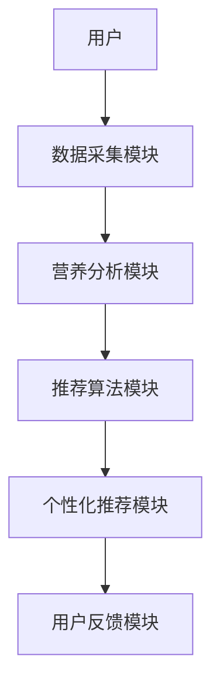

                 


# 智能餐桌：AI Agent的营养均衡建议

> 关键词：智能餐桌, AI Agent, 营养均衡, 个性化推荐, 人工智能, 健康饮食

> 摘要：本文探讨了AI Agent在智能餐桌中的应用，详细分析了其在营养均衡建议中的核心算法和系统架构设计，结合实际案例展示了如何通过AI技术实现个性化的健康饮食推荐。

---

## 第1章: AI Agent与营养均衡概述

### 1.1 AI Agent的基本概念

#### 1.1.1 人工智能代理的定义
AI Agent（人工智能代理）是指能够感知环境并采取行动以实现目标的智能体。它可以是一个软件程序，通过接收输入数据，处理信息，并输出决策或建议。

#### 1.1.2 AI Agent的核心特征
- **自主性**：能够自主决策。
- **反应性**：能够实时响应环境变化。
- **目标导向**：根据目标进行行动。
- **学习能力**：通过数据和反馈不断优化。

#### 1.1.3 营养均衡的基本概念
营养均衡是指摄入的食物中含有适量的六大营养素（蛋白质、脂肪、碳水化合物、维生素、矿物质和水），以满足人体健康需求。

---

### 1.2 智能餐桌的定义与应用场景

#### 1.2.1 智能餐桌的定义
智能餐桌是一种结合了AI技术的餐桌系统，能够根据用户的身体数据、饮食习惯和营养需求，提供个性化的饮食建议。

#### 1.2.2 智能餐桌的主要功能
- 数据采集：记录用户的饮食习惯、体重、健康状况等信息。
- 营养分析：分析用户当前的营养摄入情况。
- 个性化推荐：根据分析结果，推荐适合用户的饮食方案。

#### 1.2.3 营养均衡建议的实际应用
- 健康管理：帮助用户维持健康体重，预防慢性疾病。
- 饮食优化：提供科学的饮食建议，纠正不良饮食习惯。

---

### 1.3 AI Agent在智能餐桌中的作用

#### 1.3.1 AI Agent在营养均衡中的核心任务
- 数据收集与处理：收集用户的饮食数据，并进行清洗和预处理。
- 营养分析：利用AI算法分析用户的营养摄入情况。
- 个性化推荐：根据分析结果，生成个性化的饮食建议。

#### 1.3.2 智能餐桌的用户需求分析
- 用户希望通过智能餐桌获取科学的饮食建议。
- 用户希望推荐的饮食方案能够满足个人口味和营养需求。
- 用户希望系统能够实时更新和优化推荐方案。

#### 1.3.3 营养均衡建议的边界与外延
- 边界：仅提供营养均衡的建议，不涉及医疗诊断。
- 外延：未来可能扩展到健康监测、疾病预防等领域。

---

## 第2章: 营养均衡与AI Agent的核心概念

### 2.1 营养均衡的核心要素

#### 2.1.1 营养学的基本原理
营养学研究人体所需的各种营养素及其对人体健康的影响。六大营养素是维持人体正常功能的基础。

#### 2.1.2 营养均衡的数学模型
营养均衡可以通过数学模型表示，例如线性规划模型，用于优化营养素的摄入量。

#### 2.1.3 食物分类与营养成分分析
食物可以按营养成分分类，例如高蛋白食物、高纤维食物等。通过对食物的营养成分进行分析，可以为用户提供个性化的饮食建议。

---

### 2.2 AI Agent的营养建议生成机制

#### 2.2.1 数据收集与处理
AI Agent通过收集用户的饮食数据，分析用户的营养摄入情况。

#### 2.2.2 营养分析与个性化推荐
基于营养学原理和AI算法，生成个性化的饮食建议。

#### 2.2.3 建议生成与反馈优化
根据用户的反馈不断优化推荐方案，确保建议的科学性和实用性。

---

## 第3章: AI Agent的算法原理

### 3.1 营养均衡推荐算法

#### 3.1.1 基于协同过滤的推荐算法
协同过滤是一种基于用户相似性推荐算法，通过分析用户的饮食习惯，找到与用户相似的其他用户，推荐他们的饮食方案。

#### 3.1.2 基于内容的推荐算法
基于内容的推荐算法通过分析食物的营养成分，推荐与用户需求匹配的食物。

#### 3.1.3 混合推荐模型
混合推荐模型结合协同过滤和内容推荐的优点，通过多模型融合，提高推荐的准确性和个性化程度。

---

### 3.2 算法实现流程

#### 3.2.1 数据预处理与特征提取
- 数据清洗：去除无效数据。
- 特征提取：提取食物的营养成分数据。

#### 3.2.2 模型训练与参数优化
- 使用训练数据训练推荐模型。
- 通过参数优化提高推荐准确率。

#### 3.2.3 推荐结果生成与评估
- 根据模型预测结果生成推荐方案。
- 通过评估指标（如准确率、召回率）评估推荐效果。

---

## 第4章: 系统架构与设计

### 4.1 系统功能模块划分

#### 4.1.1 用户数据采集模块
- 数据采集：收集用户的饮食数据。
- 数据处理：清洗和预处理数据。

#### 4.1.2 营养分析模块
- 数据分析：分析用户的营养摄入情况。
- 营养评估：评估用户的营养状况。

#### 4.1.3 个性化推荐模块
- 推荐算法：基于AI算法生成推荐方案。
- 推荐结果：输出个性化饮食建议。

#### 4.1.4 用户反馈模块
- 用户反馈：收集用户的反馈信息。
- 系统优化：根据反馈优化推荐模型。

---

### 4.2 系统架构设计

#### 4.2.1 系统架构图（Mermaid）


### 4.3 系统接口设计

---

## 第5章: 项目实战

### 5.1 环境安装

#### 5.1.1 安装Python环境
- 使用Anaconda安装Python 3.8及以上版本。

#### 5.1.2 安装依赖库
- 使用pip安装必要的库，例如numpy、pandas、scikit-learn等。

---

### 5.2 系统核心实现源代码

#### 5.2.1 数据预处理代码
```python
import pandas as pd
import numpy as np

# 加载数据
data = pd.read_csv('nutrition_data.csv')

# 数据清洗
data.dropna(inplace=True)
data = pd.get_dummies(data, columns=['food_type'])
```

#### 5.2.2 推荐算法实现
```python
from sklearn.metrics.pairwise import cosine_similarity

# 计算余弦相似度
similarity_matrix = cosine_similarity(data)
```

#### 5.2.3 测试案例分析
```python
# 测试案例
test_user = 'user123'
test_recommendations = model.recommend(test_user, k=5)
print(test_recommendations)
```

---

## 第6章: 最佳实践与总结

### 6.1 项目总结

通过本项目，我们实现了基于AI Agent的智能餐桌系统，能够为用户提供个性化的营养均衡建议。系统的核心算法包括协同过滤和内容推荐，通过混合模型进一步优化推荐效果。

### 6.2 实践中的注意事项

- 数据隐私保护：确保用户数据的安全性。
- 模型优化：根据反馈不断优化推荐算法。
- 界面设计：提供友好的用户界面，方便用户使用。

### 6.3 未来展望

随着AI技术的不断发展，智能餐桌系统将更加智能化，未来可能实现更精准的健康监测和个性化饮食管理。

---

## 作者

作者：AI天才研究院/AI Genius Institute & 禅与计算机程序设计艺术 /Zen And The Art of Computer Programming

---

通过以上内容，我们详细介绍了AI Agent在智能餐桌中的应用，从核心概念到算法实现，再到系统设计，为读者提供了全面的指导和实践方案。

