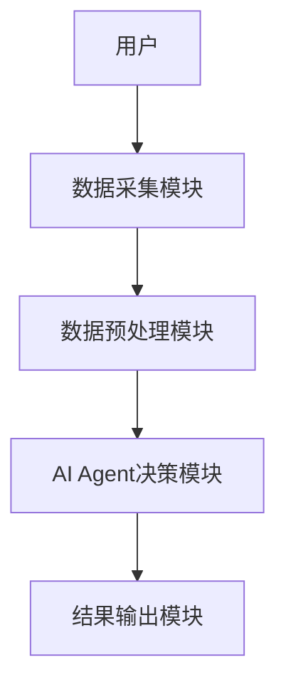
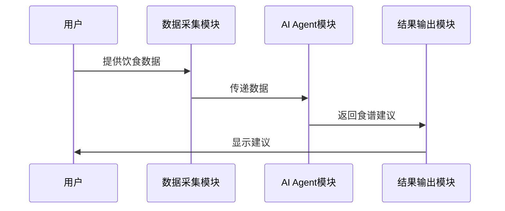

                 


# 智能餐盘：AI Agent的膳食均衡指导系统

## 关键词：AI Agent, 膳食均衡, 智能餐盘, 机器学习, 算法原理, 系统架构

## 摘要：智能餐盘通过AI Agent技术，结合机器学习算法，为用户提供个性化的膳食均衡指导。本文详细介绍了系统的背景、核心概念、算法原理、系统架构，并通过项目实战展示了系统的实现过程。

---

# 第一部分: 智能餐盘的背景与概念

## 第1章: 智能餐盘的背景介绍

### 1.1 问题背景与描述

#### 1.1.1 当前膳食管理的主要问题
现代人生活节奏快，饮食不规律，导致营养失衡、肥胖、亚健康等问题。传统膳食管理依赖人工计算和经验，难以满足个性化需求。

#### 1.1.2 膳食均衡的重要性
膳食均衡是维持身体健康的关键，涉及六大营养素的合理摄入。个体差异（年龄、性别、体重、活动量）导致需求不同。

#### 1.1.3 AI技术在膳食管理中的应用潜力
AI技术可以通过数据分析、个性化推荐和实时反馈优化膳食结构，提高管理效率。

### 1.2 问题解决与系统目标

#### 1.2.1 智能餐盘的解决方案
利用AI Agent分析用户饮食数据，推荐均衡食谱，实时反馈建议。

#### 1.2.2 系统的核心目标
提供个性化膳食建议，实时监测，优化饮食结构。

#### 1.2.3 边界与外延
限于膳食建议，不涉及医疗诊断和运动计划。

### 1.3 核心概念与系统组成

#### 1.3.1 AI Agent的定义
AI Agent是智能主体，能感知环境、执行任务并做出决策。

#### 1.3.2 智能餐盘的功能模块
- 数据采集：记录饮食数据
- 数据分析：计算营养成分
- AI决策：推荐食谱
- 结果反馈：提供建议

#### 1.3.3 系统的核心要素
- 用户数据：饮食记录、健康数据
- AI算法：协同过滤、遗传算法
- 知识库：营养数据、食谱库

---

## 第2章: AI Agent的基本原理

### 2.1 AI Agent的定义与分类

#### 2.1.1 AI Agent的定义
智能主体，具备自主性、反应性、目标导向和社交能力。

#### 2.1.2 AI Agent的分类
- 简单反射型：基于规则
- 基于模型的反应型：使用知识库
- 目标驱动型：主动实现目标
- 社交型：与环境互动

### 2.2 膳食均衡指导系统的原理

#### 2.2.1 膳食均衡的基本原则
六大营养素均衡摄入，根据个体需求调整。

#### 2.2.2 系统如何实现膳食指导
通过AI分析数据，推荐食谱，实时反馈。

#### 2.2.3 AI Agent在膳食指导中的角色
数据处理、分析、决策和反馈。

### 2.3 系统的核心算法

#### 2.3.1 基于规则的AI Agent
规则简单，适用于明确场景。

#### 2.3.2 基于机器学习的AI Agent
学习用户习惯，提供个性化建议。

#### 2.3.3 混合型AI Agent
结合规则和机器学习，适应复杂场景。

---

## 第3章: 智能餐盘的系统架构与设计

### 3.1 系统架构设计

#### 3.1.1 系统功能模块划分
- 用户输入：记录饮食
- 数据分析：计算营养
- AI决策：推荐食谱
- 结果输出：反馈建议

#### 3.1.2 系统架构图


### 3.2 系统接口设计

#### 3.2.1 用户接口
图形界面，方便数据输入和结果查看。

#### 3.2.2 数据接口
与营养数据库和食谱库连接，获取数据。

#### 3.2.3 AI Agent接口
接收数据，执行决策，返回建议。

---

## 第4章: AI Agent的核心算法

### 4.1 协同过滤算法

#### 4.1.1 算法原理
通过用户历史数据，找到相似用户，推荐食谱。

#### 4.1.2 代码示例
```python
def collaborative_filtering(user_id, user_data):
    # 计算用户相似度
    similarities = {}
    for user in user_data:
        if user != user_id:
            similarities[user] = 1 / (1 + abs(user_id - user))
    # 找出最相似用户
    similar_user = max(similarities, key=lambda k: similarities[k])
    # 返回推荐食谱
    return user_data[similar_user]['推荐食谱']
```

---

## 第5章: 系统交互与用例分析

### 5.1 系统交互流程



### 5.2 典型用例分析
用户输入饮食数据，系统分析后推荐食谱，并提供反馈。

---

## 第6章: 项目实战与应用

### 6.1 项目环境安装
安装Python、NumPy、scikit-learn等库。

### 6.2 核心功能实现
实现数据采集、分析和AI推荐模块。

### 6.3 应用解读与分析
通过实际案例分析，展示系统优势和效果。

---

## 第7章: 最佳实践与扩展

### 7.1 小结
智能餐盘通过AI技术优化膳食管理，提供高效解决方案。

### 7.2 注意事项
保护用户隐私，数据安全。

### 7.3 拓展阅读
深入研究机器学习算法，探索更多应用场景。

---

## 作者：AI天才研究院 & 禅与计算机程序设计艺术

通过以上步骤，文章详细介绍了智能餐盘的背景、核心概念、算法原理和系统设计，结合项目实战，全面展示了系统的实现和应用。

