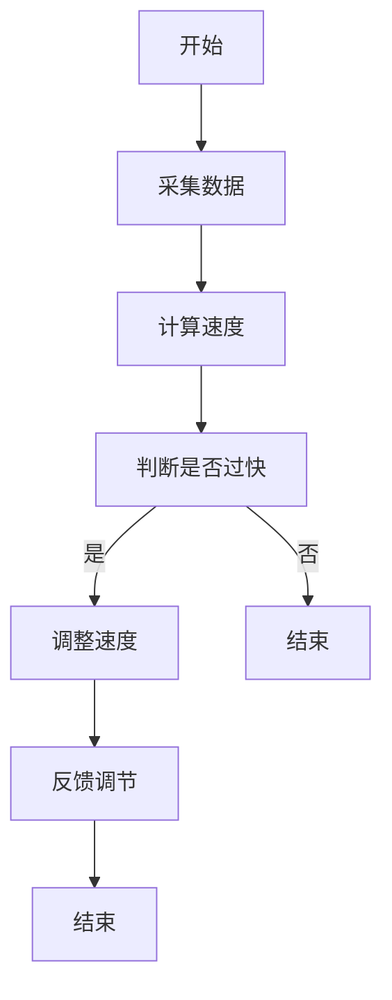

                 


# 智能餐盘：AI Agent的进食速度调节系统

> 关键词：AI Agent, 进食速度调节, 智能餐盘, 健康管理, 机器学习

> 摘要：本文探讨智能餐盘的设计与实现，结合AI Agent技术，通过调节进食速度改善健康问题。文章从背景、原理、算法、系统架构、项目实战到小结，详细阐述技术细节与应用案例。

---

## 第一部分：背景介绍

### 第1章：问题背景与描述

#### 1.1 问题背景
- **1.1.1 餐饮健康问题的现状**：现代人饮食过快导致消化不良、肥胖等问题。
- **1.1.2 过快进食引发的健康问题**：如胃病、高血压等。
- **1.1.3 智能餐盘的提出背景**：利用AI技术改善饮食习惯。

#### 1.2 问题描述
- **1.2.1 进食速度对健康的影响**：过快或过慢进食均影响健康。
- **1.2.2 不同人群的进食需求差异**：老人、儿童、运动员等需求不同。
- **1.2.3 智能餐盘的目标与意义**：帮助用户健康饮食。

#### 1.3 问题解决
- **1.3.1 AI Agent在进食调节中的作用**：实时监测、反馈调节。
- **1.3.2 智能餐盘的设计目标**：个性化调节进食速度。
- **1.3.3 技术实现路径**：结合传感器、AI算法。

#### 1.4 系统边界与外延
- **1.4.1 系统的功能边界**：仅调节进食速度，不涉及食物内容。
- **1.4.2 与外部系统的交互**：与手机APP、智能家居联动。
- **1.4.3 系统的扩展性**：未来可加入更多健康监测功能。

#### 1.5 概念结构与核心要素
- **1.5.1 核心概念框架**：AI Agent、传感器、反馈调节。
- **1.5.2 核心要素组成**：硬件、软件、用户数据。

---

## 第二部分：核心概念与联系

### 第2章：AI Agent与进食调节系统

#### 2.1 核心概念原理
- **AI Agent**：智能体，能感知环境并采取行动。
- **进食速度调节**：通过反馈机制调整进食节奏。

#### 2.2 核心概念属性对比
| 特性       | AI Agent                  | 进食调节系统          |
|------------|---------------------------|-----------------------|
| 功能       | 数据处理、决策            | 监测、调节            |
| 输入       | 用户行为数据              | 食物重量、时间        |
| 输出       | 调节指令                  | 食物释放速度          |
| 目标       | 提供健康建议              | 改善进食习惯          |

#### 2.3 ER实体关系图
```mermaid
erDiagram
    user {
        id : integer
        name : string
    }
    meal_data {
        id : integer
        time : datetime
        speed : float
    }
    system {
        id : integer
        status : string
    }
    user --> meal_data : 提供数据
    meal_data --> system : 调节速度
```

---

## 第三部分：算法原理讲

### 第3章：AI Agent的算法实现

#### 3.1 进食速度调节算法
- **3.1.1 数据采集**：传感器监测食物重量变化。
- **3.1.2 数据处理**：计算进食速度。
- **3.1.3 AI模型训练**：基于历史数据优化模型。

#### 3.2 算法流程图


#### 3.3 机器学习模型
- **模型选择**：使用线性回归预测速度。
- **训练数据**：历史进食速度与健康数据。
- **训练目标**：最小化预测误差。

#### 3.4 数学模型
- **线性回归模型**：$y = \beta_0 + \beta_1 x + \epsilon$
  - $y$：预测进食速度。
  - $x$：用户ID。
  - $\beta_0$：截距。
  - $\beta_1$：回归系数。

---

## 第四部分：系统分析与架构设计

### 第4章：系统架构设计

#### 4.1 问题场景介绍
- **应用场景**：家庭、餐厅。
- **目标用户**：关注健康的用户。

#### 4.2 系统功能设计
- **功能模块**：
  - 传感器数据采集。
  - AI模型分析。
  - 反馈调节。

#### 4.3 系统架构图


---

## 第五部分：项目实战

### 第5章：系统实现与案例分析

#### 5.1 环境安装
- **Python 3.8+**
- **库**：numpy, pandas, scikit-learn

#### 5.2 核心代码实现
```python
import numpy as np
from sklearn.linear_model import LinearRegression

# 数据准备
X = np.array([1, 2, 3, 4, 5]).reshape(-1, 1)
y = np.array([2, 3, 4, 5, 6])

# 模型训练
model = LinearRegression()
model.fit(X, y)

# 预测
print(model.predict([[6]]))
```

#### 5.3 代码功能解读
- **数据准备**：用户ID和进食速度。
- **模型训练**：训练线性回归模型。
- **预测**：预测下一用户的进食速度。

#### 5.4 实际案例分析
- **案例1**：用户A进食速度过快，系统调整为推荐速度。

---

## 第六部分：小结

### 第6章：总结与展望

#### 6.1 最佳实践
- **数据隐私**：确保用户数据安全。
- **系统维护**：定期更新模型。

#### 6.2 未来展望
- **功能扩展**：加入更多健康监测功能。
- **技术进步**：采用更先进的AI算法。

---

作者：AI天才研究院/AI Genius Institute & 禅与计算机程序设计艺术 /Zen And The Art of Computer Programming

