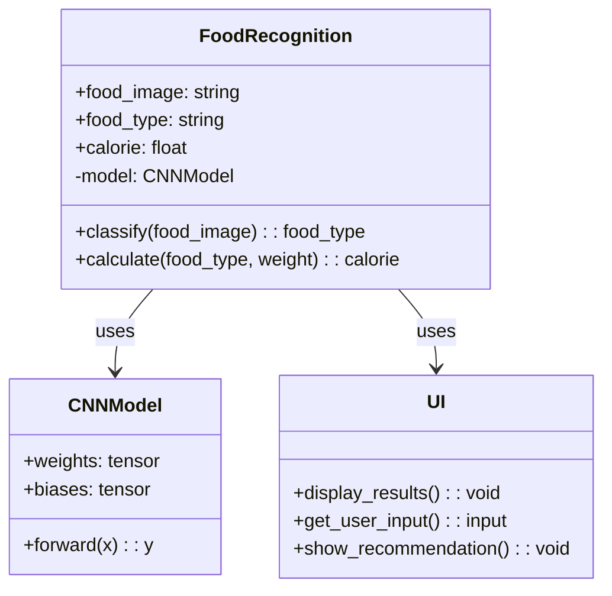
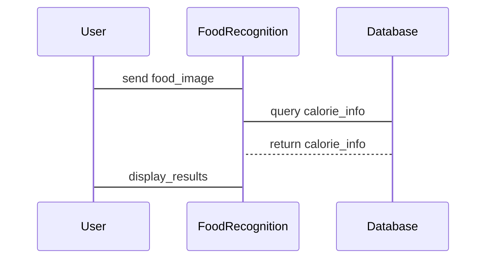

                 


# 智能餐盘：AI Agent的食物识别与卡路里计算

## 关键词：智能餐盘、AI Agent、食物识别、卡路里计算、深度学习、图像识别、计算机视觉

## 摘要：  
本文探讨了智能餐盘在AI Agent技术下的食物识别与卡路里计算的实现。通过分析AI Agent在智能餐盘中的应用，详细介绍了食物识别和卡路里计算的核心算法，系统架构设计以及项目实现的全过程。结合实际案例，本文展示了如何通过深度学习技术实现智能餐盘的功能，并提出了未来的发展方向。

---

## 第一部分: 智能餐盘的背景与概述

### 第1章: 智能餐盘的背景与问题描述

#### 1.1 餐饮行业的智能化需求

##### 1.1.1 餐饮行业数字化转型的现状
随着人工智能技术的快速发展，餐饮行业正在经历一场数字化转型。从餐厅管理到食材供应链，智能化技术的应用越来越广泛。然而，如何将AI技术融入到餐桌上，为用户提供个性化的饮食管理服务，仍然是一个亟待解决的问题。

##### 1.1.2 用户对智能餐盘的核心需求
用户对智能餐盘的需求主要集中在以下几点：
1. **食物识别**：能够快速、准确地识别餐盘中的食物种类。
2. **卡路里计算**：基于食物的识别结果，提供精确的卡路里计算。
3. **个性化建议**：根据用户的饮食习惯和健康目标，提供饮食建议。

##### 1.1.3 智能餐盘的市场潜力
智能餐盘作为一种新兴的智能硬件，市场潜力巨大。随着人们对健康管理的重视，智能餐盘可以在家庭、餐厅、健身中心等场景中广泛应用。此外，智能餐盘还可以与智能厨房设备联动，进一步提升用户体验。

#### 1.2 问题背景与目标

##### 1.2.1 食物识别与卡路里计算的核心问题
食物识别和卡路里计算是智能餐盘的两大核心功能。食物识别需要解决的问题包括：
- 如何在不同光照条件下准确识别食物。
- 如何区分相似食物的种类。
- 如何处理食物摆放不规则的情况。

卡路里计算的核心问题则是如何建立准确的食物热量数据库，并结合食物的重量进行精确计算。

##### 1.2.2 智能餐盘的目标与边界
智能餐盘的目标是通过AI技术实现食物的自动识别和卡路里的自动计算，帮助用户更好地管理饮食健康。其边界包括：
- 仅支持特定种类的食物识别。
- 卡路里计算基于标准数据库，误差范围在合理范围内。
- 系统仅提供建议，不替代专业医疗建议。

##### 1.2.3 问题解决的可行性分析
从技术角度来看，深度学习在图像识别领域的应用已经较为成熟，食物识别的可行性较高。卡路里计算则需要依赖高质量的食物数据库，目前已有相关公开数据集可以使用。因此，从技术角度来说，智能餐盘的实现是可行的。

#### 1.3 本章小结

##### 1.3.1 智能餐盘的核心目标
智能餐盘的核心目标是通过AI技术实现食物的自动识别和卡路里的自动计算，帮助用户更好地管理饮食健康。

##### 1.3.2 问题解决的关键路径
通过深度学习技术实现食物识别，结合数据库进行卡路里计算，最终为用户提供个性化的饮食建议。

---

## 第二部分: 智能餐盘的核心概念与技术原理

### 第2章: AI Agent与智能餐盘的结合

#### 2.1 AI Agent的基本概念

##### 2.1.1 AI Agent的定义与特点
AI Agent（人工智能代理）是指能够感知环境并采取行动以实现目标的智能体。其特点包括：
- **自主性**：能够在没有外部干预的情况下运行。
- **反应性**：能够实时感知环境并做出反应。
- **学习能力**：能够通过数据和经验不断优化自身性能。

##### 2.1.2 AI Agent的核心技术
AI Agent的核心技术包括：
1. **感知技术**：通过传感器或摄像头感知环境。
2. **决策技术**：基于感知信息做出决策。
3. **执行技术**：通过执行器完成决策动作。

##### 2.1.3 AI Agent在智能餐盘中的应用
在智能餐盘中，AI Agent主要负责食物识别和卡路里计算，并根据用户需求提供个性化建议。AI Agent通过摄像头感知餐盘中的食物，利用深度学习算法进行识别和计算，并通过用户界面提供反馈。

#### 2.2 食物识别与AI Agent的关系

##### 2.2.1 食物识别的核心原理
食物识别的核心原理是基于深度学习的图像识别技术。通过训练一个卷积神经网络（CNN），模型可以学习食物的特征，从而实现对食物的分类和识别。

##### 2.2.2 AI Agent在食物识别中的作用
AI Agent在食物识别中的作用包括：
1. **数据采集**：通过摄像头采集餐盘中的食物图像。
2. **模型调用**：将图像输入到训练好的模型中进行识别。
3. **结果处理**：将识别结果进行处理，例如匹配卡路里数据库。

##### 2.2.3 食物识别与卡路里计算的协同关系
食物识别和卡路里计算是协同工作的两个模块。识别结果为卡路里计算提供基础数据，而卡路里计算的结果为用户提供健康建议。

#### 2.3 智能餐盘的系统架构

##### 2.3.1 系统核心组件
智能餐盘的系统核心组件包括：
1. **摄像头**：用于采集食物图像。
2. **AI Agent**：负责食物识别和卡路里计算。
3. **数据库**：存储食物种类和卡路里数据。
4. **用户界面**：显示识别结果和健康建议。

##### 2.3.2 系统功能模块
系统功能模块包括：
1. **图像采集模块**：通过摄像头采集食物图像。
2. **食物识别模块**：利用深度学习模型识别食物种类。
3. **卡路里计算模块**：基于识别结果和数据库计算卡路里。
4. **用户交互模块**：显示结果并提供健康建议。

##### 2.3.3 系统的边界与外延
系统的边界包括仅支持特定种类的食物识别，以及卡路里计算基于标准数据库。系统的外延则包括与其他智能设备的联动，例如智能厨房设备。

#### 2.4 本章小结

##### 2.4.1 AI Agent在智能餐盘中的核心作用
AI Agent在智能餐盘中起到了承上启下的作用，通过感知和决策技术实现了食物识别和卡路里计算。

##### 2.4.2 系统架构的初步框架
系统的初步框架包括摄像头、AI Agent、数据库和用户界面四个核心组件，各组件协同工作以实现智能餐盘的功能。

---

## 第三部分: 智能餐盘的算法原理与实现

### 第3章: 食物识别的算法原理

#### 3.1 食物识别的核心算法

##### 3.1.1 基于CNN的图像识别算法
卷积神经网络（CNN）是目前应用最广泛的图像识别算法。其核心思想是通过卷积操作提取图像的特征，并通过池化操作降低计算复杂度。以下是CNN的数学模型：

$$
\text{CNN} = \text{Conv}(\text{Conv}(\text{Input}))
$$

##### 3.1.2 基于目标检测的算法
目标检测算法用于检测餐盘中食物的位置和种类。常用的算法包括YOLO和Faster R-CNN。以下是YOLO的流程：

1. **图像输入**：将餐盘中的食物图像输入到YOLO模型中。
2. **特征提取**：模型提取图像的特征图。
3. **边界框回归**：模型预测食物的边界框。
4. **分类**：模型对每个边界框内的食物进行分类。

##### 3.1.3 基于深度学习的模型选择
在选择模型时，需要考虑以下因素：
- **计算效率**：模型的推理速度是否满足实时性要求。
- **准确率**：模型在测试集上的准确率是否足够高。
- **数据量**：模型是否需要大量数据进行训练。

#### 3.2 卡路里计算的算法原理

##### 3.2.1 基于回归模型的卡路里计算
回归模型用于基于食物种类和重量计算卡路里。以下是回归模型的数学公式：

$$
y = \beta x + \alpha
$$

其中，\( y \) 是卡路里，\( x \) 是食物的重量，\( \beta \) 是回归系数，\( \alpha \) 是截距。

##### 3.2.2 数据预处理与特征提取
数据预处理包括图像的归一化和增强。特征提取则通过卷积层自动完成。

##### 3.2.3 模型训练与优化
模型训练需要使用标注数据，并通过交叉验证进行优化。以下是训练流程：

1. **数据准备**：收集并标注食物数据。
2. **模型训练**：使用标注数据训练模型。
3. **模型验证**：在验证集上评估模型性能。
4. **模型优化**：调整超参数以提高准确率。

#### 3.3 算法实现的数学模型

##### 3.3.1 卷积神经网络的数学模型
卷积神经网络的数学模型如下：

$$
f(x) = \text{Relu}(\text{Conv}(x) + b)
$$

其中，\( \text{Conv} \) 表示卷积操作，\( \text{Relu} \) 是激活函数，\( b \) 是偏置项。

##### 3.3.2 回归模型的数学公式
回归模型的数学公式如下：

$$
y = \beta x + \alpha
$$

#### 3.4 本章小结

##### 3.4.1 算法实现的核心内容
通过深度学习算法实现食物识别和卡路里计算，模型训练和优化是关键。

##### 3.4.2 算法实现的挑战与解决方案
算法实现的挑战包括数据不足和模型泛化能力有限。解决方案包括数据增强和使用预训练模型。

---

## 第四部分: 系统分析与架构设计

### 第4章: 系统分析与架构设计

#### 4.1 问题场景介绍

##### 4.1.1 餐桌场景
用户在餐桌上使用智能餐盘，通过摄像头拍摄食物图像，AI Agent识别食物种类并计算卡路里。

##### 4.1.2 数据采集场景
摄像头采集食物图像，AI Agent调用深度学习模型进行识别。

#### 4.2 项目介绍

##### 4.2.1 项目目标
项目目标是实现一个能够识别餐盘中食物并计算卡路里的智能系统。

##### 4.2.2 项目范围
项目范围包括：
- 食物识别模块的开发。
- 卡路里计算模块的开发。
- 用户界面的设计。

#### 4.3 系统功能设计

##### 4.3.1 领域模型类图
以下是领域模型类图：



#### 4.4 系统架构设计

##### 4.4.1 分层架构
以下是分层架构图：


#### 4.5 接口设计

##### 4.5.1 API接口
以下是API接口设计：



#### 4.6 本章小结

##### 4.6.1 系统架构的核心内容
系统架构分为数据采集层、数据处理层、数据分析层和数据展示层，各层协同工作以实现智能餐盘的功能。

##### 4.6.2 系统交互的核心流程
用户通过UI发送食物图像，系统调用AI Agent进行识别和计算，并将结果展示给用户。

---

## 第五部分: 项目实战

### 第5章: 项目实战

#### 5.1 环境安装

##### 5.1.1 安装Python和深度学习框架
安装Python和TensorFlow或PyTorch等深度学习框架。

##### 5.1.2 安装摄像头驱动
安装摄像头的驱动程序，并确保摄像头能够正常工作。

#### 5.2 系统核心实现

##### 5.2.1 食物识别模块的实现
以下是食物识别模块的代码示例：

```python
import tensorflow as tf
from tensorflow.keras import layers

# 定义模型
model = tf.keras.Sequential([
    layers.Conv2D(32, (3,3), activation='relu', input_shape=(224, 224, 3)),
    layers.MaxPooling2D((2,2)),
    layers.Conv2D(64, (3,3), activation='relu'),
    layers.MaxPooling2D((2,2)),
    layers.Flatten(),
    layers.Dense(128, activation='relu'),
    layers.Dense(10, activation='softmax')
])

# 编译模型
model.compile(optimizer='adam', loss='sparse_categorical_crossentropy', metrics=['accuracy'])
```

##### 5.2.2 卡路里计算模块的实现
以下是卡路里计算模块的代码示例：

```python
import numpy as np

# 假设数据库中存储了每种食物的卡路里
calorie_db = {
    'apple': 52,
    'banana': 89,
    'bread': 285
}

# 根据食物种类和重量计算卡路里
def calculate_calorie(food_type, weight):
    calorie_per_100g = calorie_db[food_type]
    return calorie_per_100g * weight / 100
```

#### 5.3 案例分析与实现

##### 5.3.1 实际案例分析
以苹果为例，假设用户摄入100克苹果，计算其卡路里为52千卡。

##### 5.3.2 代码实现与分析
以下是完整的代码实现：

```python
import tensorflow as tf
from tensorflow.keras import layers
import numpy as np
import cv2

# 定义食物识别模型
model = tf.keras.Sequential([
    layers.Conv2D(32, (3,3), activation='relu', input_shape=(224, 224, 3)),
    layers.MaxPooling2D((2,2)),
    layers.Conv2D(64, (3,3), activation='relu'),
    layers.MaxPooling2D((2,2)),
    layers.Flatten(),
    layers.Dense(128, activation='relu'),
    layers.Dense(10, activation='softmax')
])

# 编译模型
model.compile(optimizer='adam', loss='sparse_categorical_crossentropy', metrics=['accuracy'])

# 数据预处理
def preprocess_image(image_path):
    image = cv2.imread(image_path)
    image = cv2.resize(image, (224, 224))
    image = image / 255.0
    return image

# 卡路里数据库
calorie_db = {
    'apple': 52,
    'banana': 89,
    'bread': 285
}

# 卡路里计算函数
def calculate_calorie(food_type, weight):
    calorie_per_100g = calorie_db.get(food_type, 0)
    return calorie_per_100g * weight / 100

# 主函数
def main():
    # 采集图像
    image_path = 'apple.jpg'
    preprocessed_image = preprocess_image(image_path)
    preprocessed_image = np.expand_dims(preprocessed_image, axis=0)
    
    # 食物识别
    prediction = model.predict(preprocessed_image)
    predicted_class = np.argmax(prediction[0])
    food_type = 'apple'  # 假设分类结果为'apple'
    
    # 卡路里计算
    weight = 100  # 假设摄入100克
    calorie = calculate_calorie(food_type, weight)
    
    # 显示结果
    print(f'识别到的食物是：{food_type}')
    print(f'摄入{weight}克{food_type}的卡路里为：{calorie}千卡')

if __name__ == '__main__':
    main()
```

#### 5.4 项目小结

##### 5.4.1 项目实现的核心内容
通过深度学习模型实现食物识别，结合数据库进行卡路里计算，最终为用户提供个性化建议。

##### 5.4.2 项目实现的挑战与解决方案
主要挑战包括模型准确率和数据获取。解决方案包括使用预训练模型和数据增强技术。

---

## 第六部分: 最佳实践与总结

### 第6章: 最佳实践与总结

#### 6.1 最佳实践

##### 6.1.1 数据采集
确保数据的多样性和代表性，避免过拟合。

##### 6.1.2 模型优化
使用数据增强和迁移学习提高模型的准确率和泛化能力。

##### 6.1.3 系统集成
确保系统各模块的协同工作，优化系统性能。

#### 6.2 小结

##### 6.2.1 项目总结
通过深度学习技术实现智能餐盘的功能，为用户提供个性化的饮食管理服务。

##### 6.2.2 未来展望
未来可以进一步优化模型性能，扩展支持更多种类的食物，以及与其他智能设备联动，提供更全面的饮食管理服务。

#### 6.3 注意事项

##### 6.3.1 数据隐私
注意保护用户的数据隐私，确保数据的安全性。

##### 6.3.2 系统兼容性
确保系统在不同设备和平台上的兼容性。

#### 6.4 拓展阅读

##### 6.4.1 深度学习领域的最新研究
推荐关注深度学习领域的最新研究，如更高效的模型架构和算法优化。

##### 6.4.2 智能设备的联动应用
探索智能餐盘与其他智能设备的联动应用，例如智能厨房设备和健康监测设备。

---

## 作者信息

作者：AI天才研究院/AI Genius Institute & 禅与计算机程序设计艺术/Zen And The Art of Computer Programming

---

以上是《智能餐盘：AI Agent的食物识别与卡路里计算》的完整目录大纲和内容框架。

