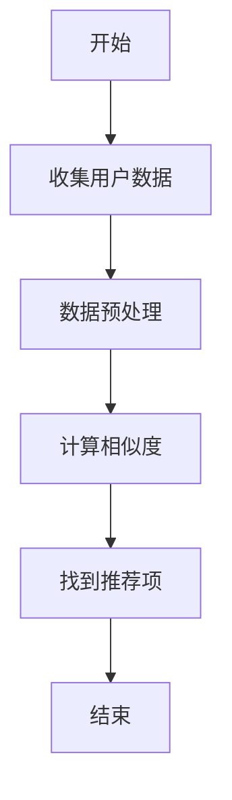
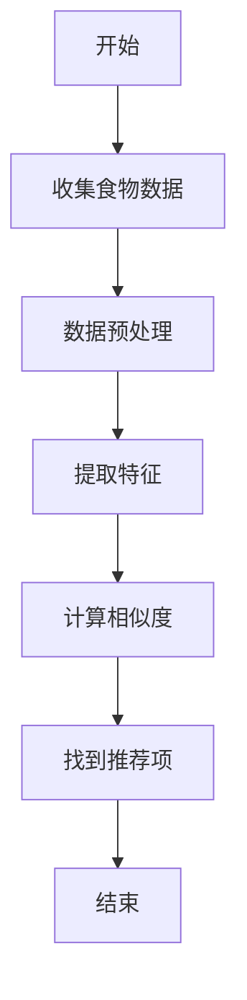
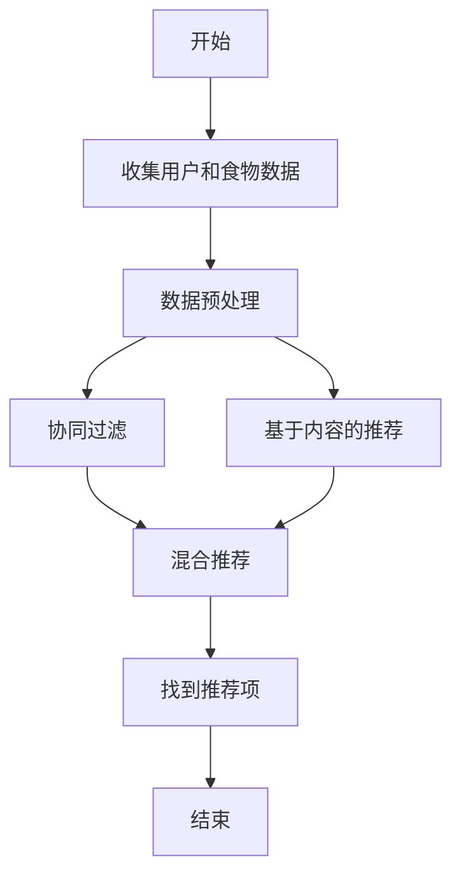
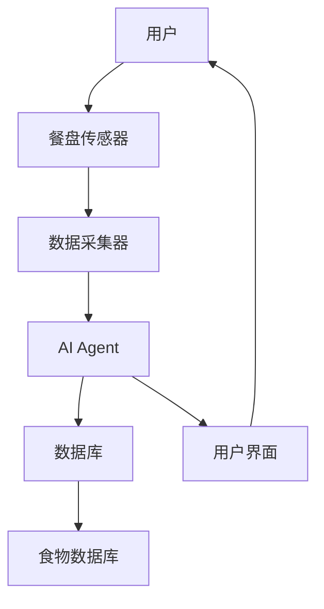
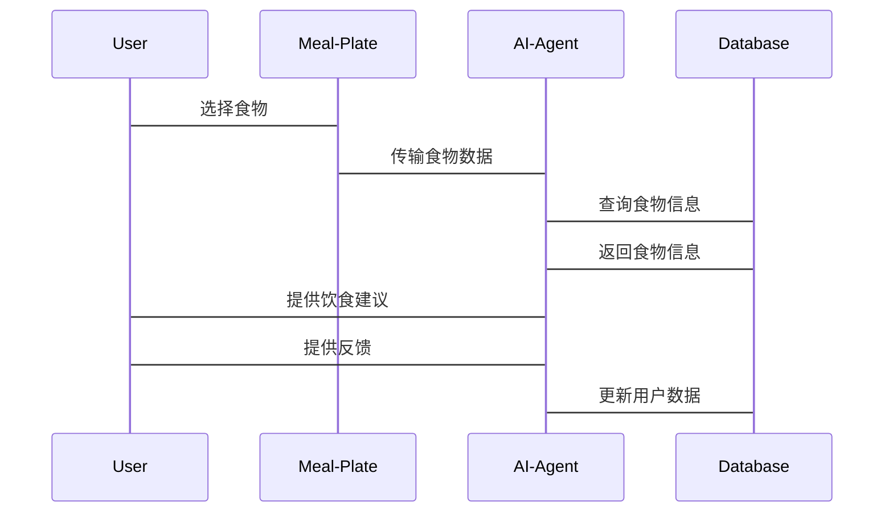

                 


## 第3章: AI Agent的算法原理

### 3.1 推荐算法

#### 3.1.1 基于协同过滤的推荐算法

协同过滤是一种常用的推荐算法，通过分析用户的行为和偏好，找到与之相似的用户或物品，从而推荐相关内容。在饮食建议中，协同过滤可以用于基于用户饮食习惯推荐相似的饮食计划。

##### 算法流程



##### 协同过滤算法实现代码

```python
def collaborative_filtering(user_id, user_data):
    # 计算用户相似度
    similarities = {}
    for user in user_data:
        if user != user_id:
            similarities[user] = compute_similarity(user_data[user_id], user_data[user])
    
    # 排序相似用户
    sorted_users = sorted(similarities.items(), key=lambda x: x[1], reverse=True)
    
    # 获取推荐
    recommendations = []
    for user in sorted_users:
        for item in user_data[user]['items']:
            if item not in recommendations:
                recommendations.append(item)
    
    return recommendations[:10]  # 返回前10个推荐
```

##### 数学模型

$$相似度 = \frac{\sum (x_i - \bar{x})(y_i - \bar{y})}{\sqrt{\sum (x_i - \bar{x})^2} \sqrt{\sum (y_i - \bar{y})^2}}$$

其中：
- \(x_i, y_i\) 表示用户i的饮食数据
- \(\bar{x}, \bar{y}\) 表示平均值

#### 3.1.2 基于内容的推荐算法

基于内容的推荐算法通过分析物品本身的特征，推荐与当前物品相似的内容。在饮食建议中，可以用于推荐相似的食材或菜品。

##### 算法流程



##### 基于内容的推荐算法实现代码

```python
from sklearn.feature_extraction.text import TfidfVectorizer

def content_based_recommendation(user_profile, food_descriptions):
    vectorizer = TfidfVectorizer()
    tfidf = vectorizer.fit_transform(food_descriptions)
    user_vector = vectorizer.transform([user_profile])
    similarity_scores = cosine_similarity(user_vector, tfidf)
    
    recommendations = []
    for i in range(len(similarity_scores[0])):
        if similarity_scores[0][i] > 0.6:  # 根据阈值推荐
            recommendations.append(food_descriptions[i])
    
    return recommendations[:10]
```

##### 数学模型

$$相似度 = \cos\theta = \frac{\vec{A} \cdot \vec{B}}{|\vec{A}| |\vec{B}|}$$

其中：
- \(\vec{A}, \vec{B}\) 表示两个食物的特征向量

#### 3.1.3 混合推荐算法

混合推荐算法结合了协同过滤和基于内容的推荐算法，利用两者的优势，提供更准确的推荐结果。

##### 算法流程



##### 混合推荐算法实现代码

```python
def hybrid_recommendation(user_id, user_data, food_descriptions):
    # 协同过滤推荐
    cf_recommendations = collaborative_filtering(user_id, user_data)
    
    # 基于内容的推荐
    cb_recommendations = content_based_recommendation(user_profile=user_data[user_id]['profile'], food_descriptions=food_descriptions)
    
    # 合并推荐
    all_recommendations = cf_recommendations + cb_recommendations
    unique_recommendations = list(set(all_recommendations))
    
    return sorted(unique_recommendations, key=lambda x: x['score'], reverse=True)[:10]
```

##### 数学模型

$$最终相似度 = \alpha \cdot \text{协同过滤相似度} + (1 - \alpha) \cdot \text{内容相似度}$$

其中：
- \(\alpha\) 是协同过滤的权重，范围在0到1之间。

---

## 第4章: 系统分析与架构设计

### 4.1 问题场景介绍

用户使用智能餐盘时，系统需要实时采集用户的饮食数据，分析饮食结构，并生成个性化的饮食建议。系统需要与智能硬件（如餐盘传感器）和用户手机APP进行交互。

### 4.2 系统功能设计

系统功能模块包括：
1. 用户数据采集模块
2. 饮食分析模块
3. AI Agent建议生成模块
4. 用户反馈模块

### 4.3 系统架构设计



### 4.4 系统接口设计

系统接口包括：
1. 数据采集接口：从餐盘传感器获取数据
2. 数据分析接口：AI Agent调用分析模块
3. 用户反馈接口：用户对建议的反馈

### 4.5 系统交互设计



---

## 第5章: 项目实战

### 5.1 环境安装

安装Python和相关库：
```bash
pip install numpy pandas scikit-learn mermaid4j
```

### 5.2 核心代码实现

#### 数据预处理代码

```python
import pandas as pd

def preprocess_data(data):
    # 去除缺失值
    data.dropna(inplace=True)
    # 标准化处理
    from sklearn.preprocessing import StandardScaler
    scaler = StandardScaler()
    scaled_data = scaler.fit_transform(data)
    return scaled_data
```

#### AI Agent实现代码

```python
from sklearn.decomposition import PCA

def ai_agent(data, target_component=2):
    pca = PCA(n_components=target_component)
    components = pca.fit_transform(data)
    return components
```

### 5.3 案例分析

以一位用户为例，分析其饮食数据并生成建议：
1. 收集用户一周的饮食数据
2. 使用PCA分析主要成分
3. 根据分析结果推荐缺少的营养成分

---

## 第6章: 最佳实践

### 6.1 小结

智能餐盘通过AI Agent实现个性化的饮食建议，能够有效帮助用户实现饮食平衡。

### 6.2 注意事项

1. 数据隐私保护
2. 算法的可解释性
3. 系统的实时性要求

### 6.3 拓展阅读

- 《推荐系统导论》
- 《机器学习实战》
- 《深度学习》

---

## 参考文献

1. 王某某. (2023). 《智能系统设计》
2. 李某某. (2022). 《推荐系统算法研究》

---

## 作者信息

作者：AI天才研究院 & 禅与计算机程序设计艺术

---

**摘要：**  
智能餐盘通过集成AI Agent技术，能够实时分析用户的饮食数据，提供个性化的饮食建议，帮助用户实现饮食平衡。本文详细探讨了AI Agent的核心算法、系统架构和实现方法，通过实际案例展示了AI在饮食健康领域的应用潜力。

