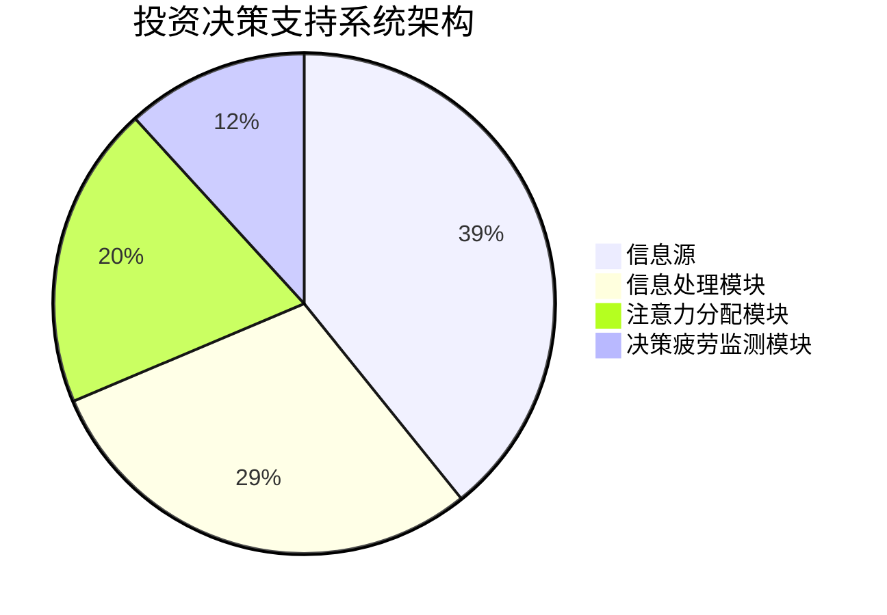

                 


# 有限注意力：信息过载时代的投资决策挑战

> **关键词**：有限注意力，信息过载，投资决策，决策疲劳，注意力管理，行为经济学  
> **摘要**：在信息爆炸的时代，投资者面临的信息量巨大，但注意力资源有限。本文探讨了有限注意力在投资决策中的挑战，分析了信息过载对决策质量的影响，并提出了优化注意力分配的策略和方法，结合行为经济学理论和数学模型，提供了实际的投资决策支持系统的实现方案。

---

## 第1章: 有限注意力与信息过载

### 1.1 有限注意力的定义与特征

#### 1.1.1 注意力资源的有限性
人类的注意力是有限的资源，每个人每天能处理的信息量是有限的。研究表明，普通人每分钟只能处理大约 60 比特的信息，而现代人每天接触到的信息量高达数百万比特。这种信息与处理能力的不平衡，导致了注意力资源的紧张。

#### 1.1.2 信息过载的现状与影响
信息过载是指信息的产生速度远超过个人或组织的处理能力。在投资领域，信息过载主要表现为每天海量的市场数据、新闻报道、社交媒体信息等。这些信息不仅分散了投资者的注意力，还可能导致决策疲劳和错误判断。

#### 1.1.3 有限注意力与决策效率的关系
有限注意力意味着投资者无法同时关注所有相关信息，必须选择性地关注部分信息。这种选择性关注可能会影响决策的全面性和准确性，从而降低投资效率。

---

### 1.2 投资决策中的注意力分配

#### 1.2.1 投资决策的核心要素
投资决策的核心要素包括市场数据、公司基本面、行业趋势、政策变化等。然而，信息的多样性使得投资者难以同时兼顾所有关键因素。

#### 1.2.2 信息过载对投资决策的干扰
信息过载会导致投资者陷入信息泥潭，难以快速识别关键信息。这不仅降低了决策效率，还可能导致投资者因信息过载而做出情绪化决策。

#### 1.2.3 注意力分配的优化方向
优化注意力分配的关键在于筛选高质量信息，减少无效信息的干扰。通过制定信息筛选策略，投资者可以更高效地分配注意力，提高决策质量。

---

### 1.3 有限注意力时代的投资挑战

#### 1.3.1 信息过载对决策质量的影响
信息过载可能导致投资者忽略关键信息，或过度依赖某些信息，从而做出错误决策。例如，投资者可能因社交媒体上的短期情绪波动而误判市场趋势。

#### 1.3.2 注意力分配的动态平衡
在信息过载的环境下，投资者需要在有限的注意力资源中找到动态平衡，既要关注重要信息，又要避免被无关信息干扰。

#### 1.3.3 有限注意力与投资收益的关系
研究表明，注意力分配的优化与投资收益密切相关。通过合理分配注意力，投资者可以更高效地捕捉市场机会，降低决策风险。

---

## 第2章: 信息过载与决策疲劳

### 2.1 信息过载的定义与表现

#### 2.1.1 信息爆炸的时代特征
现代社会的信息传播速度空前加快，社交媒体、新闻平台、数据分析工具等都为投资者提供了海量信息。然而，这种信息爆炸反而成为投资者的负担。

#### 2.1.2 信息过载对认知能力的消耗
信息过载会消耗投资者的认知资源，导致决策疲劳。研究表明，长时间处理大量信息会导致认知能力下降，影响判断力和决策能力。

#### 2.1.3 决策疲劳的形成机制
决策疲劳是指在连续做出多个决策后，个体的决策能力下降。在投资领域，决策疲劳可能导致投资者在关键时刻做出错误决策。

---

### 2.2 决策疲劳对投资决策的影响

#### 2.2.1 决策疲劳的表现形式
投资者在决策疲劳时可能会表现出以下症状：决策速度减慢、判断力下降、情绪化决策增多等。这些症状会影响投资决策的质量和效果。

#### 2.2.2 决策疲劳对投资决策的负面影响
决策疲劳可能导致投资者错失市场机会，或在市场波动中做出错误的投资决策。例如，投资者可能在市场下跌时过度恐慌，盲目卖出股票。

#### 2.2.3 如何缓解决策疲劳
缓解决策疲劳的方法包括：定期休息、减少信息干扰、制定决策规则等。通过合理管理决策过程，投资者可以有效缓解决策疲劳。

---

### 2.3 信息筛选与注意力管理

#### 2.3.1 信息筛选的基本原则
信息筛选是优化注意力分配的关键步骤。投资者应优先关注高质量信息，如权威机构的报告、行业专家的分析等。

#### 2.3.2 注意力管理的策略与技巧
投资者可以通过制定信息筛选规则、使用工具辅助信息处理、定期回顾信息质量等方法，优化注意力分配。

#### 2.3.3 信息过载时代的决策优化方法
结合行为经济学理论，投资者可以采用以下策略：避免情绪化决策、制定决策框架、利用自动化工具等，提高决策效率和质量。

---

## 第3章: 注意力经济与投资决策

### 3.1 注意力经济的定义与特征

#### 3.1.1 注意力经济的基本概念
注意力经济是指通过吸引和管理注意力资源来创造经济价值的经济模式。在投资领域，注意力经济的核心在于如何高效利用有限的注意力资源，获取最大化的投资收益。

#### 3.1.2 注意力经济的核心要素
注意力经济的核心要素包括注意力资源、信息质量、决策效率等。这些要素相互作用，共同影响投资决策的质量。

#### 3.1.3 注意力经济与投资决策的关系
注意力经济为投资决策提供了新的视角。通过优化注意力分配，投资者可以更高效地利用信息资源，提高投资收益。

---

### 3.2 投资决策中的注意力分配模型

#### 3.2.1 注意力分配的基本模型
注意力分配模型是基于行为经济学理论构建的框架。模型的核心是将注意力资源分配到最重要的信息源，减少无效信息的干扰。

#### 3.2.2 不同投资场景下的注意力分配策略
在不同的投资场景下，注意力分配策略也会有所不同。例如，在股票投资中，投资者应优先关注公司基本面和市场趋势；在基金投资中，应关注基金的历史表现和管理团队。

#### 3.2.3 注意力分配的动态调整机制
注意力分配需要根据市场变化和投资者需求进行动态调整。例如，在市场波动加剧时，投资者应增加对实时信息的关注。

---

### 3.3 信息过载时代的注意力管理策略

#### 3.3.1 信息筛选与注意力分配的结合
通过信息筛选，投资者可以将注意力集中于关键信息，提高决策效率。例如，使用自动化工具筛选行业新闻，关注分析师报告。

#### 3.3.2 信息质量与注意力分配的关系
信息质量是注意力分配的重要依据。高质量信息应分配更多的注意力资源，低质量信息则应减少关注。

#### 3.3.3 优化注意力分配的具体方法
投资者可以通过制定信息筛选规则、使用工具辅助信息处理、定期回顾信息质量等方法，优化注意力分配。

---

## 第4章: 行为经济学视角下的投资决策

### 4.1 行为经济学的基本原理

#### 4.1.1 行为经济学的核心概念
行为经济学研究人类在决策过程中的心理和行为特征。核心概念包括有限理性、认知偏差、情感决策等。

#### 4.1.2 行为经济学与投资决策的关系
行为经济学为投资决策提供了新的视角。通过理解投资者的心理和行为特征，可以优化决策过程，提高投资收益。

---

### 4.2 投资者认知偏差与决策错误

#### 4.2.1 认知偏差的定义与表现
认知偏差是指人在信息处理和决策过程中产生的系统性偏差。例如，确认偏差、过度自信偏差等。

#### 4.2.2 认知偏差对投资决策的影响
认知偏差可能导致投资者做出错误决策。例如，确认偏差导致投资者过度关注支持自己观点的信息，忽略反对信息。

#### 4.2.3 如何克服认知偏差
克服认知偏差的方法包括：保持理性思维、定期反思决策、寻求专业建议等。

---

### 4.3 情感决策与投资行为

#### 4.3.1 情感决策的定义与表现
情感决策是指基于情感和情绪做出的决策。在投资领域，情感决策可能导致投资者在市场波动中做出冲动性决策。

#### 4.3.2 情感决策对投资行为的影响
情感决策可能导致投资者在市场高点买入，在市场低点卖出，从而影响投资收益。

#### 4.3.3 如何管理情感决策
管理情感决策的方法包括：制定决策规则、避免情绪化决策、寻求专业建议等。

---

## 第5章: 算法与模型

### 5.1 注意力分配模型的算法实现

#### 5.1.1 算法原理
注意力分配模型基于行为经济学理论，结合机器学习算法，实现对信息源的优先级排序。

#### 5.1.2 算法实现
以下是注意力分配模型的Python实现代码：

```python
def attention_allocation(relevance_score, importance_score):
    attention_score = relevance_score * importance_score
    return attention_score

# 示例数据
importances = [0.8, 0.6, 0.9, 0.7]
relevances = [0.7, 0.8, 0.6, 0.9]

# 计算注意力分配
attention_scores = [attention_allocation(i, r) for i, r in zip(importances, relevances)]
print(attention_scores)
```

#### 5.1.3 算法优化
通过引入动态调整机制，注意力分配模型可以根据市场变化实时优化注意力分配。

---

### 5.2 决策疲劳缓解算法

#### 5.2.1 算法原理
决策疲劳缓解算法通过分析投资者的行为数据，识别疲劳状态，并采取干预措施。

#### 5.2.2 算法实现
以下是决策疲劳缓解算法的Python实现代码：

```python
def fatigue_detection(decision_count, accuracy):
    if decision_count > 10 and accuracy < 0.6:
        return True  # 疲劳状态
    else:
        return False

# 示例数据
decision_counts = [5, 10, 15, 20]
accuracies = [0.7, 0.6, 0.5, 0.4]

# 检测疲劳状态
fatigue_status = [fatigue_detection(dc, a) for dc, a in zip(decision_counts, accuracies)]
print(fatigue_status)
```

---

## 第6章: 系统分析与架构设计

### 6.1 投资决策支持系统

#### 6.1.1 系统功能设计
投资决策支持系统的功能包括信息筛选、注意力分配、决策疲劳监测等。

#### 6.1.2 系统架构设计
以下是系统架构的Mermaid图：



---

## 第7章: 项目实战

### 7.1 环境配置

#### 7.1.1 工具安装
需要安装Python、机器学习库（如scikit-learn）等工具。

#### 7.1.2 数据准备
收集投资相关信息，包括市场数据、公司基本面数据等。

---

### 7.2 核心代码实现

#### 7.2.1 注意力分配模型实现
以下是注意力分配模型的Python代码：

```python
import numpy as np

def attention_allocation(relevance, importance):
    return relevance * importance

# 示例数据
relevance_scores = np.array([0.7, 0.8, 0.6, 0.9])
importance_scores = np.array([0.8, 0.6, 0.9, 0.7])

attention_scores = attention_allocation(relevance_scores, importance_scores)
print(attention_scores)
```

#### 7.2.2 决策疲劳缓解算法实现
以下是决策疲劳缓解算法的Python代码：

```python
def fatigue_detection(decision_count, accuracy):
    return decision_count > 10 and accuracy < 0.6

# 示例数据
decision_counts = [5, 10, 15, 20]
accuracies = [0.7, 0.6, 0.5, 0.4]

fatigue_status = [fatigue_detection(dc, a) for dc, a in zip(decision_counts, accuracies)]
print(fatigue_status)
```

---

## 第8章: 最佳实践与未来展望

### 8.1 最佳实践

#### 8.1.1 注意力管理技巧
投资者应优先关注高质量信息，减少无效信息的干扰。

#### 8.1.2 决策疲劳缓解策略
通过定期休息、制定决策规则等方法，缓解决策疲劳。

#### 8.1.3 技术工具的应用
利用机器学习算法和自动化工具，优化注意力分配，提高决策效率。

---

### 8.2 未来展望

#### 8.2.1 人工智能在投资决策中的应用
未来，人工智能将在投资决策中发挥更大作用，帮助投资者优化注意力分配。

#### 8.2.2 行为经济学研究的拓展
行为经济学研究将更加深入，帮助投资者更好地理解决策过程。

#### 8.2.3 投资决策支持系统的进化
投资决策支持系统将更加智能化，提供更个性化的决策支持。

---

## 作者：AI天才研究院/AI Genius Institute & 禅与计算机程序设计艺术 /Zen And The Art of Computer Programming

