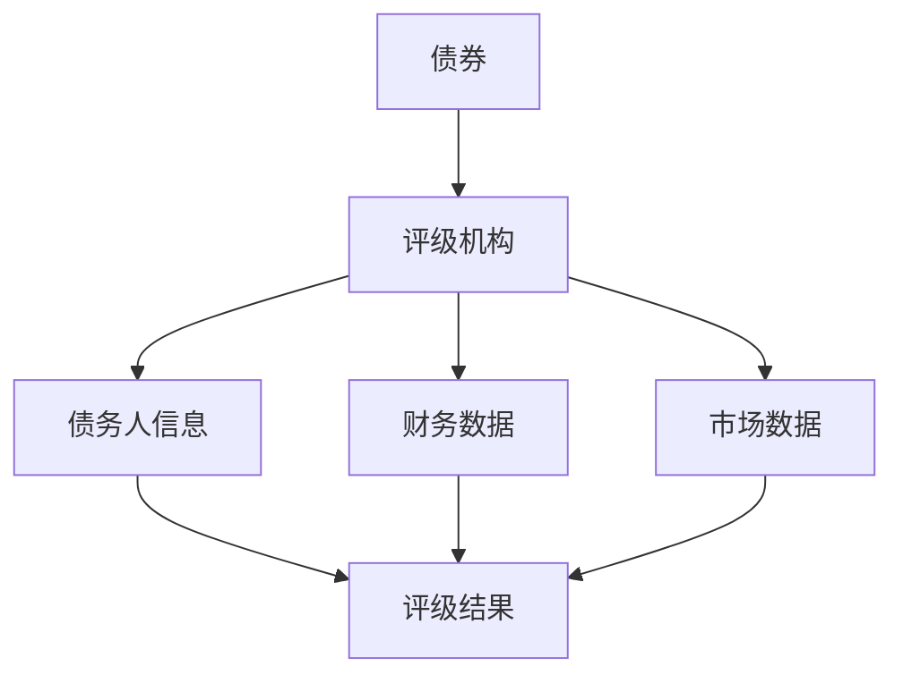
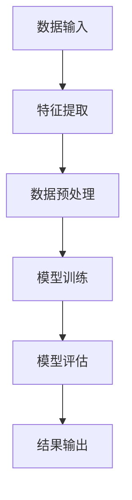
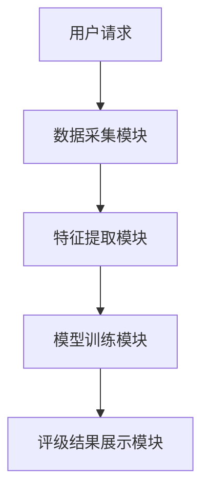

                 


# 机器学习在债券信用评级中的应用研究

> 关键词：机器学习、债券信用评级、算法原理、系统架构、项目实战

> 摘要：本文探讨了机器学习在债券信用评级中的应用，分析了传统评级方法的局限性，详细介绍了机器学习的核心概念、算法原理、系统架构，并通过实际案例展示了机器学习在信用评级中的优势和应用效果。文章最后总结了机器学习在信用评级中的最佳实践和未来研究方向。

---

## 第一部分: 背景介绍

### 第1章: 背景介绍

#### 1.1 机器学习的基本概念
- **1.1.1 机器学习的定义与特点**
  机器学习是一种人工智能技术，通过数据训练模型，使其能够从经验中学习并做出预测或决策。其特点包括数据驱动、自动化学习和适应性。

- **1.1.2 机器学习的核心概念与分类**
  核心概念包括监督学习、无监督学习、强化学习等。分类主要依据任务类型和数据类型。

- **1.1.3 机器学习在金融领域的应用背景**
  金融领域广泛运用机器学习技术，如股票预测、信用评分和欺诈检测。

#### 1.2 债券信用评级的背景与重要性
- **1.2.1 债券信用评级的定义与作用**
  债券信用评级是对债券发行者偿还能力的评估，帮助投资者评估风险和定价。

- **1.2.2 债券信用评级的分类与方法**
  分为长期评级和短期评级，主要方法包括财务指标分析、非财务因素分析等。

- **1.2.3 传统信用评级的局限性与挑战**
  传统方法依赖主观判断，难以捕捉复杂市场变化，存在效率低下和成本高昂的问题。

#### 1.3 机器学习在信用评级中的优势
- **1.3.1 数据驱动的评级优势**
  机器学习能够处理海量数据，提取非线性特征，提升评级的准确性。

- **1.3.2 非线性关系的捕捉能力**
  机器学习模型能够发现传统方法难以识别的复杂关系。

- **1.3.3 高效性与可扩展性**
  机器学习模型训练一次后，可以快速处理大量数据，适用于大规模评级需求。

#### 1.4 本章小结
- **1.4.1 核心概念回顾**
  机器学习的基本概念和债券信用评级的基本原理。

- **1.4.2 研究意义与目标**
  探讨机器学习在信用评级中的应用，优化传统评级方法的不足。

---

## 第二部分: 核心概念与联系

### 第2章: 核心概念与联系

#### 2.1 机器学习模型的核心原理
- **2.1.1 监督学习与无监督学习**
  监督学习基于标签数据，无监督学习基于无标签数据。

- **2.1.2 分类与回归模型**
  分类用于预测债券评级等级，回归用于预测违约概率。

- **2.1.3 特征提取与降维技术**
  使用主成分分析等技术减少特征维度，提升模型性能。

#### 2.2 债券信用评级的核心要素
- **2.2.1 债务人特征分析**
  包括财务指标、行业风险、管理能力等。

- **2.2.2 偿债能力与风险因素**
  包括流动性、盈利能力、杠杆率等。

- **2.2.3 市场环境与宏观经济指标**
  包括利率、通货膨胀、经济周期等。

#### 2.3 机器学习与信用评级的联系
- **2.3.1 数据特征与模型选择**
  不同数据特征适合不同模型。

- **2.3.2 模型性能与评级准确性**
  机器学习模型性能直接影响评级结果的准确性。

- **2.3.3 可解释性与实际应用的平衡**
  机器学习模型的可解释性对实际应用至关重要。

#### 2.4 核心概念对比表格
| 对比维度       | 传统评级方法            | 机器学习方法            |
|----------------|-------------------------|-------------------------|
| 数据依赖性     | 依赖少量特征            | 依赖海量数据            |
| 模型复杂性     | 简单线性模型            | 复杂非线性模型          |
| 处理速度       | 较慢                   | 较快                   |
| 可扩展性       | 有限                   | 强大                   |

#### 2.5 ER实体关系图


---

## 第三部分: 算法原理讲解

### 第3章: 算法原理讲解

#### 3.1 机器学习算法概述
- **3.1.1 监督学习算法**
  包括线性回归、支持向量机、随机森林等。

- **3.1.2 非监督学习算法**
  包括聚类算法、主题模型等。

- **3.1.3 深度学习算法**
  包括神经网络、卷积神经网络等。

#### 3.2 常见算法流程图


#### 3.3 数学模型与公式
- **3.3.1 线性回归模型**
  $$ y = \beta_0 + \beta_1x_1 + \beta_2x_2 + ... + \beta_nx_n $$

- **3.3.2 随机森林算法**
  $$ y = \sum_{i=1}^{n} \text{Tree}_i(x) $$

#### 3.4 算法实现与案例分析
- **3.4.1 算法实现代码**
  ```python
  from sklearn.ensemble import RandomForestClassifier
  model = RandomForestClassifier(n_estimators=100)
  model.fit(X_train, y_train)
  ```

---

## 第四部分: 系统分析与架构设计

### 第4章: 系统分析与架构设计

#### 4.1 问题场景介绍
- 债券信用评级系统需要处理海量数据，实时性强，要求高准确性。

#### 4.2 项目介绍
- 系统目标：构建基于机器学习的债券信用评级系统。

#### 4.3 系统功能设计
- 数据采集模块：收集债券相关信息。
- 特征提取模块：提取影响评级的关键特征。
- 模型训练模块：训练机器学习模型。
- 评级结果展示模块：输出评级结果和解释。

#### 4.4 系统架构设计


---

## 第五部分: 项目实战

### 第5章: 项目实战

#### 5.1 环境安装
- 安装Python、NumPy、Pandas、Scikit-learn等库。

#### 5.2 系统核心实现源代码
```python
import pandas as pd
from sklearn.model_selection import train_test_split
from sklearn.ensemble import RandomForestClassifier
from sklearn.metrics import accuracy_score

# 加载数据
data = pd.read_csv('bond_data.csv')
X = data.drop('rating', axis=1)
y = data['rating']

# 数据分割
X_train, X_test, y_train, y_test = train_test_split(X, y, test_size=0.2)

# 模型训练
model = RandomForestClassifier(n_estimators=100)
model.fit(X_train, y_train)

# 模型评估
y_pred = model.predict(X_test)
print("Accuracy:", accuracy_score(y_test, y_pred))
```

#### 5.3 实际案例分析
- 使用实际债券数据训练模型，分析模型在不同情况下的表现。

---

## 第六部分: 最佳实践

### 第6章: 最佳实践

#### 6.1 研究成果总结
- 机器学习在债券信用评级中展现出显著优势。

#### 6.2 应用中的注意事项
- 数据质量、模型解释性、实时性等问题需要注意。

#### 6.3 拓展阅读
- 推荐相关书籍和论文，供读者深入研究。

---

## 作者：AI天才研究院/AI Genius Institute & 禅与计算机程序设计艺术 /Zen And The Art of Computer Programming

---

### 总结
本文系统地探讨了机器学习在债券信用评级中的应用，从理论到实践，全面分析了其优势和挑战，并通过实际案例展示了其应用效果。希望本文能为相关领域的研究者和从业者提供有价值的参考。

