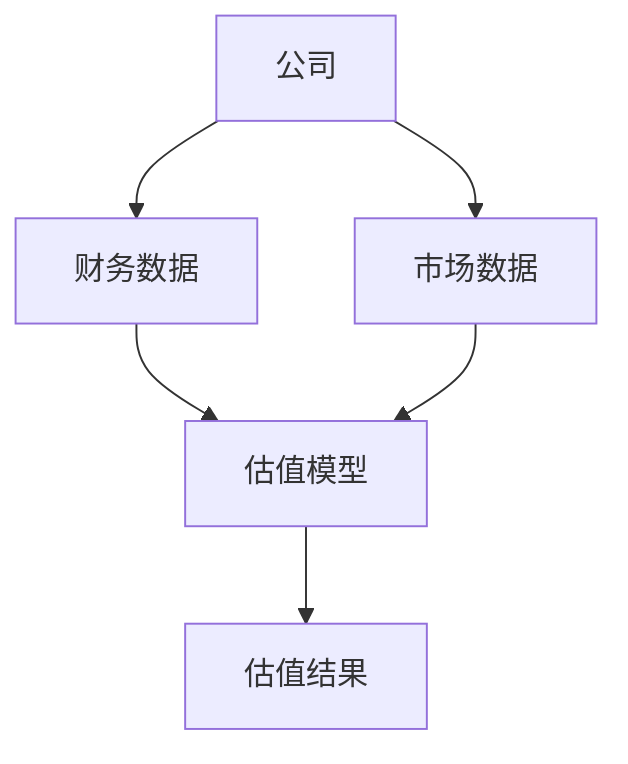
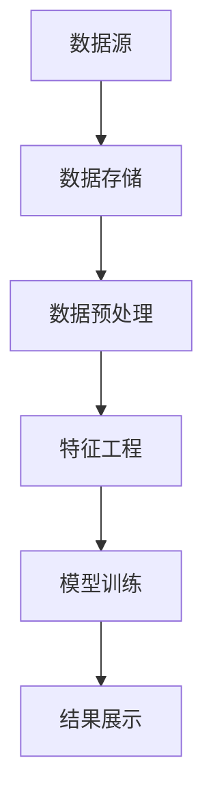
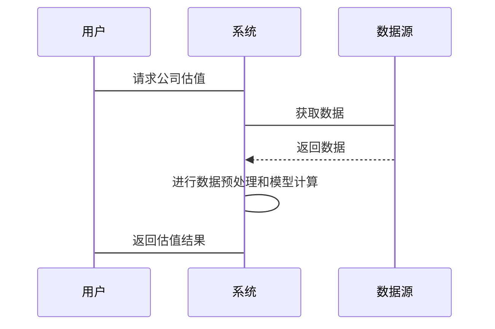

                 


# 机器学习在公司估值模型中的应用研究

## 关键词：机器学习、公司估值、金融模型、算法、数据分析

## 摘要  
本文探讨了机器学习在公司估值模型中的应用，分析了传统估值方法的局限性，并结合机器学习的优势，提出了一种基于特征工程、模型选择与优化的估值新方法。通过具体案例和系统架构设计，展示了如何利用机器学习提升公司估值的准确性和效率。

---

# 第一部分: 机器学习在公司估值模型中的应用概述

## 第1章: 机器学习与公司估值模型的背景介绍

### 1.1 机器学习的基本概念  
机器学习是一种人工智能技术，通过数据训练模型，使其能够自动学习和预测。核心要素包括数据、特征、算法和模型。机器学习算法分为监督学习、无监督学习和强化学习，具有数据驱动、自动化和适应性特点。

### 1.2 公司估值模型的基本概念  
公司估值模型用于评估公司价值，常见方法有DCF模型、相对估值法和资产重估法。传统模型依赖财务数据和市场指标，但存在数据不足、假设偏差和市场波动适应性差的问题。

### 1.3 机器学习在公司估值中的应用背景  
传统估值模型在复杂市场环境下表现有限，机器学习通过处理海量数据、发现非线性关系，提供了新的解决方案。机器学习在特征选择、预测精度和实时性方面的优势，使其成为公司估值的重要工具。

### 1.4 本章小结  
本章介绍了机器学习和公司估值模型的基本概念，分析了传统估值方法的局限性，并指出了机器学习在公司估值中的应用背景和优势。

---

# 第二部分: 核心概念与联系

## 第2章: 核心概念与联系  

### 2.1 机器学习在公司估值中的核心概念  
- **特征工程**：通过提取和处理财务、市场和行业数据，构建有效的输入特征。
- **模型选择与优化**：选择适合的算法，并通过交叉验证和超参数调优提升性能。
- **数据预处理**：处理缺失值、异常值和数据标准化，确保模型输入质量。

### 2.2 核心概念的联系与对比  
| 比较维度 | 传统估值模型 | 机器学习模型 |
|----------|---------------|---------------|
| 数据需求 | 依赖少量财务数据 | 处理大量非结构化数据 |
| 模型假设 | 基于明确假设 | 可发现隐藏规律 |
| 预测能力 | 线性预测为主 | 支持非线性关系 |

### 2.3 ER实体关系图  


### 2.4 本章小结  
本章分析了机器学习在公司估值中的核心概念，通过对比表格和ER图展示了各概念之间的联系。

---

# 第三部分: 算法原理讲解

## 第3章: 算法原理与实现  

### 3.1 机器学习算法在公司估值中的应用  
- **线性回归模型**：用于简单的线性关系预测。
- **随机森林模型**：通过集成学习提高准确性和鲁棒性。
- **神经网络模型**：处理复杂非线性关系，但训练时间较长。

### 3.2 算法原理的数学模型  
- **线性回归模型**：$$ y = \beta_0 + \beta_1x + \epsilon $$
- **随机森林模型**：基于决策树的集成方法，通过投票或平均生成结果。
- **神经网络模型**：前向传播公式：$$ a^{(l+1)} = \sigma(w^{(l)}a^{(l)} + b^{(l)}) $$

### 3.3 算法实现的Python代码示例  
```python
import pandas as pd
from sklearn.ensemble import RandomForestRegressor
from sklearn.model_selection import train_test_split
from sklearn.metrics import mean_squared_error

# 数据加载与预处理
data = pd.read_csv('company_valuation.csv')
X = data[['revenue', 'profit', 'market_cap']]
y = data['true_valuation']

# 数据划分
X_train, X_test, y_train, y_test = train_test_split(X, y, test_size=0.2, random_state=42)

# 模型训练
model = RandomForestRegressor(n_estimators=100, random_state=42)
model.fit(X_train, y_train)

# 模型预测与评估
y_pred = model.predict(X_test)
print(mean_squared_error(y_test, y_pred))
```

### 3.4 本章小结  
本章详细讲解了机器学习算法在公司估值中的应用，通过数学公式和代码示例，展示了线性回归、随机森林和神经网络的工作原理和实现步骤。

---

# 第四部分: 系统分析与架构设计

## 第4章: 系统分析与架构设计  

### 4.1 问题场景介绍  
构建一个基于机器学习的公司估值系统，目标是通过分析公司财务数据、市场数据和行业趋势，生成准确的估值结果，帮助投资者做出决策。

### 4.2 系统功能设计  
- **数据获取模块**：从数据库或API获取数据。
- **数据预处理模块**：清洗和标准化数据。
- **特征工程模块**：提取关键特征。
- **模型训练模块**：选择并训练模型。
- **结果展示模块**：输出估值结果和可视化分析。

### 4.3 系统架构设计  


### 4.4 系统接口设计  
- **数据接口**：API接口获取实时数据。
- **模型接口**：提供RESTful API供其他系统调用估值结果。
- **用户界面**：网页或移动端界面展示结果。

### 4.5 系统交互设计  


### 4.6 本章小结  
本章从系统角度分析了机器学习在公司估值中的应用，设计了一个完整的系统架构，并通过接口和交互流程图展示了系统的实现细节。

---

# 第五部分: 项目实战

## 第5章: 项目实战  

### 5.1 环境安装与配置  
- **Python环境**：安装Python 3.8及以上版本。
- **依赖库安装**：使用pip安装numpy、pandas、scikit-learn和xgboost等库。

### 5.2 系统核心实现源代码  
```python
import pandas as pd
import numpy as np
from sklearn.model_selection import GridSearchCV
from sklearn.ensemble import RandomForestRegressor
from xgboost import XGBRegressor
from sklearn.metrics import mean_absolute_error

# 数据加载
data = pd.read_csv('company_valuation.csv')

# 特征工程
numerical_features = data.select_dtypes(include=['int64', 'float64']).columns
data['revenue'] = data['revenue'].fillna(data['revenue'].mean())
data['profit'] = data['profit'].fillna(data['profit'].mean())

# 模型选择与优化
param_grid = {
    'n_estimators': [100, 200],
    'max_depth': [None, 10, 20],
    'min_samples_split': [2, 5]
}
grid_search = GridSearchCV(RandomForestRegressor(), param_grid, cv=5)
grid_search.fit(data[['revenue', 'profit']], data['true_valuation'])

best_model = grid_search.best_estimator_
print("Best Parameters:", grid_search.best_params_)
print("Best Score:", grid_search.best_score_)

# 模型评估
y_pred = best_model.predict(data[['revenue', 'profit']])
print("Mean Absolute Error:", mean_absolute_error(data['true_valuation'], y_pred))
```

### 5.3 实际案例分析  
以具体公司为例，展示如何通过数据预处理、特征选择和模型训练，生成准确的估值结果。分析模型表现，并对比传统估值方法的差异。

### 5.4 本章小结  
本章通过实际项目案例，展示了如何在Python环境中实现机器学习驱动的公司估值模型，并通过代码示例和案例分析，详细讲解了模型实现和评估过程。

---

# 总结  

## 最佳实践  
- **数据质量**：确保数据来源可靠，预处理充分。
- **特征选择**：根据业务需求选择关键特征。
- **模型选择**：根据数据特性和任务目标选择合适的算法。
- **结果解读**：结合业务背景，分析模型输出的合理性。

## 总结  
机器学习为公司估值提供了新的解决方案，通过特征工程、模型选择和系统设计，可以显著提升估值的准确性和效率。未来，随着AI技术的发展，机器学习在金融领域的应用将更加广泛和深入。

---

## 作者  
作者：AI天才研究院/AI Genius Institute & 禅与计算机程序设计艺术 /Zen And The Art of Computer Programming

