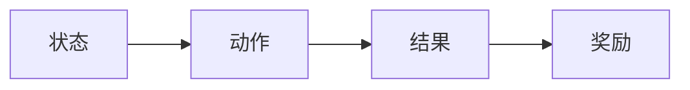
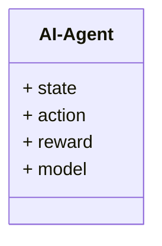
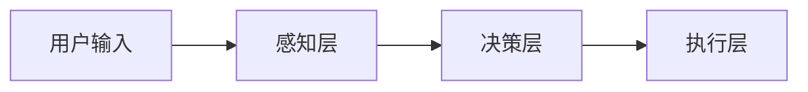
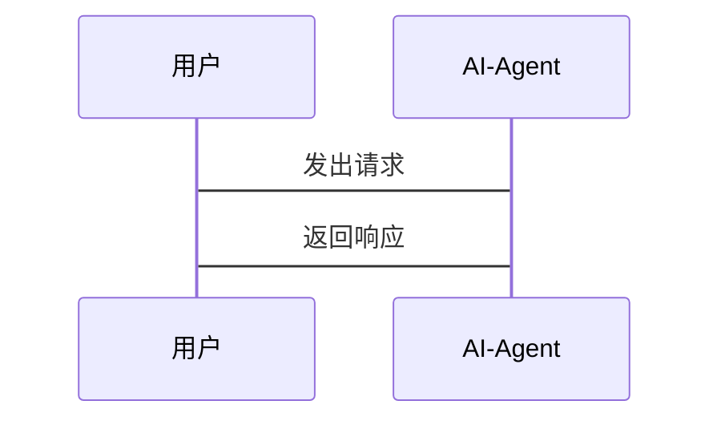

                 

# 构建AI Agent常见挑战及解决方案

> 关键词：AI Agent，人工智能，算法原理，系统架构，项目实战，挑战与解决方案

> 摘要：构建AI Agent是一个复杂但极具潜力的领域，本文将从基础概念、核心算法、系统架构、项目实战等多方面详细探讨AI Agent的构建过程，并分析常见的挑战及其解决方案。文章内容涵盖从理论到实践的各个方面，旨在为读者提供一个全面的视角，帮助他们更好地理解和应用AI Agent技术。

---

## 第一部分: AI Agent背景与基础

### 第1章: AI Agent的背景与概念

#### 1.1 AI Agent的基本概念
- 1.1.1 什么是AI Agent？
- 1.1.2 AI Agent的核心特征
- 1.1.3 AI Agent与传统AI的区别

#### 1.2 AI Agent的技术演进
- 1.2.1 AI Agent的历史发展
- 1.2.2 当前AI Agent的技术趋势
- 1.2.3 未来AI Agent的可能方向

#### 1.3 AI Agent的应用场景
- 1.3.1 智能助手
- 1.3.2 自动化系统
- 1.3.3 游戏AI
- 1.3.4 企业级应用

#### 1.4 AI Agent的常见挑战
- 1.4.1 技术层面的挑战
- 1.4.2 应用层面的挑战
- 1.4.3 伦理与安全问题

---

### 第2章: AI Agent的核心概念与原理

#### 2.1 AI Agent的核心概念
- 2.1.1 知识表示
- 2.1.2 行为规划
- 2.1.3 感知与交互

#### 2.2 AI Agent的分类
- 2.2.1 简单反射型AI Agent
- 2.2.2 基于模型的AI Agent
- 2.2.3 增量学习型AI Agent
- 2.2.4 人机协作型AI Agent

#### 2.3 AI Agent的架构模式
- 2.3.1 反射架构
- 2.3.2 行为选择架构
- 2.3.3 分层规划架构
- 2.3.4 学习增强架构

---

## 第二部分: AI Agent的算法原理

### 第3章: AI Agent的算法原理

#### 3.1 基础算法概述
- 3.1.1 强化学习算法
- 3.1.2 监督学习算法
- 3.1.3 无监督学习算法
- 3.1.4 图灵测试与自然语言处理

#### 3.2 核心算法实现
- 3.2.1 Q-Learning算法
- 3.2.2 DQN算法
- 3.2.3 A*寻径算法
- 3.2.4 蒙特卡洛树搜索

#### 3.3 算法原理图

---

## 第三部分: AI Agent的系统架构与设计

### 第4章: AI Agent的系统分析与架构设计

#### 4.1 系统功能设计
- 4.1.1 领域模型设计（Mermaid类图）

#### 4.2 系统架构设计
- 4.2.1 分层架构设计（Mermaid架构图）

#### 4.3 系统接口设计
- 4.3.1 接口定义
- 4.3.2 接口实现

#### 4.4 系统交互设计
- 4.4.1 交互流程（Mermaid序列图）

---

## 第四部分: AI Agent的项目实战

### 第5章: AI Agent的项目实战

#### 5.1 环境安装与配置
- 5.1.1 安装依赖
- 5.1.2 环境配置

#### 5.2 核心代码实现
- 5.2.1 知识表示代码
- 5.2.2 行为规划代码
- 5.2.3 感知与交互代码

#### 5.3 实际案例分析
- 5.3.1 案例背景
- 5.3.2 案例分析
- 5.3.3 案例总结

#### 5.4 项目总结与优化
- 5.4.1 项目总结
- 5.4.2 优化建议

---

## 第五部分: 总结与展望

### 第6章: 总结与展望

#### 6.1 全文总结
- 6.1.1 核心内容回顾
- 6.1.2 重点内容总结

#### 6.2 最佳实践
- 6.2.1 开发注意事项
- 6.2.2 应用建议

#### 6.3 未来展望
- 6.3.1 技术发展趋势
- 6.3.2 应用前景预测

---

## 附录: 工具与资源

### A. 常用工具与资源
- A.1 AI Agent开发工具
- A.2 数据集推荐
- A.3 开发文档与教程

---

## 作者：AI天才研究院/AI Genius Institute & 禅与计算机程序设计艺术 /Zen And The Art of Computer Programming

---

**注意事项**：
- 每个章节的内容需要详细展开，确保涵盖理论、代码、图表和实际案例。
- 使用Mermaid图示和Python代码示例来增强理解。
- 数学公式使用LaTeX格式，确保清晰易懂。

--- 

**温馨提示**：如果需要完整的文章内容，请告诉我，我将根据这个大纲为您撰写详细的技术博客文章。

