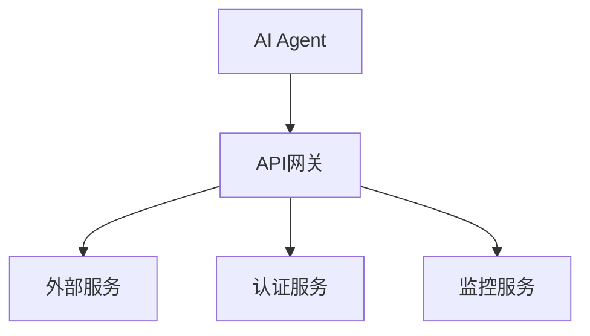
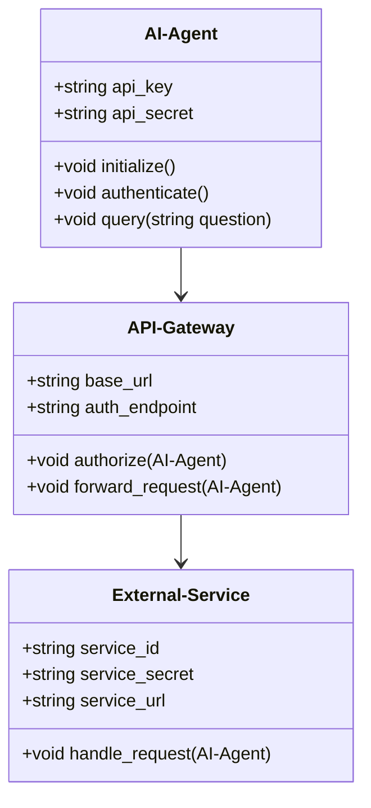
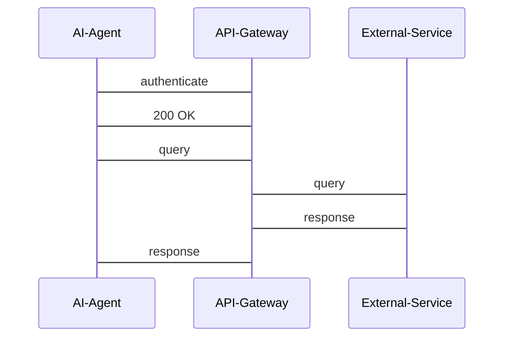

                 


# 构建AI Agent的API集成能力：连接外部服务

> 关键词：AI Agent, API集成, 外部服务, RESTful API, OAuth 2.0, 微服务架构

> 摘要：本文将深入探讨如何构建具备API集成能力的AI Agent，重点介绍API集成的核心技术、系统架构设计、安全性与监控，以及项目实战等内容。通过理论与实践结合，帮助读者全面理解AI Agent与外部服务连接的实现细节。

---

# 第一部分: AI Agent与API集成概述

## 第1章: AI Agent与API集成的背景与概念

### 1.1 AI Agent的基本概念

#### 1.1.1 AI Agent的定义与特点

AI Agent（人工智能代理）是一种能够感知环境、自主决策并执行任务的智能实体。它可以是一个软件程序、一个机器人，或者是一个智能系统。AI Agent的核心特点包括：

- **自主性**：能够在没有外部干预的情况下自主运行。
- **反应性**：能够感知环境并实时调整行为。
- **主动性**：主动采取行动以实现目标。
- **社交能力**：能够与其他系统或人类进行交互。

AI Agent的典型应用场景包括智能助手（如Siri、Alexa）、推荐系统、自动化交易系统等。

#### 1.1.2 AI Agent的核心功能与能力

AI Agent的核心功能包括：

- **感知环境**：通过传感器或API接口获取外部信息。
- **决策与推理**：基于获取的信息进行分析、推理并做出决策。
- **执行任务**：通过调用外部服务或控制物理设备来执行任务。
- **学习与优化**：通过机器学习算法不断优化自身的行为模式。

#### 1.1.3 AI Agent的分类与应用场景

AI Agent可以根据不同的标准进行分类，常见的分类方式包括：

- **按智能水平**：分为反应式AI Agent和认知式AI Agent。
- **按应用场景**：分为服务型AI Agent（如智能客服）、决策型AI Agent（如自动驾驶）等。

### 1.2 API集成的重要性

#### 1.2.1 API在现代系统中的作用

API（应用程序编程接口）是现代软件系统的重要组成部分。通过API，不同系统之间可以实现数据交互和功能调用。API的作用包括：

- **模块化开发**：通过API实现功能模块的解耦。
- **服务复用**：通过API实现功能和服务的复用。
- **生态系统构建**：通过API构建开放的生态系统，促进第三方开发。

#### 1.2.2 API集成在AI Agent中的意义

对于AI Agent而言，API集成是其连接外部世界的重要桥梁。通过API集成，AI Agent可以：

- **获取外部数据**：通过调用外部API获取所需的数据。
- **调用外部服务**：通过调用外部服务（如支付网关、天气预报服务）实现复杂任务。
- **与人类交互**：通过调用用户界面相关API实现与人类的交互。

#### 1.2.3 API经济与生态的价值

API经济是现代互联网经济的重要组成部分。通过API，企业可以快速构建生态系统，实现资源的共享与协作。API经济的价值体现在：

- **降低开发成本**：通过API复用功能，降低开发成本。
- **加速创新**：通过API快速实现功能，加速产品创新。
- **构建生态系统**：通过API吸引第三方开发者，构建开放生态系统。

### 1.3 本章小结

本章主要介绍了AI Agent的基本概念、核心功能与分类，以及API集成的重要性。通过本章的学习，读者可以理解AI Agent与API集成的关系，以及API集成在AI Agent中的核心作用。

---

## 第2章: API集成的核心技术与实现

### 2.1 API设计与集成原则

#### 2.1.1 RESTful API的设计规范

RESTful API是一种基于HTTP协议的API设计风格。REST（Representational State Transfer）强调资源、表示和状态转移。RESTful API的设计规范包括：

- **资源导向**：将API设计为资源的集合。
- **统一接口**：使用标准的HTTP方法（如GET、POST、PUT、DELETE）进行操作。
- **状态管理**：通过HTTP状态码（如200、404、500）表示操作结果。

#### 2.1.2 API版本管理策略

API版本管理是API设计中的重要问题。常见的API版本管理策略包括：

- **URL版本控制**：通过在URL中添加版本号（如/v1/）区分不同版本。
- **Header版本控制**：通过在HTTP头中添加版本号（如`API-Version: 1.0`）区分版本。
- **内容协商**：通过协商机制选择合适的API版本。

#### 2.1.3 API文档编写与维护

良好的API文档是API成功的关键。API文档应包括：

- **API接口描述**：包括API的URL、HTTP方法、请求参数、响应格式等。
- **示例**：提供完整的请求和响应示例。
- **错误处理**：描述可能的错误码和错误信息。
- **版本历史**：记录API的版本变更历史。

### 2.2 API集成的技术选型

#### 2.2.1 RESTful API与GraphQL的对比

RESTful API和GraphQL是两种常见的API设计风格。RESTful API的优点包括简单、易实现，缺点是难以扩展。GraphQL的优点是查询灵活、数据获取效率高，缺点是实现复杂。选择RESTful API还是GraphQL，需要根据具体场景决定。

#### 2.2.2 API网关与服务发现机制

API网关是API集成中的重要组件。API网关的作用包括：

- **路由与转发**：将请求路由到相应的服务。
- **认证与授权**：对API请求进行认证和授权。
- **速率限制**：防止API被滥用。
- **监控与日志**：监控API的使用情况并记录日志。

服务发现机制是API网关的重要功能。常见的服务发现机制包括：

- **DNS发现**：通过DNS记录服务地址。
- **服务注册与发现**：通过服务注册中心（如Consul）进行服务发现。

#### 2.2.3 API速率限制与熔断机制

API速率限制是API安全的重要措施。常见的API速率限制策略包括：

- **基于IP的速率限制**：限制单个IP的请求次数。
- **基于用户的速率限制**：限制单个用户的请求次数。
- **全局速率限制**：限制整个API的请求次数。

熔断机制是处理API过载的重要策略。熔断机制通过暂时拒绝部分请求，防止服务崩溃。

### 2.3 本章小结

本章主要介绍了API设计与集成的核心原则，包括RESTful API设计规范、API版本管理策略、API文档编写与维护，以及API网关与服务发现机制等。通过本章的学习，读者可以掌握API设计与集成的核心技术。

---

## 第3章: API集成的技术实现

### 3.1 HTTP协议与API通信

#### 3.1.1 HTTP方法（GET、POST、PUT等）的使用场景

HTTP协议是API通信的基础。常见的HTTP方法包括：

- **GET**：用于获取资源。
- **POST**：用于创建资源。
- **PUT**：用于更新资源。
- **DELETE**：用于删除资源。
- **HEAD**：用于获取资源的元数据。
- **OPTIONS**：用于获取支持的HTTP方法。

#### 3.1.2 HTTP状态码在API集成中的应用

HTTP状态码是API通信的重要组成部分。常见的HTTP状态码包括：

- **200 OK**：表示请求成功。
- **404 Not Found**：表示资源未找到。
- **500 Internal Server Error**：表示服务器内部错误。
- **401 Unauthorized**：表示未授权访问。
- **403 Forbidden**：表示禁止访问。

#### 3.1.3 JSON与XML在API数据传输中的作用

JSON（JavaScript Object Notation）和XML（Extensible Markup Language）是常见的数据交换格式。JSON的优点是轻量、易解析，XML的优点是结构清晰、可扩展性好。在API集成中，JSON更常用。

### 3.2 OAuth 2.0与API认证授权

#### 3.2.1 OAuth 2.0的认证流程

OAuth 2.0是一种常用的认证协议。OAuth 2.0的认证流程包括：

1. **授权码获取**：用户向授权服务器申请授权码。
2. **令牌获取**：客户端使用授权码向令牌颁发服务器申请访问令牌。
3. **令牌使用**：客户端使用访问令牌调用API。

#### 3.2.2 JWT（JSON Web Token）的使用原理

JWT是一种用于身份认证的JSON格式令牌。JWT的结构包括：

- **Header**：令牌的头部信息。
- **Payload**：令牌的负载信息。
- **Signature**：令牌的签名部分。

JWT的优点是无状态、可扩展、安全性高。

#### 3.2.3 API密钥与访问控制策略

API密钥是API访问控制的重要手段。API密钥的作用包括：

- **身份验证**：验证调用者的身份。
- **权限控制**：控制调用者对API的访问权限。

常见的API访问控制策略包括：

- **基于角色的访问控制（RBAC）**：根据用户角色控制访问权限。
- **基于策略的访问控制（PBAC）**：根据访问策略控制访问权限。

### 3.3 API调用与中间件实现

#### 3.3.1 使用HTTP客户端库（如Axios、Postman）进行API调用

HTTP客户端库是API调用的重要工具。常见的HTTP客户端库包括：

- **Axios**：用于浏览器和Node.js环境。
- **Postman**：用于API测试和调试。
- **requests**：用于Python环境。

#### 3.3.2 API网关的实现与配置（如Apigee、 Kong）

API网关是API集成的重要组件。常见的API网关包括：

- **Apigee**：提供企业级API管理功能。
- **Kong**：开源的API网关，支持插件扩展。
- **Nginx**：通过插件实现API网关功能。

#### 3.3.3 API中间件的功能与作用

API中间件是API集成中的重要组件。常见的API中间件包括：

- **认证中间件**：实现API认证功能。
- **授权中间件**：实现API授权功能。
- **速率限制中间件**：实现API速率限制功能。

### 3.4 本章小结

本章主要介绍了API集成的技术实现，包括HTTP协议与API通信、OAuth 2.0与API认证授权，以及API调用与中间件实现。通过本章的学习，读者可以掌握API集成的技术实现细节。

---

## 第4章: AI Agent的系统架构设计

### 4.1 系统架构概述

#### 4.1.1 微服务架构与AI Agent的结合

微服务架构是现代系统设计的重要模式。AI Agent可以采用微服务架构，将不同功能模块（如感知模块、决策模块、执行模块）独立部署。

#### 4.1.2 领域模型的设计与实现

领域模型是系统设计的重要部分。AI Agent的领域模型应包括：

- **感知层**：感知环境并获取数据。
- **决策层**：基于感知数据进行分析和决策。
- **执行层**：根据决策结果执行任务。

#### 4.1.3 系统架构的可扩展性与可维护性

系统架构的可扩展性与可维护性是系统设计的重要目标。通过模块化设计、松耦合设计，可以提高系统的可扩展性和可维护性。

### 4.2 API集成的系统架构图

#### 4.2.1 使用Mermaid绘制系统架构图



---

## 第5章: API集成的安全性与监控

### 5.1 API安全性设计

#### 5.1.1 API认证与授权机制

API认证与授权机制是API安全性的重要保障。常见的API认证机制包括：

- **OAuth 2.0**：基于令牌的认证。
- **API密钥**：基于密钥的认证。
- **JWT**：基于JSON Web Token的认证。

常见的API授权机制包括：

- **基于角色的访问控制（RBAC）**：根据用户角色控制访问权限。
- **基于策略的访问控制（PBAC）**：根据访问策略控制访问权限。

#### 5.1.2 API数据加密与签名

API数据加密与签名是API安全性的重要保障。常见的API数据加密方法包括：

- **HTTPS**：通过SSL/TLS协议加密数据传输。
- **AES加密**：对敏感数据进行加密处理。
- **HMAC签名**：通过哈希消息认证码（HMAC）进行数据签名。

### 5.2 API监控与日志管理

#### 5.2.1 API性能监控

API性能监控是API管理的重要内容。常见的API性能监控指标包括：

- **响应时间**：API的平均响应时间。
- **请求成功率**：API的成功请求比例。
- **吞吐量**：单位时间内处理的请求数量。

#### 5.2.2 API日志管理

API日志管理是API监控的重要手段。常见的API日志管理工具包括：

- **ELK Stack**：由Elasticsearch、Logstash、Kibana组成的日志管理平台。
- **Prometheus + Grafana**：用于指标监控和可视化。
- **Fluentd**：用于日志采集和传输。

### 5.3 本章小结

本章主要介绍了API集成的安全性与监控，包括API安全性设计和API监控与日志管理。通过本章的学习，读者可以掌握API集成的安全性保障和监控管理方法。

---

## 第6章: 项目实战

### 6.1 项目背景与目标

#### 6.1.1 项目背景

假设我们正在开发一个智能客服AI Agent，该AI Agent需要集成外部API服务，包括：

- **自然语言处理API**：用于理解和生成自然语言。
- **知识库查询API**：用于查询知识库中的信息。
- **语音识别API**：用于识别用户的语音输入。

#### 6.1.2 项目目标

通过本项目，我们希望实现一个能够与用户进行自然语言交互的智能客服AI Agent。

### 6.2 系统功能设计

#### 6.2.1 使用Mermaid绘制领域模型类图



#### 6.2.2 系统接口设计

系统接口设计包括：

- **AI Agent接口**：`POST /api/v1/query`，用于向外部服务发送查询请求。
- **API网关接口**：`POST /api/v1/authenticate`，用于API认证。
- **外部服务接口**：`POST /api/v1/service`，用于处理具体业务逻辑。

#### 6.2.3 系统交互设计

使用Mermaid绘制系统交互序列图：



### 6.3 项目实现

#### 6.3.1 环境安装

项目实现需要以下环境：

- **Python 3.8+**
- **Flask框架**
- **Postman或curl工具**
- **Mermaid图表工具**

#### 6.3.2 核心代码实现

以下是AI Agent的核心代码实现：

```python
import requests
from flask import jsonify

class AIAgent:
    def __init__(self, api_key, api_secret):
        self.api_key = api_key
        self.api_secret = api_secret
        self.authenticated = False

    def authenticate(self):
        headers = {
            'Authorization': f'Basic {self.get_basic_auth()}'
        }
        response = requests.post('http://api-gateway:8080/api/v1/authenticate', headers=headers)
        if response.status_code == 200:
            self.authenticated = True
        else:
            raise Exception('Authentication failed')

    def get_basic_auth(self):
        return f"{self.api_key}:{self.api_secret}".encode('ascii').b64encode().decode('ascii')

    def query(self, question):
        if not self.authenticated:
            self.authenticate()
        headers = {
            'Content-Type': 'application/json',
            'Authorization': f'Bearer {self.get_access_token()}'
        }
        data = {
            'question': question
        }
        response = requests.post('http://api-gateway:8080/api/v1/query', headers=headers, json=data)
        return response.json()

    def get_access_token(self):
        return 'your-access-token'  # 示例，实际应从认证响应中获取

# 初始化AI Agent
ai_agent = AIAgent('your-api-key', 'your-api-secret')
# 调用查询接口
result = ai_agent.query('What is AI?')
print(result)
```

#### 6.3.3 代码解读与分析

- **AIAgent类**：实现AI Agent的核心功能，包括认证和查询。
- **authenticate方法**：通过API网关进行认证。
- **query方法**：通过API网关调用外部服务。
- **HTTP请求**：使用requests库发送HTTP请求。

### 6.4 项目小结

本章通过一个智能客服AI Agent的项目实战，详细介绍了API集成的实现过程，包括系统设计、接口设计和代码实现。通过本章的学习，读者可以掌握API集成的实际应用方法。

---

## 第7章: 总结与展望

### 7.1 本章总结

本文全面探讨了AI Agent的API集成能力，包括API设计与集成原则、系统架构设计、安全性与监控，以及项目实战等内容。通过本文的学习，读者可以掌握AI Agent与外部服务连接的关键技术。

### 7.2 未来展望

随着AI技术的不断发展，AI Agent的API集成能力将更加重要。未来的发展方向包括：

- **智能化API网关**：通过AI技术优化API网关的功能。
- **API可观测性**：通过日志、指标和跟踪实现API的可观测性。
- **API可扩展性**：通过模块化设计提高API的可扩展性。
- **API可维护性**：通过松耦合设计提高API的可维护性。

---

# 作者：AI天才研究院/AI Genius Institute & 禅与计算机程序设计艺术 /Zen And The Art of Computer Programming

---

这篇文章通过理论与实践相结合，全面介绍了AI Agent的API集成能力。希望对读者在AI Agent的开发和应用中有所帮助。

