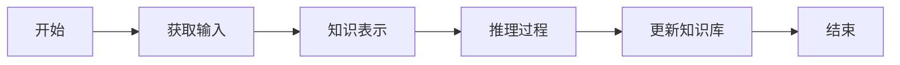
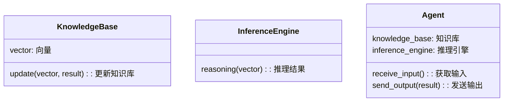

                 

<think>
好的，我需要根据用户的请求和我提供的详细目录，开始撰写《构建AI Agent的动态知识推理系统》的技术博客文章。首先，我会从文章标题和关键词开始，然后是摘要，接着按照目录结构逐步展开每个章节的内容。

### 文章标题
《构建AI Agent的动态知识推理系统》

### 文章关键词
- AI Agent
- 动态知识推理
- 知识表示
- 推理引擎
- 系统架构设计

### 摘要
在人工智能快速发展的今天，AI Agent（智能代理）正变得越来越重要。为了使AI Agent能够适应动态变化的环境，动态知识推理系统的构建显得尤为关键。本文将详细探讨动态知识推理的核心概念、算法原理、系统架构设计以及项目实现，帮助读者全面理解并掌握如何构建高效的动态知识推理系统。

---

### 第1章: AI Agent与动态知识推理概述

#### 1.1 AI Agent的基本概念
AI Agent是指在计算机系统中，能够感知环境、自主决策并执行任务的智能实体。它能够理解用户需求，主动采取行动以实现目标。AI Agent的核心特点包括自主性、反应性、目标导向和学习能力。

动态知识推理则是AI Agent实现智能决策的关键技术。它允许系统根据实时信息不断更新知识库，适应环境变化，从而做出更准确的推理和决策。

#### 1.2 动态知识推理的背景与意义
随着智能系统应用场景的不断扩大，传统的静态知识库已无法满足实时变化的需求。动态知识推理能够帮助AI Agent在面对不确定性和动态信息时，快速调整策略，提高系统的适应性和智能性。

动态知识推理的应用场景包括自动驾驶、智能客服、推荐系统等。例如，在自动驾驶中，AI Agent需要实时处理交通状况、道路变化等动态信息，确保行驶安全。

#### 1.3 动态知识推理系统的边界与外延
动态知识推理系统的边界包括知识表示、推理引擎和知识库。系统的外延则涵盖了从数据采集到知识更新的整个过程。系统的核心要素包括知识获取模块、知识表示模块、推理引擎模块和知识更新模块。

---

### 第2章: 动态知识推理的核心概念与联系

#### 2.1 动态知识推理的原理
知识表示是动态知识推理的基础，常用向量空间模型和概率模型。推理过程则通过概率推理、逻辑推理等方法，基于当前知识库进行推理。

动态知识推理的特点包括实时性、动态性和自适应性。系统能够实时处理信息，并根据新知识不断调整推理策略。

#### 2.2 动态知识推理的核心概念属性对比
| 属性 | 描述 |
|------|------|
| 动态性 | 系统能够实时更新知识库 |
| 实时性 | 系统能够在短时间内完成推理 |
| 知识更新频率 | 系统支持高频率的知识更新 |

#### 2.3 动态知识推理的ER实体关系图
```mermaid
er
  actor: 用户
  knowledge_base: 知识库
  inference_engine: 推理引擎
  relation: 关系
  attribute: 属性
  action: 动作
  user_request: 用户请求
  updated_knowledge: 更新的知识
```

---

### 第3章: 动态知识推理算法原理

#### 3.1 动态知识推理算法的数学模型
知识表示的向量空间模型：
$$v_i = [w_1, w_2, ..., w_n]$$

推理过程的概率模型：
$$P(h|e) = \frac{P(e|h)P(h)}{P(e)}$$

#### 3.2 动态知识推理算法的流程


#### 3.3 动态知识推理算法的Python实现
```python
def dynamic_inference(knowledge_base, input_data):
    # 知识表示
    vector = knowledge_base.to_vector(input_data)
    # 推理过程
    result = inference_engine.reasoning(vector)
    # 更新知识库
    knowledge_base.update(vector, result)
    return result
```

---

### 第4章: 动态知识推理系统的分析与架构设计

#### 4.1 问题场景介绍
系统目标是构建一个能够实时更新知识库并进行动态推理的AI Agent。系统输入包括用户请求和实时信息，输出则是推理结果和更新后的知识库。

#### 4.2 系统功能设计
- 知识获取模块：负责收集和预处理数据。
- 知识表示模块：将数据转化为知识表示形式。
- 推理引擎模块：执行推理过程。
- 知识更新模块：更新知识库。

#### 4.3 系统架构设计


---

### 第5章: 项目实战

#### 5.1 环境安装
安装必要的库，如TensorFlow、PyTorch、scikit-learn等。

#### 5.2 核心实现源代码
```python
class KnowledgeBase:
    def __init__(self):
        self.vectors = {}

    def to_vector(self, input_data):
        # 简单的转换示例
        return input_data

    def update(self, vector, result):
        self.vectors.update({vector: result})

class InferenceEngine:
    def reasoning(self, vector):
        # 简单的推理示例
        return "推论结果"
```

#### 5.3 代码解读与分析
上述代码定义了知识库和推理引擎的基本结构。知识库将输入数据转换为向量并存储，推理引擎根据向量进行推理并返回结果。

#### 5.4 实际案例分析
以自然语言处理为例，AI Agent能够实时更新对用户意图的理解，动态调整回复策略。

---

### 小结
构建AI Agent的动态知识推理系统是一个复杂而重要的任务。通过理解核心概念、设计合理的算法和架构，我们可以实现高效的动态知识推理，提升AI Agent的智能性和适应性。

### 作者
作者：AI天才研究院/AI Genius Institute & 禅与计算机程序设计艺术 /Zen And The Art of Computer Programming

---

以上是文章的完整结构和内容，涵盖了从理论到实践的各个方面，帮助读者全面理解动态知识推理系统的构建过程。

