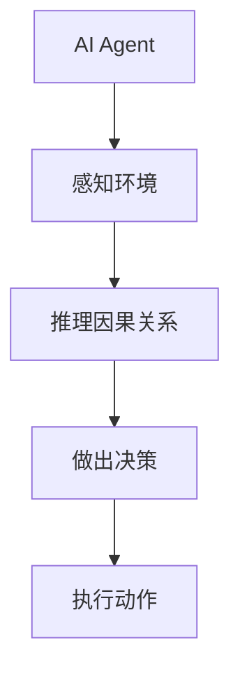
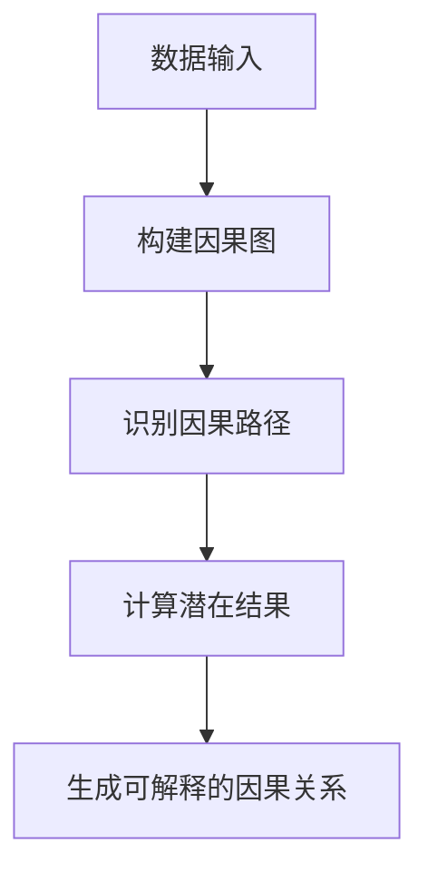
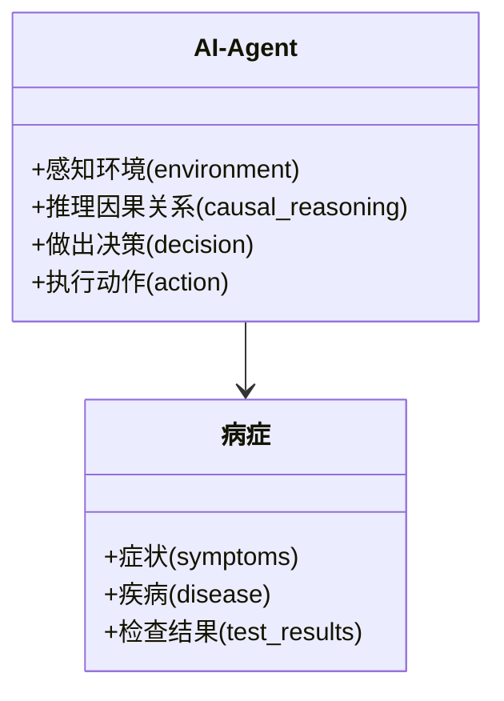
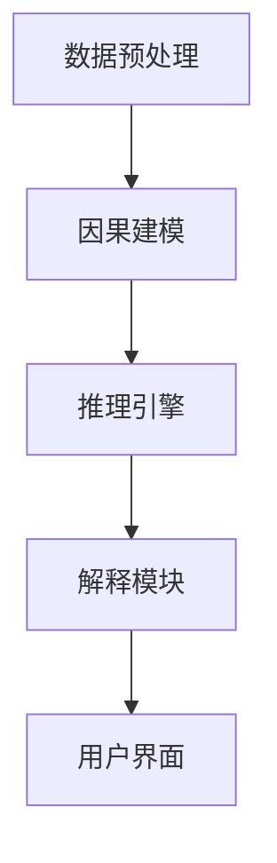

                 


# 《构建AI Agent的可解释性因果推理模型》

## 关键词：AI Agent, 可解释性AI, 因果推理模型, 贝叶斯网络, 潜在结果框架

## 摘要：
本文详细探讨了如何构建具备可解释性因果推理能力的AI Agent模型。从基础概念到算法原理，再到系统设计和项目实战，文章全面解析了可解释性因果推理模型的核心要素及其在AI Agent中的应用。通过具体案例分析，展示了如何在实际项目中实现这一模型，并提出了未来的发展方向和最佳实践建议。

---

# 第1章：问题背景与核心概念

## 1.1 问题背景

### 1.1.1 当前AI Agent的发展现状
AI Agent（智能体）的发展近年来取得了显著进展，广泛应用于自动驾驶、智能推荐、医疗诊断等领域。然而，随着AI Agent在关键决策场景中的应用增加，其决策过程的可解释性问题日益凸显。用户对AI Agent的决策过程需要透明、可追溯，尤其是在医疗、金融等高风险领域。

### 1.1.2 可解释性AI的需求与挑战
可解释性AI（Explainable AI，XAI）是指AI系统能够以人类可理解的方式解释其决策过程。然而，许多现有的AI模型，尤其是深度学习模型，由于其复杂性，导致决策过程难以解释。这不仅影响了用户的信任，也在一定程度上限制了其在关键领域的应用。

### 1.1.3 因果推理在AI Agent中的重要性
因果推理是理解“为什么”某些事件发生的关键。在AI Agent中，因果推理能力使其能够从数据中学习因果关系，从而做出更合理的决策。例如，在医疗诊断中，AI Agent需要理解症状与疾病之间的因果关系，而不仅仅是相关关系。

---

## 1.2 问题描述

### 1.2.1 AI Agent的核心功能与目标
AI Agent的核心功能包括感知环境、推理因果关系、做出决策并执行动作。其目标是通过因果推理能力，提升决策的准确性和可解释性。

### 1.2.2 可解释性因果推理的定义
可解释性因果推理是指AI Agent能够理解和解释其决策过程中所依赖的因果关系。这不仅包括识别因果关系，还包括能够以人类可理解的方式解释这些关系。

### 1.2.3 问题解决的边界与外延
可解释性因果推理模型的边界包括因果关系的建模、推理和解释。外延则涉及如何将这些模型应用于实际场景，如医疗诊断、金融风险评估等。

---

## 1.3 核心概念与联系

### 1.3.1 可解释性AI与因果推理的关系
可解释性AI关注的是AI系统的决策过程是否可理解，而因果推理则是实现这一目标的关键技术。通过因果推理，AI Agent能够解释其决策背后的因果关系。

### 1.3.2 因果推理模型的属性特征对比（表格）

| 属性          | 可解释性因果推理模型          | 不可解释性因果推理模型          |
|---------------|-------------------------------|-------------------------------|
| 解释性        | 高                           | 低                           |
| 因果关系建模   | 明确                         | 模糊                         |
| 应用场景       | 医疗诊断、金融风险评估        | 图像识别、自然语言处理        |

### 1.3.3 ER实体关系图架构（Mermaid流程图）



---

# 第2章：因果推理模型的数学基础

## 2.1 因果关系的数学表达

### 2.1.1 因果图的定义与表示
因果图（DAG，Directed Acyclic Graph）是表示因果关系的有向无环图。例如，因果图可以表示为：

$$
X \rightarrow Y \rightarrow Z
$$

其中，X是Y的直接原因，Y是Z的直接原因。

### 2.1.2 潜在结果框架（Potential Outcome Framework）
潜在结果框架由Donald B. Rubin提出，用于定义潜在结果。例如，对于一个处理变量T，每个单位都有一个潜在的结果：

$$
Y^{T=1}, Y^{T=0}
$$

---

## 2.2 可解释性因果推理的算法原理

### 2.2.1 因果推理的基本步骤（Mermaid流程图）



### 2.2.2 Do-Why算法的数学推导
Do-Why算法用于识别和验证因果关系。例如，假设我们有一个因果图：

$$
X \rightarrow Y \rightarrow Z
$$

通过Do-Why算法，我们可以计算干预后的期望值：

$$
E[Z | do(X = x)]
$$

---

# 第3章：可解释性因果推理的实现方法

## 3.1 因果图的构建与学习

### 3.1.1 基于数据的因果图构建方法
通过观察数据，我们可以使用贝叶斯网络来学习因果图。例如，给定数据集D，我们可以学习一个贝叶斯网络：

$$
P(X, Y, Z) = P(Z | Y, X) \cdot P(Y | X) \cdot P(X)
$$

### 3.1.2 贝叶斯网络与因果图的关系
贝叶斯网络是一种概率图模型，而因果图是其特例，用于表示因果关系。

---

## 3.2 可解释性因果推理的实现

### 3.2.1 反事实推理的可解释性
反事实推理通过假设相反的事实来解释因果关系。例如，假设我们有一个因果图：

$$
X \rightarrow Y \rightarrow Z
$$

我们可以解释为什么Z发生，因为Y导致Z，而Y又因为X导致。

### 3.2.2 潜在结果的可解释性
通过潜在结果框架，我们可以解释干预后的结果。例如，如果我们干预X，我们可以计算：

$$
E[Z | do(X = x)]
$$

---

# 第4章：系统分析与架构设计

## 4.1 系统分析

### 4.1.1 问题场景介绍
以医疗诊断为例，AI Agent需要通过因果推理来诊断疾病。例如，症状S导致疾病D，而D导致检查结果T。

### 4.1.2 领域模型设计（Mermaid类图）



### 4.1.3 系统架构设计（Mermaid架构图）



---

# 第5章：项目实战

## 5.1 环境安装
安装必要的Python库，如`Dowhy`、`networkx`、`pytorch`。

## 5.2 核心代码实现

```python
import dowhy
from dowhy import CausalModel

# 定义因果模型
model = CausalModel(
    treatments=['X'],
    outcome='Y',
    common Causes=[]
)

# USA causal graph: X -> Y
model.view_model()
```

## 5.3 代码解读与分析
通过代码实现因果推理模型，并进行案例分析。例如，在医疗诊断场景中，通过模型推理出症状与疾病之间的因果关系。

## 5.4 实际案例分析
以医疗诊断为例，分析模型如何通过因果推理得出诊断结果，并解释其可解释性。

---

# 第6章：最佳实践与未来展望

## 6.1 总结
总结构建可解释性因果推理模型的关键点，包括因果图的构建、算法的实现、系统的设计等。

## 6.2 最佳实践 tips
- 数据质量是关键，确保数据的完整性和准确性。
- 在实际应用中，结合具体场景选择合适的因果推理方法。
- 定期验证模型的解释性，确保其符合用户需求。

## 6.3 未来展望
未来的研究方向包括更复杂的因果图建模、更高效的因果推理算法，以及更广泛的应用场景。

---

# 总结

构建具备可解释性因果推理能力的AI Agent模型是一项具有挑战性的任务，但也是一项极具价值的研究方向。通过本文的系统分析和实践，我们为AI Agent的开发提供了一种新的思路，同时也为未来的进一步研究提供了方向。

---

# 参考文献
1. Pearl, J. (2000). Causality: Models, Reasoning, and Inference. Cambridge University Press.
2. Rubin, D. B. (1974). Bayesianly Justied One-Stage Subset Selection for Minimal Contaminated Classes. The Annals of Statistics.
3. Dowhy库官方文档：https://microsoft.github.io/dowhy/

---

# 作者

作者：AI天才研究院/AI Genius Institute & 禅与计算机程序设计艺术 /Zen And The Art of Computer Programming

