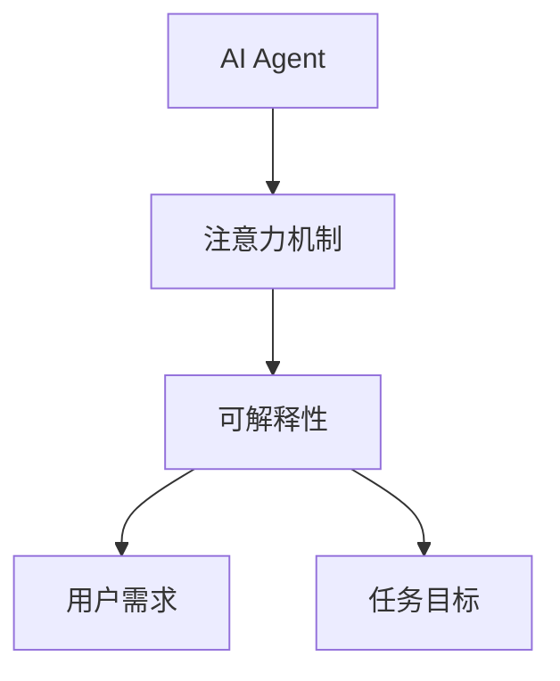
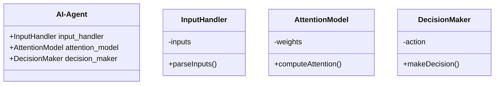
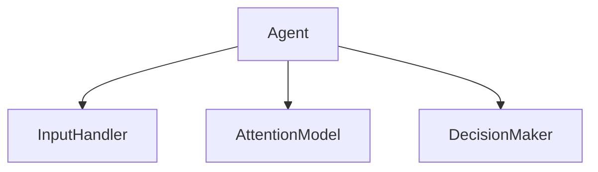

                 


# 构建AI Agent的可解释性注意力机制

> 关键词：AI Agent，可解释性，注意力机制，深度学习，自然语言处理

> 摘要：本文深入探讨了构建AI Agent的可解释性注意力机制，从背景介绍到核心算法，再到系统设计和项目实战，全面解析了如何设计一个具备可解释性的注意力机制，使得AI Agent能够更好地理解和执行任务。文章内容涵盖背景介绍、核心概念、算法原理、系统分析、项目实战和总结，旨在为读者提供一个全面的技术指导。

---

## 第一部分：AI Agent与可解释性注意力机制概述

### 第1章：问题背景与概念

#### 1.1 问题背景
随着人工智能技术的快速发展，AI Agent（智能体）在各个领域的应用日益广泛。AI Agent能够自主感知环境、执行任务并做出决策，但其核心问题在于如何构建可解释的注意力机制，使得AI Agent的行为更加透明和可信。

#### 1.2 基本概念
- **AI Agent**：能够感知环境并采取行动以实现目标的智能体。
- **注意力机制**：一种模拟人类注意力的选择性关注机制，用于处理多任务或多模态输入。
- **可解释性**：AI Agent的行为和决策过程可以被人类理解和解释。

#### 1.3 问题描述
当前的AI Agent在处理复杂任务时，往往依赖黑箱模型，缺乏可解释性。这使得用户难以信任和依赖AI Agent的决策。因此，构建可解释性注意力机制成为关键。

#### 1.4 解决方法
通过引入可解释性注意力机制，AI Agent能够明确关注任务相关的输入部分，同时提供可解释的决策依据。

#### 1.5 边界与外延
- **边界**：仅关注注意力机制的可解释性，不涉及AI Agent的其他模块。
- **外延**：可应用于自然语言处理、计算机视觉等领域。

---

## 第二部分：可解释性注意力机制的核心概念

### 第2章：核心概念与联系

#### 2.1 核心概念原理
可解释性注意力机制通过引入位置编码和注意力权重，明确关注输入中的关键部分。

#### 2.2 属性特征对比
| 属性 | 不可解释注意力机制 | 可解释注意力机制 |
|------|---------------------|-------------------|
| 透明性 | 黑箱模型             | 白盒模型           |
| 解释性 | 难以解释             | 易于解释           |
| 可靠性 | 可能不可靠           | 更加可靠           |

#### 2.3 ER实体关系图


---

## 第三部分：可解释性注意力机制的算法原理

### 第3章：算法原理

#### 3.1 注意力机制的基本公式
注意力机制的核心公式：
$$ \text{Attention}(Q, K, V) = \sum_{i=1}^{n} \alpha_i V_i $$
其中，$\alpha_i$ 是注意力权重，$V_i$ 是值向量。

#### 3.2 可解释性注意力机制的改进
引入位置编码和可解释性约束：
$$ \text{Attention}_{\text{explainable}}(Q, K, V) = \sum_{i=1}^{n} \beta_i V_i $$
其中，$\beta_i$ 是可解释的注意力权重。

#### 3.3 算法流程图
```mermaid
graph TD
    Start --> Input
    Input --> Compute Attention
    Compute Attention --> Output
```

#### 3.4 代码实现
```python
import torch

def explainable_attention(query, key, value):
    # 计算注意力权重
    scores = torch.matmul(query, key.transpose(-2, -1)) / torch.sqrt(torch.sum(key**2, dim=-1))
    # 应用Softmax
    weights = torch.softmax(scores, dim=-1)
    # 计算加权和
    output = torch.matmul(weights, value)
    return output, weights
```

---

## 第四部分：系统分析与架构设计

### 第4章：系统分析与架构设计

#### 4.1 问题场景
AI Agent需要处理多任务输入，明确关注关键部分。

#### 4.2 系统功能设计
- **输入处理**：解析多模态输入。
- **注意力计算**：计算可解释注意力权重。
- **决策执行**：基于注意力结果执行任务。

#### 4.3 领域模型类图


#### 4.4 系统架构图


---

## 第五部分：项目实战

### 第5章：项目实战

#### 5.1 环境安装
安装必要的库：
```bash
pip install torch
```

#### 5.2 核心代码实现
```python
import torch

class ExplainableAttentionModel(torch.nn.Module):
    def __init__(self, input_dim, hidden_dim):
        super(ExplainableAttentionModel, self).__init__()
        self.query = torch.nn.Linear(input_dim, hidden_dim)
        self.key = torch.nn.Linear(input_dim, hidden_dim)
        self.value = torch.nn.Linear(input_dim, hidden_dim)
    
    def forward(self, inputs):
        # 计算查询、键、值
        q = self.query(inputs)
        k = self.key(inputs)
        v = self.value(inputs)
        # 计算注意力权重
        scores = torch.matmul(q, k.transpose(-2, -1)) / torch.sqrt(torch.sum(k**2, dim=-1))
        weights = torch.softmax(scores, dim=-1)
        # 计算加权和
        output = torch.matmul(weights, v)
        return output, weights
```

#### 5.3 案例分析
通过实际案例分析，展示可解释性注意力机制在AI Agent中的应用。

---

## 第六部分：总结与展望

### 第6章：总结与展望

#### 6.1 内容总结
本文详细介绍了构建AI Agent的可解释性注意力机制，从背景到算法，再到系统设计和项目实战。

#### 6.2 未来展望
未来的研究方向包括更高效的计算方法和更广泛的应用场景。

#### 6.3 注意事项
- 确保数据质量和多样性。
- 定期更新模型和权重。

#### 6.4 最佳实践
- 结合具体任务需求设计注意力机制。
- 使用可视化工具分析注意力权重。

---

## 作者：AI天才研究院 & 禅与计算机程序设计艺术

---

通过以上详细的内容结构，我希望能够系统地构建一篇关于可解释性注意力机制的技术博客，为读者提供全面而深入的指导。

