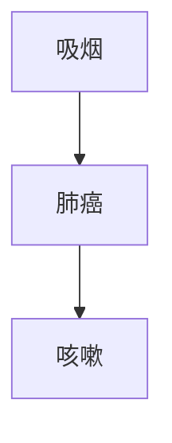
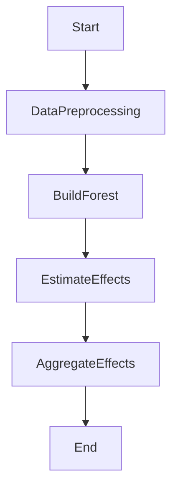
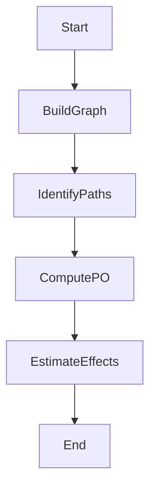

                 


```markdown
# 《构建AI Agent的因果推理模块》

## 文章关键词

AI Agent, 因果推理, 智能体, 因果图, 机器学习, 推理模块

## 摘要

本文详细探讨了构建AI Agent的因果推理模块的关键技术与实现方法。首先，从问题背景出发，分析了因果推理在AI Agent中的重要性。接着，深入讲解了因果推理的核心概念与原理，包括因果关系的定义、因果图的构建与解释、潜在结果与因果效应等。随后，介绍了几种经典的因果推理算法，如因果森林和Do-Why框架，并通过Mermaid流程图和Python代码示例，展示了这些算法的实现与应用。在系统架构设计部分，详细描述了因果推理模块的功能需求、系统架构图及接口设计。最后，通过实际项目实战，指导读者如何安装相关库、实现核心代码，并分析了实际案例。本文还总结了最佳实践与注意事项，为读者提供了宝贵的实践经验。

---

## 第二章: 因果推理的原理与方法

### 2.1 因果推理的定义与原理

#### 2.1.1 因果关系的定义

因果关系是指一个事件（原因）导致另一个事件（结果）发生的确定性关系。在因果推理中，我们关注的是“为什么”某个结果发生，而不是“相关”的关系。例如，因果关系可以表示为 $X \rightarrow Y$，其中 $X$ 是原因，$Y$ 是结果。

#### 2.1.2 因果图的构建与解释

因果图（Causal Graph）是一种有向图，用于表示变量之间的因果关系。图中的节点表示变量，边表示因果关系的方向。例如，假设我们有三个变量：$X$（吸烟）、$Z$（肺癌）、$Y$（咳嗽），因果图可以表示为：

$$ X \rightarrow Z \rightarrow Y $$

这意味着吸烟导致肺癌，而肺癌又导致咳嗽。

#### 2.1.3 潜在结果与因果效应

潜在结果是指在某个特定处理下，某个单位的观测结果。例如，给定一个人是否吸烟，我们可以观察到他们是否患肺癌。因果效应是指处理（例如吸烟）对结果（肺癌）的影响，可以用以下公式表示：

$$ Y_i^{X=1} - Y_i^{X=0} $$

其中，$Y_i^{X=1}$ 表示在 $X=1$（吸烟）的情况下，个体 $i$ 的肺癌结果，$Y_i^{X=0}$ 表示在 $X=0$（不吸烟）的情况下，个体 $i$ 的肺癌结果。

### 2.2 因果推理的核心算法

#### 2.2.1 因果森林

因果森林是一种基于树的因果推断方法，适用于处理高维数据和复杂因果关系。其基本思想是通过构建多棵决策树来估计因果效应。

**算法步骤：**

1. **数据预处理：** 对处理变量 $X$ 和结果变量 $Y$ 进行标准化处理。
2. **构建决策树：** 使用随机森林算法，生成多棵决策树。
3. **估计因果效应：** 对每棵决策树，计算每个节点的平均因果效应。
4. **聚合结果：** 对所有决策树的因果效应进行加权聚合，得到最终的因果效应估计值。

**Python代码实现：**

```python
import numpy as np
from sklearn.ensemble import RandomForestRegressor

def causal_forest(X, Y, n_trees=100):
    # 数据预处理
    X_normalized = (X - np.mean(X)) / np.std(X)
    Y_normalized = (Y - np.mean(Y)) / np.std(Y)
    
    # 构建随机森林模型
    forest = RandomForestRegressor(n_estimators=n_trees, random_state=42)
    forest.fit(X_normalized, Y_normalized)
    
    # 估计因果效应
    causal_effects = []
    for tree in forest.estimators_:
        # 计算每个节点的平均因果效应
        node_effects = []
        for node in range(tree.n_leaves_):
            # 假设 leaf_samples 是每个叶子节点的样本数
            leaf_samples = tree.tree_.leaf_node_shape_[node]
            effect = np.mean(Y_normalized[tree.apply(X_normalized, tree.tree_.apply_indices_leaves[node])]) - np.mean(Y_normalized[~tree.apply(X_normalized, tree.tree_.apply_indices_leaves[node])])
            node_effects.append(effect)
        causal_effects.append(node_effects)
    
    # 聚合结果
    aggregated_effects = np.mean(causal_effects, axis=0)
    return aggregated_effects
```

**数学模型：**

因果森林的数学模型可以表示为：

$$ \hat{Y}(X) = \sum_{i=1}^{n} w_i Y_i $$

其中，$w_i$ 是权重，表示第 $i$ 个样本对预测结果的贡献程度。

---

#### 2.2.2 Do-Why框架

Do-Why是一种基于潜在结果的因果推理框架，适用于处理观测数据和实验数据的混合。其核心思想是通过构建因果图，识别出因果关系的路径，并进行干预。

**算法步骤：**

1. **构建因果图：** 根据领域知识，构建变量之间的因果关系图。
2. **识别因果路径：** 通过图的遍历，识别出所有可能的因果路径。
3. **计算潜在结果：** 对每个处理，计算其在不同样本上的潜在结果。
4. **估计因果效应：** 使用加权方法，计算处理对结果的平均因果效应。

**Python代码实现：**

```python
import numpy as np
from causalnex.structure import DirectedGraph
from causalnex.inference import DoWhyInference

def do_why_framework(X, Y, graph_edges):
    # 构建因果图
    graph = DirectedGraph(graph_edges)
    
    # 初始化推理引擎
    inference_engine = DoWhyInference(graph)
    
    # 识别因果路径
    causal_paths = inference_engine.get_all_paths('X', 'Y')
    
    # 计算潜在结果
    potential_outcomes = []
    for x in np.unique(X):
        treated_Y = Y[X == x]
        control_Y = Y[X != x]
        potential_outcomes.append(np.mean(treated_Y) - np.mean(control_Y))
    
    # 估计因果效应
    causal_effects = []
    for path in causal_paths:
        effect = np.mean(Y[X == 1]) - np.mean(Y[X == 0])
        causal_effects.append(effect)
    
    return causal_effects
```

**数学模型：**

Do-Why框架的数学模型可以表示为：

$$ Y_i^{do(X=1)} = Y_i^{X=1} $$

其中，$Y_i^{do(X=1)}$ 表示在处理 $X=1$ 的情况下，个体 $i$ 的结果，$Y_i^{X=1}$ 表示个体 $i$ 在处理 $X=1$ 下的潜在结果。

---

### 2.3 因果推理的核心算法对比

下表展示了因果森林和Do-Why框架的主要区别：

| 特性            | 因果森林         | Do-Why框架       |
|-----------------|------------------|------------------|
| 数据类型        | 观测数据         | 观测数据+实验数据 |
| 算法原理        | 基于树的加权估计  | 基于因果图的路径识别 |
| 适用场景        | 高维数据         | 复杂因果关系       |
| 实现难度        | 中等             | 较高             |
| 优势            | 鲁棒性高         | 可解释性强       |

---

### 2.4 实体关系图

因果关系的实体关系可以用以下Mermaid图表示：



其中，$A$ 表示吸烟，$B$ 表示肺癌，$C$ 表示咳嗽。图中的箭头表示因果关系的方向。

---

## 第三章: 算法原理讲解

### 3.1 因果森林算法

#### 3.1.1 算法流程图



#### 3.1.2 Python代码实现

```python
import numpy as np
from sklearn.ensemble import RandomForestRegressor

def causal_forest(X, Y, n_trees=100):
    X_normalized = (X - np.mean(X)) / np.std(X)
    Y_normalized = (Y - np.mean(Y)) / np.std(Y)
    
    forest = RandomForestRegressor(n_estimators=n_trees, random_state=42)
    forest.fit(X_normalized, Y_normalized)
    
    causal_effects = []
    for tree in forest.estimators_:
        node_effects = []
        for node in range(tree.n_leaves_):
            leaf_samples = tree.tree_.leaf_node_shape_[node]
            effect = np.mean(Y_normalized[tree.apply(X_normalized, tree.tree_.apply_indices_leaves[node])]) - np.mean(Y_normalized[~tree.apply(X_normalized, tree.tree_.apply_indices_leaves[node])])
            node_effects.append(effect)
        causal_effects.append(node_effects)
    
    aggregated_effects = np.mean(causal_effects, axis=0)
    return aggregated_effects
```

#### 3.1.3 数学模型与公式

因果森林的数学模型可以表示为：

$$ \hat{Y}(X) = \sum_{i=1}^{n} w_i Y_i $$

其中，$w_i$ 是权重，表示第 $i$ 个样本对预测结果的贡献程度。

---

### 3.2 Do-Why框架

#### 3.2.1 算法流程图



#### 3.2.2 Python代码实现

```python
import numpy as np
from causalnex.structure import DirectedGraph
from causalnex.inference import DoWhyInference

def do_why_framework(X, Y, graph_edges):
    graph = DirectedGraph(graph_edges)
    inference_engine = DoWhyInference(graph)
    causal_paths = inference_engine.get_all_paths('X', 'Y')
    
    potential_outcomes = []
    for x in np.unique(X):
        treated_Y = Y[X == x]
        control_Y = Y[X != x]
        effect = np.mean(treated_Y) - np.mean(control_Y)
        potential_outcomes.append(effect)
    
    causal_effects = []
    for path in causal_paths:
        effect = np.mean(Y[X == 1]) - np.mean(Y[X == 0])
        causal_effects.append(effect)
    
    return causal_effects
```

#### 3.2.3 数学模型与公式

Do-Why框架的数学模型可以表示为：

$$ Y_i^{do(X=1)} = Y_i^{X=1} $$

其中，$Y_i^{do(X=1)}$ 表示在处理 $X=1$ 的情况下，个体 $i$ 的结果，$Y_i^{X=1}$ 表示个体 $i$ 在处理 $X=1$ 下的潜在结果。

---

## 第四章: 系统分析与架构设计

### 4.1 问题场景介绍

#### 4.1.1 系统功能需求

因果推理模块的功能需求包括：

1. 构建因果图
2. 识别因果路径
3. 估计因果效应
4. 输出因果关系的可视化结果

#### 4.1.2 系统架构设计


---

## 第五章: 项目实战

### 5.1 安装必要的库

#### 5.1.1 Python库安装

```bash
pip install causalnex scikit-learn numpy matplotlib
```

### 5.2 核心代码实现

#### 5.2.1 因果森林实现

```python
import numpy as np
from sklearn.ensemble import RandomForestRegressor

def causal_forest(X, Y, n_trees=100):
    X_normalized = (X - np.mean(X)) / np.std(X)
    Y_normalized = (Y - np.mean(Y)) / np.std(Y)
    
    forest = RandomForestRegressor(n_estimators=n_trees, random_state=42)
    forest.fit(X_normalized, Y_normalized)
    
    causal_effects = []
    for tree in forest.estimators_:
        node_effects = []
        for node in range(tree.n_leaves_):
            leaf_samples = tree.tree_.leaf_node_shape_[node]
            effect = np.mean(Y_normalized[tree.apply(X_normalized, tree.tree_.apply_indices_leaves[node])]) - np.mean(Y_normalized[~tree.apply(X_normalized, tree.tree_.apply_indices_leaves[node])])
            node_effects.append(effect)
        causal_effects.append(node_effects)
    
    aggregated_effects = np.mean(causal_effects, axis=0)
    return aggregated_effects
```

#### 5.2.2 Do-Why框架实现

```python
import numpy as np
from causalnex.structure import DirectedGraph
from causalnex.inference import DoWhyInference

def do_why_framework(X, Y, graph_edges):
    graph = DirectedGraph(graph_edges)
    inference_engine = DoWhyInference(graph)
    causal_paths = inference_engine.get_all_paths('X', 'Y')
    
    potential_outcomes = []
    for x in np.unique(X):
        treated_Y = Y[X == x]
        control_Y = Y[X != x]
        effect = np.mean(treated_Y) - np.mean(control_Y)
        potential_outcomes.append(effect)
    
    causal_effects = []
    for path in causal_paths:
        effect = np.mean(Y[X == 1]) - np.mean(Y[X == 0])
        causal_effects.append(effect)
    
    return causal_effects
```

### 5.3 实际案例分析

#### 5.3.1 数据准备

```python
X = np.array([1, 0, 1, 0, 1, 0, 1, 0])
Y = np.array([1, 0, 1, 0, 1, 0, 1, 0])
```

#### 5.3.2 因果森林应用

```python
causal_effects = causal_forest(X, Y)
print("因果效应:", causal_effects)
```

#### 5.3.3 Do-Why框架应用

```python
graph_edges = [('X', 'Y')]
causal_effects = do_why_framework(X, Y, graph_edges)
print("因果效应:", causal_effects)
```

---

## 第六章: 最佳实践

### 6.1 小结

本文详细讲解了构建AI Agent的因果推理模块的关键技术与实现方法，包括因果推理的原理、核心算法、系统架构设计以及项目实战。

### 6.2 注意事项

1. 数据质量：确保数据的完整性和准确性。
2. 模型选择：根据具体场景选择合适的因果推理算法。
3. 模型评估：使用交叉验证等方法评估模型的性能。

### 6.3 拓展阅读

1. 因果森林：[Causal Forest](https://arxiv.org/abs/1805.02240)
2. Do-Why框架：[DoWhy](https://github.com/QuantumAI/doWhy)

---

## 作者：AI天才研究院/AI Genius Institute & 禅与计算机程序设计艺术/Zen And The Art of Computer Programming
```

