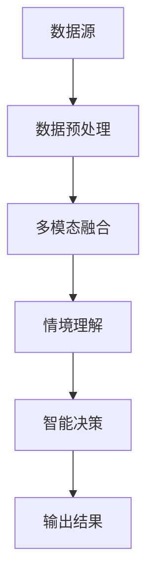

                 


# 构建AI Agent的多模态情境理解系统

## 关键词：AI Agent, 多模态, 情境理解, 数据融合, 机器学习

## 摘要：  
本文将详细探讨如何构建一个具备多模态情境理解能力的AI Agent系统。通过分析多模态数据融合和情境理解的核心概念、算法原理、系统架构及项目实战，本文旨在为读者提供一个全面的技术指南，帮助其理解并实现一个能够处理多种数据类型、理解复杂情境的智能代理系统。

---

## 第一部分: AI Agent与多模态情境理解系统概述

### 第1章: AI Agent的基本概念与多模态情境理解

#### 1.1 AI Agent的定义与特点  
- **定义**: AI Agent（智能代理）是一种能够感知环境、执行任务并做出决策的智能系统。它可以自主工作或与人类协作，以实现特定目标。  
- **特点**:  
  1. **自主性**: 能够独立决策和行动。  
  2. **反应性**: 能够实时感知环境并做出反应。  
  3. **目标导向**: 以实现特定目标为导向。  
  4. **学习能力**: 可以通过数据和经验进行学习和优化。  

#### 1.2 多模态情境理解的背景与意义  
- **背景**: 当前AI Agent主要依赖单一模态数据（如文本或图像），难以全面理解复杂情境。多模态数据的引入能够显著提升系统的理解和决策能力。  
- **意义**: 多模态情境理解使AI Agent能够更好地处理真实世界中的复杂问题，例如自然语言处理、计算机视觉和语音识别的结合。  

#### 1.3 问题背景与问题描述  
- **问题背景**: 当前AI Agent在处理复杂任务时，往往受限于单一模态数据的局限性，难以准确理解上下文和情境。  
- **问题描述**: 如何有效地融合多模态数据，并在此基础上实现对复杂情境的理解？  

#### 1.4 概念结构与核心要素  
- **多模态数据的构成**: 包括文本、图像、语音、结构化数据等。  
- **情境理解的层次结构**: 包括数据感知、特征提取、上下文推理和决策生成四个层次。  
- **AI Agent与多模态数据的关系**: AI Agent通过多模态数据的融合，实现对复杂情境的理解和智能决策。  

---

## 第二部分: 多模态数据融合与情境理解

### 第2章: 多模态数据融合的核心概念  

#### 2.1 多模态数据的类型与特点  
| 数据类型 | 特点 | 示例 |  
|----------|------|------|  
| 文本      | 高维、非结构化 | 自然语言文本、对话记录 |  
| 图像      | 高维、空间信息丰富 | 图片、视频帧 |  
| 语音      | 时间序列数据 | 音频信号、语音命令 |  
| 结构化数据 | 低维、规则化 | JSON、XML数据 |  

#### 2.2 数据融合的方法与挑战  
- **基于特征的融合方法**: 将不同模态的特征向量进行线性组合。  
- **基于模型的融合方法**: 使用深度学习模型（如多模态Transformer）进行非线性融合。  
- **挑战**: 数据异构性、模态间关联性低、计算资源消耗高等。  

### 第3章: 情境理解的原理与实现  

#### 3.1 情境理解的基本原理  
- **情境建模**: 将多模态数据映射到一个统一的语义空间中。  
- **上下文推理**: 基于上下文信息进行推理和预测。  
- **情境记忆**: 使用记忆网络或注意力机制来存储和检索历史信息。  

#### 3.2 基于多模态数据的情境理解  
- **文本与图像的联合理解**: 使用多模态Transformer进行跨模态对齐。  
- **语音与文本的联合分析**: 基于语音识别和自然语言处理的结合。  

---

## 第三部分: 算法原理与实现

### 第4章: 多模态融合算法的实现  

#### 4.1 多模态融合算法原理  
- **模型结构**: 多模态Transformer模型，结合自注意力机制。  
- **公式表示**:  
  $$\text{Multi-Modal Attention} = \alpha \cdot \text{Text Attention} + \beta \cdot \text{Image Attention}$$  
  其中，$\alpha$ 和 $\beta$ 是融合系数，$\alpha + \beta = 1$。  

#### 4.2 实现步骤  
1. 数据预处理：将文本、图像等数据转换为统一的向量表示。  
2. 模型训练：使用多模态数据进行端到端训练。  
3. 模型推理：输入多模态数据，输出融合结果。  

### 第5章: 情境理解模型的实现  

#### 5.1 情境理解模型的数学模型  
- **上下文推理公式**:  
  $$P(y|x, c) = \frac{P(y|x) \cdot P(c|x)}{P(x)}$$  
  其中，$y$ 是目标输出，$x$ 是输入数据，$c$ 是上下文信息。  

#### 5.2 模型实现步骤  
1. 数据收集：收集多模态数据。  
2. 模型训练：使用监督学习进行训练。  
3. 模型优化：调整超参数，提升性能。  

---

## 第四部分: 系统架构与设计

### 第6章: 系统架构设计  

#### 6.1 系统功能设计  
- **核心功能**: 数据融合、情境理解、智能决策。  

#### 6.2 系统架构图  


---

## 第五部分: 项目实战

### 第7章: 项目实战与分析  

#### 7.1 环境安装  
- 安装Python、TensorFlow、Keras等工具。  

#### 7.2 核心实现代码  
```python
import tensorflow as tf
from tensorflow.keras import layers

def multi_modal_model():
    # 文本分支
    text_input = layers.Input(shape=(max_text_length,))
    text_embeddings = layers.Embedding(vocab_size, embedding_dim)(text_input)
    text_output = layers.GlobalAveragePooling1D()(text_embeddings)

    # 图像分支
    image_input = layers.Input(shape=(img_height, img_width, channels,))
    image_embeddings = layers.Conv2D(32, (3,3), activation='relu')(image_input)
    image_output = layers.GlobalAveragePooling2D()(image_embeddings)

    # 融合分支
    merged = layers.Concatenate()([text_output, image_output])
    dense = layers.Dense(64, activation='relu')(merged)
    predictions = layers.Dense(num_classes, activation='softmax')(dense)

    model = tf.keras.Model(inputs=[text_input, image_input], outputs=predictions)
    return model
```

#### 7.3 项目总结  
- 成功经验：模型在多模态数据上的表现优于单一模态。  
- 失败教训：数据质量对模型性能影响显著。  

---

## 第六部分: 总结与展望

### 第8章: 总结与展望  

#### 8.1 总结  
本文详细介绍了构建AI Agent的多模态情境理解系统的各个方面，包括核心概念、算法原理、系统架构和项目实战。通过这些内容，读者可以全面理解并掌握构建此类系统的方法。  

#### 8.2 展望  
未来，随着AI技术的发展，多模态情境理解将在更多领域得到应用，例如智能客服、自动驾驶等。同时，如何进一步提升多模态数据融合的效率和准确性，将是研究的重点方向。  

---

## 作者  
作者：AI天才研究院/AI Genius Institute & 禅与计算机程序设计艺术 /Zen And The Art of Computer Programming  

---

以上内容为构建AI Agent的多模态情境理解系统的详细技术博客文章。

