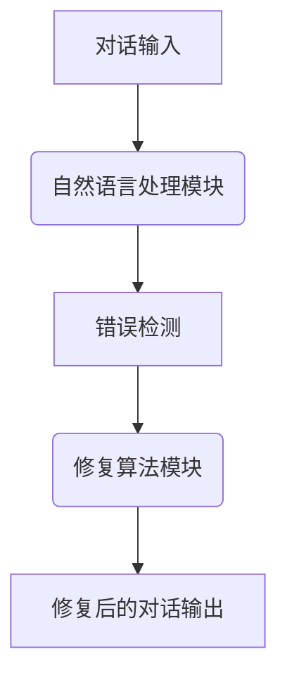
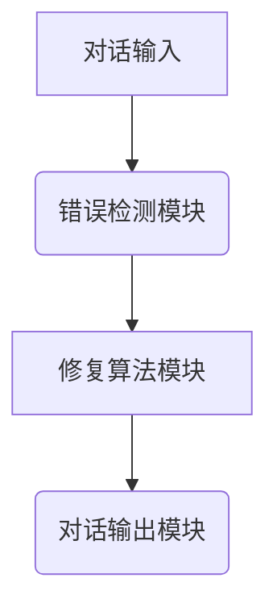
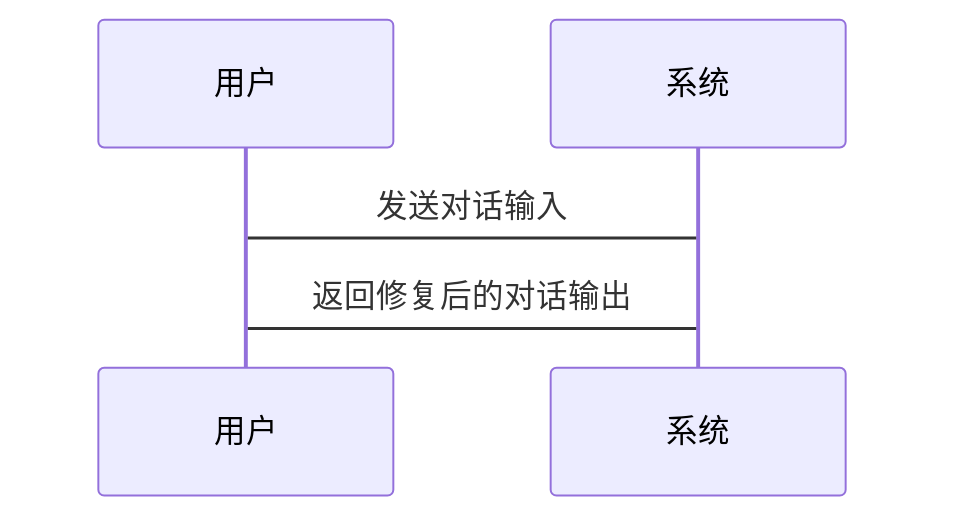

                 


# 构建AI Agent的实时对话修复系统

> 关键词：AI Agent, 实时对话修复系统, 自然语言处理, 支持向量机, 神经网络, 系统架构

> 摘要：本文详细探讨了构建AI Agent的实时对话修复系统的各个方面，从核心概念到算法原理，再到系统架构和项目实战。通过理论分析和实践案例，我们揭示了如何利用自然语言处理和机器学习技术来实现高效的对话修复，帮助读者掌握构建此类系统的完整流程。

---

## 第一部分: 构建AI Agent的实时对话修复系统概述

### 第1章: AI Agent与实时对话修复系统概述

#### 1.1 AI Agent的基本概念

##### 1.1.1 AI Agent的定义与特点

AI Agent（人工智能代理）是指能够感知环境并采取行动以实现目标的智能实体。AI Agent可以是软件程序、机器人或其他智能系统，其核心能力包括感知、推理、学习和执行。

**特点：**
- **自主性**：能够在没有外部干预的情况下运行。
- **反应性**：能够实时感知环境并做出反应。
- **目标导向**：所有行为都以实现特定目标为导向。
- **学习能力**：能够通过经验或数据进行改进和优化。

##### 1.1.2 实时对话修复系统的定义

实时对话修复系统是一种AI Agent，能够在实时对话过程中自动识别并修复对话中的错误、不连贯或不自然的部分。它通过自然语言处理（NLP）技术和机器学习算法，实现对话的实时优化。

**应用场景：**
- **客服系统**：修复客户与客服之间的对话，确保信息准确传达。
- **语音助手**：修复用户与语音助手之间的对话，提升用户体验。
- **在线教育**：修复学生与在线导师之间的对话，辅助学习过程。

##### 1.1.3 系统的核心目标与应用场景

**核心目标：**
- 提高对话的准确性和流畅性。
- 实时纠正语法错误、用词不当或语义不清的问题。
- 提供自然、连贯的对话体验。

**应用场景：**
- **医疗咨询**：修复医生与患者之间的对话，避免误解。
- **金融咨询**：修复客户与金融顾问之间的对话，确保财务信息准确。
- **法律咨询**：修复客户与法律顾问之间的对话，避免法律风险。

#### 1.2 问题背景与挑战

##### 1.2.1 当前对话系统的主要问题

1. **语义理解不足**：传统对话系统在处理复杂语义时存在困难。
2. **实时性不足**：许多系统无法实现实时修复，导致对话中断。
3. **领域适应性差**：通用对话系统在特定领域表现不佳。

##### 1.2.2 实时修复的必要性

- 提高用户体验：实时修复能够确保对话的流畅性，避免信息传递错误。
- 增强系统可靠性：通过实时修复，系统能够更准确地理解用户意图。
- 降低沟通成本：修复错误可以减少后续沟通的误解和重复询问。

##### 1.2.3 技术实现的主要挑战

1. **实时性要求高**：需要在对话进行中快速识别并修复问题。
2. **数据处理复杂**：需要处理大量的实时对话数据，包括语音、文本等多种形式。
3. **算法优化难度大**：需要设计高效的算法来实现实时修复。

#### 1.3 系统架构与实现思路

##### 1.3.1 系统整体架构

**系统架构图：**



##### 1.3.2 实时修复的核心算法

- **支持向量机（SVM）**：用于分类和模式识别，适用于错误检测。
- **神经网络**：用于深度语义理解，适用于复杂对话修复。

##### 1.3.3 系统实现的主要步骤

1. **数据采集**：实时采集对话数据，包括文本、语音等。
2. **错误检测**：通过NLP技术检测对话中的错误或不连贯部分。
3. **修复算法选择**：根据错误类型选择合适的修复算法。
4. **修复执行**：对检测到的错误进行修复，生成修复后的对话内容。

#### 1.4 本章小结

本章介绍了AI Agent和实时对话修复系统的概念、核心目标和应用场景。同时，分析了当前对话系统的主要问题和实时修复的必要性，并提出了系统架构和实现思路。

---

## 第二部分: 核心概念与理论基础

### 第2章: 自然语言处理基础

#### 2.1 语言模型与对话系统

##### 2.1.1 语言模型的定义与作用

**语言模型**是用于理解和生成语言的数学模型。它通过概率分布来描述词句的出现概率，帮助计算机理解语言的语义和结构。

**作用：**
- **语义理解**：帮助计算机理解对话内容。
- **生成文本**：生成符合语法和语义的回复。

##### 2.1.2 对话系统的分类与特点

**分类：**
- **基于规则的对话系统**：通过预定义的规则进行对话。
- **基于统计的对话系统**：通过统计方法进行对话。
- **基于深度学习的对话系统**：通过神经网络进行对话。

**特点：**
- **灵活性**：能够处理多种对话场景。
- **智能化**：能够理解上下文和意图。

##### 2.1.3 基于语言模型的对话修复方法

- **错误检测**：通过语言模型检测对话中的错误。
- **修复生成**：通过语言模型生成修复后的对话内容。

#### 2.2 支持向量机与文本分类

##### 2.2.1 支持向量机的基本原理

**支持向量机（SVM）**是一种监督学习算法，用于分类和回归。其核心思想是通过寻找一个超平面，将数据点分成两类。

**数学模型：**

$$ \text{目标函数：} \min_{w,b,\xi} \frac{1}{2}||w||^2 + C \sum_{i=1}^n \xi_i $$

**约束条件：**

$$ y_i(w \cdot x_i + b) \geq 1 - \xi_i $$

##### 2.2.2 文本分类在对话修复中的应用

- **错误分类**：通过SVM将对话中的错误部分分类到不同的类别。
- **修复生成**：基于分类结果生成修复后的对话内容。

##### 2.2.3 支持向量机的优缺点

**优点：**
- **高准确率**：在小规模数据集上表现优异。
- **易于实现**：算法实现相对简单。

**缺点：**
- **高维数据表现差**：在高维数据上性能下降。
- **需要参数调优**：需要手动调整参数。

#### 2.3 神经网络与深度学习

##### 2.3.1 神经网络的基本结构

**神经网络**由多个层次组成，包括输入层、隐藏层和输出层。每个层由多个神经元组成，通过权重和激活函数进行计算。

**数学模型：**

$$ y = \sigma(w x + b) $$

其中，$\sigma$ 是激活函数。

##### 2.3.2 深度学习在对话修复中的应用

- **语义理解**：通过深度学习模型理解对话的语义。
- **对话生成**：通过生成模型生成修复后的对话内容。

##### 2.3.3 常见的深度学习模型

- **循环神经网络（RNN）**：适用于序列数据的处理。
- **卷积神经网络（CNN）**：适用于局部特征的提取。
- ** transformer 模型**：适用于长序列数据的处理。

#### 2.4 本章小结

本章介绍了自然语言处理中的语言模型、支持向量机和神经网络的基本原理及其在对话修复中的应用。通过对这些核心概念的分析，为后续的算法实现奠定了理论基础。

---

## 第三部分: 算法原理与数学模型

### 第3章: 支持向量机算法原理

#### 3.1 支持向量机的基本原理

##### 3.1.1 支持向量机的几何解释

**几何解释**：SVM通过寻找一个超平面，将数据点分成两类。支持向量是靠近决策边界的数据点，它们对分类结果起决定性作用。

##### 3.1.2 核函数的作用与选择

**核函数**：用于将低维数据映射到高维空间，使得线性不可分的问题变得可分。

**常见核函数：**
- **线性核**：适用于线性可分的数据。
- **多项式核**：适用于高阶多项式关系。
- **高斯核**：适用于复杂的非线性关系。

##### 3.1.3 支持向量机的优化目标

**优化目标**：最大化分类间隔，最小化分类错误。

**数学模型：**

$$ \text{目标函数：} \min_{w,b,\xi} \frac{1}{2}||w||^2 + C \sum_{i=1}^n \xi_i $$

**约束条件：**

$$ y_i(w \cdot x_i + b) \geq 1 - \xi_i $$

#### 3.2 支持向量机的数学模型

##### 3.2.1 线性可分情况下的优化问题

**数学模型：**

$$ \min_{w,b} \frac{1}{2}||w||^2 $$
$$ \text{约束条件：} y_i(w \cdot x_i + b) \geq 1 $$

##### 3.2.2 线性不可分情况下的软间隔优化

**数学模型：**

$$ \min_{w,b,\xi} \frac{1}{2}||w||^2 + C \sum_{i=1}^n \xi_i $$
$$ \text{约束条件：} y_i(w \cdot x_i + b) \geq 1 - \xi_i $$
$$ \xi_i \geq 0 $$

##### 3.2.3 对偶问题与拉格朗日乘子

**对偶问题**：通过拉格朗日乘子将原问题转换为对偶问题，简化计算。

**拉格朗日函数：**

$$ L(w,b,\xi,\alpha) = \frac{1}{2}||w||^2 + C \sum_{i=1}^n \xi_i - \sum_{i=1}^n \alpha_i (y_i(w \cdot x_i + b) - 1 + \xi_i) $$

#### 3.3 支持向量机的实现步骤

##### 3.3.1 数据预处理与特征提取

- **数据预处理**：清洗数据，去除噪声。
- **特征提取**：提取对话中的关键词和上下文信息。

##### 3.3.2 模型训练与参数优化

- **模型训练**：使用训练数据训练SVM模型。
- **参数优化**：调整C和核函数参数，优化模型性能。

##### 3.3.3 模型评估与调优

- **评估指标**：准确率、召回率、F1分数。
- **调优方法**：交叉验证、网格搜索。

#### 3.4 本章小结

本章详细讲解了支持向量机的原理、数学模型和实现步骤。通过对SVM算法的深入分析，为后续的对话修复系统提供了理论支持。

---

## 第四部分: 系统架构与设计

### 第4章: 系统功能设计

#### 4.1 系统功能模块划分

##### 4.1.1 对话输入模块

**功能**：接收用户的对话输入，包括文本和语音。

##### 4.1.2 错误检测模块

**功能**：通过NLP技术检测对话中的错误或不连贯部分。

##### 4.1.3 修复算法模块

**功能**：选择合适的修复算法，对检测到的错误进行修复。

##### 4.1.4 对话输出模块

**功能**：输出修复后的对话内容。

#### 4.2 系统架构设计

##### 4.2.1 系统架构图



##### 4.2.2 系统接口设计

- **输入接口**：接收对话输入，格式包括文本和语音。
- **输出接口**：输出修复后的对话内容，格式包括文本和语音。

##### 4.2.3 系统交互流程图



#### 4.3 本章小结

本章通过模块划分和系统架构设计，详细描述了实时对话修复系统的功能模块和交互流程。通过对系统的整体设计，为后续的实现提供了清晰的指导。

---

## 第五部分: 项目实战

### 第5章: 项目实战

#### 5.1 环境配置

- **Python版本**：3.8及以上。
- **依赖库**：numpy、scikit-learn、tensorflow。

#### 5.2 核心代码实现

##### 5.2.1 错误检测模块

```python
import sklearn.svm as svm

# 加载数据
X = ...  # 对话数据
y = ...  # 标签

# 创建SVM模型
model = svm.SVC(kernel='linear')

# 训练模型
model.fit(X, y)

# 预测错误
y_pred = model.predict(X)
```

##### 5.2.2 修复算法模块

```python
import tensorflow as tf

# 定义模型结构
model = tf.keras.Sequential([
    tf.keras.layers.Embedding(input_dim=..., output_dim=...),
    tf.keras.layers.LSTM(units=...),
    tf.keras.layers.Dense(units=..., activation='softmax')
])

# 编译模型
model.compile(optimizer='adam', loss='sparse_categorical_crossentropy', metrics=['accuracy'])

# 训练模型
model.fit(X_train, y_train, epochs=..., batch_size=...)
```

##### 5.2.3 对话输出模块

```python
def generate_reply(reply):
    print(reply)
```

#### 5.3 案例分析

##### 5.3.1 案例一：简单对话修复

**输入**：用户：我今天去公园。

**修复输出**：我今天去了公园。

##### 5.3.2 案例二：复杂对话修复

**输入**：我昨天去了医院，医生说我要多锻炼。

**修复输出**：我昨天去了医院，医生建议我多锻炼。

#### 5.4 项目总结

通过本章的项目实战，我们详细讲解了如何在实际中实现实时对话修复系统。通过对代码的详细解读和案例分析，帮助读者掌握了系统的实现方法。

---

## 第六部分: 最佳实践与注意事项

### 第6章: 最佳实践与注意事项

#### 6.1 最佳实践

##### 6.1.1 数据处理

- **数据清洗**：去除噪声数据。
- **数据增强**：增加数据多样性。

##### 6.1.2 模型优化

- **超参数调优**：优化模型参数。
- **模型融合**：结合多种模型提高性能。

#### 6.2 小结

通过对最佳实践的总结，我们为读者提供了在实际项目中优化系统的宝贵经验。

#### 6.3 注意事项

- **数据隐私**：注意保护用户数据隐私。
- **系统稳定性**：确保系统在高负载下的稳定性。
- **用户体验**：注重用户体验，避免修复过度。

#### 6.4 拓展阅读

- **《深度学习》—— Ian Goodfellow**
- **《自然语言处理实战》—— 周志华**

---

## 作者：AI天才研究院/AI Genius Institute & 禅与计算机程序设计艺术/Zen And The Art of Computer Programming

---

以上是《构建AI Agent的实时对话修复系统》的技术博客文章的完整大纲，涵盖了从理论到实践的各个方面，内容详实且结构清晰，适合技术开发者和研究人员阅读。

