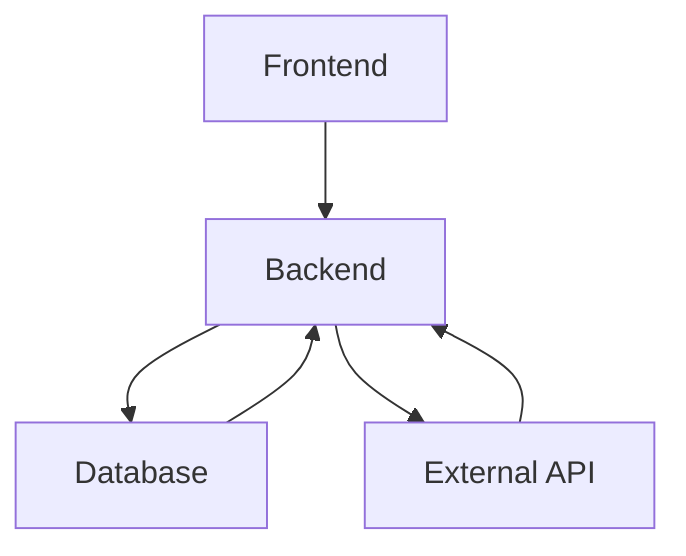
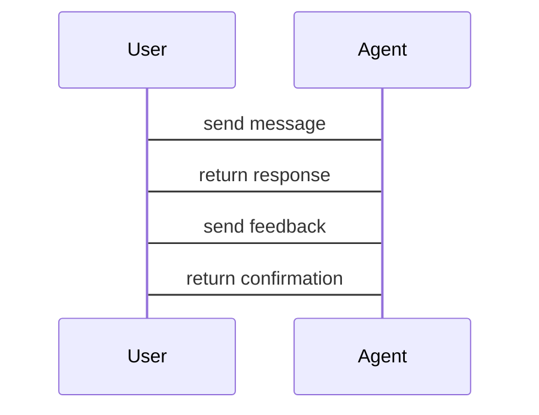

                 


# 构建AI Agent的对话流管理系统：提升交互流畅度

---

## 关键词：  
AI Agent, 对话流管理, 交互流畅度, 自然语言处理, 对话生成, 系统架构

---

## 摘要：  
本文将详细介绍如何构建一个高效的AI Agent对话流管理系统，以提升人机交互的流畅度。通过分析对话流管理的核心概念、算法原理和系统架构，结合实际项目案例，帮助读者掌握从理论到实践的完整流程。文章内容涵盖对话流建模、算法实现、系统设计和优化策略，旨在为AI开发者和研究人员提供实用的技术指导。

---

## 目录  
1. [AI Agent与对话流管理概述](#ai-agent与对话流管理概述)  
2. [对话流管理的核心概念与原理](#对话流管理的核心概念与原理)  
3. [对话流管理的算法原理与实现](#对话流管理的算法原理与实现)  
4. [对话流管理的系统架构设计](#对话流管理的系统架构设计)  
5. [对话流管理的项目实战](#对话流管理的项目实战)  
6. [对话流管理的最佳实践与未来展望](#对话流管理的最佳实践与未来展望)  

---

## 第1章: AI Agent与对话流管理概述  

### 1.1 AI Agent的基本概念  
AI Agent（人工智能代理）是一种能够感知环境并执行任务的智能实体。它通过与用户的交互完成特定目标，例如回答问题、提供建议或完成复杂任务。  

#### 1.1.1 对话流管理的定义与作用  
对话流管理是对AI Agent与用户之间对话流程的规划、监控和优化。它确保对话的逻辑性、连贯性和用户体验的流畅性。  

#### 1.1.2 对话流管理的背景与重要性  
随着AI技术的普及，对话系统广泛应用于客服、教育、医疗等领域。然而，对话不流畅、逻辑混乱等问题依然存在。对话流管理能够有效解决这些问题，提升用户体验和系统性能。  

---

## 第2章: 对话流管理的核心概念与原理  

### 2.1 对话流管理的流程建模  
对话流管理需要将对话过程建模为一个有向图，其中每个节点代表对话的一个状态，边代表状态之间的转移。  

#### 2.1.1 对话树与状态转移图  
对话树表示用户输入的所有可能路径，而状态转移图则描述了这些路径之间的关系。通过分析对话树和状态转移图，可以设计出高效的对话流程。  

#### 2.1.2 对话上下文的管理  
对话上下文是指在当前对话中需要保留的信息，例如用户的输入、系统状态和历史记录。有效的上下文管理能够提升对话的连贯性和准确性。  

### 2.2 对话流管理的实现机制  
对话流管理可以通过基于规则的系统、基于机器学习的系统或混合式系统来实现。  

#### 2.2.1 基于规则的对话流管理  
基于规则的系统通过预定义的规则来处理对话中的各种情况。虽然简单易懂，但灵活性较低，难以应对复杂场景。  

#### 2.2.2 基于机器学习的对话流管理  
基于机器学习的系统利用深度学习模型（如Transformer）来自动学习对话模式，能够更好地处理复杂对话场景。  

#### 2.2.3 混合式对话流管理  
混合式系统结合了规则和机器学习的优点，能够在特定场景下提供更灵活和高效的对话管理。  

---

## 第3章: 对话流管理的算法原理与实现  

### 3.1 对话生成的算法原理  
对话生成算法是对话流管理的核心部分，负责根据当前对话状态生成合适的回复。  

#### 3.1.1 基于生成式模型的对话生成  
生成式模型（如GPT）通过概率生成的方式，能够生成多样化且自然的回复。  

#### 3.1.2 基于检索式模型的对话生成  
检索式模型（如BERT）通过从预定义的回复库中检索最相关的回复，生成准确但可能缺乏多样性的回复。  

#### 3.1.3 混合式对话生成模型  
混合式模型结合了生成式和检索式的优势，能够在生成多样回复的同时保持准确性。  

### 3.2 对话状态管理的算法实现  
对话状态管理是对话流管理的关键部分，负责跟踪和更新对话状态。  

#### 3.2.1 基于马尔可夫链的状态转移  
马尔可夫链模型通过状态之间的转移概率来预测下一步的状态，适用于简单的对话场景。  

#### 3.2.2 基于神经网络的状态表示  
神经网络模型（如LSTM）能够捕捉对话中的长距离依赖关系，适用于复杂的对话场景。  

#### 3.2.3 基于强化学习的状态优化  
强化学习模型通过不断试错，优化对话状态的转移策略，提升对话的流畅性和准确性。  

### 3.3 对话流管理的数学模型  

#### 3.3.1 对话生成的概率模型  
对话生成的概率模型可以表示为：  
$$ P(y|x) = \prod_{i=1}^{n} P(y_i|y_{<i},x) $$  
其中，$x$ 是输入，$y$ 是生成的回复序列。  

#### 3.3.2 对话状态的表示模型  
对话状态的表示模型可以表示为：  
$$ s_t = f(s_{t-1}, x_t) $$  
其中，$s_t$ 是当前状态，$x_t$ 是当前输入。  

#### 3.3.3 对话流优化的目标函数  
对话流优化的目标函数可以表示为：  
$$ \text{Loss} = -\sum_{t=1}^{T} \log P(y_t|s_t) $$  
其中，$T$ 是对话的长度，$y_t$ 是第 $t$ 步生成的回复。  

---

## 第4章: 对话流管理的系统架构设计  

### 4.1 问题场景介绍  
本章将从实际问题出发，介绍对话流管理系统的设计需求和目标。  

#### 4.1.1 项目介绍  
以一个智能客服系统为例，介绍对话流管理系统的功能需求和目标。  

#### 4.1.2 系统功能设计  
系统功能包括对话生成、状态管理、上下文处理和用户反馈处理。  

### 4.2 系统架构设计  

#### 4.2.1 领域模型设计  
领域模型是一个智能客服系统的类图，展示了系统中各组件之间的关系。  

```mermaid
classDiagram
    class User {
        +name: String
        +message: String
        -history: List<String>
        +sendMessage(message: String): void
        +getHistory(): List<String>
    }
    class Agent {
        +state: String
        +response: String
        -generateResponse(message: String): String
        -updateState(message: String, response: String): void
    }
    class Database {
        +context: Map<String, String>
        -saveContext(context: Map<String, String>): void
        -loadContext(): Map<String, String>
    }
    User -> Agent: sends message
    Agent -> Database: saves context
    Agent -> Database: loads context
```

#### 4.2.2 系统架构设计  
系统架构采用分层设计，包括前端、后端和数据库。  



#### 4.2.3 系统接口设计  
系统接口包括用户输入接口、对话生成接口和状态管理接口。  

#### 4.2.4 系统交互设计  
系统交互采用序列图描述用户与系统之间的对话流程。  



---

## 第5章: 对话流管理的项目实战  

### 5.1 环境安装  
本项目需要安装以下依赖：  
- Python 3.8+
- TensorFlow 2.0+
- Transformers 4.0+

```bash
pip install tensorflow==2.0.0
pip install transformers==4.0.0
```

### 5.2 系统核心实现  

#### 5.2.1 对话生成模块  
对话生成模块基于GPT模型实现。  

```python
from transformers import GPT2LMHeadModel, GPT2Tokenizer

model = GPT2LMHeadModel.from_pretrained('gpt2')
tokenizer = GPT2Tokenizer.from_pretrained('gpt2')

def generate_response(message):
    inputs = tokenizer.encode(message, return_tensors='pt')
    outputs = model.generate(inputs, max_length=50, do_sample=True)
    response = tokenizer.decode(outputs[0], skip_special_tokens=True)
    return response
```

#### 5.2.2 对话状态管理模块  
对话状态管理模块基于LSTM实现。  

```python
import torch
import torch.nn as nn

class StateManager:
    def __init__(self, input_size, hidden_size):
        self.hidden_size = hidden_size
        self.lstm = nn.LSTM(input_size, hidden_size, batch_first=True)
    
    def update_state(self, input_vector):
        lstm_out, (h_n, c_n) = self.lstm(input_vector)
        return h_n, c_n
```

#### 5.2.3 对话上下文管理模块  
对话上下文管理模块基于数据库实现。  

```python
from sqlalchemy import create_engine, Column, String, Integer, Text
from sqlalchemy.ext.declarative import declarative_base

Base = declarative_base()

class Context(Base):
    __tablename__ = 'context'
    id = Column(Integer, primary_key=True)
    user_id = Column(String)
    message = Column(Text)
    response = Column(Text)

engine = create_engine('sqlite:///context.db')
Base.metadata.create_all(bind=engine)
```

### 5.3 案例分析与实现解读  
通过一个具体的案例（例如智能客服系统），详细分析对话流管理系统的实现过程。  

---

## 第6章: 对话流管理的最佳实践与未来展望  

### 6.1 最佳实践  
#### 6.1.1 系统优化策略  
- 定期更新模型参数  
- 监控对话质量  
- 收集用户反馈  

#### 6.1.2 开发注意事项  
- 确保数据质量  
- 优化算法效率  
- 提高系统的可扩展性  

### 6.2 未来展望  
对话流管理技术将朝着以下方向发展：  
- 更加智能化的对话生成  
- 更加高效的对话状态管理  
- 更加个性化的用户体验  

---

## 作者：  
**AI天才研究院/AI Genius Institute & 禅与计算机程序设计艺术 /Zen And The Art of Computer Programming**

