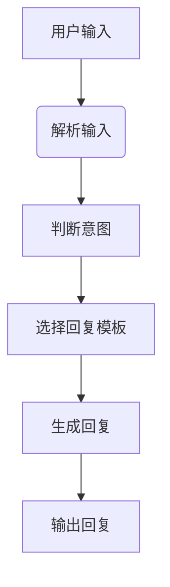
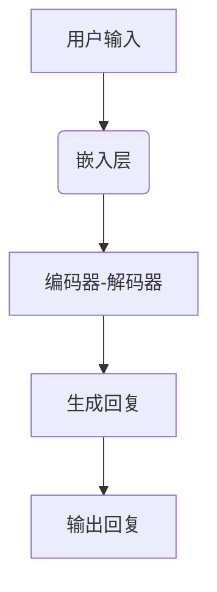
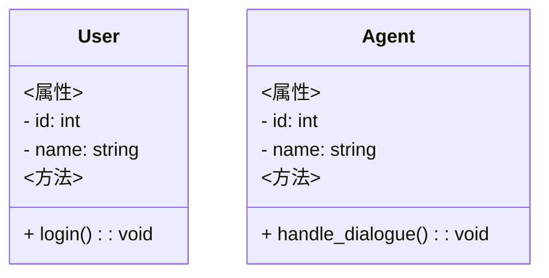
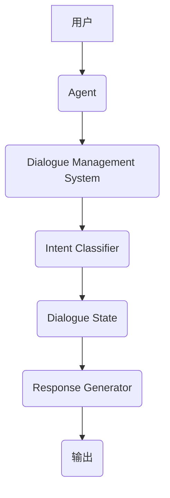

                 


# 《构建AI Agent的对话管理系统》

## 关键词：对话管理系统, AI Agent, 自然语言处理, 系统架构, 项目实战

## 摘要：  
本文将详细介绍如何构建一个高效的AI Agent对话管理系统。从对话管理系统的背景与概念出发，逐步深入讲解其核心概念、算法原理、系统架构设计、项目实战以及最佳实践。通过本文的学习，读者将能够理解对话管理系统的本质，并掌握构建一个实际可用的对话管理系统的完整流程。

---

# 第一部分: 对话管理系统的背景与概念

## 第1章: 对话管理系统的背景与概念

### 1.1 对话管理系统的定义与作用

对话管理系统（Dialogue Management System）是AI Agent的核心组件之一，负责理解和生成对话内容，管理对话流程，并根据对话历史和当前上下文做出决策。其主要作用包括：
- 理解用户的意图
- 维护对话状态
- 生成合适的回复
- 处理对话中的不确定性

#### 1.1.1 对话管理系统的定义
对话管理系统是一个用于管理和控制对话流程的软件系统，它通过分析用户输入、维护对话状态，并根据预设的规则或模型生成合适的回复。

#### 1.1.2 对话管理系统的功能与作用
对话管理系统的功能包括：
- 用户意图识别
- 对话状态管理
- 回复生成
- 对话历史记录

#### 1.1.3 对话管理系统的应用领域
对话管理系统广泛应用于智能客服、智能助手、聊天机器人、虚拟助手等领域。

### 1.2 AI Agent与对话管理的关系

AI Agent（人工智能代理）是指能够感知环境并采取行动以实现目标的智能实体。对话管理是AI Agent与用户交互的核心环节，其重要性体现在：
- 提供自然的对话体验
- 实现高效的用户需求匹配
- 提高系统的可用性和用户体验

#### 1.2.1 AI Agent的基本概念
AI Agent是一种能够自主决策并执行任务的智能实体，通常分为简单反射型代理、基于模型的反射型代理、目标驱动代理和效用驱动代理。

#### 1.2.2 对话管理在AI Agent中的核心地位
对话管理是AI Agent与用户交互的核心模块，负责理解用户输入、维护对话状态，并生成合适的回复。

#### 1.2.3 对话管理系统的边界与外延
对话管理系统的边界包括：
- 用户输入的解析
- 对话状态的维护
- 回复的生成与输出
其外延包括自然语言处理、语音识别、机器学习等技术。

---

## 第2章: 对话管理系统的实体关系

### 2.1 对话管理系统的实体关系图（ER图）

```mermaid
erdiagram
actor: 用户
agent: AI Agent
dialogue_management_system: 对话管理系统
intent_classifier: 意图分类器
dialogue_state: 对话状态
response_generator: 回复生成器
```

### 2.2 对话管理系统的属性特征对比

| 属性 | 描述 |
|------|------|
| 实体类型 | 用户、AI Agent、对话状态等 |
| 关系 | 用户与AI Agent通过对话管理系统进行交互 |
| 属性 | 对话历史、意图、情感等 |

---

## 第3章: 对话管理系统的算法原理

### 3.1 基于规则的对话管理算法

#### 3.1.1 算法流程图



#### 3.1.2 示例

假设用户输入“我要订一张去北京的机票”，系统首先解析输入，判断意图是“预订机票”，然后选择合适的回复模板，生成回复如“请提供您的出发日期和返回日期。”

### 3.2 基于深度学习的对话管理算法

#### 3.2.1 算法流程图



#### 3.2.2 示例

使用Keras框架训练一个序列到序列模型，输入为用户的问题，输出为机器生成的回复。

---

## 第4章: 对话管理系统的数学模型与公式

### 4.1 基于规则的对话管理模型

#### 4.1.1 数学公式
$$
P(\text{intent} | \text{input}) = \frac{\text{count}(input \text{且} intent)}{\text{total inputs}}
$$

#### 4.1.2 示例
假设输入为“我要订酒店”，系统计算出意图概率为0.8，判断意图为“预订酒店”。

### 4.2 基于深度学习的对话管理模型

#### 4.2.1 数学公式
$$
\text{损失函数} = -\sum_{i=1}^{n} \text{log}(P(y_i | x_i))
$$

#### 4.2.2 示例
使用交叉熵损失函数训练一个对话模型，输入为用户的问题，输出为机器生成的回复。

---

## 第5章: 对话管理系统的系统架构设计

### 5.1 系统功能设计

#### 5.1.1 领域模型（Mermaid类图）



### 5.2 系统架构设计

#### 5.2.1 系统架构图（Mermaid架构图）



---

## 第6章: 对话管理系统的项目实战

### 6.1 环境安装与配置

#### 6.1.1 开发环境搭建
- 安装Python
- 安装相关库（如TensorFlow、Keras、NLTK）

### 6.2 核心代码实现

#### 6.2.1 对话管理模块实现

```python
class DialogueManager:
    def __init__(self):
        self.dialogue_state = {}
    
    def process_input(self, input_text):
        # 解析输入
        pass
    
    def generate_response(self):
        # 生成回复
        pass
```

#### 6.2.2 算法实现

```python
import tensorflow as tf
from tensorflow.keras import layers

model = tf.keras.Sequential([
    layers.Embedding(input_dim=1000, output_dim=64),
    layers.LSTM(64),
    layers.Dense(64, activation='relu'),
    layers.Dense(10, activation='softmax')
])
```

### 6.3 案例分析与小结

#### 6.3.1 案例分析
- 用户输入：“我要订机票。”
- 系统解析意图：预订机票
- 系统生成回复：“请提供您的出发日期和目的地。”

#### 6.3.2 小结
对话管理系统的实现需要结合规则和深度学习方法，根据实际需求选择合适的算法。

---

## 第7章: 最佳实践与总结

### 7.1 最佳实践

#### 7.1.1 开发注意事项
- 确保数据质量
- 选择合适的算法
- 定期更新模型

#### 7.1.2 部署与维护
- 使用容器化技术部署
- 定期监控系统性能

### 7.2 小结与展望

#### 7.2.1 本书总结
本文详细讲解了对话管理系统的构建过程，从理论到实践，为读者提供了完整的实现方案。

#### 7.2.2 未来发展方向
未来，对话管理系统将更加智能化，结合更多先进的技术如大语言模型（LLM）和多模态交互技术。

---

作者：AI天才研究院/AI Genius Institute & 禅与计算机程序设计艺术 /Zen And The Art of Computer Programming

