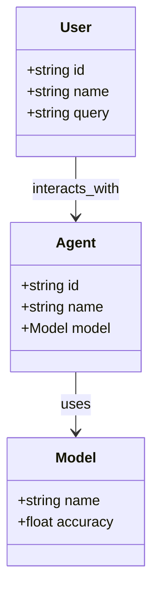
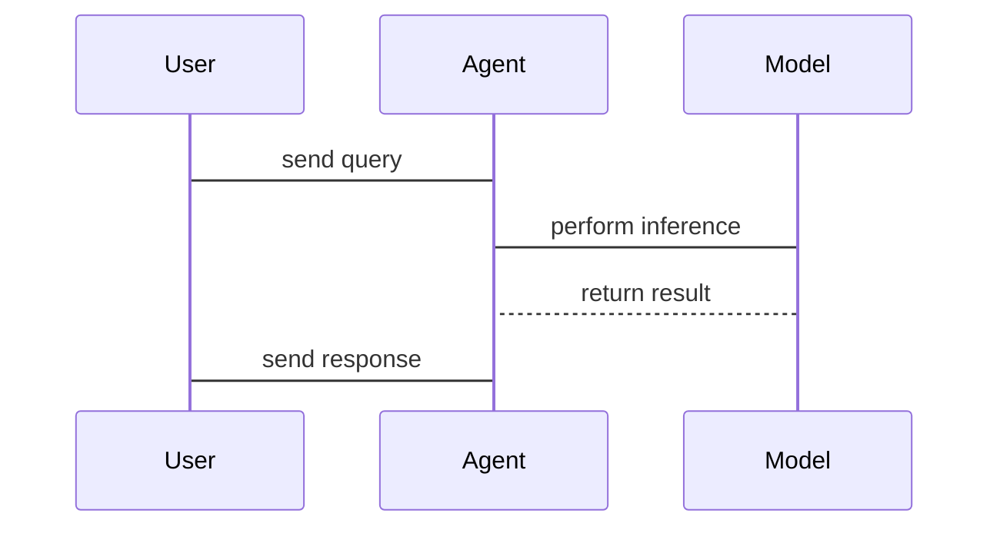
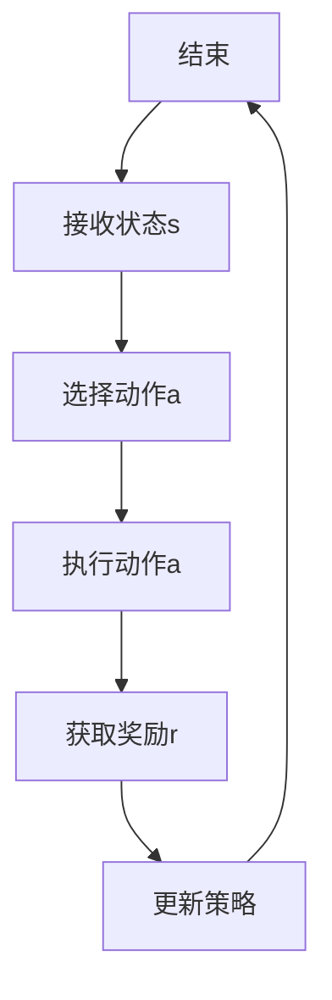

                 


# 《构建AI Agent的技术栈选择指南》

---

## 关键词  
AI Agent、技术栈、机器学习、深度学习、NLP、强化学习

---

## 摘要  
本文将深入探讨构建AI Agent所需的技术栈选择策略。从AI Agent的基本概念到技术实现的各个层面，结合实际案例，详细分析如何选择合适的工具和技术，以构建高效、可靠的AI Agent系统。通过理论与实践相结合的方式，帮助读者理解AI Agent的核心技术及其应用场景。

---

# 第一部分: AI Agent技术栈选择的背景与基础

## 第1章: AI Agent概述与背景

### 1.1 AI Agent的基本概念  
- **1.1.1 什么是AI Agent**  
  AI Agent（人工智能代理）是指能够感知环境并采取行动以实现目标的智能体。  
- **1.1.2 AI Agent的核心特点**  
  - 自主性：无需外部干预，自主决策。  
  - 反应性：能够实时感知环境并做出反应。  
  - 目标导向：所有行为均以实现特定目标为导向。  
- **1.1.3 AI Agent的应用场景**  
  - 智能助手（如Siri、Alexa）  
  - 游戏AI  
  - 智能推荐系统  

### 1.2 AI Agent的发展现状  
- **1.2.1 AI Agent的历史演变**  
  从简单的规则驱动到复杂的深度学习模型。  
- **1.2.2 当前AI Agent的技术趋势**  
  - 多模态交互  
  - 实时推理  
  - 可解释性  
- **1.2.3 未来AI Agent的发展方向**  
  - 更高的自主性与智能性  
  - 更广泛的应用场景  

### 1.3 AI Agent的优势与挑战  
- **1.3.1 AI Agent的主要优势**  
  - 提高效率  
  - 24/7可用性  
  - 处理复杂任务的能力  
- **1.3.2 AI Agent面临的技术挑战**  
  - 数据依赖性  
  - 模型的可解释性  
  - 安全性问题  
- **1.3.3 AI Agent的伦理与法律问题**  
  - 数据隐私  
  - 责任归属  

## 第2章: AI Agent的核心技术栈  

### 2.1 AI Agent的技术组成  
- **2.1.1 模型选择**  
  - 选择合适的模型架构（如规则、机器学习、强化学习）  
- **2.1.2 开发框架**  
  - TensorFlow、PyTorch等深度学习框架  
- **2.1.3 云服务与平台**  
  - AWS、Google Cloud、Azure等  

### 2.2 AI Agent的技术栈分类  
- **2.2.1 模型训练框架**  
  - TensorFlow、PyTorch、Keras  
- **2.2.2 推理框架**  
  - ONNX、TensorFlow Lite  
- **2.2.3 数据处理工具**  
  - Apache Spark、Pandas、NumPy  

### 2.3 AI Agent技术栈的选择标准  
- **2.3.1 性能要求**  
  - 计算效率、资源利用率  
- **2.3.2 开发效率**  
  - 易用性、社区支持  
- **2.3.3 成本控制**  
  - 开发、部署、维护成本  

---

# 第二部分: AI Agent技术栈的选择策略

## 第3章: AI Agent模型选择策略  

### 3.1 常见AI Agent模型介绍  
- **3.1.1 基于规则的AI Agent**  
  - 通过预定义规则实现简单的决策逻辑。  
- **3.1.2 基于机器学习的AI Agent**  
  - 使用监督学习或无监督学习进行模式识别。  
- **3.1.3 基于强化学习的AI Agent**  
  - 通过奖励机制优化决策策略。  

### 3.2 模型选择的影响因素  
- **3.2.1 任务需求**  
  - 任务的复杂性、数据的可用性。  
- **3.2.2 数据量与质量**  
  - 数据的充足性、干净性。  
- **3.2.3 计算资源**  
  - CPU/GPU资源、内存容量。  

### 3.3 模型选择的优化方法  
- **3.3.1 超参数调优**  
  - 使用网格搜索、随机搜索或贝叶斯优化。  
- **3.3.2 模型融合**  
  - 集成学习（如投票、加权平均）。  
- **3.3.3 模型解释性增强**  
  - 使用LIME、SHAP等工具提升模型可解释性。  

## 第4章: AI Agent开发框架的选择  

### 4.1 常见AI Agent开发框架  
- **4.1.1 TensorFlow**  
  - 官方支持，功能强大，社区活跃。  
- **4.1.2 PyTorch**  
  - 动态计算图，适合快速实验。  
- **4.1.3 Keras**  
  - 高度模块化，易于上手。  

### 4.2 开发框架选择的影响因素  
- **4.2.1 开发团队的技术栈**  
  - 是否熟悉特定框架的语法和API。  
- **4.2.2 任务的复杂性**  
  - 复杂任务（如NLP）推荐PyTorch，简单任务推荐Keras。  
- **4.2.3 社区支持与资源**  
  - 活跃的社区和丰富的教程。  

## 第5章: AI Agent部署与云服务选择  

### 5.1 常见云服务与平台  
- **5.1.1 AWS SageMaker**  
  - 提供从训练到部署的全流程支持。  
- **5.1.2 Google Cloud AI**  
  - 强调与TensorFlow的集成。  
- **5.1.3 Azure AI**  
  - 与微软的开发工具无缝集成。  

### 5.2 选择云服务的策略  
- **5.2.1 成本控制**  
  - 按需付费 vs 预付费。  
- **5.2.2 扩展性**  
  - 支持横向扩展和纵向扩展。  
- **5.2.3 易用性**  
  - 界面友好，支持自动化部署。  

---

## 第6章: AI Agent项目实战  

### 6.1 项目背景与需求分析  
- **6.1.1 项目目标**  
  - 构建一个简单的智能客服AI Agent。  
- **6.1.2 功能需求**  
  - 用户咨询、信息查询、意图识别。  

### 6.2 系统设计与实现  

#### 6.2.1 系统功能设计（领域模型）  


#### 6.2.2 系统架构设计  


#### 6.2.3 系统实现与代码  
```python
# 模型训练代码
import tensorflow as tf
from tensorflow.keras import layers

model = tf.keras.Sequential([
    layers.Dense(64, activation='relu'),
    layers.Dense(10, activation='softmax')
])
model.compile(optimizer='adam', loss='sparse_categorical_crossentropy', metrics=['accuracy'])
model.fit(train_data, train_labels, epochs=10)
```

#### 6.2.4 项目小结  
- 成功实现了AI Agent的基本功能。  
- 在实际应用中需要考虑模型的可扩展性和可维护性。  

---

## 第7章: AI Agent的系统架构与优化  

### 7.1 系统架构设计  

#### 7.1.1 系统架构图  


#### 7.1.2 实体关系图（ER图）  
```mermaid
erd
    User { id: int, name: string }
    Agent { id: int, name: string }
    Model { id: int, name: string, accuracy: float }
    User -[1..n]-> Agent: interacts_with
    Agent -[1..n]-> Model: uses
```

### 7.2 系统优化策略  
- **7.2.1 模型优化**  
  - 使用早停法防止过拟合。  
- **7.2.2 系统性能优化**  
  - 异步处理、缓存机制。  
- **7.2.3 安全性优化**  
  - 数据加密、访问控制。  

---

## 第8章: AI Agent的算法原理与实现  

### 8.1 强化学习算法原理  

#### 8.1.1 算法流程图  


#### 8.1.2 算法实现代码  
```python
import numpy as np

class Agent:
    def __init__(self, state_space, action_space):
        self.state_space = state_space
        self.action_space = action_space
        # 初始化策略模型
        self.model = self._build_model()

    def _build_model(self):
        # 构建神经网络模型
        pass

    def act(self, state):
        # 根据状态选择动作
        pass

    def remember(self, state, action, reward, next_state):
        # 存储记忆
        pass

    def replay(self, batch_size):
        # 回放记忆进行训练
        pass
```

#### 8.1.3 数学模型与公式  
- **Q-learning公式**  
  $$ Q(s, a) = Q(s, a) + \alpha (r + \gamma \max Q(s', a') - Q(s, a)) $$  
- **策略梯度公式**  
  $$ \theta_{t+1} = \theta_t + \alpha \nabla_\theta J(\theta) $$  

---

## 第9章: AI Agent的数学模型与公式  

### 9.1 Q-learning算法的数学模型  
- **Q值更新公式**  
  $$ Q(s, a) = Q(s, a) + \alpha (r + \gamma \max Q(s', a') - Q(s, a)) $$  
- **折扣因子γ**  
  - γ ∈ [0, 1]，γ越大，未来奖励的影响越大。  

### 9.2 策略梯度算法的数学模型  
- **策略函数**  
  $$ \pi_\theta(a|s) = \text{softmax}(\theta^T \phi(s,a)) $$  
- **目标函数**  
  $$ J(\theta) = \mathbb{E}_{s,a} [\log \pi_\theta(a|s) Q(s,a)] $$  

---

## 第10章: AI Agent的最佳实践与小结  

### 10.1 最佳实践  
- **选择合适的模型与框架**  
  - 根据任务需求选择模型，根据团队熟悉度选择框架。  
- **注重模型的可解释性**  
  - 使用LIME或SHAP工具提升模型的透明度。  
- **确保数据的质量与安全**  
  - 数据清洗、数据加密、数据脱敏。  

### 10.2 小结  
- 构建AI Agent需要综合考虑模型选择、框架选型、系统架构等多个方面。  
- 通过实际项目案例，我们可以更好地理解技术栈的选择策略。  
- 未来，随着技术的发展，AI Agent将具备更高的智能性和更强的实用性。  

---

## 作者  
作者：AI天才研究院 & 禅与计算机程序设计艺术

