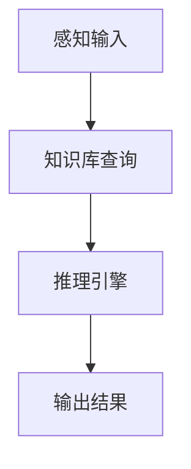
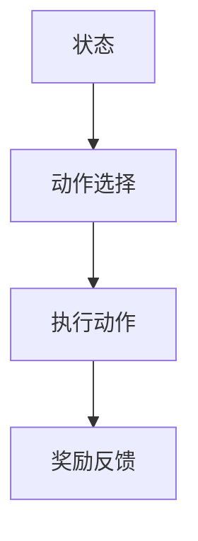
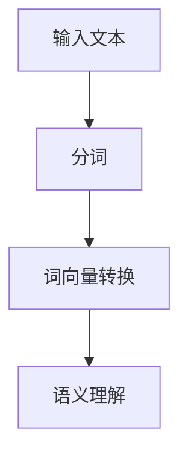
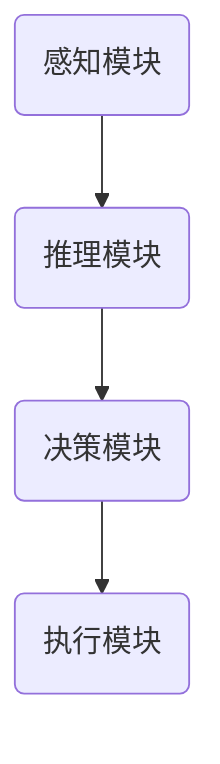
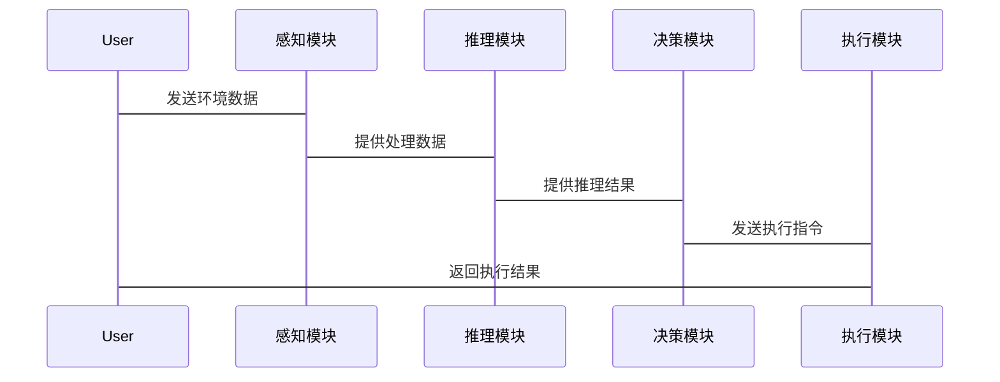

                 


# 构建AI Agent的技术栈选择指南

## 关键词：AI Agent，技术栈选择，算法原理，系统架构，项目实战

## 摘要：  
本文将详细探讨构建AI Agent所需的技术栈选择，从AI Agent的核心概念、算法原理、系统架构到项目实战，逐步分析并给出详细的技术指导。通过本文，读者将能够理解AI Agent的构建过程，并掌握如何选择合适的技术栈来实现高效的AI Agent系统。

---

# 第一部分: AI Agent技术栈选择背景与核心概念

## 第1章: AI Agent概述与背景介绍

### 1.1 AI Agent的基本概念

#### 1.1.1 什么是AI Agent
AI Agent（人工智能代理）是一种能够感知环境、自主决策并执行任务的智能实体。它可以分为弱AI Agent和强AI Agent，前者专注于特定任务，后者具备通用智能。

#### 1.1.2 AI Agent的核心属性
- **自主性**：能够在没有外部干预的情况下自主运作。
- **反应性**：能够实时感知环境并做出响应。
- **目标导向**：基于目标驱动行为。
- **社交能力**：能够与其他AI Agent或人类进行交互。

#### 1.1.3 AI Agent的分类与应用场景
- **简单反射型AI Agent**：基于规则的反应式系统。
- **基于模型的反射型AI Agent**：具备内部状态和目标的复杂系统。
- **目标导向型AI Agent**：专注于实现特定目标。
- **效用导向型AI Agent**：通过最大化效用函数实现目标。
- **学习型AI Agent**：通过机器学习不断优化性能。

应用场景包括自动驾驶、智能客服、智能推荐系统、游戏AI、工业自动化等。

### 1.2 AI Agent技术栈的背景与现状

#### 1.2.1 AI Agent的发展历程
从专家系统到机器学习，再到当前的深度学习和强化学习，AI Agent的技术经历了从简单到复杂的演变。

#### 1.2.2 当前技术栈的主要趋势
- **开源框架**：如TensorFlow、PyTorch、OpenAI Gym等。
- **云原生架构**：基于容器化和微服务的AI Agent部署。
- **边缘计算**：AI Agent在边缘设备上的实时处理。
- **多模态交互**：结合视觉、听觉、语言等多种交互方式。

#### 1.2.3 企业级AI Agent应用的挑战与机遇
- **挑战**：复杂环境下的决策不确定性、多智能体协作的同步问题、实时性与资源消耗的平衡。
- **机遇**：AI Agent在各行业的广泛应用，如金融、医疗、交通等。

## 第2章: AI Agent的核心概念与联系

### 2.1 AI Agent的核心原理

#### 2.1.1 AI Agent的感知与决策机制
- **感知**：通过传感器或数据接口获取环境信息。
- **决策**：基于感知信息，结合内部模型和目标，做出决策。

#### 2.1.2 知识表示与推理方法
- **知识表示**：通过符号逻辑或向量表示知识。
- **推理**：基于知识库进行逻辑推理，得出结论。

#### 2.1.3 人机交互与任务执行
- **交互方式**：自然语言处理、语音识别、视觉识别等。
- **任务执行**：通过API调用或其他方式完成任务。

### 2.2 核心概念对比与ER实体关系图

#### 2.2.1 AI Agent与传统AI的区别
| 特性            | 传统AI         | AI Agent      |
|-----------------|----------------|----------------|
| 自主性          | 无            | 有            |
| 反应性          | 无            | 有            |
| 目标导向        | 无            | 有            |
| 交互能力        | 无            | 有            |

#### 2.2.2 ER实体关系图
```mermaid
er
    actor(Agent)
    actor(Agent) --> entity(Environment)
    actor(Agent) --> entity(Task)
    entity(Task) --> entity(Action)
```

---

# 第二部分: AI Agent技术栈的算法原理与数学模型

## 第3章: AI Agent算法原理

### 3.1 AI Agent的核心算法

#### 3.1.1 逻辑推理算法
- **一阶逻辑推理**：通过谓词逻辑进行推理。
- **概率推理**：基于贝叶斯网络进行推理。

#### 3.1.2 强化学习算法
- **Q-learning**：通过试错学习优化决策。
- **深度Q网络**：结合深度学习和强化学习。

#### 3.1.3 自然语言处理算法
- **词嵌入**：通过Word2Vec、GloVe等技术生成词向量。
- **Transformer架构**：用于序列建模和生成。

### 3.2 算法原理的Mermaid流程图

#### 3.2.1 逻辑推理流程图


#### 3.2.2 强化学习流程图


#### 3.2.3 NLP处理流程图


### 3.3 算法实现的Python代码示例

#### 3.3.1 逻辑推理代码
```python
from logic推理库 import 推理引擎
engine = 推理引擎()
result = engine推理(输入)
```

#### 3.3.2 强化学习代码
```python
import numpy as np
from强化学习库 import DQN
agent = DQN(状态空间, 动作空间)
action = agent.act(state)
```

#### 3.3.3 NLP处理代码
```python
from nlp库 import 分词器
tokens = 分词器分词(输入文本)
```

### 3.4 数学模型与公式

#### 3.4.1 逻辑推理公式
$$ \text{命题逻辑公式：} P \land Q \implies R $$

#### 3.4.2 强化学习公式
$$ Q(s, a) = r + \gamma \max Q(s', a') $$

#### 3.4.3 NLP公式
$$ \text{注意力机制：} \alpha_i = \frac{e_i}{\sum_j e_j} $$

---

# 第三部分: AI Agent系统分析与架构设计

## 第4章: 系统分析与需求分析

### 4.1 项目背景与目标

#### 4.1.1 项目背景
构建一个能够自主决策、多模态交互的AI Agent系统。

#### 4.1.2 项目目标
实现一个具备感知、推理、决策和执行能力的AI Agent。

### 4.2 系统功能需求

#### 4.2.1 用户需求分析
- **用户角色**：普通用户、开发者、系统管理员。
- **核心功能**：感知、推理、决策、执行。
- **附加功能**：日志记录、性能监控。

#### 4.2.2 系统功能列表
| 功能模块       | 功能描述           |
|----------------|--------------------|
| 感知模块       | 采集环境数据       |
| 推理模块       | 处理数据并得出结论 |
| 决策模块       | 基于结论做出决策   |
| 执行模块       | 执行具体任务       |

#### 4.2.3 非功能性需求
- **性能需求**：实时响应，延迟<1秒。
- **安全需求**：数据加密，访问控制。
- **可扩展性**：支持新增功能模块。

## 第5章: 系统架构设计

### 5.1 系统架构图



### 5.2 系统接口设计

#### 5.2.1 接口定义
- **输入接口**：环境数据输入。
- **输出接口**：执行动作输出。
- **日志接口**：记录系统运行状态。

#### 5.2.2 序列图


---

## 第6章: 项目实战

### 6.1 环境安装

#### 6.1.1 安装依赖
```bash
pip install tensorflow numpy matplotlib
```

#### 6.1.2 安装框架
```bash
pip install gym matplotlib
```

### 6.2 系统核心实现

#### 6.2.1 逻辑推理实现
```python
def 推理引擎(输入):
    # 实现推理逻辑
    return 输出
```

#### 6.2.2 强化学习实现
```python
class DQN:
    def __init__(self, 状态空间, 动作空间):
        self.状态空间 = 状态空间
        self.动作空间 = 动作空间
        # 初始化网络
    def act(self, state):
        # 返回动作
        return action
```

#### 6.2.3 NLP实现
```python
def 分词器(输入):
    # 实现分词逻辑
    return 分词结果
```

### 6.3 案例分析与解读

#### 6.3.1 案例分析
- **案例背景**：构建一个智能客服AI Agent。
- **实现步骤**：
  1. 安装环境并初始化框架。
  2. 实现自然语言理解模块。
  3. 集成推理引擎。
  4. 部署强化学习优化对话流程。

#### 6.3.2 代码解读
```python
from智能客服库 import 分词器, 推理引擎

def 处理客户咨询(输入):
    分词结果 = 分词器(输入)
    推理结果 = 推理引擎(分词结果)
    return 推理结果
```

### 6.4 项目总结

#### 6.4.1 项目成果
成功构建了一个具备自然语言处理、逻辑推理能力的智能客服AI Agent。

#### 6.4.2 经验总结
- **技术选型**：选择合适的框架和库可以显著提高开发效率。
- **系统设计**：模块化设计有助于系统的扩展和维护。
- **性能优化**：通过强化学习优化决策过程，可以提升系统性能。

---

## 第四部分: 最佳实践与扩展阅读

## 第7章: 最佳实践

### 7.1 技术选型建议

#### 7.1.1 开源框架选择
- **深度学习**：TensorFlow、PyTorch。
- **强化学习**：OpenAI Gym、RLlib。
- **NLP**：Hugging Face、spaCy。

#### 7.1.2 开发工具推荐
- **IDE**：PyCharm、VS Code。
- **版本控制**：Git、GitHub。
- **调试工具**：pdb、IPython。

### 7.2 系统优化建议

#### 7.2.1 性能优化
- **并行计算**：利用GPU加速计算。
- **模型压缩**：通过剪枝等技术降低模型复杂度。

#### 7.2.2 可扩展性优化
- **模块化设计**：便于新增功能模块。
- **微服务架构**：通过容器化部署提高可扩展性。

## 第8章: 小结与展望

### 8.1 小结
本文详细探讨了构建AI Agent所需的技术栈选择，从核心概念、算法原理到系统架构和项目实战，为读者提供了全面的技术指导。

### 8.2 展望
未来，AI Agent将朝着更强的自主性、更高的智能性和更广泛的应用领域发展。建议读者持续关注相关领域的最新技术动态。

---

## 作者信息

作者：AI天才研究院/AI Genius Institute & 禅与计算机程序设计艺术 /Zen And The Art of Computer Programming

