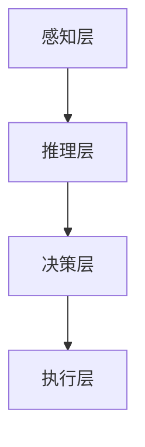
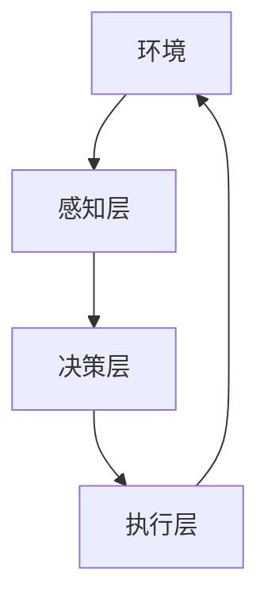
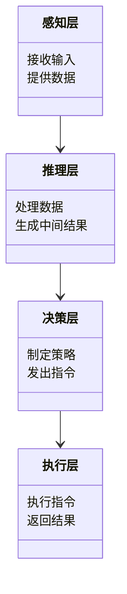
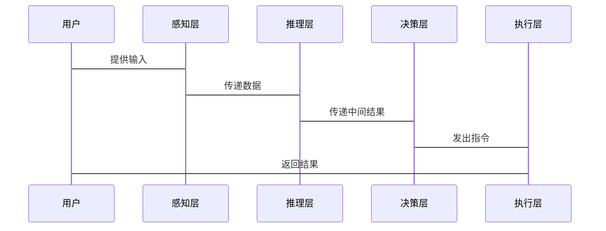

                 


# 构建AI Agent的敏捷开发流程

## 关键词：
AI Agent、敏捷开发、算法原理、系统架构、项目实战、开发流程

## 摘要：
在人工智能和机器学习快速发展的今天，AI Agent（智能体）的应用场景越来越广泛。然而，AI Agent的开发不同于传统软件开发，它具有更强的复杂性和不确定性。为了高效地构建AI Agent，敏捷开发方法论成为了一种重要的选择。本文将从AI Agent的核心概念、敏捷开发的背景、算法原理、系统架构、项目实战等多个维度，详细探讨如何构建AI Agent的敏捷开发流程，帮助读者掌握AI Agent开发的关键步骤和方法。

---

## 第1章：AI Agent与敏捷开发背景

### 1.1 AI Agent的基本概念
AI Agent是一种能够感知环境、自主决策并执行任务的智能实体。它能够通过与环境的交互，实现特定目标，例如自动驾驶汽车、智能客服系统、推荐系统等。AI Agent的核心特征包括自主性、反应性、目标导向性和社会性。

#### AI Agent的核心特征对比表

| 特征       | 描述                                                                 |
|------------|----------------------------------------------------------------------|
| 自主性     | AI Agent能够自主决策，无需外部干预                                       |
| 反应性     | AI Agent能够实时感知环境并做出反应                                       |
| 目标导向性 | AI Agent的行为以实现特定目标为导向                                       |
| 社会性     | AI Agent能够与其他Agent或人类进行交互，协作完成任务                   |

#### AI Agent的架构模型（Mermaid图）


### 1.2 敏捷开发方法论
敏捷开发是一种以迭代和增量的方式进行软件开发的方法论，强调客户合作、快速响应变化和交付可用的软件。与传统瀑布开发相比，敏捷开发更加灵活，适合应对复杂性和不确定性的AI Agent开发。

#### 敏捷开发的核心原则
1. 个体互动高于流程和工具
2. 可以的进度高于严格的计划
3. 客户合作高于合同谈判
4. 响应变化高于遵循计划

### 1.3 本章小结
本章介绍了AI Agent的基本概念、核心特征以及敏捷开发的核心理念，为后续章节的讨论奠定了基础。AI Agent的复杂性和不确定性使得敏捷开发成为一种更适合的选择。

---

## 第2章：AI Agent的核心概念与技术原理

### 2.1 AI Agent的定义与架构
AI Agent的架构决定了其行为方式。常见的AI Agent架构包括基于规则的架构、基于模型的架构、基于学习的架构等。

#### AI Agent的架构模型（Mermaid图）


### 2.2 AI Agent的能力与特征
AI Agent的能力包括感知能力、学习能力和决策能力。这些能力使得AI Agent能够适应不同的环境和任务需求。

#### AI Agent能力对比表
| 能力       | 描述                                                                 |
|------------|----------------------------------------------------------------------|
| 感知能力   | 通过传感器或数据源获取环境信息                                         |
| 学习能力   | 通过训练数据或经验提升性能                                             |
| 决策能力   | 根据当前状态和目标选择最优行动                                         |

### 2.3 AI Agent与传统软件开发的对比
AI Agent开发与传统软件开发在目标、过程和技术实现上有显著差异。

#### AI Agent与传统软件开发的对比表
| 维度       | AI Agent开发                              | 传统软件开发                            |
|------------|------------------------------------------|-----------------------------------------|
| 开发目标   | 实现智能化行为                              | 实现功能性需求                            |
| 开发过程   | 迭代式开发，注重实验和反馈                | 瀑布式开发，注重计划和控制                |
| 技术实现   | 依赖机器学习和深度学习                   | 依赖传统编程和算法                        |

---

## 第3章：AI Agent的算法原理

### 3.1 强化学习算法
强化学习是一种通过试错机制来优化决策策略的算法。AI Agent通过与环境的交互，学习最优策略。

#### 强化学习算法流程（Mermaid图）


#### 强化学习数学模型
强化学习的核心是通过最大化累计奖励来优化策略。数学模型如下：

$$ R = r_1 + r_2 + \cdots + r_n $$

其中，$R$ 是总奖励，$r_i$ 是每一步的奖励。

### 3.2 监督学习算法
监督学习是一种通过训练数据学习输入与输出之间映射关系的算法。

#### 监督学习数学模型
监督学习的目标是最小化预测值与真实值之间的误差：

$$ \min_{\theta} \sum_{i=1}^n (y_i - \hat{y}_i)^2 $$

其中，$\theta$ 是模型参数，$y_i$ 是真实值，$\hat{y}_i$ 是预测值。

### 3.3 本章小结
本章介绍了AI Agent开发中常用的强化学习和监督学习算法，分析了它们的数学模型和应用场景。

---

## 第4章：AI Agent的系统架构设计

### 4.1 系统功能设计
AI Agent的系统功能包括感知、推理、决策和执行四个部分。

#### 系统功能设计（Mermaid类图）


### 4.2 系统架构设计
AI Agent的系统架构需要考虑模块化设计和可扩展性。

#### 系统架构设计（Mermaid架构图）


### 4.3 系统接口设计
系统接口设计需要考虑模块之间的交互和数据格式。

#### 系统接口设计
- 感知层接口：提供环境数据输入接口
- 推理层接口：提供数据处理和中间结果输出接口
- 决策层接口：提供策略制定和指令输出接口
- 执行层接口：提供指令执行和结果反馈接口

### 4.4 系统交互设计
系统交互设计需要考虑用户与AI Agent的交互流程。

#### 系统交互设计（Mermaid序列图）


### 4.5 本章小结
本章通过系统功能设计、架构设计、接口设计和交互设计，详细介绍了AI Agent的系统架构。

---

## 第5章：AI Agent的项目实战

### 5.1 环境安装
AI Agent开发需要安装Python、深度学习框架（如TensorFlow、PyTorch）和相关库。

#### 环境配置代码
```bash
pip install numpy
pip install tensorflow
pip install scikit-learn
```

### 5.2 核心代码实现
AI Agent的核心代码实现包括感知层、推理层、决策层和执行层。

#### 核心代码实现
```python
# 感知层
class Perceive:
    def __init__(self):
        self.sensors = []

    def get_input(self):
        return self.sensors

# 推理层
class Infer:
    def __init__(self):
        self.models = []

    def process_data(self, data):
        return self.models.predict(data)

# 决策层
class Decide:
    def __init__(self):
        self.strategies = []

    def make_decision(self, data):
        return self.strategies[0](data)

# 执行层
class Execute:
    def __init__(self):
        self.actions = []

    def perform_action(self, action):
        return self.actions[action]

# 实例化各层
perceive = Perceive()
infer = Infer()
decide = Decide()
execute = Execute()

# 交互流程
input_data = perceive.get_input()
processed_data = infer.process_data(input_data)
decision = decide.make_decision(processed_data)
result = execute.perform_action(decision)
```

### 5.3 案例分析
以智能客服系统为例，AI Agent可以通过自然语言处理技术与用户交互，实现自动响应和问题解决。

#### 案例分析
1. 用户输入问题：例如“如何重置密码？”
2. 感知层接收输入并传递给推理层
3. 推理层分析问题并生成中间结果
4. 决策层制定响应策略并发出指令
5. 执行层执行指令并返回结果

### 5.4 本章小结
本章通过具体的项目实战，详细介绍了AI Agent开发的核心代码实现和实际应用案例。

---

## 第6章：最佳实践与未来展望

### 6.1 最佳实践
1. **模块化设计**：将系统划分为感知层、推理层、决策层和执行层，便于管理和维护。
2. **数据质量管理**：确保训练数据的多样性和代表性。
3. **持续优化**：通过反馈机制不断优化AI Agent的性能。

### 6.2 小结
构建AI Agent的敏捷开发流程需要结合敏捷开发方法论和AI技术，注重模块化设计、数据质量和持续优化。

### 6.3 未来展望
随着AI技术的不断发展，AI Agent的开发将更加智能化和自动化，开发流程也将更加高效和灵活。

---

## 作者：AI天才研究院/AI Genius Institute & 禅与计算机程序设计艺术 /Zen And The Art of Computer Programming

---

以上是《构建AI Agent的敏捷开发流程》的完整目录大纲和文章内容。

