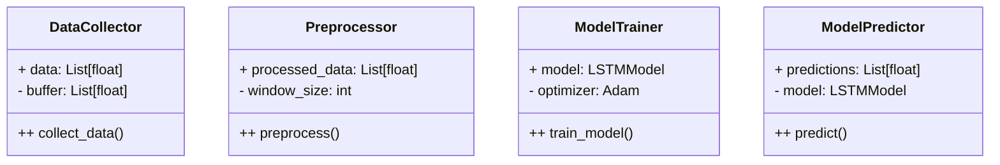
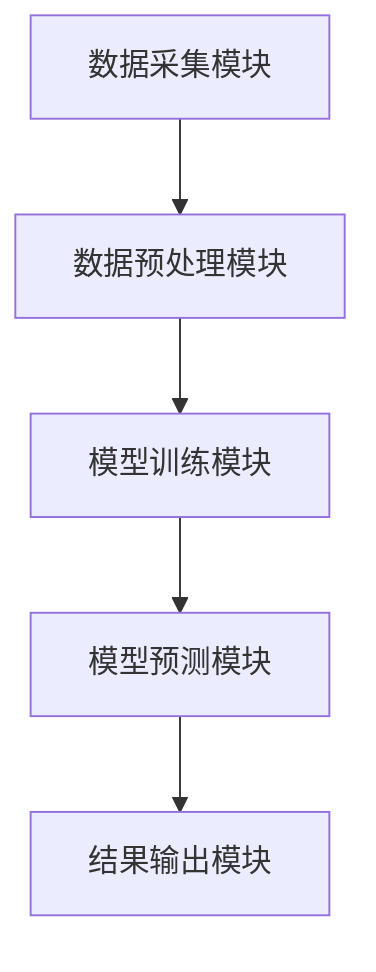
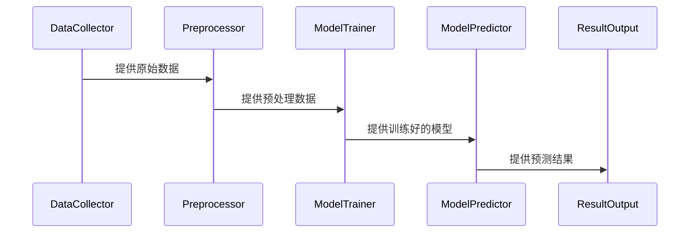

                 


# 构建AI Agent的时序学习与预测模型

> 关键词：AI Agent, 时序学习, 预测模型, 时间序列, 智能决策

> 摘要：本文详细探讨了构建AI Agent时序学习与预测模型的关键技术，从背景知识、核心概念、算法原理到系统设计和项目实战，结合理论与实践，帮助读者全面掌握构建高效AI Agent时序预测模型的方法。

---

# 第一部分: AI Agent与时序学习的背景介绍

## 第1章: AI Agent与时序学习的背景介绍

### 1.1 时序数据的基本概念

#### 1.1.1 时序数据的定义
时序数据是指按时间顺序排列的数据，通常具有时间戳特征。例如，股票价格、天气数据、传感器读数等。

#### 1.1.2 时序数据的特征
- **顺序性**：数据的时间顺序不可改变。
- **趋势性**：数据可能呈现上升或下降趋势。
- **周期性**：数据可能具有周期性特征。
- **随机性**：数据中可能包含不可预测的噪声。

#### 1.1.3 时序数据的常见应用场景
- 金融时间序列分析（股票价格预测、外汇汇率预测）。
- 工业过程控制（设备状态监测、生产优化）。
- 医疗健康（患者生命体征监测、疾病预测）。

---

### 1.2 AI Agent的定义与特点

#### 1.2.1 AI Agent的基本概念
AI Agent是指具有感知环境、自主决策和执行任务能力的智能实体。它可以是一个软件程序或物理设备。

#### 1.2.2 AI Agent的核心特点
- **自主性**：无需外部干预，自主完成任务。
- **反应性**：能够实时感知环境并做出反应。
- **目标导向性**：基于目标进行决策和行动。
- **学习能力**：通过学习提升自身性能。

#### 1.2.3 AI Agent与传统AI的区别
- **自主性**：AI Agent具有更强的自主性，能够独立完成任务。
- **动态性**：AI Agent需要处理动态变化的环境。
- **实时性**：AI Agent通常需要实时响应。

---

### 1.3 时序学习在AI Agent中的问题背景

#### 1.3.1 时序数据的复杂性
时序数据通常具有高度的复杂性，包括长尾分布、非线性关系和复杂的依赖关系。

#### 1.3.2 时序预测的挑战
- 数据稀疏性：某些时间点的数据可能缺失。
- 短时依赖性：某些预测任务需要捕捉短期依赖关系。
- 长期依赖性：某些预测任务需要捕捉长期依赖关系。

#### 1.3.3 AI Agent对时序学习的需求
AI Agent需要基于时序数据做出预测和决策，因此需要高效的时序学习模型。

---

### 1.4 时序学习与预测模型的应用价值

#### 1.4.1 金融领域的应用
- 股票价格预测。
- 外汇汇率预测。
- 金融风险评估。

#### 1.4.2 医疗领域的应用
- 患者生命体征监测。
- 疾病预测与诊断。
- 药物研发优化。

#### 1.4.3 工业领域的应用
- 设备状态监测与预测性维护。
- 生产过程优化。
- 质量控制。

---

### 1.5 本章小结
本章介绍了时序数据的基本概念、AI Agent的定义与特点，以及时序学习在AI Agent中的问题背景和应用价值。下一章将深入探讨时序学习的核心概念与联系。

---

# 第二部分: 时序学习的核心概念与联系

## 第2章: 时序学习的核心概念

### 2.1 时序模型的基本原理

#### 2.1.1 基于循环神经网络（RNN）的时序模型
- RNN的基本结构。
- RNN的处理时序数据的方式。
- RNN的局限性：梯度消失与梯度爆炸问题。

#### 2.1.2 基于Transformer的时序模型
- Transformer的基本结构。
- Transformer在时序预测中的应用。
- Transformer的优势：全局依赖关系。

#### 2.1.3 基于LSTM的时序模型
- LSTM的基本结构。
- LSTM的门控机制。
- LSTM在时序预测中的优势。

---

### 2.2 时序模型的核心要素

#### 2.2.1 状态转移
- 状态转移的定义。
- 状态转移矩阵的构建。
- 状态转移在时序预测中的作用。

#### 2.2.2 时间依赖性
- 时间依赖性的定义。
- 时间依赖性在时序模型中的体现。
- 时间依赖性对预测准确性的影响。

#### 2.2.3 预测准确性
- 预测准确性的定义。
- 不同时序模型的预测准确性对比。
- 提高预测准确性的方法。

---

### 2.3 时序模型与AI Agent的关系

#### 2.3.1 时序模型在AI Agent中的作用
- 时序模型作为AI Agent的核心决策模块。
- 时序模型帮助AI Agent理解动态环境。
- 时序模型支持AI Agent做出实时预测。

#### 2.3.2 时序模型如何支持AI Agent的决策
- 时序模型为AI Agent提供环境信息。
- 时序模型帮助AI Agent预测未来状态。
- 时序模型支持AI Agent做出最优决策。

#### 2.3.3 时序模型的优化对AI Agent性能的影响
- 时序模型性能优化对AI Agent决策准确性的提升。
- 时序模型优化对AI Agent响应速度的影响。
- 时序模型优化对AI Agent资源消耗的影响。

---

### 2.4 核心概念对比表

| 概念         | RNN          | LSTM         | Transformer    |
|--------------|--------------|--------------|---------------|
| 基本结构     | 循环结构      | 门控机制      | 自注意力机制  |
| 时间依赖性   | 简单          | 复杂          | 全局依赖       |
| 预测准确性   | 一般          | 较高          | 更高           |
| 优缺点       | 适用于短序列  | 适用于长序列  | 计算资源需求高 |

---

### 2.5 本章小结
本章详细探讨了时序模型的核心概念与联系，分析了不同时序模型的优缺点及其在AI Agent中的作用。下一章将从算法原理的角度深入分析时序模型的实现细节。

---

# 第三部分: 时序学习的算法原理

## 第3章: 时序学习的算法原理

### 3.1 基于LSTM的时序预测算法

#### 3.1.1 LSTM的基本结构
- LSTM的三个门控：输入门、遗忘门和输出门。
- LSTM的细胞状态（Cell State）。
- LSTM的前向传播过程。

#### 3.1.2 LSTM的数学模型
- 输入门公式：
  $$ i_t = \sigma(W_i x_t + U_i h_{t-1}) $$
- 遗忘门公式：
  $$ f_t = \sigma(W_f x_t + U_f h_{t-1}) $$
- 细胞状态更新公式：
  $$ c_t = f_t \cdot c_{t-1} + i_t \cdot tanh(W_c x_t + U_c h_{t-1}) $$
- 输出门公式：
  $$ o_t = \sigma(W_o x_t + U_o h_{t-1}) $$
- 最终隐藏层状态：
  $$ h_t = o_t \cdot tanh(c_t) $$

#### 3.1.3 LSTM的代码实现
```python
import tensorflow as tf
from tensorflow.keras.layers import LSTM, Dense

model = tf.keras.Sequential()
model.add(LSTM(64, input_shape=(timesteps, features)))
model.add(Dense(1))
model.compile(optimizer='adam', loss='mse')
```

---

### 3.2 基于Transformer的时序预测算法

#### 3.2.1 Transformer的基本结构
- 输入嵌入（Input Embedding）。
- 位置编码（Positional Encoding）。
- 自注意力机制（Self-Attention）。
- 前向网络（Feed-Forward Network）。

#### 3.2.2 Transformer的数学模型
- 自注意力机制公式：
  $$ \text{Attention}(Q, K, V) = \text{softmax}\left(\frac{QK^T}{\sqrt{d_k}}\right)V $$
- 前向网络公式：
  $$ \text{FFN}(x) = \max(0, x W_1 + b_1) W_2 + b_2 $$

#### 3.2.3 Transformer的代码实现
```python
import tensorflow as tf
from tensorflow.keras.layers import Dense, MultiHeadAttention

model = tf.keras.Sequential()
model.add(MultiHeadAttention(heads=8, key_dim=64, value_dim=64))
model.add(Dense(1))
model.compile(optimizer='adam', loss='mse')
```

---

### 3.3 时序模型的训练与预测

#### 3.3.1 模型训练流程
1. 数据预处理：归一化、滑动窗口分割。
2. 模型构建：选择适当的时序模型。
3. 模型训练：使用合适的目标函数（如均方误差）和优化器（如Adam）。
4. 模型评估：使用验证集评估模型性能。

#### 3.3.2 模型预测流程
1. 数据预处理：与训练数据一致。
2. 模型输入：将预处理后的数据输入模型。
3. 获取预测结果。
4. 结果分析：对比真实值与预测值。

---

### 3.4 本章小结
本章详细分析了LSTM和Transformer两种时序预测算法的原理和实现方法。下一章将从系统设计的角度探讨如何构建高效的时序学习模型。

---

# 第四部分: 时序学习的系统设计与实现

## 第4章: 时序学习的系统设计与实现

### 4.1 项目背景

#### 4.1.1 项目目标
构建一个高效的AI Agent时序学习与预测模型，能够实时处理时序数据并做出准确预测。

#### 4.1.2 项目需求
- 实时数据处理。
- 高精度预测。
- 系统可扩展性。

---

### 4.2 系统功能设计

#### 4.2.1 功能模块划分
- 数据采集模块：负责采集时序数据。
- 数据预处理模块：对数据进行归一化、滑动窗口分割等处理。
- 模型训练模块：负责训练时序预测模型。
- 模型预测模块：负责实时预测和结果输出。

#### 4.2.2 功能模块的类图设计


---

### 4.3 系统架构设计

#### 4.3.1 系统架构图


#### 4.3.2 系统交互流程


---

### 4.4 系统实现

#### 4.4.1 环境安装
- 安装Python 3.8及以上版本。
- 安装TensorFlow、Keras、NumPy等库。

#### 4.4.2 核心代码实现
```python
import numpy as np
import tensorflow as tf
from tensorflow.keras.layers import LSTM, Dense
from tensorflow.keras.models import Sequential

# 数据预处理
def preprocess(data, window_size=30):
    X = []
    y = []
    for i in range(len(data) - window_size):
        X.append(data[i:i+window_size])
        y.append(data[i+window_size])
    return np.array(X), np.array(y)

# 模型构建
def build_model(input_shape):
    model = Sequential()
    model.add(LSTM(64, input_shape=input_shape))
    model.add(Dense(1))
    return model

# 模型训练
def train_model(X, y, epochs=50):
    model = build_model((X.shape[1], X.shape[2]))
    model.compile(optimizer='adam', loss='mse')
    model.fit(X, y, epochs=epochs, batch_size=32)
    return model

# 模型预测
def predict(model, X):
    return model.predict(X)
```

---

### 4.5 本章小结
本章详细探讨了AI Agent时序学习与预测模型的系统设计与实现，包括功能模块划分、系统架构设计和核心代码实现。下一章将通过实际案例分析进一步验证模型的性能。

---

# 第五部分: 项目实战与案例分析

## 第5章: 项目实战与案例分析

### 5.1 实际案例分析

#### 5.1.1 案例背景
以股票价格预测为例，构建一个基于LSTM的时序预测模型。

#### 5.1.2 数据来源
使用某股票的历史收盘价数据，数据长度为1000天。

#### 5.1.3 数据预处理
- 数据归一化：将数据缩放到0-1范围。
- 滑动窗口分割：窗口大小设为30天。

#### 5.1.4 模型训练
- 训练数据集大小为900天，验证数据集大小为100天。
- 训练模型50个Epoch，批量大小为32。

#### 5.1.5 模型预测
- 使用训练好的模型预测未来30天的股票价格。
- 对比真实价格与预测价格，计算预测误差。

---

### 5.2 代码实现与结果分析

#### 5.2.1 完整代码实现
```python
import numpy as np
import pandas as pd
import tensorflow as tf
from tensorflow.keras.layers import LSTM, Dense
from tensorflow.keras.models import Sequential
from sklearn.preprocessing import MinMaxScaler

# 数据加载与预处理
data = pd.read_csv('stock_price.csv')
data = data['Close'].values
data = data.reshape(-1, 1)
scaler = MinMaxScaler()
data_scaled = scaler.fit_transform(data)

X, y = preprocess(data_scaled, window_size=30)

# 模型构建与训练
model = build_model((X.shape[1], X.shape[2]))
model.compile(optimizer='adam', loss='mse')
model.fit(X, y, epochs=50, batch_size=32)

# 模型预测
predicted = model.predict(X[-1:])
predicted_price = scaler.inverse_transform(predicted)
print("预测价格:", predicted_price[0][0])
print("真实价格:", data[-1])
print("预测误差:", abs(predicted_price[0][0] - data[-1]))
```

#### 5.2.2 结果分析
- 预测结果与真实结果对比。
- 计算预测误差，评估模型性能。

---

### 5.3 模型优化与调参

#### 5.3.1 模型调参
- 调整LSTM单元数量。
- 调整训练Epoch数。
- 改变批量大小。

#### 5.3.2 模型优化效果
- 提高预测准确性。
- 减少预测误差。

---

### 5.4 本章小结
本章通过实际案例分析，详细展示了如何构建和优化AI Agent时序学习与预测模型。下一章将总结最佳实践和注意事项。

---

# 第六部分: 最佳实践与总结

## 第6章: 最佳实践与总结

### 6.1 最佳实践

#### 6.1.1 数据预处理
- 数据归一化：避免模型训练过程中数值过大或过小。
- 滑动窗口分割：合理选择窗口大小，捕捉有效信息。

#### 6.1.2 模型选择
- 根据任务需求选择模型：短序列选择RNN，长序列选择LSTM或Transformer。
- 综合考虑模型性能与计算资源。

#### 6.1.3 模型调参
- 通过网格搜索或随机搜索选择最优参数。
- 使用交叉验证评估模型性能。

#### 6.1.4 模型评估
- 使用均方误差（MSE）、平均绝对误差（MAE）等指标评估模型性能。
- 对比不同模型的预测结果，选择表现最佳的模型。

#### 6.1.5 模型部署
- 将模型部署到生产环境中，实时处理数据。
- 定期更新模型，保持预测准确性。

---

### 6.2 模型的局限性与注意事项

#### 6.2.1 模型的局限性
- LSTM和Transformer模型计算资源需求较高。
- 模型对长序列的预测可能存在延迟。
- 模型可能受到数据稀疏性和噪声的影响。

#### 6.2.2 注意事项
- 数据预处理是关键，需谨慎处理。
- 模型选择需结合实际任务需求。
- 模型部署需考虑实时性和资源限制。

---

### 6.3 总结

AI Agent时序学习与预测模型的构建是一个复杂但 rewarding 的过程。通过合理选择模型、精心设计系统架构、优化模型参数，可以构建出高效、准确的时序预测模型，为AI Agent的决策提供有力支持。

---

# 结语

构建AI Agent时序学习与预测模型是一项具有挑战性的任务，但通过系统化的学习和实践，我们可以掌握其核心技术和实现方法。希望本文能为读者提供有价值的参考和启发。

---

# 作者

作者：AI天才研究院/AI Genius Institute & 禅与计算机程序设计艺术/Zen And The Art of Computer Programming

