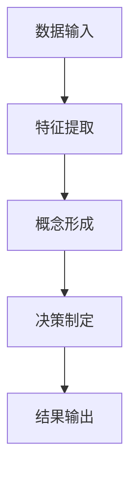
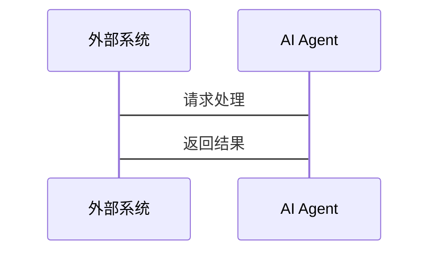

                 


# 构建AI Agent的概念抽象与泛化能力

## 关键词：AI Agent，概念抽象，泛化能力，算法原理，系统架构，项目实战

## 摘要：  
本文深入探讨构建AI Agent的概念抽象与泛化能力，从背景介绍、核心概念、算法原理到系统架构和项目实战，详细分析AI Agent如何通过概念抽象和泛化能力实现智能决策。文章结合数学模型、公式推导和实际案例，为读者提供全面的技术视角。

---

## 第一部分: AI Agent的概念与背景

### 第1章: AI Agent的定义与背景

#### 1.1 AI Agent的基本概念  
AI Agent（人工智能代理）是指能够感知环境、采取行动以实现特定目标的智能实体。它具备自主性、反应性、目标导向性和社会性等核心特征。  

**定义：**  
AI Agent是一个能够感知环境、处理信息、做出决策并执行动作的智能系统，旨在实现预设目标或优化特定目标函数。  

**发展历史：**  
AI Agent的概念起源于传统人工智能研究，经历了从专家系统到基于代理的系统的演变。  

**应用场景：**  
AI Agent广泛应用于自动驾驶、智能助手、机器人控制、推荐系统等领域。  

#### 1.2 问题背景与问题描述  
AI Agent的核心挑战在于如何从大量数据中提取概念，并将这些概念泛化到新场景中。  

**问题背景：**  
在复杂环境中，AI Agent需要处理多样化的数据，提取其中的共性和差异性特征。  

**问题描述：**  
概念抽象与泛化能力是AI Agent实现智能决策的关键，涉及数据特征提取、模式识别和知识表示等问题。  

**问题解决：**  
通过算法学习数据的内在结构，构建概念模型，并通过泛化能力适应新场景。  

**边界与外延：**  
概念抽象的边界在于数据的相似性和可区分性，而泛化能力的外延则涉及领域知识的扩展。  

#### 1.3 核心概念与联系  
AI Agent的构建涉及多个核心概念，包括数据特征提取、模式识别、知识表示和推理能力。  

**核心概念结构：**  
1. 数据特征提取：从原始数据中提取关键特征。  
2. 概念抽象：基于特征提取出一般性概念。  
3. 泛化能力：将概念扩展到新的数据实例。  
4. 系统架构：设计支持概念抽象与泛化的系统结构。  

**概念属性特征对比表：**  
下表对比了不同概念的属性特征，包括特征名称、特征类型和特征描述。  

| 特征名称 | 特征类型 | 特征描述 |
|----------|----------|----------|
|  类别  |  数值型  |  表示数据的类别标签。 |
|  属性  |  分类型  |  表示数据的属性特征。 |
|  特征权重 |  数值型  |  表示特征的重要性。 |

**ER实体关系图：**  
以下是概念之间的实体关系图，展示了数据、特征、概念之间的关联关系。  

```mermaid
erd
  entity 数据 {
    <文件> 数据实例
  }
  entity 特征 {
    <文件> 特征提取
  }
  entity 概念 {
    <文件> 概念抽象
  }
  数据 -- 特征: 提取特征
  特征 -- 概念: 抽象概念
```

#### 1.4 本章小结  
本章介绍了AI Agent的基本概念和背景，明确了概念抽象与泛化能力的重要性，并通过对比和图表展示了核心概念的结构和联系。

---

## 第二部分: 概念抽象与泛化能力的核心原理

### 第2章: 概念抽象的原理与方法

#### 2.1 概念抽象的基本原理  
概念抽象是通过特征提取和模式识别，从具体实例中提取出一般性概念的过程。  

**特征提取：**  
特征提取是将原始数据转换为特征向量的过程，常用的方法包括主成分分析（PCA）和线性判别分析（LDA）。  

**模式识别：**  
模式识别通过分类算法识别数据中的模式，如决策树、支持向量机（SVM）等。  

**数学模型：**  
PCA的目标是最小化数据的方差，公式为：  
$$ \arg \min_{W} \text{Tr}((XW)^T XW) $$  
其中，$X$是数据矩阵，$W$是特征权重矩阵。  

#### 2.2 泛化能力的核心机制  
泛化能力是AI Agent将概念扩展到新数据实例的能力，主要依赖于归纳推理和类比推理。  

**归纳推理：**  
归纳推理通过训练数据推导出一般性规则，常用方法包括决策树和随机森林。  

**类比推理：**  
类比推理通过类比不同概念之间的关系，扩展已知概念到新概念。  

**数学模型：**  
支持向量机（SVM）的目标是最优化间隔最大化，公式为：  
$$ \arg \min_{w,b,\xi} \frac{1}{2}||w||^2 + C \sum_{i=1}^n \xi_i $$  
其中，$w$是超平面参数，$b$是偏置项，$\xi$是松弛变量。  

#### 2.3 概念属性特征对比表  
以下是不同概念的属性特征对比表，展示了特征名称、特征类型和特征描述。  

| 特征名称 | 特征类型 | 特征描述 |
|----------|----------|----------|
|  类别  |  数值型  |  表示数据的类别标签。 |
|  属性  |  分类型  |  表示数据的属性特征。 |
|  特征权重 |  数值型  |  表示特征的重要性。 |

**ER实体关系图：**  
以下是概念之间的实体关系图，展示了数据、特征、概念之间的关联关系。  

```mermaid
erd
  entity 数据 {
    <文件> 数据实例
  }
  entity 特征 {
    <文件> 特征提取
  }
  entity 概念 {
    <文件> 概念抽象
  }
  数据 -- 特征: 提取特征
  特征 -- 概念: 抽象概念
```

#### 2.4 本章小结  
本章详细讲解了概念抽象的基本原理和方法，分析了泛化能力的核心机制，并通过对比和图表展示了概念属性特征的结构。

---

## 第三部分: 算法原理与系统架构设计

### 第3章: 算法原理与实现

#### 3.1 算法原理  
概念抽象与泛化能力的实现依赖于多种算法，如聚类、分类和深度学习。  

**聚类算法：**  
聚类算法通过无监督学习提取数据的内在结构，如K-means算法。  

**分类算法：**  
分类算法通过有监督学习将数据划分为不同类别，如决策树和随机森林。  

**深度学习：**  
深度学习通过神经网络提取数据的高层次特征，如卷积神经网络（CNN）和循环神经网络（RNN）。  

**数学模型：**  
K-means算法的目标是最小化簇内平方和，公式为：  
$$ \arg \min_{k} \sum_{i=1}^k \sum_{j=1}^{n_i} (x_j - \mu_i)^2 $$  
其中，$k$是簇的数量，$n_i$是第$i$个簇的样本数量，$\mu_i$是第$i$个簇的均值。  

#### 3.2 系统架构设计  
AI Agent的系统架构包括数据输入、特征提取、概念形成、决策制定和结果输出模块。  

**系统架构图：**  
以下是AI Agent的系统架构图，展示了各个模块之间的关系。  



#### 3.3 接口设计  
AI Agent需要与外部系统交互，常见的接口包括API接口和消息队列接口。  

**API接口：**  
API接口定义了AI Agent与外部系统的交互方式，如RESTful API。  

**消息队列：**  
消息队列用于异步通信，如Kafka或RabbitMQ。  

**交互序列图：**  
以下是AI Agent与外部系统的交互序列图。  



#### 3.4 本章小结  
本章详细讲解了AI Agent的算法原理与实现，分析了系统架构设计，并通过图表展示了系统架构和交互流程。

---

## 第四部分: 项目实战与应用案例

### 第4章: 项目实战

#### 4.1 项目环境安装  
AI Agent的开发需要安装Python、NumPy、Scikit-learn等库。  

**环境配置：**  
```bash
pip install numpy scikit-learn matplotlib
```

#### 4.2 核心代码实现  
以下是AI Agent的核心代码实现，包括数据加载、特征提取、概念形成和决策制定。  

```python
import numpy as np
from sklearn.cluster import KMeans
from sklearn.decomposition import PCA
from sklearn.tree import DecisionTreeClassifier

# 数据加载
data = np.loadtxt('data.csv', delimiter=',')

# 特征提取
pca = PCA(n_components=2)
reduced_data = pca.fit_transform(data)

# 概念形成
kmeans = KMeans(n_clusters=3)
clusters = kmeans.fit_predict(reduced_data)

# 决策制定
dtc = DecisionTreeClassifier()
dtc.fit(reduced_data, clusters)
```

#### 4.3 实际案例分析  
以图像分类为例，展示AI Agent如何通过概念抽象与泛化能力实现分类任务。  

**案例分析：**  
AI Agent通过训练数据提取图像特征，形成概念模型，并将模型应用到新图像中进行分类。  

**代码解读：**  
上述代码展示了如何使用PCA进行特征提取，K-means进行聚类，以及决策树进行分类。  

#### 4.4 本章小结  
本章通过实际项目展示AI Agent的开发过程，详细讲解了环境配置、代码实现和案例分析。

---

## 第五部分: 总结与展望

### 第5章: 总结与展望

#### 5.1 最佳实践  
- 数据预处理是关键，确保数据质量和特征选择。  
- 选择合适的算法，结合数据特点和任务需求。  
- 系统架构设计要合理，确保模块之间的高效协作。  

#### 5.2 小结  
本文详细探讨了AI Agent的概念抽象与泛化能力，从背景、原理到实现，为读者提供了全面的技术视角。  

#### 5.3 展望  
未来的研究方向包括更高效的特征提取方法、更强大的泛化能力算法，以及更智能的系统架构设计。

---

## 作者：AI天才研究院 & 禅与计算机程序设计艺术

---

通过以上目录，我将逐步完成每一篇技术博客文章，确保内容详实、逻辑清晰，帮助读者深入理解AI Agent的概念抽象与泛化能力。

