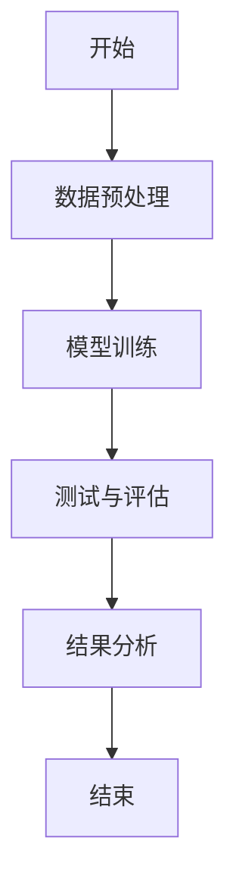
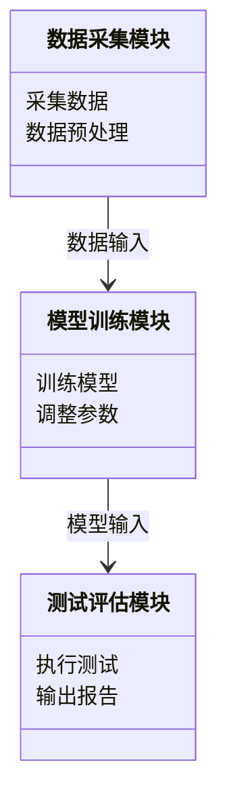
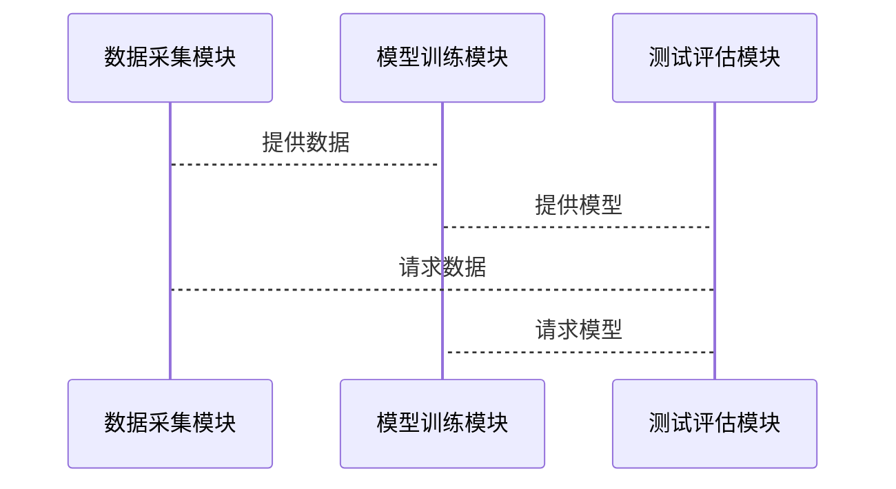

                 


# 《构建AI Agent的测试与评估框架》

> 关键词：AI Agent，测试框架，评估指标，系统架构，算法原理，项目实战

> 摘要：本文系统地探讨了构建AI Agent测试与评估框架的关键步骤和方法，从基本概念、核心算法、系统架构到实际案例，层层深入，为读者提供全面的理论支持和实践指导。

---

# 第一部分: AI Agent 测试与评估框架概述

# 第1章: AI Agent 概述

## 1.1 AI Agent 的基本概念

### 1.1.1 AI Agent 的定义
AI Agent（人工智能代理）是指能够感知环境、自主决策并执行任务的智能体。它通过传感器获取信息，利用推理能力解决问题，并通过执行器与环境互动。

### 1.1.2 AI Agent 的核心特征
- **自主性**：能够在没有外部干预的情况下运行。
- **反应性**：能够实时感知环境并做出反应。
- **目标导向**：具有明确的目标，驱动其行为。
- **可扩展性**：能够适应不同规模和复杂度的任务。

### 1.1.3 AI Agent 的分类与应用场景
- **按智能水平**：
  - 单智能体：简单的任务执行，如自动回复机器人。
  - 多智能体：复杂协作，如自动驾驶系统。
- **按应用领域**：
  - 服务机器人：提供客户服务。
  - 自动交易：金融市场的自动化交易。
  - 智能助手：如Siri、Alexa。

## 1.2 AI Agent 的发展背景

### 1.2.1 人工智能技术的演进
AI Agent的发展得益于深度学习、自然语言处理和强化学习的进步，尤其是大语言模型的崛起，使得AI Agent具备更强的理解和生成能力。

### 1.2.2 大语言模型对 AI Agent 的推动
大语言模型为AI Agent提供了强大的语言理解和生成能力，使其能够更好地与人类交互并执行复杂任务。

### 1.2.3 当前 AI Agent 的研究现状
当前研究主要集中在提高AI Agent的可解释性、安全性和多智能体协作能力。然而，如何平衡效率与准确性的挑战依然存在。

## 1.3 本章小结

### 1.3.1 AI Agent 的核心概念回顾
- AI Agent是具备自主性、反应性和目标导向的智能体。
- 其分类基于智能水平和应用场景。

### 1.3.2 本章内容总结
本章为后续测试与评估框架的构建奠定了基础，介绍了AI Agent的基本概念和发展背景。

---

# 第2章: AI Agent 测试与评估的重要性

## 2.1 测试与评估的必要性

### 2.1.1 AI Agent 的复杂性与不确定性
AI Agent需要处理复杂的环境和不确定性，这使得测试与评估变得至关重要。

### 2.1.2 测试与评估在实际应用中的作用
- **功能验证**：确保AI Agent能够正确执行任务。
- **性能优化**：通过评估发现问题并改进性能。
- **安全性保障**：防止潜在的安全漏洞。

## 2.2 测试与评估的主要挑战

### 2.2.1 多目标平衡的难题
AI Agent需要在多个目标之间找到平衡，例如效率与准确性的权衡。

### 2.2.2 测试数据的获取与处理
高质量的数据是测试与评估的基础，但获取和处理数据往往面临成本和时间的挑战。

### 2.2.3 评估指标的制定与实施
评估指标的选择直接影响测试结果的有效性，制定合理的指标是关键。

## 2.3 标准化测试与评估的意义

### 2.3.1 促进技术进步
标准化测试推动技术进步，促进AI Agent性能的提升。

### 2.3.2 保障应用安全
通过标准化评估，可以确保AI Agent在实际应用中的安全性和可靠性。

### 2.3.3 推动行业规范发展
标准化测试为行业提供了统一的评估标准，促进行业的健康发展。

## 2.4 本章小结

### 2.4.1 测试与评估的核心价值
- 测试与评估是确保AI Agent性能和安全性的关键步骤。
- 标准化测试推动技术进步和行业规范。

### 2.4.2 本章内容总结
本章强调了测试与评估的重要性，并指出了当前面临的主要挑战。

---

# 第3章: AI Agent 测试与评估的核心概念

## 3.1 AI Agent 的核心属性

### 3.1.1 智能性
AI Agent具备理解和处理复杂信息的能力，能够执行复杂的任务。

### 3.1.2 适应性
AI Agent能够根据环境变化调整自己的行为，适应不同的应用场景。

### 3.1.3 可解释性
AI Agent的行为需要能够被人类理解和解释，特别是在安全和伦理方面。

## 3.2 测试与评估的关键维度

### 3.2.1 功能完整性
确保AI Agent能够完成设计中的所有功能。

### 3.2.2 性能指标
包括响应时间、准确率、资源利用率等。

### 3.2.3 安全性与可靠性
评估AI Agent在安全漏洞和系统崩溃情况下的表现。

## 3.3 核心概念的联系与对比

### 3.3.1 AI Agent 属性与测试维度的对应关系
| AI Agent属性 | 测试维度       |
|----------------|----------------|
| 智能性         | 任务完成度     |
| 适应性         | 环境变化应对能力 |
| 可解释性       | 行为可追溯性   |

### 3.3.2 通过表格对比核心概念的特征
通过对比分析，明确不同属性在测试中的具体表现。

## 3.4 核心概念的 ER 实体关系图

```mermaid
erDiagram
    class AI_Agent {
        id
        智能性
        适应性
        可解释性
    }
    class 测试维度 {
        id
        任务完成度
        环境变化应对能力
        行为可追溯性
    }
    AI_Agent --> 测试维度 : "影响"
```

## 3.5 本章小结

### 3.5.1 核心概念的总结
- AI Agent的核心属性包括智能性、适应性和可解释性。
- 测试维度涵盖任务完成度、环境应对能力和行为可追溯性。

### 3.5.2 本章内容总结
本章通过对比分析，明确了AI Agent的核心属性及其在测试中的具体表现。

---

# 第4章: AI Agent 测试与评估的算法原理

## 4.1 测试与评估的算法概述

### 4.1.1 算法的基本流程
1. 数据预处理：清洗和标注测试数据。
2. 模型训练：使用监督学习训练评估模型。
3. 测试与评估：应用测试数据，计算各项指标。

### 4.1.2 算法的关键步骤
- 数据预处理：确保数据的干净和一致性。
- 模型训练：选择合适的算法并调整参数。
- 测试与评估：计算准确率、召回率等指标。

## 4.2 算法的数学模型

### 4.2.1 评估指标的数学表达
准确率：$$\text{准确率} = \frac{\text{正确预测数}}{\text{总预测数}}$$
召回率：$$\text{召回率} = \frac{\text{正确预测数}}{\text{实际正例数}}$$

### 4.2.2 多指标综合评估
通过加权平均或其他方法综合多个指标，例如F1分数：
$$\text{F1分数} = 2 \times \frac{\text{准确率} \times \text{召回率}}{\text{准确率} + \text{召回率}}$$

## 4.3 算法的流程图



## 4.4 算法的Python实现示例

```python
# 示例代码：计算准确率、召回率和F1分数
from sklearn.metrics import accuracy_score, recall_score, f1_score

y_true = [0, 1, 2, 3, 4, 5, 6, 7, 8, 9]
y_pred = [0, 1, 2, 3, 4, 5, 6, 7, 8, 9]

accuracy = accuracy_score(y_true, y_pred)
recall = recall_score(y_true, y_pred, average='macro')
f1 = f1_score(y_true, y_pred, average='macro')

print(f"准确率: {accuracy}")
print(f"召回率: {recall}")
print(f"F1分数: {f1}")
```

## 4.5 本章小结

### 4.5.1 算法原理的总结
- 算法流程包括数据预处理、模型训练和测试评估。
- 使用准确率、召回率和F1分数等指标进行综合评估。

### 4.5.2 本章内容总结
本章详细讲解了AI Agent测试与评估的算法原理，包括数学模型和流程图的实现。

---

# 第5章: AI Agent 测试与评估的系统架构设计

## 5.1 系统架构概述

### 5.1.1 系统模块划分
- 数据采集模块：获取测试数据。
- 模型训练模块：训练评估模型。
- 测试评估模块：执行测试并输出结果。

### 5.1.2 系统功能设计
- 支持多种数据格式的输入。
- 提供灵活的评估指标配置。
- 输出详细的评估报告。

## 5.2 系统架构的领域模型



## 5.3 系统接口设计

### 5.3.1 数据接口
- 输入：测试数据集。
- 输出：处理后的数据集。

### 5.3.2 模型接口
- 输入：训练好的模型。
- 输出：测试结果。

## 5.4 系统交互流程



## 5.5 本章小结

### 5.5.1 系统架构的设计总结
- 系统分为数据采集、模型训练和测试评估三个模块。
- 各模块之间通过明确的接口进行交互。

### 5.5.2 本章内容总结
本章详细描述了AI Agent测试与评估系统的架构设计，包括模块划分和接口设计。

---

# 第6章: AI Agent 测试与评估的项目实战

## 6.1 项目背景介绍

### 6.1.1 项目目标
构建一个可扩展的AI Agent测试与评估框架，能够支持多种应用场景。

### 6.1.2 项目需求
- 支持多数据格式的输入。
- 提供灵活的评估指标配置。
- 输出详细的评估报告。

## 6.2 系统核心实现

### 6.2.1 环境安装
```bash
pip install scikit-learn numpy pandas
```

### 6.2.2 核心代码实现

```python
import pandas as pd
from sklearn.metrics import accuracy_score, recall_score, f1_score

def evaluate_model(y_true, y_pred):
    accuracy = accuracy_score(y_true, y_pred)
    recall = recall_score(y_true, y_pred, average='macro')
    f1 = f1_score(y_true, y_pred, average='macro')
    return {
        '准确率': accuracy,
        '召回率': recall,
        'F1分数': f1
    }

# 示例数据
y_true = [0, 1, 2, 3, 4, 5, 6, 7, 8, 9]
y_pred = [0, 1, 2, 3, 4, 5, 6, 7, 8, 9]

# 调用评估函数
results = evaluate_model(y_true, y_pred)
for key, value in results.items():
    print(f"{key}: {value}")
```

## 6.3 项目实战案例分析

### 6.3.1 案例介绍
以一个简单的分类任务为例，构建AI Agent测试与评估框架。

### 6.3.2 代码实现与解读
- 数据预处理：清洗和标注数据。
- 模型训练：使用监督学习算法训练模型。
- 测试评估：应用测试数据，计算各项指标。

## 6.4 项目小结

### 6.4.1 项目实施总结
- 成功构建了一个可扩展的AI Agent测试与评估框架。
- 通过具体案例展示了框架的应用和实现。

### 6.4.2 经验与教训
- 数据预处理是关键，需要仔细清洗和标注。
- 模型选择和参数调整直接影响评估结果。

---

# 第7章: 总结与展望

## 7.1 总结

### 7.1.1 核心内容回顾
- AI Agent的基本概念和发展背景。
- 测试与评估的重要性及核心概念。
- 算法原理和系统架构设计。
- 项目实战和经验总结。

### 7.1.2 本书内容总结
通过系统的讲解和实战案例，构建了完整的AI Agent测试与评估框架。

## 7.2 展望

### 7.2.1 研究热点
- 提高AI Agent的可解释性。
- 增强多智能体协作能力。

### 7.2.2 技术发展趋势
- 标准化测试与评估框架的推广。
- 结合大语言模型提升AI Agent能力。

## 7.3 本章小结

### 7.3.1 总结部分回顾
- AI Agent测试与评估框架的核心内容。
- 本书的贡献和价值。

### 7.3.2 展望部分总结
- 未来的研究热点和技术发展趋势。

---

# 作者：AI天才研究院 & 禅与计算机程序设计艺术

