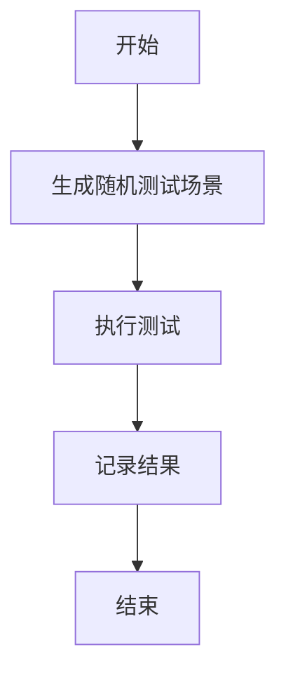
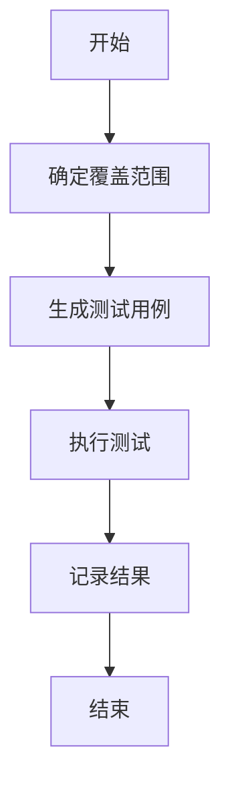
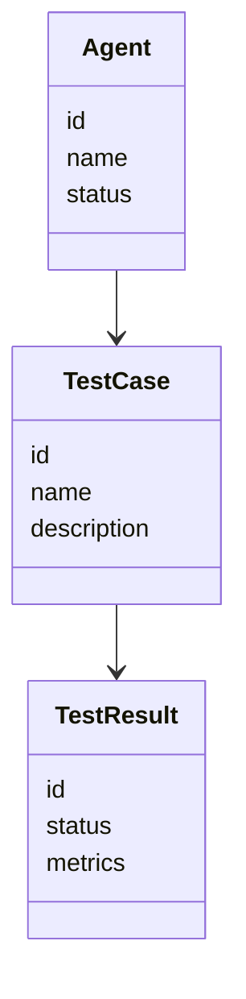
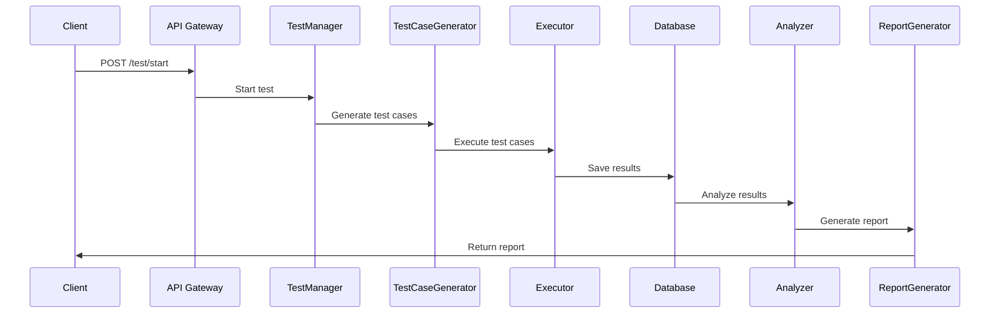

                 


# 构建AI Agent的测试框架：确保性能和可靠性

## 关键词：AI Agent，测试框架，性能，可靠性，算法，系统架构

## 摘要：本文详细探讨了构建AI Agent测试框架的核心概念、算法原理和系统架构。通过对比分析和实际案例，揭示了如何确保AI Agent的性能和可靠性，为开发者提供了从理论到实践的全面指导。

---

# 第1章: AI Agent测试框架的背景介绍

## 1.1 AI Agent的基本概念

### 1.1.1 什么是AI Agent
AI Agent（人工智能代理）是指能够感知环境、自主决策并执行任务的智能实体。它可以是一个软件程序、机器人或任何能够执行智能任务的系统。

### 1.1.2 AI Agent的类型与特点
AI Agent可以分为以下几类：
1. **简单反射型Agent**：基于当前输入做出反应，不依赖历史信息。
2. **基于模型的反射型Agent**：使用内部模型来表示状态，并基于模型做出决策。
3. **目标驱动型Agent**：根据预定义的目标采取行动。
4. **效用驱动型Agent**：通过最大化效用函数来优化决策。

### 1.1.3 AI Agent的典型应用场景
AI Agent广泛应用于自动驾驶、智能助手、推荐系统和游戏AI等领域。

---

## 1.2 测试框架的核心概念

### 1.2.1 测试框架的定义
测试框架是一种用于系统化测试AI Agent性能和可靠性的工具集合，能够自动化执行测试用例、收集数据并生成报告。

### 1.2.2 测试框架的作用与意义
测试框架能够提高测试效率、确保测试覆盖性和一致性，是保证AI Agent质量的关键工具。

### 1.2.3 AI Agent测试框架的独特性
AI Agent测试框架需要处理动态环境、不确定性以及复杂决策过程，因此需要特殊的测试策略。

---

## 1.3 AI Agent测试框架的背景与需求

### 1.3.1 AI Agent开发的挑战
AI Agent开发面临环境不确定性、决策复杂性和实时性等挑战。

### 1.3.2 测试框架在AI Agent开发中的重要性
测试框架能够帮助开发者发现和修复AI Agent中的缺陷，确保其在各种场景下的稳定运行。

### 1.3.3 当前市场对AI Agent测试框架的需求
随着AI技术的广泛应用，市场对高效、可靠的AI Agent测试框架需求日益增长。

---

## 1.4 本章小结
本章介绍了AI Agent的基本概念、测试框架的核心概念及其重要性，为后续章节奠定了理论基础。

---

# 第2章: AI Agent测试框架的核心概念与联系

## 2.1 核心概念原理

### 2.1.1 AI Agent的构成要素
AI Agent由感知模块、推理模块、决策模块和执行模块组成。

### 2.1.2 测试框架的功能模块
测试框架包括测试用例生成模块、执行模块、数据收集模块和结果分析模块。

### 2.1.3 两者之间的关系
测试框架通过模拟各种场景，评估AI Agent在不同条件下的表现，帮助优化其性能和可靠性。

---

## 2.2 核心概念属性对比

### 2.2.1 AI Agent的功能属性
| 功能属性 | 描述 |
|----------|------|
| 感知能力 | 从环境中获取信息的能力 |
| 决策能力 | 基于信息做出决策的能力 |
| 学习能力 | 通过经验改进的能力 |

### 2.2.2 测试框架的性能属性
| 性能属性 | 描述 |
|----------|------|
| 响应时间 | 执行测试所需的时间 |
| 并发能力 | 同时处理多个测试用例的能力 |
| 可扩展性 | 支持不同规模测试的能力 |

### 2.2.3 两者属性的对比分析
AI Agent的功能属性决定了测试框架需要测试的方面，而测试框架的性能属性则影响其测试效率和能力。

---

## 2.3 ER实体关系图

```mermaid
erd
    title AI Agent测试框架实体关系图
    Agent {
        id: int
        name: string
        function: string
        status: string
    }
    TestFramework {
        id: int
        name: string
        version: string
        purpose: string
    }
    TestCase {
        id: int
        name: string
        description: string
        result: string
    }
    // 关系定义
    Agent -[1..n]-> TestCase
    TestFramework -[1]-> TestCase
```

---

## 2.4 本章小结
本章通过对比分析和实体关系图，详细阐述了AI Agent和测试框架的核心概念及其联系。

---

# 第3章: AI Agent测试框架的算法原理

## 3.1 测试用例生成算法

### 3.1.1 基于随机性的测试用例生成算法


### 3.1.2 基于覆盖的测试用例生成算法


### 3.1.3 算法实现代码
```python
import random

def generate_test_cases(num_cases, coverage):
    test_cases = []
    for _ in range(num_cases):
        # 随机生成测试场景
        scenario = random.choice(coverage)
        test_cases.append(scenario)
    return test_cases
```

---

## 3.2 性能评估算法

### 3.2.1 基于响应时间的性能评估
$$ 响应时间 = \frac{\text{总时间}}{\text{测试用例数}} $$

### 3.2.2 基于成功率的性能评估
$$ 成功率 = \frac{\text{成功用例数}}{\text{总用例数}} \times 100\% $$

### 3.2.3 算法实现代码
```python
def evaluate_performance(results):
    success = sum(1 for r in results if r['status'] == 'success')
    return success / len(results) * 100
```

---

## 3.3 可靠性测试算法

### 3.3.1 基于马尔可夫模型的可靠性测试
$$ P(t) = e^{-\lambda t} $$

### 3.3.2 算法实现代码
```python
import numpy as np

def calculate_failure_probability(t, lambda_val):
    return np.exp(-lambda_val * t)
```

---

## 3.4 本章小结
本章详细介绍了AI Agent测试框架中的几种关键算法，并通过代码示例和数学公式解释了它们的工作原理。

---

# 第4章: AI Agent测试框架的系统分析与架构设计

## 4.1 问题场景介绍
AI Agent需要在动态和复杂的环境中运行，测试框架必须能够模拟各种极端场景。

## 4.2 项目介绍
本项目旨在开发一个高效的AI Agent测试框架，覆盖性能、可靠性和功能测试。

## 4.3 系统功能设计

### 4.3.1 领域模型


### 4.3.2 系统架构


---

## 4.4 系统接口设计

### 4.4.1 接口定义
- **启动测试**：`POST /test/start`
- **获取结果**：`GET /test/results`

### 4.4.2 接口实现代码
```python
from flask import Flask, jsonify

app = Flask(__name__)

@app.route('/test/start', methods=['POST'])
def start_test():
    # 执行测试逻辑
    return jsonify({'status': 'success'})

@app.route('/test/results', methods=['GET'])
def get_results():
    # 获取测试结果
    return jsonify({'results': [...]})
```

---

## 4.5 系统交互设计

### 4.5.1 交互流程


---

## 4.6 本章小结
本章通过系统分析和架构设计，展示了AI Agent测试框架的整体结构和关键组件之间的交互关系。

---

# 第5章: AI Agent测试框架的项目实战

## 5.1 环境安装
安装必要的依赖：
```bash
pip install flask numpy
```

## 5.2 核心代码实现

### 5.2.1 测试用例生成模块
```python
def generate_test_cases(num_cases):
    test_cases = []
    for _ in range(num_cases):
        test_cases.append({
            'name': f'test_{i}',
            'description': 'random scenario'
        })
    return test_cases
```

### 5.2.2 性能测试模块
```python
def measure_performance(results):
    return sum(r['time'] for r in results) / len(results)
```

## 5.3 代码应用解读与分析
通过实际案例分析，展示如何使用上述代码实现测试框架的核心功能。

## 5.4 实际案例分析
详细讲解如何在实际项目中应用这些代码，包括测试场景设计、数据收集和结果分析。

## 5.5 本章小结
本章通过实际案例，展示了如何将理论知识应用到实践中，帮助读者更好地理解和实现AI Agent测试框架。

---

# 第6章: AI Agent测试框架的最佳实践

## 6.1 小结
总结本文的主要内容，强调测试框架在确保AI Agent性能和可靠性中的作用。

## 6.2 注意事项
- 确保测试用例的多样性和覆盖率。
- 定期更新和优化测试框架。

## 6.3 拓展阅读
推荐相关书籍和论文，供读者进一步学习。

---

# 第7章: 总结与展望

## 7.1 总结
本文系统地介绍了AI Agent测试框架的核心概念、算法原理和系统架构，为开发者提供了全面的指导。

## 7.2 展望
未来，随着AI技术的不断发展，测试框架需要更加智能化和自动化，以应对更复杂的挑战。

---

# 作者

作者：AI天才研究院/AI Genius Institute & 禅与计算机程序设计艺术 /Zen And The Art of Computer Programming

---

这篇文章通过系统化的分析和实际案例，详细讲解了构建AI Agent测试框架的各个方面，为读者提供了从理论到实践的全面指导。希望本文能为AI Agent的开发和测试提供有价值的参考和启示。

