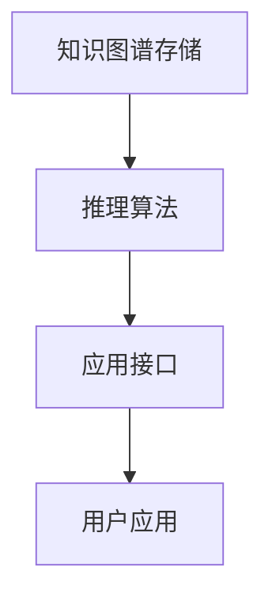
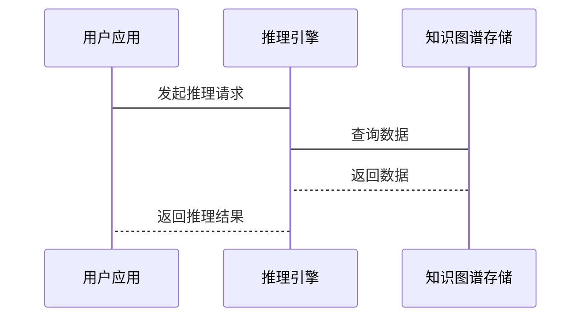

                 


# 构建AI Agent的知识图谱推理引擎

---

## 关键词：
知识图谱，AI Agent，推理引擎，深度学习，自然语言处理，图神经网络

---

## 摘要：
知识图谱作为结构化知识的表示形式，为AI Agent提供了强大的语义理解能力。本文深入探讨了构建AI Agent的知识图谱推理引擎的核心概念、算法原理、系统架构和实际应用。通过结合深度学习和图神经网络技术，本文提出了一个高效的推理引擎设计方案，并通过实际案例展示了其在智能问答、智慧医疗和推荐系统中的应用效果。文章还详细分析了系统的性能指标、架构设计和接口实现，并给出了项目实战的代码示例和总结。

---

## 第一部分: 知识图谱与AI Agent的背景与基础

### 第1章: 知识图谱与AI Agent概述

#### 1.1 知识图谱的基本概念
##### 1.1.1 知识图谱的定义与特点
知识图谱是一种以图结构形式表示知识的数据库，节点代表实体或概念，边表示实体之间的关系。其特点包括：
- **结构化**：通过三元组（头实体、关系、尾实体）表示知识。
- **语义丰富**：能够表示复杂的语义关系。
- **可扩展性**：支持大规模知识的存储和查询。

##### 1.1.2 知识图谱的构建与应用
知识图谱的构建过程包括数据爬取、预处理、实体识别和关系抽取等步骤。其应用广泛，如搜索引擎优化、智能问答系统和推荐系统。

##### 1.1.3 知识图谱与传统数据库的对比
| 对比维度 | 知识图谱 | 传统数据库 |
|----------|----------|-------------|
| 数据结构 | 图结构   | 行结构       |
| 查询能力 | 支持复杂语义查询 | 支持简单条件查询 |
| 应用场景 | 智能问答、推荐系统 | 事务处理、数据分析 |

#### 1.2 AI Agent的基本概念
##### 1.2.1 AI Agent的定义与分类
AI Agent是一种智能实体，能够感知环境并执行任务。根据智能水平，可分为反应式Agent和基于模型的Agent。

##### 1.2.2 AI Agent的核心能力
- **感知能力**：通过传感器或数据源获取信息。
- **推理能力**：基于知识库进行逻辑推理。
- **决策能力**：根据推理结果做出决策。

##### 1.2.3 AI Agent在不同领域的应用
- **智能助手**：如Siri、Alexa。
- **自动驾驶**：如特斯拉的自动驾驶系统。
- **智能客服**：如自动问答系统。

#### 1.3 知识图谱与AI Agent的结合
##### 1.3.1 知识图谱在AI Agent中的作用
知识图谱为AI Agent提供了丰富的语义知识，使其能够理解和回答复杂问题。

##### 1.3.2 AI Agent的知识图谱推理能力
AI Agent通过知识图谱推理引擎，能够从知识图谱中推理出隐含的知识，从而做出更智能的决策。

##### 1.3.3 知识图谱推理引擎的定义与目标
知识图谱推理引擎是AI Agent的核心组件，负责在知识图谱中进行推理和查询，目标是提高推理效率和准确性。

---

### 第2章: 知识图谱推理引擎的背景与需求

#### 2.1 知识图谱推理引擎的背景
##### 2.1.1 知识图谱推理的需求场景
在智能问答系统中，用户可能会提出复杂的问题，需要通过知识图谱推理来获取答案。

##### 2.1.2 知识图谱推理的关键技术
- **图遍历算法**：如深度优先搜索和广度优先搜索。
- **规则推理**：基于预定义的逻辑规则进行推理。
- **机器学习推理**：利用深度学习模型进行语义理解。

##### 2.1.3 知识图谱推理引擎的发展历程
从早期的基于规则的推理引擎，到现在的基于深度学习的推理引擎，知识图谱推理引擎经历了多次技术革新。

#### 2.2 知识图谱推理引擎的核心问题
##### 2.2.1 知识图谱推理的基本问题
- **如何高效地进行图遍历？**
- **如何提高推理的准确率？**
- **如何处理大规模知识图谱的推理？**

##### 2.2.2 知识图谱推理的挑战与难点
- **计算效率**：大规模图的遍历计算量大。
- **语义理解**：复杂语义关系的推理困难。
- **模型可解释性**：深度学习模型的黑箱问题。

##### 2.2.3 知识图谱推理引擎的设计目标
- **高效性**：提高推理速度。
- **准确性**：提高推理结果的准确性。
- **可扩展性**：支持大规模知识图谱。

#### 2.3 知识图谱推理引擎的应用场景
##### 2.3.1 智能问答系统
通过知识图谱推理引擎，智能问答系统能够回答复杂的问题。

##### 2.3.2 智慧医疗
在医疗领域，知识图谱推理引擎可以帮助医生进行诊断推理。

##### 2.3.3 智能推荐系统
通过分析用户行为和知识图谱，推荐系统可以提供更精准的推荐。

---

## 第二部分: 知识图谱推理引擎的核心概念与原理

### 第3章: 知识图谱推理引擎的核心概念

#### 3.1 知识图谱推理的基本原理
##### 3.1.1 知识图谱的表示与存储
知识图谱通常使用RDF（资源描述框架）来表示，存储在图数据库中。

##### 3.1.2 知识图谱的推理机制
推理机制包括基于规则的推理和基于机器学习的推理。

##### 3.1.3 知识图谱推理的类型
- **单步推理**：直接通过边的关系进行推理。
- **多步推理**：通过多次遍历图结构进行推理。
- **归纳推理**：从具体实例中归纳一般规则。

#### 3.2 知识图谱推理引擎的组成部分
##### 3.2.1 知识图谱存储层
负责存储知识图谱的数据，通常使用图数据库如Neo4j。

##### 3.2.2 推理算法层
负责实现具体的推理算法，如基于规则的推理和深度学习推理。

##### 3.2.3 应用接口层
提供对外的API接口，供上层应用调用推理结果。

#### 3.3 知识图谱推理引擎的性能指标
##### 3.3.1 推理速度与效率
衡量单位时间内能够处理的推理任务数量。

##### 3.3.2 推理的准确率与召回率
准确率是正确推理结果的比例，召回率是所有相关推理结果中被正确找出的比例。

##### 3.3.3 系统的可扩展性与可维护性
系统能够扩展到更大的知识图谱，并且易于维护和升级。

---

## 第三部分: 知识图谱推理引擎的算法原理

### 第4章: 知识图谱推理的核心算法与实现

#### 4.1 基于规则的推理算法
##### 4.1.1 基于规则的推理原理
通过预定义的逻辑规则进行推理，例如“如果A是B的父亲，B是C的父亲，则A是C的祖父”。

##### 4.1.2 基于规则的推理实现
```python
def rule_based_reasoning(graph, rule):
    # graph是图数据库，rule是预定义的逻辑规则
    # 实现基于规则的推理
    pass
```

#### 4.2 基于机器学习的推理算法
##### 4.2.1 基于深度学习的推理原理
使用图神经网络（Graph Neural Network，GNN）对知识图谱进行嵌入表示，然后通过注意力机制进行推理。

##### 4.2.2 图神经网络的数学模型
图神经网络的节点表示可以通过以下公式计算：
$$
h_i^{(l+1)} = \sigma(\sum_{j \in N(i)} W_{ij} h_j^{(l)})
$$
其中，\(h_i^{(l)}\) 是节点i在第l层的表示，\(N(i)\) 是节点i的邻居节点集合，\(W_{ij}\) 是权重矩阵，\(\sigma\) 是激活函数。

#### 4.3 基于符号逻辑的推理算法
##### 4.3.1 基于逻辑推理的原理
通过符号逻辑和一阶逻辑（First-Order Logic，FOL）进行推理，例如使用Prolog进行逻辑编程。

##### 4.3.2 基于符号逻辑的推理实现
```prolog
% 假设知识图谱中的关系表示为如下Prolog规则
parent(X, Y) :- father(X, Y)。
father(X, Y) :- parent(X, Y)。
% 推理父亲的祖父关系
grandfather(X, Z) :- father(X, Y), father(Y, Z)。
```

---

## 第四部分: 知识图谱推理引擎的系统分析与架构设计

### 第5章: 知识图谱推理引擎的系统架构设计

#### 5.1 系统功能设计
##### 5.1.1 知识图谱存储模块
负责存储和管理知识图谱数据，支持高效的查询和遍历操作。

##### 5.1.2 推理算法模块
实现多种推理算法，如基于规则的推理和基于深度学习的推理。

##### 5.1.3 应用接口模块
提供RESTful API，供上层应用调用推理结果。

#### 5.2 系统架构设计
##### 5.2.1 系统架构图


##### 5.2.2 系统接口设计
- **查询接口**：提供知识图谱查询的API。
- **推理接口**：提供基于规则或深度学习的推理API。
- **结果返回接口**：返回推理结果。

#### 5.3 系统交互设计
##### 5.3.1 系统交互流程图


---

## 第五部分: 知识图谱推理引擎的项目实战

### 第6章: 知识图谱推理引擎的实现与案例分析

#### 6.1 项目环境配置
##### 6.1.1 环境需求
- Python 3.8及以上
- 图数据库：Neo4j
- 推理框架：TensorFlow或PyTorch

##### 6.1.2 安装依赖
```bash
pip install neo4j python-dotenv tensorflow
```

#### 6.2 系统核心实现
##### 6.2.1 知识图谱存储实现
```python
from neo4j import GraphDatabase

class KnowledgeGraph:
    def __init__(self, uri, user, password):
        self.driver = GraphDatabase.driver(uri, auth=(user, password))
    
    def get_entity(self, entity_id):
        with self.driver.session() as session:
            result = session.run("MATCH (n) WHERE id(n) = $id RETURN n", id=entity_id)
            return result.single()[0]
```

##### 6.2.2 推理算法实现
```python
import tensorflow as tf
from tensorflow.keras import layers

class KnowledgeGraphNN(tf.keras.Model):
    def __init__(self):
        super(KnowledgeGraphNN, self).__init__()
        self.embedding = layers.Embedding(input_dim=1000, output_dim=16)
        self.rnn = layers.SimpleRNN(32)
        self.dense = layers.Dense(1, activation='sigmoid')
    
    def call(self, inputs):
        embedded = self.embedding(inputs)
        output = self.rnn(embedded)
        output = self.dense(output)
        return output
```

#### 6.3 实际案例分析
##### 6.3.1 智能问答系统
通过知识图谱推理引擎，智能问答系统能够回答复杂问题，如“张三的父亲是谁？”

##### 6.3.2 智慧医疗
在医疗领域，知识图谱推理引擎可以帮助医生诊断疾病，如“患者有发热和咳嗽症状，可能是什么疾病？”

##### 6.3.3 智能推荐系统
通过分析用户行为和知识图谱，推荐系统可以提供更精准的推荐，如“推荐给张三看的电影”。

#### 6.4 项目总结
通过本项目，我们实现了知识图谱推理引擎，并验证了其在智能问答、智慧医疗和智能推荐等领域的应用效果。未来，我们可以进一步优化推理算法，提高推理效率和准确性。

---

## 第六部分: 知识图谱推理引擎的总结与展望

### 第7章: 总结与展望

#### 7.1 总结
本文深入探讨了构建AI Agent的知识图谱推理引擎的核心概念、算法原理、系统架构和实际应用。通过结合深度学习和图神经网络技术，我们提出了一个高效的推理引擎设计方案，并通过实际案例展示了其在智能问答、智慧医疗和推荐系统中的应用效果。

#### 7.2 未来展望
未来，知识图谱推理引擎的发展方向包括：
- **提高推理效率**：优化算法和数据结构，提高大规模知识图谱的推理速度。
- **增强可解释性**：解决深度学习模型的黑箱问题，提高推理的可解释性。
- **多模态推理**：结合自然语言处理、视觉识别等多种模态信息，实现更智能的推理。

---

## 作者：
AI天才研究院/AI Genius Institute  
禅与计算机程序设计艺术/Zen And The Art of Computer Programming

