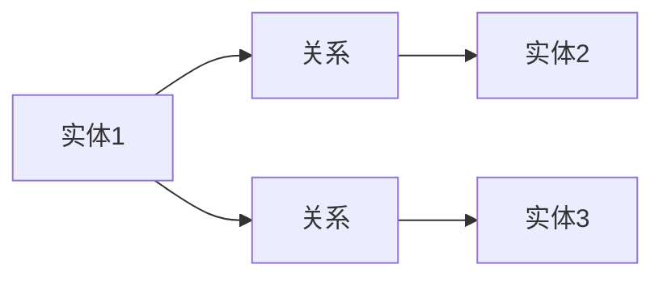
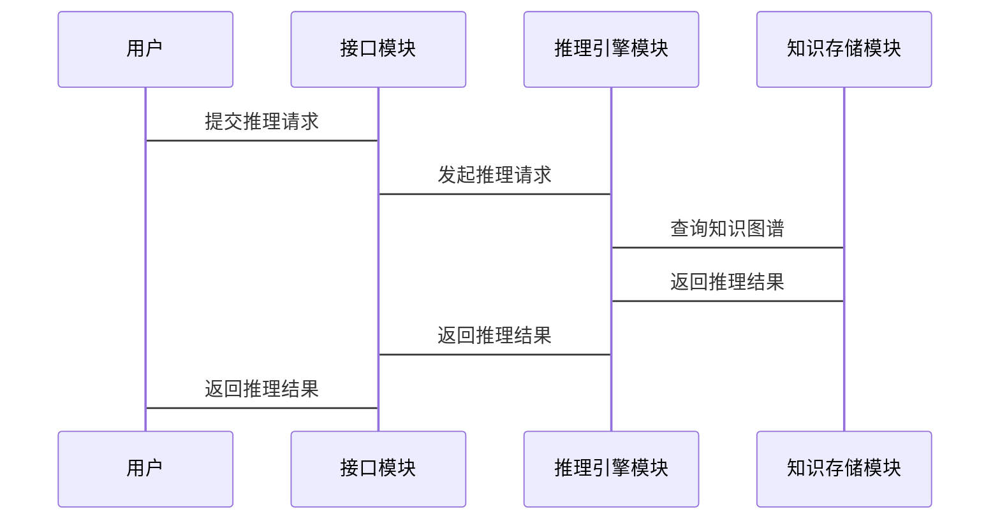

                 

---

# 《构建AI Agent的知识图谱推理引擎优化》

> **关键词**: AI Agent, 知识图谱, 推理引擎, 知识表示, 逻辑推理, 实体关系图

> **摘要**: 本文详细探讨了构建AI Agent的知识图谱推理引擎的优化方法。通过分析知识图谱与AI Agent的结合，阐述了知识图谱推理引擎的核心概念、算法原理、系统架构设计以及实际应用。本文还提供了具体的项目实战案例，从环境搭建到代码实现，再到性能优化和扩展性设计，为读者提供了全面的技术指导。最后，本文总结了构建AI Agent的知识图谱推理引擎的关键点和未来发展方向。

---

# 第一部分: 知识图谱与AI Agent背景介绍

## 第1章: 知识图谱与AI Agent基本概念

### 1.1 知识图谱的定义与特点
知识图谱是一种结构化的数据表示形式，由实体（Entity）和关系（Relation）组成，用于描述现实世界中的概念及其关系。其特点包括：
- **结构化**: 以图的形式表示知识，支持复杂的语义关系。
- **可扩展性**: 支持大规模数据的构建和扩展。
- **语义理解**: 通过上下文理解实体之间的关系。

### 1.2 AI Agent的定义与特点
AI Agent（智能体）是一种能够感知环境、自主决策并执行任务的智能系统。其特点包括：
- **自主性**: 能够独立完成任务，无需外部干预。
- **反应性**: 能够实时感知环境并做出反应。
- **学习能力**: 通过学习提升自身的智能水平。

### 1.3 知识图谱在AI Agent中的作用
知识图谱为AI Agent提供了丰富的知识库，支持其进行推理和决策。通过知识图谱，AI Agent可以理解上下文、推理关系，并做出更智能的决策。

### 1.4 问题背景与解决
- **问题背景**: AI Agent需要依赖知识库进行推理，但传统知识库缺乏语义理解和推理能力。
- **问题描述**: 如何构建高效的推理引擎，使AI Agent能够快速、准确地进行推理。
- **解决方法**: 构建知识图谱推理引擎，通过知识表示和逻辑推理提升AI Agent的能力。

---

## 第2章: 知识图谱与推理引擎的核心概念

### 2.1 知识图谱的表示与推理
知识图谱通过三元组（头实体、关系、尾实体）表示知识，例如 `(中国, 资源充足, 石油)`。推理引擎通过这些三元组进行逻辑推理，例如推断出“中国是石油资源丰富的国家”。

### 2.2 推理引擎的分类
- **基于规则的推理**: 使用预定义的逻辑规则进行推理。
- **基于图的推理**: 基于知识图谱的结构进行推理。
- **基于机器学习的推理**: 使用深度学习模型进行推理。

### 2.3 知识图谱与推理引擎的结合
知识图谱为推理引擎提供知识库，推理引擎为知识图谱提供推理能力。两者结合可以实现更智能的决策。

### 2.4 实体关系图（ER图）
通过Mermaid绘制实体关系图，展示知识图谱中的实体及其关系。

---

# 第二部分: 知识图谱推理引擎的算法原理

## 第3章: 知识图谱的构建与优化

### 3.1 知识抽取与表示
- **知识抽取**: 从文本中提取实体和关系。
- **知识表示**: 使用三元组表示知识，例如 `(A, R, B)`。

### 3.2 知识融合与优化
- **知识融合**: 将多个来源的知识整合到一个知识图谱中。
- **知识优化**: 去除冗余知识，提升知识图谱的质量。

### 3.3 知识图谱的嵌入表示
- **Word2Vec**: 用于将实体和关系表示为向量。
- **GloVe**: 用于全局向量的词嵌入。

### 3.4 知识图谱的存储与索引
- **存储**: 使用图数据库（如Neo4j）存储知识图谱。
- **索引**: 建立索引提升查询效率。

---

## 第4章: 推理引擎的算法实现

### 4.1 前向链推理
- **定义**: 从已知的事实出发，沿着知识图谱进行推理。
- **流程**: 
  1. 从已知事实出发，遍历知识图谱。
  2. 根据关系推理出新的事实。
  3. 返回推理结果。

### 4.2 后向链推理
- **定义**: 从目标事实出发，反向遍历知识图谱。
- **流程**: 
  1. 从目标事实出发，反向遍历知识图谱。
  2. 找到与已知事实相关的推理路径。
  3. 返回推理结果。

### 4.3 知识图谱推理的数学模型
知识图谱推理可以表示为一个图的最短路径问题，目标是找到从起点到终点的最短路径。

$$
\text{最短路径} = \argmin_{p \in P} \text{length}(p)
$$

其中，\( P \) 是所有可能的路径集合，\( \text{length}(p) \) 是路径 \( p \) 的长度。

---

# 第三部分: 系统分析与架构设计

## 第5章: 系统功能设计

### 5.1 功能模块
- **知识抽取模块**: 从文本中提取实体和关系。
- **知识存储模块**: 存储知识图谱。
- **推理引擎模块**: 实现知识图谱的推理功能。
- **接口模块**: 提供API供其他系统调用。

### 5.2 系统架构设计
- **分层架构**: 包括数据层、推理层和接口层。
- **数据层**: 负责知识的存储和索引。
- **推理层**: 负责知识的推理和计算。
- **接口层**: 提供API供外部系统调用。

### 5.3 系统接口设计
- **接口1**: 提供知识抽取功能。
- **接口2**: 提供知识推理功能。
- **接口3**: 提供知识查询功能。

### 5.4 系统交互流程
通过Mermaid绘制系统交互流程图。

---

## 第6章: 项目实战与优化

### 6.1 环境搭建
- **Python版本**: 3.8+
- **依赖库安装**: `pip install neo4j requests`

### 6.2 核心代码实现
- **知识抽取**: 使用自然语言处理库（如spaCy）提取实体和关系。
- **知识存储**: 使用Neo4j存储知识图谱。
- **推理引擎**: 实现前向链推理和后向链推理。

### 6.3 性能优化
- **索引优化**: 在知识存储层建立索引，提升查询效率。
- **缓存优化**: 使用缓存技术减少重复查询。

### 6.4 可扩展性设计
- **分布式存储**: 使用分布式数据库支持大规模数据存储。
- **增量更新**: 支持知识图谱的增量更新。

### 6.5 安全性考虑
- **权限控制**: 对知识图谱的访问权限进行控制。
- **数据加密**: 对敏感数据进行加密存储。

---

## 第7章: 最佳实践与总结

### 7.1 最佳实践
- **性能优化**: 定期优化知识图谱的存储和查询效率。
- **可扩展性**: 设计可扩展的系统架构，支持数据规模的扩展。
- **安全性**: 加强数据的安全性，防止数据泄露。

### 7.2 未来发展方向
- **多模态推理**: 结合图像、语音等多种模态信息进行推理。
- **实时推理**: 提升推理引擎的实时性，支持实时决策。
- **自适应推理**: 实现推理引擎的自适应优化，动态调整推理策略。

---

# 作者信息

**作者**: AI天才研究院/AI Genius Institute & 禅与计算机程序设计艺术 /Zen And The Art of Computer Programming

