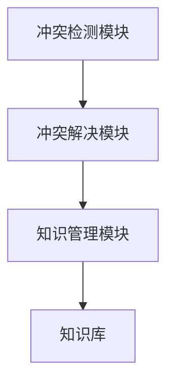

                 


# 构建AI Agent的知识库冲突检测与解决机制

> 关键词：AI Agent，知识库，冲突检测，冲突解决，知识图谱，实体关系，算法原理

> 摘要：构建一个高效的AI Agent需要一个可靠的知识库，而知识库中的冲突检测与解决机制是确保知识库准确性和一致性的关键。本文将深入探讨知识库冲突的背景、核心概念、算法原理、系统设计以及实际应用，为读者提供全面的解决方案。

---

# 第一部分: 知识库冲突的背景与问题描述

## 第1章: 知识库的基本概念与冲突问题

### 1.1 知识库的定义与特点

- **知识库的定义**：知识库是AI Agent的核心数据结构，用于存储和管理各种知识，包括事实、规则、概念和实体关系等。
- **知识库的特点**：
  - **结构化**：知识以层次化或图结构的形式组织。
  - **可扩展性**：支持动态添加和更新知识。
  - **一致性**：确保知识之间的逻辑一致。

### 1.2 知识库在AI Agent中的作用

- **推理与决策**：知识库为AI Agent提供推理的基础。
- **知识表示**：通过符号化表示，使AI Agent能够理解和处理复杂信息。
- **学习与记忆**：知识库支持AI Agent的学习和记忆功能。

### 1.3 知识库冲突的定义与分类

- **冲突的定义**：知识库中存在相互矛盾或不一致的知识。
- **冲突的分类**：
  - **事实冲突**：同一实体的不同属性值冲突（例如，同一人有两个出生日期）。
  - **规则冲突**：不同的规则导致矛盾（例如，规则1要求A成立，规则2要求A不成立）。
  - **语义冲突**：不同知识的语义导致矛盾（例如，同一词在不同上下文中的含义不同）。

---

## 第2章: 知识库冲突的产生原因与影响

### 2.1 知识库来源的多样性

- **多源输入**：知识可能来自不同的数据源，例如传感器数据、外部数据库和用户输入。
- **数据格式差异**：不同数据源可能使用不同的表示方式，导致冲突。

### 2.2 数据更新的不一致性

- **并发更新**：多个用户或系统同时更新知识库，导致版本冲突。
- **时序依赖**：知识的更新顺序可能引发冲突。

### 2.3 知识表示的多样性

- **符号表示**：使用不同的符号或术语表示同一概念。
- **语义歧义**：同一术语在不同上下文中有不同含义。

### 2.4 知识库冲突对AI Agent的影响

- **推理错误**：冲突知识可能导致错误的推理结果。
- **任务失败**：冲突知识可能使AI Agent无法完成任务。
- **用户体验下降**：冲突知识可能导致不一致的响应，影响用户体验。

---

# 第二部分: 知识库冲突检测的核心概念

## 第3章: 冲突检测的基本原理

### 3.1 冲突检测的定义与实现方法

- **定义**：冲突检测是指发现知识库中存在冲突的过程。
- **实现方法**：
  - **基于规则的方法**：使用预定义的规则检测冲突。
  - **基于相似度的方法**：通过计算知识相似度发现冲突。
  - **基于图论的方法**：通过图结构分析冲突。

### 3.2 冲突检测的关键技术

- **冲突检测的属性**：
  - **冲突类型**：事实冲突、规则冲突、语义冲突。
  - **冲突级别**：局部冲突、全局冲突。
  - **冲突影响**：对推理、任务执行和用户体验的影响。

### 3.3 冲突检测的ER实体关系图

```mermaid
er
    entity 知识库 {
        key 知识ID
        attribute 知识内容
        attribute 知识来源
    }
    entity 冲突记录 {
        key 冲突ID
        attribute 冲突知识ID1
        attribute 冲突知识ID2
        attribute 冲突类型
    }
    relationship 冲突检测 {
        知识库 -- 冲突记录
    }
```

---

## 第4章: 冲突检测的算法原理

### 4.1 基于相似度的冲突检测算法

- **算法流程**：
  1. 计算知识对的相似度。
  2. 根据相似度判断是否存在冲突。

### 4.2 基于规则的冲突检测算法

- **规则定义**：预定义规则用于检测特定类型的冲突。
- **规则匹配**：通过规则匹配知识库中的冲突。

### 4.3 基于图论的冲突检测算法

- **图结构表示**：将知识表示为图中的节点和边。
- **冲突检测**：通过图遍历发现矛盾关系。

---

# 第三部分: 知识库冲突解决的算法与系统设计

## 第5章: 冲突解决的核心算法

### 5.1 冲突解决的基本原理

- **冲突消除**：通过修改知识库中的冲突部分消除矛盾。
- **冲突缓解**：通过调整知识权重或引入新知识缓解冲突。

### 5.2 冲突解决的策略

- **优先级规则**：根据知识来源的优先级选择保留的知识。
- **协商机制**：通过协商解决冲突。
- **混合方法**：结合多种方法解决冲突。

---

## 第6章: 系统设计与实现

### 6.1 系统架构设计

- **功能模块**：
  - 冲突检测模块：负责发现知识库中的冲突。
  - 冲突解决模块：负责消除或缓解冲突。
  - 知识管理模块：负责知识的存储和更新。

### 6.2 系统架构图



---

## 第7章: 项目实战与案例分析

### 7.1 环境安装与配置

- **工具安装**：安装必要的开发工具和库。
- **依赖管理**：使用包管理工具管理依赖。

### 7.2 核心代码实现

```python
def detect_conflict(knowledge_base):
    # 检测知识库中的冲突
    pass

def resolve_conflict(conflict_records):
    # 解决冲突
    pass
```

### 7.3 案例分析

- **案例背景**：一个AI Agent的知识库中存在事实冲突。
- **冲突检测**：检测到同一实体的两个不同属性值。
- **冲突解决**：根据优先级选择正确的属性值。

---

## 第8章: 总结与展望

### 8.1 本章总结

- **核心内容回顾**：知识库冲突的背景、检测与解决方法。
- **技术总结**：冲突检测与解决的关键技术和算法。

### 8.2 未来展望

- **研究方向**：更高效、更智能的冲突检测与解决方法。
- **应用场景**：AI Agent在更多领域的应用。

---

作者：AI天才研究院/AI Genius Institute & 禅与计算机程序设计艺术 /Zen And The Art of Computer Programming

