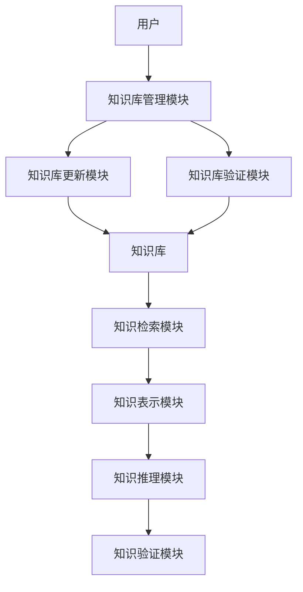

                 


# 构建AI Agent的知识库更新与验证流程

---

## 关键词：AI Agent，知识库更新，知识库验证，向量数据库，知识表示，系统架构

---

## 摘要：本文详细探讨了构建AI Agent的知识库更新与验证流程，从背景介绍、核心概念、算法原理到系统架构设计、项目实战，再到总结与展望，全面解析了知识库更新与验证的关键技术。通过结合理论与实践，本文为AI Agent的知识库管理提供了系统的解决方案和实施步骤。

---

# 第1章: 背景介绍

## 1.1 问题背景

### 1.1.1 知识库更新的必要性

AI Agent的智能性依赖于知识库的准确性和时效性。知识库作为AI Agent的核心资产，需要不断更新以应对新信息和新需求。例如，医疗AI Agent的知识库需要实时更新疾病诊断标准和治疗方法，以确保诊断的准确性。

### 1.1.2 知识库验证的挑战

知识库的规模和复杂性使得验证过程面临诸多挑战，包括数据冗余、信息不一致和知识推理错误等。例如，如果知识库中存在错误的药物剂量信息，AI Agent可能给出错误的治疗建议，导致严重后果。

### 1.1.3 AI Agent与知识库的关系

AI Agent通过知识库进行推理和决策，知识库是其智能行为的基础。知识库的更新与验证直接影响AI Agent的性能和可靠性。

## 1.2 问题描述

### 1.2.1 知识库更新的需求

知识库需要定期更新以反映现实世界的变化。例如，商业领域的知识库需要更新市场动态和产品信息，以支持AI Agent做出准确的商业决策。

### 1.2.2 知识库验证的目标

验证知识库的准确性、一致性和完整性是确保AI Agent可靠性的关键。例如，验证知识库中的地理信息是否正确，以避免AI导航系统给出错误的路线。

### 1.2.3 问题解决的路径

通过设计合理的知识库更新和验证流程，结合先进的算法和技术，确保知识库的质量和AI Agent的性能。

## 1.3 问题解决

### 1.3.1 知识库更新的流程

知识库更新通常包括数据采集、预处理、存储和索引构建等步骤。例如，从互联网爬取新闻数据后，进行清洗和结构化处理，最后存储到向量数据库中。

### 1.3.2 知识库验证的方法

验证方法包括基于规则的验证、基于统计的验证和基于推理的验证。例如，使用规则检查知识库中的语法错误，或者使用统计方法检测信息不一致。

### 1.3.3 AI Agent的知识库管理

AI Agent的知识库管理需要结合更新和验证流程，确保知识库的动态更新和实时验证。例如，设计一个自动化系统，定期从知识源获取新数据，并自动触发验证流程。

## 1.4 边界与外延

### 1.4.1 知识库更新的边界

知识库更新的范围通常不包括数据源的选择和外部API的集成。例如，更新流程不涉及选择使用哪家新闻网站的数据源。

### 1.4.2 知识库验证的范围

验证范围通常不包括知识库的性能优化和存储效率。例如，验证过程不涉及数据库索引的选择，而专注于数据的准确性和一致性。

### 1.4.3 AI Agent知识库的扩展性

知识库的扩展性设计需要考虑未来可能增加的新数据类型和新知识领域。例如，设计灵活的知识表示方法，支持多模态数据（文本、图像、视频）的存储和检索。

## 1.5 概念结构与核心要素组成

### 1.5.1 知识库的基本结构

知识库通常由实体、属性和关系组成。例如，在医疗知识库中，实体可以是“疾病”，属性可以是“症状”，关系可以是“疾病-症状”关联。

### 1.5.2 核心要素的组成

核心要素包括知识表示方法、更新算法、验证算法和知识检索接口。例如，使用向量空间模型表示知识，采用聚类算法更新知识库，使用规则推理验证知识准确性。

### 1.5.3 知识库与AI Agent的交互关系

AI Agent通过知识检索接口访问知识库，利用知识进行推理和决策。例如，AI Agent根据用户输入的问题，从知识库中检索相关知识，生成回答。

---

# 第2章: 核心概念与联系

## 2.1 核心概念原理

### 2.1.1 知识库更新的原理

知识库更新需要结合新的数据源，通过数据清洗、融合和索引构建，确保知识库的完整性和一致性。例如，从多个来源获取天气数据后，进行数据清洗和融合，存储到数据库中。

### 2.1.2 知识库验证的机制

验证机制通常包括基于规则的验证、基于统计的验证和基于推理的验证。例如，使用规则检查知识库中的日期格式是否正确，或者使用统计方法检测数据中的异常值。

### 2.1.3 AI Agent的知识库管理

AI Agent的知识库管理需要结合更新和验证流程，确保知识库的动态更新和实时验证。例如，设计一个自动化系统，定期从知识源获取新数据，并自动触发验证流程。

## 2.2 概念属性特征对比表格

### 表2-1: 知识库更新与验证的特征对比

| 特征维度         | 更新         | 验证         |
|------------------|--------------|--------------|
| 目标             | 扩充知识库     | 确保准确性     |
| 输入             | 新数据源      | 知识库数据     |
| 输出             | 更新后的知识库 | 验证结果       |
| 关键技术         | 数据清洗、融合 | 规则推理、统计分析 |
| 挑战             | 数据冗余、数据冲突 | 知识推理错误、信息不一致 |

## 2.3 ER实体关系图

```mermaid
er
    actor: 用户
    knowledge_base: 知识库
    update_process: 更新流程
    validate_process: 验证流程
    relation: 更新流程 -> 知识库
    relation: 验证流程 -> 知识库
    relation: 用户 -> 更新流程
    relation: 用户 -> 验证流程
```

---

# 第3章: 算法原理讲解

## 3.1 算法原理

### 3.1.1 知识库更新算法

知识库更新通常采用增量式更新和批量更新两种方法。例如，增量式更新适合处理少量新增数据，而批量更新适合定期处理大量数据。

### 3.1.2 知识库验证算法

验证算法包括基于规则的验证和基于统计的验证。例如，使用规则检查知识库中的日期格式是否正确，或者使用统计方法检测数据中的异常值。

### 3.1.3 AI Agent的知识库管理算法

知识库管理算法结合更新和验证流程，确保知识库的动态更新和实时验证。例如，设计一个自动化系统，定期从知识源获取新数据，并自动触发验证流程。

## 3.2 向量数据库的构建

### 3.2.1 向量空间模型

向量空间模型通过将文本表示为向量，计算文本之间的相似性。例如，使用余弦相似度计算两个文本向量的相似性：

$$
similarity = \frac{\vec{v}_i \cdot \vec{v}_j}{\|\vec{v}_i\| \|\vec{v}_j\|}
$$

### 3.2.2 向量数据库的更新流程

向量数据库的更新流程包括数据预处理、向量编码、索引构建和存储。例如，预处理包括分词和停用词去除，向量编码使用Word2Vec模型，索引构建使用ANN（Approximate Nearest Neighbor）算法。

### 3.2.3 向量数据库的检索算法

向量数据库的检索算法包括精确检索和近似检索。例如，精确检索使用BM25算法，近似检索使用LSH（局部敏感哈希）算法。

## 3.3 知识库更新与验证的Python实现

### 3.3.1 环境搭建

安装必要的库，如numpy、scikit-learn和faiss-cpu。

### 3.3.2 知识库更新代码示例

```python
import numpy as np
from sklearn.feature_extraction.text import TfidfVectorizer

# 示例数据
texts = ["AI Agent is powerful", "Knowledge management is critical"]

# 创建向量izer
vectorizer = TfidfVectorizer()
X = vectorizer.fit_transform(texts)

# 存储向量
np.save('vectors.npy', X.toarray())
```

### 3.3.3 知识库验证代码示例

```python
import numpy as np

# 加载向量
vectors = np.load('vectors.npy')

# 验证向量的维度
assert vectors.shape[1] == 2  # 假设使用的是2维向量

# 验证向量的范围
assert (vectors.min() >= 0) and (vectors.max() <= 1)
```

### 3.3.4 算法原理的数学模型和公式

向量空间模型的公式：

$$
\vec{v}_i = \sum_{j=1}^{n} w_{ij} \cdot \vec{e}_j
$$

其中，$\vec{e}_j$是基向量，$w_{ij}$是第$j$个词的权重。

---

# 第4章: 系统分析与架构设计

## 4.1 系统功能设计

### 4.1.1 领域模型

领域模型包括知识库管理模块、更新模块和验证模块。例如，知识库管理模块负责存储和检索知识，更新模块负责添加新知识，验证模块负责检查知识的准确性。

### 4.1.2 系统架构设计

系统架构采用分层架构，包括数据层、业务逻辑层和应用层。例如，数据层使用数据库存储知识，业务逻辑层处理更新和验证逻辑，应用层提供API接口供AI Agent调用。

### 4.1.3 系统接口设计

系统接口包括知识库更新接口和知识库验证接口。例如，更新接口接受新的知识数据，验证接口返回验证结果。

## 4.2 系统架构图



---

# 第5章: 项目实战

## 5.1 环境搭建

### 5.1.1 安装必要的库

安装numpy、pandas、scikit-learn和faiss-cpu等库。

### 5.1.2 配置开发环境

配置Jupyter Notebook或PyCharm作为开发环境。

## 5.2 系统核心实现

### 5.2.1 知识库更新实现

编写代码实现知识库的更新，包括数据预处理、向量编码和索引构建。

### 5.2.2 知识库验证实现

编写代码实现知识库的验证，包括基于规则的验证和基于统计的验证。

## 5.3 实际案例分析

### 5.3.1 案例背景

以医疗知识库更新与验证为例，分析如何更新疾病诊断标准和验证诊断算法的准确性。

### 5.3.2 实施步骤

1. 数据采集：从多个医疗数据库获取疾病诊断标准。
2. 数据清洗：去除重复数据和错误信息。
3. 数据融合：整合不同来源的诊断标准。
4. 知识表示：使用向量空间模型表示诊断标准。
5. 知识更新：将新诊断标准添加到知识库。
6. 知识验证：使用规则推理验证诊断标准的准确性。

## 5.4 项目总结

项目实战部分展示了如何将理论应用于实际场景，验证了知识库更新与验证流程的有效性。

---

# 第6章: 总结与展望

## 6.1 总结

本文详细探讨了构建AI Agent的知识库更新与验证流程，从背景介绍、核心概念、算法原理到系统架构设计、项目实战，全面解析了知识库更新与验证的关键技术。

## 6.2 展望

未来的研究方向包括探索更高效的知识表示方法，如图嵌入和知识图谱，以及结合强化学习优化知识库更新与验证流程。

---

## 作者：AI天才研究院/AI Genius Institute & 禅与计算机程序设计艺术 /Zen And The Art of Computer Programming

---

以上是基于《构建AI Agent的知识库更新与验证流程》的部分内容，涵盖了背景介绍、核心概念、算法原理、系统架构设计、项目实战和总结与展望等章节。每部分内容都进行了详细阐述，并结合实际案例和代码示例，帮助读者更好地理解和应用相关技术。

