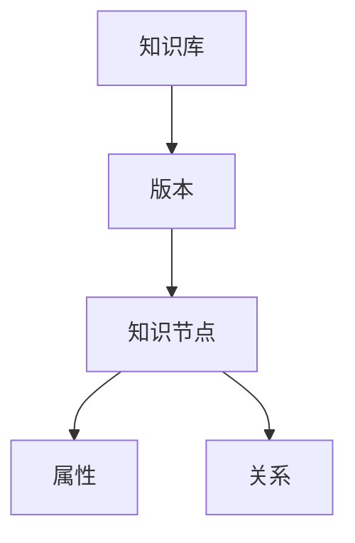
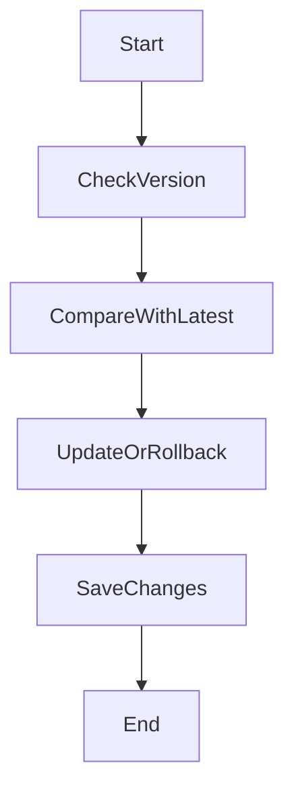
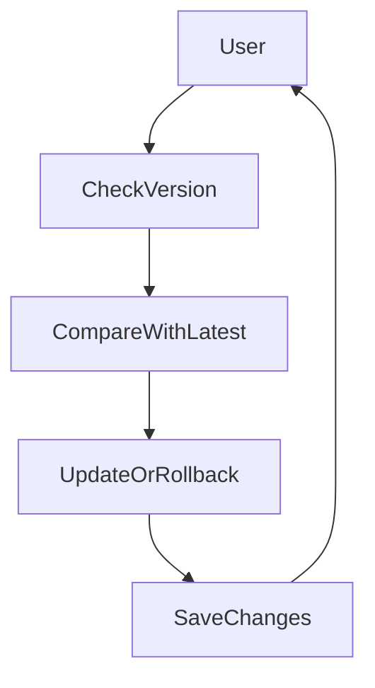
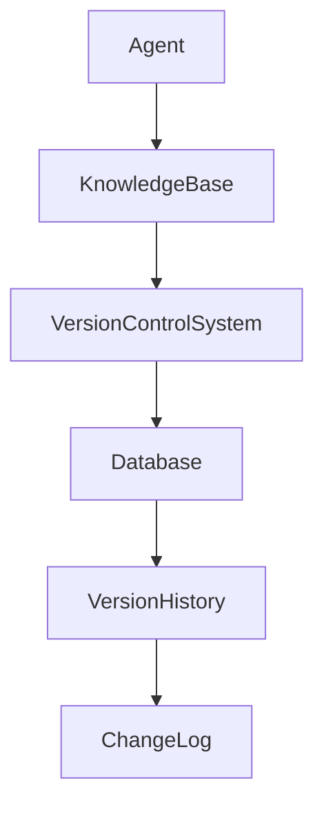

                 


# 构建AI Agent的知识库版本控制系统

## 关键词：AI Agent, 知识库, 版本控制, 系统架构, 算法原理

## 摘要：本文详细探讨了构建AI Agent的知识库版本控制系统的背景、核心概念、算法原理、系统架构设计、项目实战以及最佳实践。文章从问题背景出发，逐步分析了知识库版本控制的必要性，提出了基于领域模型和系统架构的解决方案，并通过具体案例展示了系统的实现过程，最后总结了实施中的注意事项和未来研究方向。

---

# 第一部分: 知识库版本控制的背景与核心概念

## 第1章: 知识库版本控制的背景与问题背景

### 1.1 问题背景

#### 1.1.1 AI Agent与知识库的关系
AI Agent（人工智能代理）是一种能够感知环境并采取行动以实现目标的智能系统。知识库是AI Agent的核心知识存储，包含了AI Agent所需的所有信息，包括事实、规则、目标等。知识库是AI Agent进行推理和决策的基础。

#### 1.1.2 知识库版本控制的必要性
随着AI Agent的应用场景越来越复杂，知识库的内容也在不断更新和扩展。知识库的版本控制变得尤为重要，原因如下：
1. **数据一致性**：确保不同版本的知识库在不同场景下的数据一致性。
2. **可追溯性**：记录知识库的变更历史，以便在出现问题时能够回溯。
3. **协作开发**：多人协作开发知识库时，版本控制是必不可少的工具。
4. **容错性**：在知识库更新过程中，版本控制可以避免数据丢失和冲突。

#### 1.1.3 当前知识库管理的挑战
当前的知识库管理面临以下挑战：
1. **知识冲突**：不同来源的知识可能互相矛盾。
2. **版本混乱**：缺乏统一的版本控制机制，导致知识库的版本混乱。
3. **性能问题**：大规模知识库的版本控制可能影响系统性能。
4. **安全性**：知识库的版本控制需要考虑安全性，防止恶意篡改。

#### 1.1.4 知识库版本控制的边界与外延
知识库版本控制的边界包括：
1. 知识库的内容更新。
2. 知识库的版本记录。
3. 知识库的回滚机制。

知识库版本控制的外延包括：
1. 知识库的备份与恢复。
2. 知识库的访问控制。
3. 知识库的分布与同步。

### 1.2 问题描述

#### 1.2.1 知识库版本控制的核心问题
知识库版本控制的核心问题是如何在保证数据一致性的前提下，实现对知识库的高效管理。具体包括：
1. **版本冲突的检测与解决**。
2. **版本的高效存储与检索**。
3. **版本的同步与共享**。

#### 1.2.2 知识库版本控制的目标
知识库版本控制的目标包括：
1. 确保知识库的正确性和一致性。
2. 提供知识库的可追溯性和可恢复性。
3. 支持多人协作开发。
4. 提供高效的版本检索和比较功能。

#### 1.2.3 知识库版本控制的实现路径
知识库版本控制的实现路径包括：
1. **基于数据库的版本控制**：利用数据库的事务机制实现知识库的版本控制。
2. **基于文件的版本控制**：将知识库的内容存储为文件，利用版本控制系统（如Git）进行管理。
3. **基于分布式系统的版本控制**：利用分布式系统的优势，实现知识库的版本控制。

---

## 第2章: 知识库版本控制的核心概念与联系

### 2.1 核心概念原理

#### 2.1.1 知识库的定义与属性
知识库是一种结构化的数据存储，通常包含以下属性：
1. **实体**：知识库中的基本单位，例如“人物”、“地点”、“事件”等。
2. **属性**：实体的描述，例如“姓名”、“年龄”、“性别”等。
3. **关系**：实体之间的关联，例如“父亲”、“朋友”、“同事”等。

#### 2.1.2 版本控制的基本原理
版本控制是一种记录文件或项目每个变更过程，同时使用户能够回溯、恢复或比较之前版本的手段。知识库的版本控制需要考虑以下方面：
1. **版本号**：每个版本的唯一标识。
2. **变更记录**：记录每个版本的变更内容。
3. **版本比较**：比较不同版本之间的差异。

#### 2.1.3 AI Agent的知识库更新机制
AI Agent的知识库更新机制包括：
1. **主动更新**：AI Agent根据需求主动更新知识库。
2. **被动更新**：外部系统触发知识库的更新。
3. **增量更新**：仅更新知识库的部分内容。

### 2.2 核心概念对比表

| 比较维度 | 知识库 | 传统数据库 |
|----------|--------|------------|
| 数据结构 | 结构化数据 | 结构化数据 |
| 数据一致性 | 高 | 高 |
| 可扩展性 | 高 | 中 |
| 版本控制 | 需要 | 通常需要 |

---

### 2.3 ER实体关系图



---

# 第三部分: 知识库版本控制的算法原理

## 第3章: 知识库版本控制的算法原理

### 3.1 算法原理概述

#### 3.1.1 知识库版本控制的基本算法
知识库版本控制的基本算法包括：
1. **版本号生成算法**：为每个版本生成唯一的标识。
2. **变更记录算法**：记录每个版本的变更内容。
3. **版本比较算法**：比较不同版本之间的差异。

#### 3.1.2 算法的核心思想
算法的核心思想是通过记录每个版本的变更内容，实现对知识库的高效管理。具体包括：
1. **变更检测**：检测知识库的变更内容。
2. **变更记录**：记录变更内容。
3. **版本恢复**：根据记录恢复到指定版本。

#### 3.1.3 算法的实现步骤
1. **初始化版本号**：为知识库的初始版本分配一个初始版本号。
2. **检测变更**：检测知识库的变更内容。
3. **记录变更**：将变更内容记录到变更日志中。
4. **生成新版本号**：为新版本分配新的版本号。
5. **版本恢复**：根据需要恢复到指定版本。

### 3.2 算法流程图



---

### 3.3 数学模型与公式

#### 3.3.1 版本号生成算法
版本号生成算法可以采用递增的方式，公式为：
$$ version_{n+1} = version_n + 1 $$

#### 3.3.2 变更记录算法
变更记录算法可以采用哈希函数，公式为：
$$ hash(content) = H(content) $$

其中，$H$ 是哈希函数。

#### 3.3.3 版本比较算法
版本比较算法可以通过比较两个版本的哈希值来实现。如果两个版本的哈希值相同，则表示内容相同；否则，表示内容不同。

---

## 第4章: 知识库版本控制的系统架构设计

### 4.1 系统功能设计

#### 4.1.1 系统功能模块
知识库版本控制系统主要包括以下几个功能模块：
1. **版本管理模块**：负责版本号的生成和管理。
2. **变更记录模块**：负责记录知识库的变更内容。
3. **版本比较模块**：负责比较不同版本之间的差异。
4. **版本恢复模块**：负责根据需要恢复到指定版本。

#### 4.1.2 系统功能流程图



### 4.2 系统架构设计

#### 4.2.1 系统架构设计原理
知识库版本控制系统的架构设计需要考虑以下方面：
1. **数据存储**：知识库的内容和版本信息需要存储在数据库中。
2. **数据一致性**：确保不同版本的知识库在数据上的一致性。
3. **性能优化**：优化系统的性能，提高版本控制的效率。

#### 4.2.2 系统架构设计图



---

## 第5章: 知识库版本控制的项目实战

### 5.1 项目环境安装

#### 5.1.1 环境要求
知识库版本控制系统的运行环境要求如下：
1. **操作系统**：Windows、Linux、macOS。
2. **编程语言**：Python 3.6以上版本。
3. **依赖库**：Git、数据库（MySQL、PostgreSQL等）。

#### 5.1.2 安装步骤
1. 安装Python和pip。
2. 安装Git。
3. 安装数据库。
4. 安装项目依赖库：
   ```bash
   pip install pymysql gitpython
   ```

---

### 5.2 系统核心实现

#### 5.2.1 核心代码实现

```python
class VersionControlSystem:
    def __init__(self, database_config):
        self.database = DatabaseHandler(database_config)

    def create_new_version(self, current_version):
        self.database.update_version(current_version + 1)

    def record_change(self, change_content):
        self.database.insert_change_log(change_content)

    def compare_versions(self, version1, version2):
        return self.database.get_diff(version1, version2)

    def rollback_version(self, target_version):
        self.database.rollback_to_version(target_version)
```

---

### 5.3 案例分析与实现

#### 5.3.1 案例分析
假设我们有一个知识库，包含以下内容：
- 版本1：{'name': 'Alice', 'age': 20}
- 版本2：{'name': 'Alice', 'age': 21}

我们需要比较版本1和版本2的差异，并将版本2回滚到版本1。

#### 5.3.2 实现步骤
1. 初始化版本号：
   ```python
   vcs = VersionControlSystem({'host': 'localhost', 'user': 'root', 'password': 'password', 'database': 'knowledge_base'})
   vcs.create_new_version(1)
   ```

2. 记录变更：
   ```python
   change_content = {'age': 21}
   vcs.record_change(change_content)
   ```

3. 比较版本：
   ```python
   diff = vcs.compare_versions(1, 2)
   print(diff)  # 输出 {'age': 21}
   ```

4. 回滚版本：
   ```python
   vcs.rollback_version(1)
   ```

---

## 第6章: 知识库版本控制的最佳实践

### 6.1 小结

---

## 附录

### 附录A: 术语表

---

## 参考文献

---

作者：AI天才研究院/AI Genius Institute & 禅与计算机程序设计艺术 /Zen And The Art of Computer Programming

