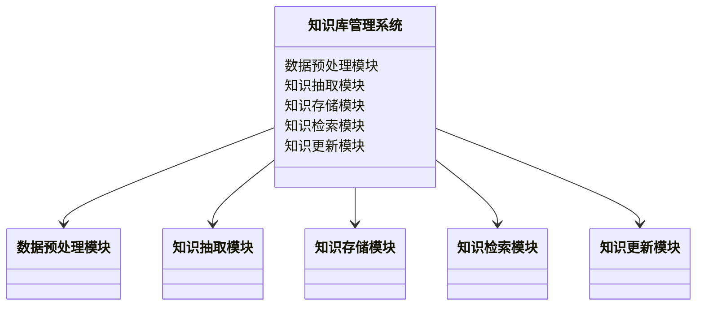
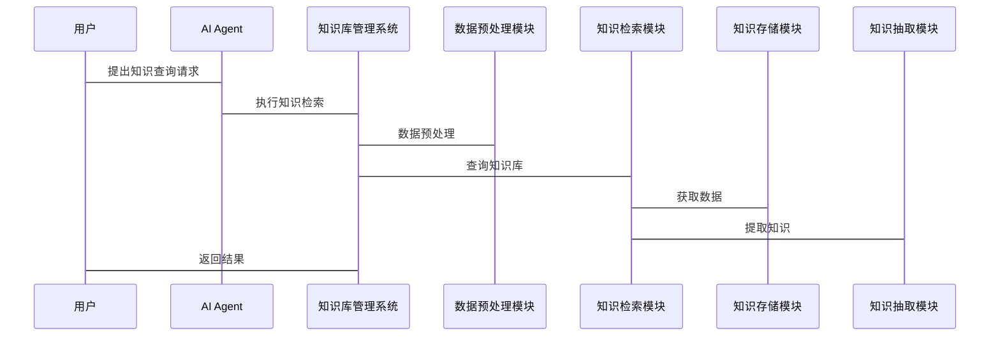

                 


# 构建AI Agent的知识库管理系统

## 关键词：AI Agent, 知识库, 管理系统, 系统架构, 算法原理, 项目实战

## 摘要：
本文详细探讨了构建AI Agent的知识库管理系统的各个方面。从背景介绍到核心概念，从算法原理到系统架构设计，再到项目实战，层层深入，全面解析如何有效管理AI Agent所需的知识库。通过具体案例分析和代码实现，帮助读者掌握构建高效知识库管理系统的技能。

---

# 第1章: AI Agent与知识库管理系统的背景介绍

## 1.1 问题背景
### 1.1.1 当前AI Agent的发展现状
AI Agent（智能代理）正在快速发展，广泛应用于自动驾驶、智能助手、推荐系统等领域。然而，AI Agent的能力高度依赖知识库，知识库的管理成为核心挑战。

### 1.1.2 知识库管理在AI Agent中的重要性
知识库是AI Agent理解和决策的基础。高效的 knowledge management 可以显著提升AI Agent的性能和响应速度。

### 1.1.3 传统知识库管理的局限性
传统知识库管理存在数据分散、难以扩展、缺乏智能化等问题，难以满足AI Agent的需求。

## 1.2 问题描述
### 1.2.1 AI Agent的知识需求
AI Agent需要快速获取、理解和应用知识，知识库管理必须支持高效查询和动态更新。

### 1.2.2 知识库管理的核心问题
如何构建一个高效、可扩展的知识库，同时支持AI Agent的实时需求。

### 1.2.3 知识库与AI Agent的结合挑战
知识库需要与AI Agent的推理、学习能力无缝结合，同时支持多种数据格式和接口。

## 1.3 问题解决
### 1.3.1 知识库管理的目标
构建一个支持AI Agent的知识库管理系统，实现知识的高效存储、查询和更新。

### 1.3.2 AI Agent的知识获取与应用
通过知识库管理系统，AI Agent可以快速获取所需知识，并应用于实际场景。

### 1.3.3 知识库管理的优化方向
优化知识存储结构、提升查询效率、增强知识关联性等。

## 1.4 边界与外延
### 1.4.1 知识库管理的边界
知识库管理仅限于数据存储和查询，不涉及数据生成和外部系统集成。

### 1.4.2 AI Agent的知识库管理与相关概念的区分
区分知识库管理与数据仓库、数据库管理等概念，明确知识库管理的独特性。

### 1.4.3 知识库管理的外延应用
知识库管理可以扩展到数据挖掘、机器学习模型训练等领域。

## 1.5 概念结构与核心要素组成
### 1.5.1 知识库管理系统的组成要素
包括数据存储、查询引擎、知识建模、知识更新等模块。

### 1.5.2 AI Agent与知识库的关系
AI Agent通过知识库获取知识，知识库为AI Agent提供决策支持。

### 1.5.3 知识库管理的核心功能
知识存储、知识组织、知识检索、知识更新等。

## 1.6 本章小结
本章介绍了AI Agent与知识库管理系统的背景，明确了知识库管理的重要性及其核心问题，为后续章节奠定了基础。

---

# 第2章: 知识库管理系统的核心概念与联系

## 2.1 核心概念原理
### 2.1.1 知识库的定义与特征
知识库是结构化数据的集合，支持高效查询和语义理解。

### 2.1.2 AI Agent的知识需求与知识库的关系
AI Agent需要知识库提供结构化、语义化的知识，以支持其推理和决策。

### 2.1.3 知识库管理系统的功能模块
包括数据预处理、知识抽取、知识存储、知识检索、知识更新等功能。

## 2.2 核心概念属性特征对比
### 2.2.1 知识库与数据库的对比
| 特性 | 数据库 | 知识库 |
|------|--------|--------|
| 数据结构 | 结构化数据 | 结构化+语义化数据 |
| 查询方式 | SQL查询 | 基于语义的查询 |
| 应用场景 | 数据统计、分析 | 知识推理、智能决策 |

### 2.2.2 知识库与语料库的对比
| 特性 | 语料库 | 知识库 |
|------|--------|--------|
| 数据类型 | 文本数据 | 结构化数据 |
| 处理方式 | 文本挖掘 | 知识抽取、推理 |
| 应用场景 | 信息提取 | 知识检索、决策支持 |

### 2.2.3 知识库与图数据库的对比
| 特性 | 图数据库 | 知识库 |
|------|--------|--------|
| 数据存储 | 图结构数据 | 多模态数据 |
| 查询方式 | 图遍历查询 | 基于语义的查询 |
| 应用场景 | 关系分析 | 知识推理、智能问答 |

## 2.3 ER实体关系图
```mermaid
er
actor: 用户
agent: AI Agent
knowledge_base: 知识库
role: 角色
action: 行为
```

## 2.4 本章小结
本章详细分析了知识库管理系统的核心概念及其与其他系统的区别，通过对比和图示帮助读者更好地理解知识库管理的特点。

---

# 第3章: 知识库管理系统的算法原理

## 3.1 算法原理概述
知识库管理系统的算法主要涉及知识抽取、知识表示、知识检索和知识推理。

## 3.2 知识抽取算法
### 3.2.1 知识抽取的数学模型
$$ \text{知识抽取} = \argmax_{c} P(c | t) $$
其中，$c$ 是概念，$t$ 是文本。

### 3.2.2 知识抽取的实现步骤
1. 文本预处理（分词、句法分析）。
2. 实体识别（NER）。
3. 关系抽取。
4. 知识表示（图结构或向量表示）。

## 3.3 知识表示算法
### 3.3.1 向量空间模型
使用词袋模型或TF-IDF对文本进行向量化表示。

### 3.3.2 知识图谱表示
使用图嵌入（Graph Embedding）方法，如TransE、TransH等。

## 3.4 知识检索算法
### 3.4.1 基于向量的相似度计算
$$ \text{相似度} = \frac{\vec{a} \cdot \vec{b}}{|\vec{a}| |\vec{b}|} $$
其中，$\vec{a}$和$\vec{b}$是两个向量的表示。

### 3.4.2 基于图的最短路径搜索
使用广度优先搜索（BFS）或深度优先搜索（DFS）在知识图谱中找到最短路径。

## 3.5 算法实现
### 3.5.1 知识抽取的Python代码实现
```python
from transformers import pipeline

nlp = pipeline("ner")
text = "The capital of France is Paris."
result = nlp(text)
print(result)
```

### 3.5.2 知识图谱构建的代码实现
```python
from kg_loader import load_kg
kg = load_kg("example.kg")
```

## 3.6 本章小结
本章详细介绍了知识库管理系统的算法原理，包括知识抽取、表示和检索的实现方法，并通过代码示例帮助读者理解。

---

# 第4章: 系统分析与架构设计方案

## 4.1 问题场景介绍
构建一个支持AI Agent的知识库管理系统，需要考虑数据来源、存储结构、查询性能等问题。

## 4.2 系统功能设计
### 4.2.1 领域模型设计


### 4.2.2 系统架构设计


### 4.2.3 系统接口设计
系统提供RESTful API接口，支持HTTP请求。

### 4.2.4 系统交互设计


## 4.3 本章小结
本章详细分析了系统架构设计，包括功能模块、架构图和交互流程图，为后续实现提供了清晰的指导。

---

# 第5章: 项目实战

## 5.1 环境安装
安装必要的Python库，如numpy、pandas、transformers等。

## 5.2 核心代码实现
### 5.2.1 知识抽取模块
```python
from transformers import pipeline

nlp = pipeline("ner")
text = "The capital of France is Paris."
result = nlp(text)
print(result)
```

### 5.2.2 知识存储模块
```python
import sqlite3

conn = sqlite3.connect("knowledge.db")
cursor = conn.cursor()
cursor.execute("CREATE TABLE entities (id INTEGER PRIMARY KEY, name TEXT, type TEXT)")
conn.commit()
conn.close()
```

### 5.2.3 知识检索模块
```python
import sqlite3

conn = sqlite3.connect("knowledge.db")
cursor = conn.cursor()
cursor.execute("SELECT * FROM entities WHERE name = 'Paris'")
results = cursor.fetchall()
print(results)
conn.close()
```

## 5.3 代码解读与分析
详细解读上述代码，分析每个模块的功能及其在系统中的作用。

## 5.4 实际案例分析
通过构建一个简单的问答系统，展示知识库管理系统的实际应用。

## 5.5 项目小结
总结项目实现的关键点和经验教训，为读者提供实践指导。

---

# 第6章: 最佳实践与总结

## 6.1 最佳实践
### 6.1.1 知识库设计
建议使用图数据库或知识图谱来存储复杂关系。

### 6.1.2 算法选择
根据具体需求选择合适的算法，如使用BERT进行文本表示。

## 6.2 小结
构建AI Agent的知识库管理系统需要综合考虑知识抽取、表示、检索和更新等环节，通过合理的系统架构设计和高效的算法实现，可以显著提升系统的性能。

## 6.3 注意事项
- 确保数据质量和一致性。
- 定期更新知识库以保持其准确性。
- 注意数据安全和隐私保护。

## 6.4 拓展阅读
推荐相关书籍和论文，帮助读者深入学习知识库管理和AI Agent的知识。

---

# 作者：AI天才研究院/AI Genius Institute & 禅与计算机程序设计艺术 /Zen And The Art of Computer Programming

