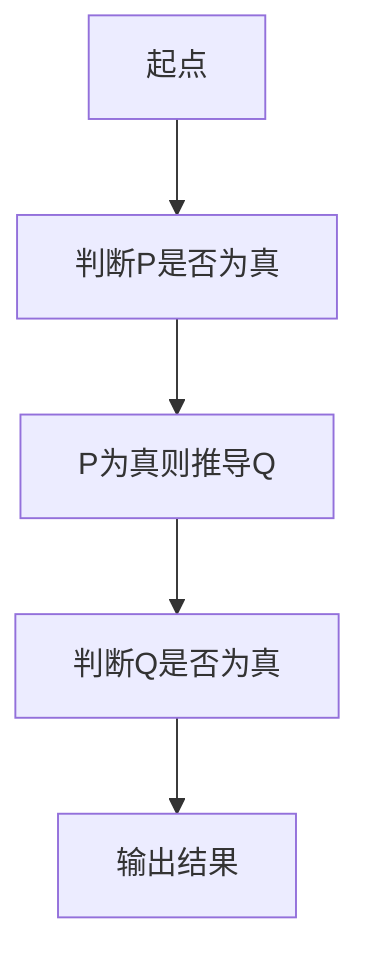
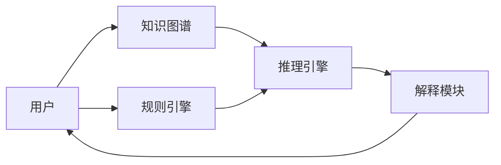

                 


# 《构建AI Agent的知识推理可解释性框架》

---

## 关键词：  
AI Agent，知识推理，可解释性框架，知识图谱，规则引擎，逻辑推理

---

## 摘要：  
本文系统地探讨了构建AI Agent的知识推理可解释性框架的核心问题。首先，我们从背景出发，分析了知识推理在AI Agent中的重要性，以及可解释性框架的需求和挑战。接着，我们深入讲解了知识图谱和规则引擎等核心概念，分析了它们在知识推理中的作用和联系。随后，我们详细阐述了基于知识图谱的推理算法原理，包括知识表示、推理规则和不确定性处理。之后，我们从系统架构的角度，探讨了AI Agent的知识推理系统的整体设计和实现方案。最后，通过一个实际案例，展示了如何将理论应用于实践，并总结了构建可解释性框架的关键点和未来发展方向。

---

## 第一部分：背景介绍

### 第1章：知识推理与可解释性框架的背景

#### 1.1 问题背景  
知识推理是AI Agent实现智能决策的核心能力，但其复杂性和不确定性常常导致推理过程缺乏透明性，难以被人类理解和验证。这使得可解释性成为构建可靠AI Agent的关键需求。  

#### 1.2 问题描述  
- **知识表示**：如何将现实世界中的信息有效地表示为计算机可处理的形式？  
- **推理规则**：如何设计推理规则以支持从已知事实到目标结论的推导？  
- **可解释性**：如何确保推理过程和结果能够被人类理解和验证？  

#### 1.3 问题解决  
通过构建知识图谱和可解释性框架，我们可以实现知识的结构化表示、推理过程的透明化以及推理结果的可验证性。  

#### 1.4 边界与外延  
- **边界**：本框架仅关注知识推理部分，不涉及感知和学习。  
- **外延**：可扩展至多模态数据处理和动态知识更新。  

---

## 第二部分：核心概念与联系

### 第2章：知识图谱与知识表示

#### 2.1 知识图谱的定义与特点  
- **定义**：知识图谱是一种图结构，由实体和关系组成，用于表示知识的语义网络。  
- **特点**：  
  1. **层次化**：支持多粒度的知识表示。  
  2. **语义丰富**：通过关系和属性描述实体的语义信息。  
  3. **动态性**：支持实时更新和扩展。  

#### 2.2 知识图谱的构建过程  
- **数据收集与预处理**：从多种来源（文本、数据库等）获取数据，并进行清洗和结构化。  
- **实体识别与关系抽取**：通过自然语言处理技术识别实体及其关系。  
- **知识融合与优化**：消除冲突，优化知识图谱的结构和质量。  

#### 2.3 知识图谱的存储与查询  
- **存储方式**：常用图数据库（如Neo4j）或分布式存储系统。  
- **查询语言**：使用SPARQL进行基于图的查询。  
- **查询优化**：通过索引和缓存技术提升查询效率。  

#### 2.4 知识图谱与可解释性  
通过知识图谱的可视化和语义解释，可以实现推理过程的可解释性。  

#### 2.5 ER实体关系图  
```mermaid
erDiagram
    actor 用户 {
        string 用户ID
        string 用户名
        string 密码
    }
    actor 实体 {
        string 实体ID
        string 实体类型
        string 实体名称
    }
    actor 关系 {
        string 关系ID
        string 关系名称
        string 关系类型
    }
    用户 --> 实体 : 管理
    用户 --> 关系 : 定义
    实体 --> 关系 : 参与
```

---

### 第3章：规则引擎与逻辑推理

#### 3.1 规则引擎的定义与作用  
- **定义**：规则引擎是一种用于定义、管理和执行规则的软件组件。  
- **作用**：通过规则引擎，可以实现知识推理中的条件判断和决策逻辑。  

#### 3.2 逻辑推理的基本原理  
- **命题逻辑**：通过真值逻辑进行简单推理。  
- **谓词逻辑**：通过谓词和量词描述复杂关系。  
- **推理规则**：基于规则库进行正向或反向推理。  

#### 3.3 可解释性规则设计  
- **规则的可解释性**：规则应清晰、简洁，便于人类理解和验证。  
- **规则的可扩展性**：支持动态添加和修改规则。  

#### 3.4 规则引擎与知识图谱的结合  
通过规则引擎，可以实现基于知识图谱的动态推理。  

---

## 第三部分：算法原理

### 第4章：基于知识图谱的推理算法

#### 4.1 知识表示与推理规则  
- **知识表示**：使用知识图谱中的实体和关系表示事实。  
- **推理规则**：定义规则以推导新的事实。  

#### 4.2 推理算法的数学模型  
- **基本逻辑**：$P \rightarrow Q$，表示如果P为真，则Q也为真。  
- **复杂推理**：通过多步推理，如$P \rightarrow Q$，$Q \rightarrow R$，从而推导出$P \rightarrow R$。  

#### 4.3 推理过程中的不确定性处理  
- **概率推理**：使用贝叶斯网络进行概率计算。  
- **模糊推理**：通过模糊逻辑处理模糊信息。  

#### 4.4 算法实现  


---

## 第四部分：系统分析与架构设计

### 第5章：系统架构设计

#### 5.1 问题场景介绍  
- **目标**：构建一个支持知识推理的AI Agent系统。  
- **需求**：支持知识表示、推理和解释。  

#### 5.2 系统功能设计  
- **知识图谱构建**：支持实体和关系的定义与管理。  
- **规则引擎**：支持规则的定义和执行。  
- **推理引擎**：支持基于知识图谱的推理。  
- **解释模块**：提供推理过程和结果的可解释性。  

#### 5.3 系统架构图  


---

## 第五部分：项目实战

### 第6章：项目实现

#### 6.1 环境安装  
- **依赖项**：安装Python、Neo4j、Flask等。  

#### 6.2 核心代码实现  
```python
from neo4j import GraphDatabase
from flask import Flask, request, jsonify

app = Flask(__name__)

# 知识图谱操作类
class KnowledgeGraph:
    def __init__(self, uri):
        self.graph = GraphDatabase(uri)
    
    def add_entity(self, entity_type, entity_name):
        # 实体添加逻辑
        pass
    
    def add_relation(self, entity1, relation, entity2):
        # 关系添加逻辑
        pass

# API路由
@app.route('/api/add_entity', methods=['POST'])
def add_entity():
    data = request.json
    kg.add_entity(data['type'], data['name'])
    return jsonify({'status': 'success'})

if __name__ == '__main__':
    kg = KnowledgeGraph("bolt://localhost:7687")
    app.run()
```

---

## 第六部分：总结与展望

### 第7章：总结与展望

#### 7.1 最佳实践  
- **可解释性设计**：确保规则和知识表示的透明性。  
- **动态更新**：支持实时更新知识图谱和规则。  

#### 7.2 小结  
本文系统地探讨了构建AI Agent的知识推理可解释性框架的核心问题，提出了基于知识图谱和规则引擎的解决方案，并通过实际案例展示了实现过程。  

#### 7.3 注意事项  
- 确保数据质量和完整性。  
- 定期更新知识图谱以适应变化。  

---

## 作者：  
AI天才研究院 & 禅与计算机程序设计艺术

