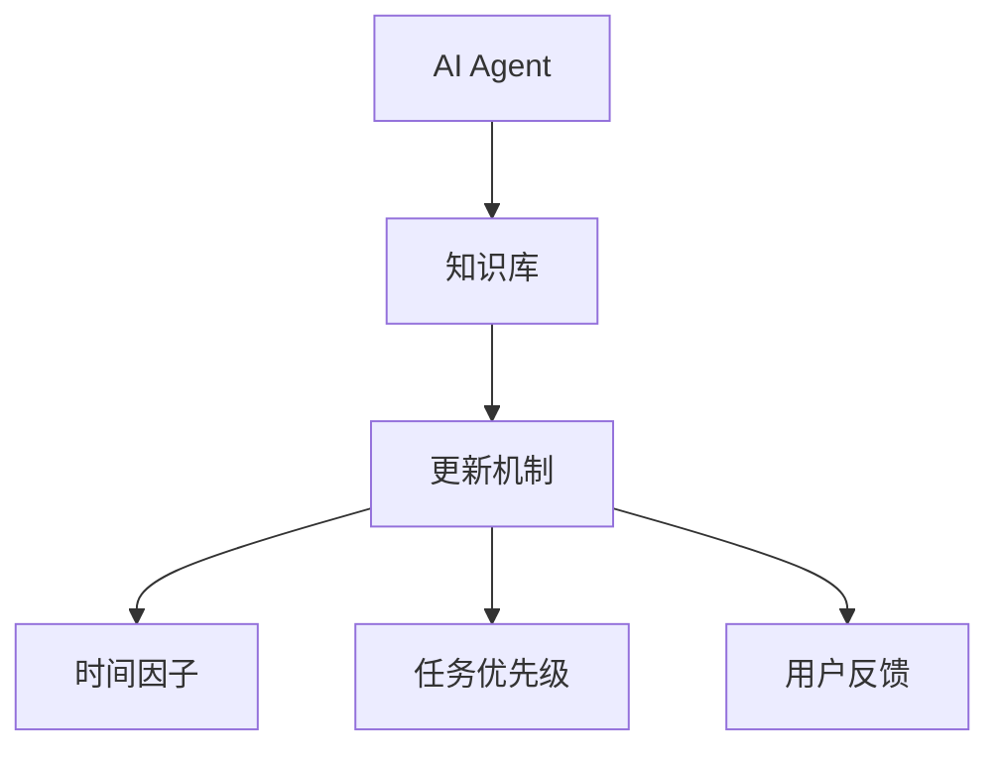
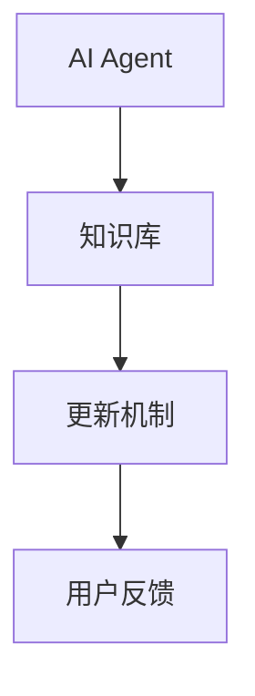

                 


# 构建AI Agent的知识更新机制：保持信息时效性

---

## 关键词：
- AI Agent
- 知识更新机制
- 信息时效性
- 基于时间的遗忘机制
- 强化学习策略
- 知识蒸馏技术

---

## 摘要：
本文详细探讨了AI Agent的知识更新机制，重点分析了如何保持信息的时效性。文章从背景与概念入手，逐步深入到算法原理、系统设计、项目实战以及最佳实践，系统性地介绍了知识更新机制的核心原理和实现方法。通过具体案例分析和代码实现，帮助读者掌握AI Agent的知识更新机制，确保其在实际应用中的高效性和准确性。

---

# 第一部分: 知识更新机制的背景与概念

## 第1章: 知识更新机制的背景与问题描述

### 1.1 知识更新机制的背景

#### 1.1.1 信息时效性的概念
信息的时效性是指信息在特定时间内的有效性或相关性。随着环境的变化，旧的知识可能不再适用，新的知识需要不断补充和更新。AI Agent作为一种智能体，需要具备动态适应环境的能力，而知识更新机制是其实现这一能力的核心。

#### 1.1.2 AI Agent的核心需求
- **动态适应性**：AI Agent需要根据环境的变化调整自己的行为和决策。
- **实时性**：AI Agent需要快速响应和处理实时信息。
- **准确性**：AI Agent的知识库需要保持高精度，以确保决策的正确性。

#### 1.1.3 知识更新机制的重要性
知识更新机制是AI Agent实现动态适应和实时决策的关键。它能够确保AI Agent的知识库始终保持最新状态，从而提高其在复杂环境中的表现。

### 1.2 问题背景与问题描述

#### 1.2.1 信息过时的问题
AI Agent的知识库可能会因为环境的变化而变得过时，导致决策错误。例如，在动态市场环境中，价格、政策等信息的变化会影响AI Agent的决策。

#### 1.2.2 知识更新的必要性
为了应对环境的变化，AI Agent需要定期更新其知识库，以保持信息的准确性。否则，过时的知识会导致决策失误，影响系统的性能。

#### 1.2.3 知识更新的边界与外延
- **边界**：知识更新的范围和频率需要根据具体场景和任务需求来确定。
- **外延**：知识更新不仅包括新增信息，还包括对已有知识的修正和优化。

### 1.3 知识更新机制的核心概念

#### 1.3.1 知识更新的定义与特点
知识更新是指通过一定的机制，动态地补充、修正和删除知识库中的信息，以保持知识库的准确性和时效性。

#### 1.3.2 知识更新的核心要素
- **更新频率**：知识更新的周期，例如实时更新、定期更新等。
- **更新策略**：选择哪些知识需要更新，例如基于时间的遗忘机制、基于任务的优先级等。
- **更新方式**：知识更新的具体实现方法，例如增量式更新、全量式更新等。

#### 1.3.3 知识更新的实现方式
- **基于时间的遗忘机制**：根据知识的使用时间，自动遗忘过时的知识。
- **基于任务的更新策略**：根据任务需求，优先更新相关知识。
- **基于反馈的优化方法**：根据用户反馈，动态调整知识库的内容。

## 1.4 本章小结
本章介绍了知识更新机制的背景、问题背景以及核心概念。知识更新机制是AI Agent保持信息时效性的关键，其实现需要考虑更新频率、策略和方式。

---

# 第二部分: 知识更新机制的核心概念与联系

## 第2章: 知识更新机制的核心原理

### 2.1 知识更新机制的原理

#### 2.1.1 基于时间的遗忘机制
基于时间的遗忘机制是一种常见的知识更新方法。它通过设定遗忘因子，随着时间的推移，逐渐减少旧知识的权重，最终将旧知识遗忘。

- **数学模型**：
$$\text{遗忘因子} \alpha \in (0, 1)$$
$$\text{新权重} = \alpha \times \text{旧权重}$$

- **实现步骤**：
  1. 确定遗忘因子α。
  2. 对每个时间步，更新知识的权重。
  3. 当权重小于阈值时，删除知识。

#### 2.1.2 基于任务的更新策略
基于任务的更新策略是一种根据任务需求动态更新知识的方法。它可以根据任务的重要性，优先更新相关知识。

- **实现步骤**：
  1. 分析任务需求，确定需要更新的知识点。
  2. 根据优先级排序，选择需要更新的知识。
  3. 更新知识库中相关内容。

#### 2.1.3 基于反馈的优化方法
基于反馈的优化方法是一种通过用户反馈调整知识库内容的方法。它可以根据用户的反馈，动态优化知识库的结构和内容。

- **实现步骤**：
  1. 收集用户反馈。
  2. 分析反馈内容，确定需要调整的知识点。
  3. 根据反馈优化知识库内容。

### 2.2 知识更新机制的属性特征对比

#### 2.2.1 不同更新策略的对比分析
| 更新策略 | 特点 | 优点 | 缺点 |
|----------|------|------|------|
| 基于时间的遗忘机制 | 时间驱动 | 简单易实现 | 可能忽略重要信息 |
| 基于任务的更新策略 | 任务驱动 | 高效精准 | 需要任务需求分析 |
| 基于反馈的优化方法 | 用户驱动 | 精细化优化 | 实时性较差 |

#### 2.2.2 更新频率与精度的平衡
- **低频更新**：更新频率低，但精度高。
- **高频更新**：更新频率高，但精度可能较低。

#### 2.2.3 更新机制的可扩展性
- **可扩展性**：知识更新机制应具备良好的可扩展性，能够适应知识库规模的变化。

### 2.3 知识更新机制的ER实体关系图



## 2.4 本章小结
本章详细讲解了知识更新机制的核心原理，包括基于时间的遗忘机制、基于任务的更新策略以及基于反馈的优化方法。通过对比分析，帮助读者理解不同更新策略的优缺点。

---

# 第三部分: 知识更新机制的算法原理

## 第3章: 知识更新算法的实现原理

### 3.1 基于时间的遗忘机制

#### 3.1.1 前向传播过程
- **输入**：当前知识状态。
- **输出**：更新后的知识状态。

#### 3.1.2 后向传播过程
- **损失函数**：衡量更新前后的知识差异。
- **优化器**：更新模型参数。

#### 3.1.3 遗忘机制的数学模型
$$\text{新权重} = \alpha \times \text{旧权重}$$
其中，$\alpha$ 是遗忘因子，$0 < \alpha < 1$。

#### 3.1.4 实现代码
```python
def update_with_forget(knowledge, alpha):
    updated_knowledge = {}
    for key, value in knowledge.items():
        updated_value = alpha * value
        if updated_value < 0.1:  # 阈值判断
            updated_knowledge[key] = None
        else:
            updated_knowledge[key] = updated_value
    return updated_knowledge
```

### 3.2 基于强化学习的知识更新策略

#### 3.2.1 强化学习的基本原理
- **状态**：环境的状态。
- **动作**：AI Agent的行为。
- **奖励**：环境对AI Agent行为的反馈。

#### 3.2.2 策略网络的构建
- **输入层**：环境状态。
- **隐藏层**：处理输入信息。
- **输出层**：输出动作概率。

#### 3.2.3 知识更新策略的数学模型
$$Q(s, a) = \beta \times Q(s, a) + (1-\beta) \times r$$
其中，$\beta$ 是策略参数，$r$ 是奖励值。

#### 3.2.4 实现代码
```python
import numpy as np

class QNetwork:
    def __init__(self, input_dim, output_dim):
        self.weights = np.random.randn(input_dim, output_dim)
    
    def forward(self, state):
        return np.dot(state, self.weights)
    
    def update(self, Q_prev, reward, beta=0.9):
        Q_new = beta * Q_prev + (1-beta) * reward
        return Q_new
```

### 3.3 基于知识蒸馏的知识更新技术

#### 3.3.1 知识蒸馏的基本原理
- **教师模型**：提供指导信息。
- **学生模型**：学习教师模型的知识。

#### 3.3.2 知识蒸馏的实现步骤
1. 训练教师模型。
2. 使用教师模型的输出作为学生模型的标签。
3. 优化学生模型的参数。

#### 3.3.3 知识蒸馏的数学模型
$$\text{学生模型损失} = \lambda \times (\text{学生模型输出} - \text{教师模型输出})^2$$
其中，$\lambda$ 是蒸馏系数。

#### 3.3.4 实现代码
```python
def distillation_loss(student_output, teacher_output, temp=2):
    loss = (student_output - teacher_output) ** 2 / temp ** 2
    return loss.mean()
```

---

# 第四部分: 知识更新机制的系统设计与实现

## 第4章: 知识更新系统的架构设计

### 4.1 系统功能设计

#### 4.1.1 系统模块划分
- **知识库模块**：存储和管理知识。
- **更新机制模块**：实现知识的更新。
- **反馈模块**：收集用户反馈。

#### 4.1.2 系统功能流程
1. 知识库模块提供初始知识。
2. 更新机制模块根据需求更新知识。
3. 反馈模块收集用户反馈，优化知识库。

### 4.2 系统架构设计

#### 4.2.1 系统架构图


#### 4.2.2 系统接口设计
- **接口1**：知识库接口。
  - 输入：知识内容。
  - 输出：更新后的知识。
- **接口2**：反馈接口。
  - 输入：用户反馈。
  - 输出：优化后的知识。

#### 4.2.3 系统交互流程
1. AI Agent调用知识库接口获取知识。
2. 更新机制模块根据需求更新知识。
3. 反馈模块收集用户反馈，优化知识库。
4. 知识库模块更新知识内容。

### 4.3 本章小结
本章详细设计了知识更新系统的架构，包括模块划分、功能流程和系统交互流程。

---

# 第五部分: 知识更新机制的项目实战

## 第5章: 知识更新机制的项目实现

### 5.1 环境安装与配置

#### 5.1.1 安装依赖
- Python 3.6+
- NumPy
- TensorFlow
- Mermaid

#### 5.1.2 环境配置
```bash
pip install numpy tensorflow mermaid
```

### 5.2 知识更新系统的实现

#### 5.2.1 知识库模块实现
```python
class KnowledgeBase:
    def __init__(self):
        self.knowledge = {}
    
    def add_knowledge(self, key, value):
        self.knowledge[key] = value
    
    def update_knowledge(self, key, value):
        self.knowledge[key] = value
    
    def get_knowledge(self, key):
        return self.knowledge.get(key, None)
```

#### 5.2.2 更新机制模块实现
```python
class UpdateMechanism:
    def __init__(self, knowledge_base):
        self.knowledge_base = knowledge_base
    
    def update_with_forget(self, alpha=0.9):
        knowledge = self.knowledge_base.get_all_knowledge()
        updated_knowledge = {}
        for key, value in knowledge.items():
            updated_value = alpha * value
            if updated_value < 0.1:
                updated_knowledge[key] = None
            else:
                updated_knowledge[key] = updated_value
        self.knowledge_base.update_all_knowledge(updated_knowledge)
```

#### 5.2.3 反馈模块实现
```python
class FeedbackModule:
    def __init__(self, knowledge_base):
        self.knowledge_base = knowledge_base
    
    def collect_feedback(self, feedback):
        self.knowledge_base.update_knowledge(feedback.key, feedback.value)
```

### 5.3 项目实战案例分析

#### 5.3.1 案例背景
假设我们有一个智能客服AI Agent，需要实时更新产品信息。

#### 5.3.2 知识库初始化
```python
knowledge_base = KnowledgeBase()
knowledge_base.add_knowledge("product1", {"name": "Product A", "price": 100})
knowledge_base.add_knowledge("product2", {"name": "Product B", "price": 200})
```

#### 5.3.3 知识更新过程
```python
update_mechanism = UpdateMechanism(knowledge_base)
update_mechanism.update_with_forget(alpha=0.8)
```

#### 5.3.4 用户反馈
```python
feedback_module = FeedbackModule(knowledge_base)
feedback_module.collect_feedback(Feedback(key="product1", value={"name": "Product A Updated", "price": 120}))
```

#### 5.3.5 更新后的知识库
```python
print(knowledge_base.get_all_knowledge())
# 输出：
# {
#     "product1": {"name": "Product A Updated", "price": 120},
#     "product2": {"name": "Product B", "price": 200}
# }
```

### 5.4 本章小结
本章通过具体案例展示了知识更新机制的实现过程，包括环境配置、模块实现以及案例分析。

---

# 第六部分: 知识更新机制的最佳实践与总结

## 第6章: 最佳实践与总结

### 6.1 最佳实践

#### 6.1.1 知识更新机制的选择
- 根据需求选择合适的更新策略。
- 结合任务需求和反馈信息。

#### 6.1.2 知识更新的性能优化
- 使用高效的算法。
- 并行计算。

#### 6.1.3 知识更新的安全性
- 数据加密。
- 权限控制。

### 6.2 小结与展望

#### 6.2.1 本章小结
知识更新机制是AI Agent保持信息时效性的关键，其实现需要考虑更新频率、策略和方式。

#### 6.2.2 未来展望
- 更智能的更新策略。
- 更高效的更新算法。
- 更广泛的应用场景。

### 6.3 注意事项

#### 6.3.1 更新频率与精度的平衡
- 避免过于频繁的更新导致精度下降。
- 避免过于低频的更新导致信息过时。

#### 6.3.2 更新机制的可扩展性
- 确保知识更新机制能够适应知识库规模的变化。

### 6.4 拓展阅读
- 《Reinforcement Learning: Theory and Algorithms》
- 《Neural Networks and Deep Learning》
- 《Knowledge Management: Concepts, Strategies and Implementations》

---

# 作者：
AI天才研究院/AI Genius Institute  
禅与计算机程序设计艺术/Zen And The Art of Computer Programming

