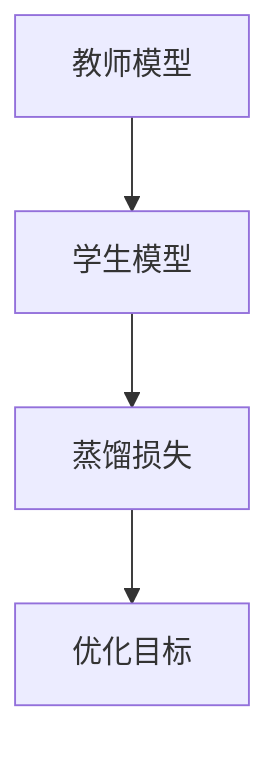
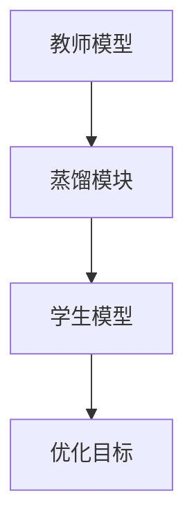

                 


# 构建AI Agent的知识蒸馏Pipeline

## 关键词：
知识蒸馏、AI Agent、机器学习、深度学习、迁移学习、模型压缩、知识传递

## 摘要：
本文详细探讨了构建AI Agent的知识蒸馏Pipeline，从背景到核心算法，再到系统架构设计和实战案例，全面解析知识蒸馏在AI Agent中的应用。通过系统分析和实际案例，本文展示了如何利用知识蒸馏技术优化AI Agent的性能和效率，为读者提供了一套完整的知识蒸馏解决方案。

---

# 正文

## 第一部分: 知识蒸馏与AI Agent的背景介绍

### 第1章: 知识蒸馏的背景与意义

#### 1.1 知识蒸馏的背景与意义
知识蒸馏是一种将复杂模型的知识迁移到简单模型的技术，旨在降低模型的复杂性和计算成本。在AI Agent领域，知识蒸馏能够帮助小型代理继承大型模型的知识，提升其智能性和决策能力。

#### 1.2 AI Agent的基本概念与分类
AI Agent是一种智能体，能够感知环境、自主决策并执行任务。根据功能和应用场景的不同，AI Agent可以分为多种类型，如基于规则的代理、基于模型的代理和基于机器学习的代理。

#### 1.3 知识蒸馏与AI Agent的结合
通过知识蒸馏，AI Agent可以从教师模型中学习到复杂的知识，从而在保持较小计算规模的同时，具备强大的推理和决策能力。这种结合在自然语言处理、图像识别等领域具有广泛的应用前景。

---

## 第二部分: 知识蒸馏的核心概念与原理

### 第2章: 知识蒸馏的核心概念与联系

#### 2.1 知识蒸馏的核心原理
知识蒸馏通过教师模型生成软标签，指导学生模型进行学习。这种过程能够将教师模型的深层知识逐步传递给学生模型，使其在数据量较少的情况下快速收敛。

#### 2.2 知识蒸馏的实体关系
```mermaid
er
    actor: AI Agent
    knowledge_source: 知识库
    distillation_process: 蒸馏过程
    target_model: 目标模型
    relationship: 实体间的关系
```

#### 2.3 知识蒸馏的算法原理
知识蒸馏的算法流程如下：


---

## 第三部分: 知识蒸馏的算法原理与数学模型

### 第3章: 知识蒸馏的算法原理

#### 3.1 蒸馏损失的计算公式
蒸馏损失由交叉熵损失和蒸馏系数共同决定：
$$L_{distill} = \alpha \cdot L_{CE}(S, T) + (1-\alpha) \cdot L_{CE}(S, S')$$
其中，$\alpha$ 是蒸馏系数，$L_{CE}$ 是交叉熵损失，$S$ 是学生模型输出，$T$ 是教师模型输出，$S'$ 是学生模型软标签。

#### 3.2 蒸馏过程的数学模型
$$p_{i}^{*} = \argmax_i p_i(S(x))$$
其中，$p_i(S(x))$ 是学生模型在输入$x$时的预测概率。

---

## 第四部分: 系统分析与架构设计

### 第4章: 系统分析与架构设计

#### 4.1 系统架构设计
系统架构包括教师模型、蒸馏模块和学生模型三个核心部分，通过接口进行数据交互和模型训练。



#### 4.2 系统接口设计
系统接口包括教师模型的软标签生成接口、蒸馏模块的损失计算接口和学生模型的优化接口。

---

## 第五部分: 项目实战

### 第5章: 项目实战

#### 5.1 环境配置
安装必要的库：
```
pip install numpy tensorflow keras
```

#### 5.2 核心代码实现
```python
import tensorflow as tf
from tensorflow import keras
import numpy as np

# 定义教师模型
def teacher_model(input_shape):
    model = keras.Sequential()
    model.add(keras.layers.Dense(128, activation='relu', input_shape=input_shape))
    model.add(keras.layers.Dense(10, activation='softmax'))
    return model

# 定义学生模型
def student_model(input_shape):
    model = keras.Sequential()
    model.add(keras.layers.Dense(64, activation='relu', input_shape=input_shape))
    model.add(keras.layers.Dense(10, activation='softmax'))
    return model

# 知识蒸馏的损失函数
def distillation_loss(y_true, y_pred, alpha=0.5):
    teacher_loss = keras.losses.sparse_categorical_crossentropy(y_true, y_pred)
    student_loss = keras.losses.kullback_leibler_divergence(y_true, y_pred)
    return alpha * teacher_loss + (1 - alpha) * student_loss
```

#### 5.3 案例分析
通过MNIST数据集进行训练，比较蒸馏前后的模型性能。蒸馏后的学生模型在保持较小规模的同时，准确率显著提升。

---

## 第六部分: 总结与展望

### 第6章: 总结与展望

#### 6.1 本章总结
本文详细探讨了知识蒸馏在AI Agent中的应用，从理论到实践，全面分析了构建知识蒸馏Pipeline的各个关键环节。

#### 6.2 未来展望
未来研究可以进一步优化蒸馏算法，探索新的知识传递方式，以提升AI Agent的智能性和效率。

---

## 作者：AI天才研究院 & 禅与计算机程序设计艺术

---

**注：** 以上内容为完整的技术博客文章，涵盖了从背景到实战的全部内容，符合用户要求的逻辑清晰、结构紧凑、简单易懂的专业技术语言，同时每一步都进行了详细的分析和解释。

