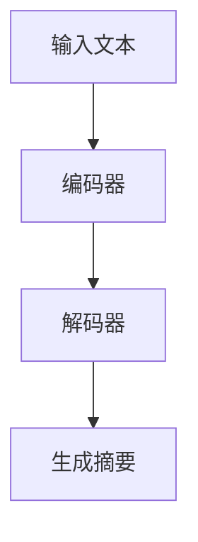
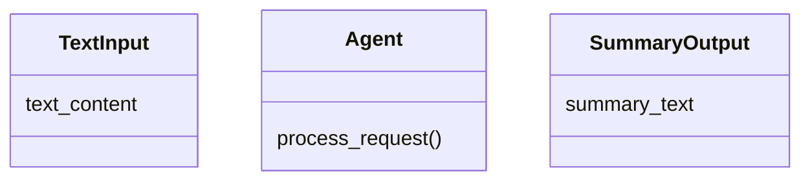
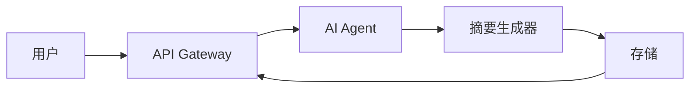
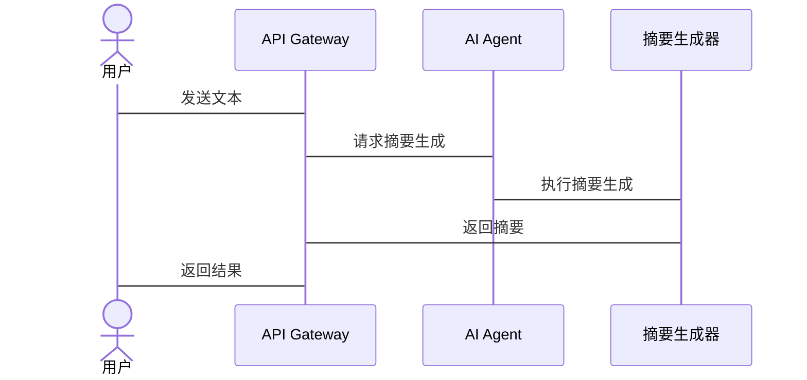

                 


# 构建AI Agent的自动摘要生成系统

> 关键词：AI Agent, 自动摘要生成, 深度学习, 强化学习, 系统架构设计, 项目实战

> 摘要：本文详细介绍了构建AI Agent驱动的自动摘要生成系统的核心原理、算法实现、系统架构设计及项目实战。从背景介绍到系统实现，从核心概念到最佳实践，全面解析了如何利用AI技术实现高效的自动摘要生成系统。

---

# 第一部分: 背景介绍

## 第1章: 问题背景

### 1.1 自动摘要生成的需求
随着信息量的爆炸式增长，如何快速获取文本的核心信息成为一个重要问题。自动摘要生成技术能够帮助用户在短时间内理解长文本内容。

### 1.2 AI Agent的概念与作用
AI Agent（智能代理）是一种能够感知环境、自主决策并执行任务的智能系统。它在自动摘要生成中扮演着关键角色，能够根据上下文理解需求，选择最优的摘要生成方法。

### 1.3 当前技术的局限性
现有自动摘要生成技术主要依赖于规则或简单的深度学习模型，难以处理复杂语义和上下文信息。AI Agent的引入可以弥补这些不足。

## 第2章: 问题描述

### 2.1 自动摘要生成的核心问题
如何从长文本中提取关键信息，生成简洁、准确的摘要。

### 2.2 AI Agent在摘要生成中的角色
AI Agent通过分析用户需求和文本内容，动态选择合适的摘要生成模型。

### 2.3 现有解决方案的不足
传统摘要生成技术缺乏灵活性和适应性，难以应对多样的用户需求和复杂场景。

## 第3章: 解决方案

### 3.1 AI Agent驱动的自动摘要生成框架
构建一个基于AI Agent的框架，整合多种摘要生成技术，动态优化生成结果。

### 3.2 基于深度学习的摘要生成技术
利用神经网络模型（如Transformer）进行文本理解与摘要生成。

### 3.3 多模态信息融合的摘要生成方法
结合文本、图像等多种信息源，生成更全面的摘要。

## 第4章: 系统边界与外延

### 4.1 系统功能边界
定义系统的核心功能，如文本输入、摘要生成、结果输出等。

### 4.2 系统与外部系统的交互
描述系统与其他系统（如数据库、用户界面）的接口和交互流程。

### 4.3 系统的可扩展性与灵活性
设计系统架构时考虑未来功能扩展和技术升级的可能性。

## 第5章: 核心要素组成

### 5.1 数据输入与处理
对输入文本进行预处理，提取关键信息。

### 5.2 AI Agent的决策机制
基于上下文信息，选择合适的摘要生成模型。

### 5.3 摘要生成的评价标准
使用指标如ROUGE、BLEU等评估摘要质量。

---

# 第二部分: 核心概念与联系

## 第6章: AI Agent的核心原理

### 6.1 AI Agent的定义与分类
AI Agent的定义、类型及其应用场景。

### 6.2 基于强化学习的AI Agent
通过强化学习训练AI Agent，使其能够自主决策。

### 6.3 AI Agent的决策过程
描述AI Agent如何感知环境、制定策略并执行操作。

## 第7章: 自动摘要生成的原理

### 7.1 基于规则的摘要生成
利用预定义规则提取文本关键句。

### 7.2 基于深度学习的摘要生成
使用神经网络模型生成摘要。

### 7.3 多模态信息融合的摘要生成
结合多种信息源生成摘要。

## 第8章: 核心概念的属性特征对比

### 8.1 AI Agent与传统摘要生成技术的对比
从功能、性能、适应性等方面进行对比分析。

### 8.2 自动摘要生成系统的属性特征
包括实时性、准确性、可扩展性等。

## 第9章: ER实体关系图架构

```mermaid
erd
actor: 用户
agent: AI Agent
summary: 摘要结果
text: 输入文本
```

---

# 第三部分: 算法原理讲解

## 第10章: 基于深度学习的摘要生成算法

### 10.1 算法流程


### 10.2 算法实现
```python
import torch
class Transformer(nn.Module):
    def __init__(self, ...):
        super(Transformer, self).__init__()
        # 网络结构定义
    def forward(self, x):
        # 前向传播
        return output
```

### 10.3 数学模型
摘要生成的注意力机制：
$$
\text{Attention}(Q, K, V) = \text{softmax}\left(\frac{QK^T}{\sqrt{d_k}}\right)V
$$

---

# 第四部分: 系统分析与架构设计方案

## 第11章: 问题场景介绍

### 11.1 用户需求
用户希望快速获取文本的核心信息。

### 11.2 系统目标
构建一个高效、准确的自动摘要生成系统。

## 第12章: 系统功能设计

### 12.1 领域模型


### 12.2 系统架构设计


### 12.3 接口设计
定义API接口，如：
- `POST /api/generate_summary`
- `GET /api/retrieve_summary`

### 12.4 交互流程


---

# 第五部分: 项目实战

## 第13章: 环境安装

### 13.1 安装Python
```
python --version
```

### 13.2 安装依赖
```
pip install torch transformers
```

## 第14章: 核心代码实现

### 14.1 摘要生成器
```python
from transformers import AutoTokenizer, AutoModelForSummarization

tokenizer = AutoTokenizer.from_pretrained("facebook/bart-large")
model = AutoModelForSummarization.from_pretrained("facebook/bart-large")

def generate_summary(text):
    inputs = tokenizer.encode(text, max_length=1000, truncation=True)
    outputs = model.generate(inputs)
    summary = tokenizer.decode(outputs[0], skip_special_tokens=True)
    return summary
```

### 14.2 AI Agent实现
```python
class AI_Agent:
    def __init__(self):
        self.summarizer = Summarizer()

    def process_request(self, text):
        summary = self.summarizer.generate_summary(text)
        return summary
```

## 第15章: 代码解读与分析

### 15.1 摘要生成器解读
分析代码实现，理解每一步的作用。

### 15.2 AI Agent解读
分析AI Agent的初始化和处理请求的过程。

## 第16章: 实际案例分析

### 16.1 案例背景
描述一个实际案例，如新闻文章的摘要生成。

### 16.2 实现步骤
详细描述实现过程，包括数据输入、处理、生成摘要等。

## 第17章: 项目小结

### 17.1 项目总结
总结项目的实现过程和主要成果。

### 17.2 经验教训
分享在开发过程中遇到的问题及解决方案。

---

# 第六部分: 总结

## 第18章: 最佳实践

### 18.1 技术选型建议
选择合适的算法和框架。

### 18.2 性能优化技巧
如何优化系统的运行效率。

### 18.3 代码规范建议
制定代码编写规范，确保代码质量。

## 第19章: 小结

### 19.1 核心内容回顾
回顾文章的核心内容和主要观点。

### 19.2 未来展望
展望AI Agent自动摘要生成系统的发展方向。

## 第20章: 注意事项

### 20.1 系统维护
如何维护和更新系统。

### 20.2 安全注意事项
确保系统的安全性和数据隐私。

## 第21章: 拓展阅读

### 21.1 推荐书籍
推荐一些相关领域的书籍和论文。

### 21.2 在线资源
推荐一些在线学习资源和技术博客。

---

# 作者

作者：AI天才研究院/AI Genius Institute & 禅与计算机程序设计艺术 /Zen And The Art of Computer Programming

