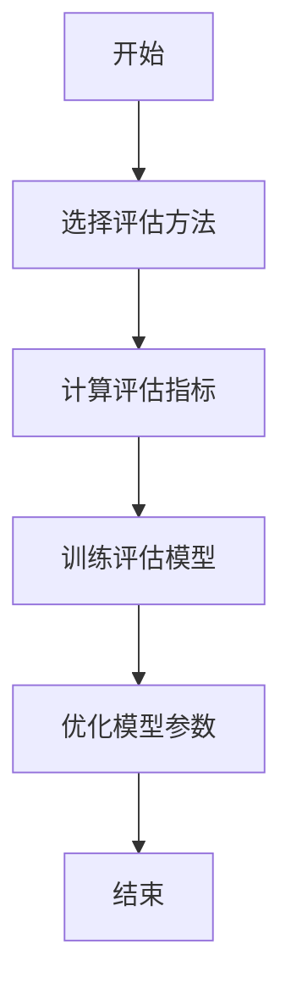
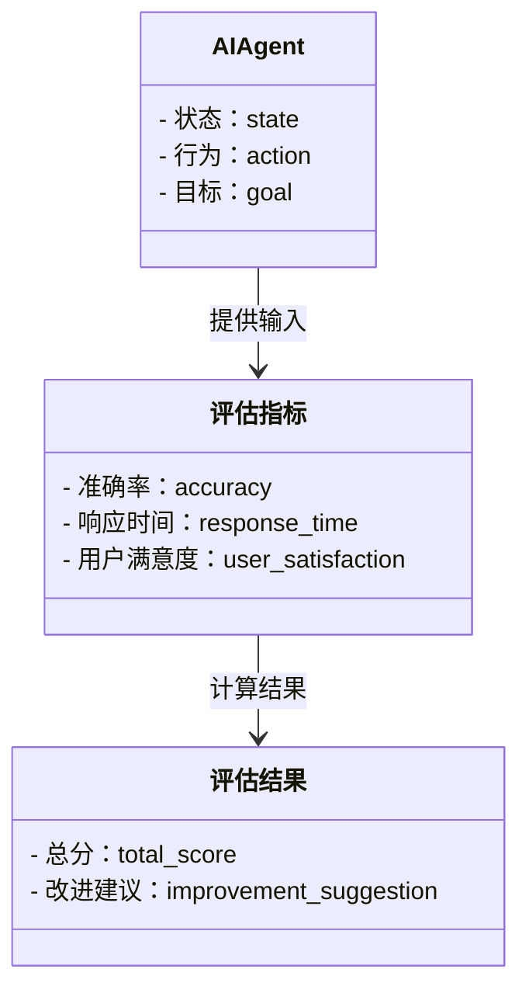
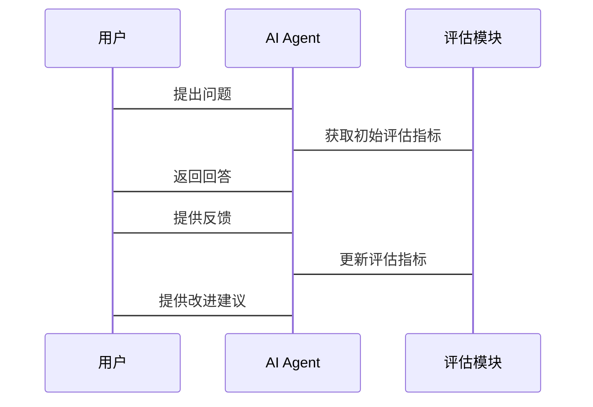

                 


# 构建AI Agent的自我评估机制：持续改进性能

**关键词**：AI Agent、自我评估机制、持续改进性能、强化学习、监督学习、算法原理

**摘要**：  
AI Agent的自我评估机制是实现持续性能改进的核心。本文从AI Agent的基本概念出发，详细探讨了自我评估机制的原理、算法实现、系统架构设计及实际项目案例。通过分析评估指标、模型训练与优化策略，结合强化学习和监督学习的方法，提供了一套系统化的解决方案。同时，本文还探讨了实际应用中的挑战与解决方案，为构建高效、可靠的AI Agent自我评估机制提供了理论与实践指导。

---

# 第1章: AI Agent与自我评估机制概述

## 1.1 AI Agent的基本概念

### 1.1.1 AI Agent的定义  
AI Agent（人工智能代理）是指能够感知环境、做出决策并采取行动以实现目标的智能实体。它可以是一个软件程序，也可以是嵌入在硬件中的智能系统。AI Agent的核心目标是通过感知和行动来优化任务执行效率，提高用户体验。

### 1.1.2 AI Agent的核心特征  
- **自主性**：能够在没有外部干预的情况下自主运行。  
- **反应性**：能够实时感知环境变化并做出反应。  
- **目标导向性**：通过设定目标来驱动行为决策。  
- **学习能力**：通过数据和经验不断优化自身的性能。  

### 1.1.3 AI Agent的应用场景  
- 智能助手（如Siri、Alexa）  
- 自动驾驶系统  
- 智能客服机器人  
- 游戏AI  

---

## 1.2 自我评估机制的必要性

### 1.2.1 AI Agent性能优化的需求  
AI Agent的目标是不断提高性能，以更好地满足用户需求。然而，AI Agent的性能受到数据质量、算法选择、环境复杂性等多种因素的影响。为了持续优化性能，AI Agent需要具备自我评估的能力，以便及时发现问题并进行调整。

### 1.2.2 自我评估在AI Agent中的作用  
- **性能监控**：实时监控AI Agent的运行状态，发现潜在问题。  
- **决策优化**：通过评估结果优化决策策略。  
- **自我改进**：根据评估结果调整模型参数或算法，提升性能。  

### 1.2.3 自我评估机制的边界与外延  
- **边界**：自我评估机制仅关注AI Agent内部性能的优化，不涉及外部环境的直接干预。  
- **外延**：自我评估机制可以与其他技术（如机器学习、自然语言处理）结合，提升整体性能。  

---

## 1.3 自我评估机制的核心要素

### 1.3.1 评估指标体系  
评估指标是衡量AI Agent性能的核心依据。常见的评估指标包括：  
- **准确率**：预测结果与真实结果的匹配程度。  
- **响应时间**：处理请求所需的时间。  
- **用户满意度**：用户对AI Agent表现的主观评价。  

### 1.3.2 评估方法与模型  
- **基于强化学习的评估方法**：通过奖励机制对AI Agent的行为进行评估。  
- **基于监督学习的评估方法**：利用标注数据对AI Agent的表现进行评估。  
- **混合评估方法**：结合强化学习和监督学习的优点，提升评估的全面性。  

### 1.3.3 评估反馈机制  
- **实时反馈**：在AI Agent执行任务的过程中，实时提供反馈信息。  
- **周期性反馈**：定期对AI Agent的表现进行评估，并提供反馈。  
- **用户反馈**：通过用户交互获取反馈信息，用于优化AI Agent的行为。  

---

## 1.4 本章小结  
本章从AI Agent的基本概念出发，详细阐述了自我评估机制的必要性及其核心要素。通过分析评估指标、评估方法与反馈机制，为后续章节的深入探讨奠定了基础。

---

# 第2章: AI Agent自我评估机制的核心概念与联系

## 2.1 自我评估机制的原理

### 2.1.1 评估指标的定义与选择  
评估指标的选择直接影响评估结果的准确性。例如，在自然语言处理任务中，可以使用BLEU、ROUGE等指标来评估生成文本的质量。  

### 2.1.2 评估模型的构建与训练  
- **基于强化学习的评估模型**：通过定义奖励函数，训练AI Agent在特定任务中的行为策略。  
- **基于监督学习的评估模型**：利用标注数据，训练AI Agent识别和分类任务。  

### 2.1.3 评估结果的反馈与应用  
评估结果需要及时反馈给AI Agent，并指导其行为调整。例如，在自然语言处理任务中，AI Agent可以根据评估结果优化生成文本的质量。

---

## 2.2 核心概念对比分析

### 2.2.1 评估指标与评估方法的对比  
| 评估指标       | 评估方法         |  
|----------------|------------------|  
| 准确率         | 监督学习         |  
| 响应时间       | 强化学习         |  
| 用户满意度     | 混合评估方法     |  

### 2.2.2 不同评估模型的优劣势分析  
| 评估模型       | 优势             | 劣势             |  
|----------------|------------------|------------------|  
| 强化学习模型     | 能够处理复杂环境   | 需要大量训练数据 |  
| 监督学习模型     | 数据标注成本低   | 无法处理动态环境   |  
| 混合评估模型     | 结合两种方法的优点 | 实现复杂性较高     |  

### 2.2.3 评估结果与实际应用的关联  
评估结果能够直接指导AI Agent的行为调整，例如在自动驾驶系统中，评估结果可以用于优化路径规划算法。

---

## 2.3 ER实体关系图架构

```mermaid
er
actor(AI Agent)
actor(评估指标)
actor(评估结果)
```

---

## 2.4 本章小结  
本章通过对比分析和实体关系图，详细阐述了AI Agent自我评估机制的核心概念及其相互关系，为后续的算法实现奠定了基础。

---

# 第3章: AI Agent自我评估机制的算法原理

## 3.1 评估指标的计算方法

### 3.1.1 基于强化学习的评估指标  
在强化学习中，评估指标通常基于奖励函数定义。例如，AI Agent在自动驾驶中的奖励函数可以定义为：  
$$ R = \alpha \cdot \text{安全距离} + \beta \cdot \text{到达时间} $$  

其中，$\alpha$ 和 $\beta$ 是权重系数，用于平衡不同指标的重要性。

### 3.1.2 基于监督学习的评估指标  
在监督学习中，评估指标通常基于分类准确率或回归误差。例如，分类准确率的计算公式为：  
$$ \text{准确率} = \frac{\text{正确预测数}}{\text{总预测数}} $$  

### 3.1.3 混合评估方法  
混合评估方法结合了强化学习和监督学习的优点。例如，可以先使用监督学习模型训练基础行为策略，再通过强化学习方法优化策略。

---

## 3.2 评估模型的训练与优化

### 3.2.1 基于深度学习的评估模型  
深度学习模型（如神经网络）可以用于评估AI Agent的行为。例如，使用卷积神经网络（CNN）对图像进行分类，评估结果可以用于优化图像识别任务。

### 3.2.2 基于规则的评估模型  
基于规则的评估模型通过预定义规则对AI Agent的行为进行评估。例如，在智能客服系统中，可以定义规则：如果回答错误，则扣分。

### 3.2.3 模型训练的优化策略  
- **数据增强**：通过增加训练数据的多样性，提升模型的泛化能力。  
- **超参数优化**：通过网格搜索或随机搜索优化模型的超参数。  
- **模型集成**：通过集成多个模型的结果，提升评估的准确性。  

---

## 3.3 算法流程图



---

## 3.4 Python实现示例

```python
def evaluate_agent(agent, test_case):
    # 初始化评估指标
    accuracy = 0
    response_time = 0
    user_satisfaction = 0

    # 计算评估指标
    for case in test_case:
        # 计算准确率
        accuracy += agent.predict(case['input']) == case['output']
        # 计算响应时间
        response_time += agent.get_response_time(case['input'])
        # 计算用户满意度
        user_satisfaction += agent.get_user_feedback(case['input'])

    # 返回评估结果
    return {
        '准确率': accuracy / len(test_case),
        '响应时间': response_time / len(test_case),
        '用户满意度': user_satisfaction / len(test_case)
    }
```

---

## 3.5 本章小结  
本章详细探讨了AI Agent自我评估机制的算法原理，通过对比分析和具体实现示例，展示了如何通过评估指标和模型优化提升AI Agent的性能。

---

# 第4章: AI Agent自我评估机制的系统分析与架构设计

## 4.1 问题场景介绍  
假设我们正在开发一个智能客服系统，AI Agent需要能够自动回答用户的问题，并根据用户反馈优化回答质量。

---

## 4.2 系统功能设计

### 4.2.1 领域模型设计



---

### 4.2.2 系统架构设计

```mermaid
journey
    参与者：AI Agent
    参与者：用户
    背景：智能客服系统
    流程：(
        step
            操作：用户提出问题
            事件：AI Agent接收问题
        step
            操作：AI Agent生成回答
            事件：用户收到回答
        step
            操作：用户反馈满意度
            事件：AI Agent更新评估指标
    )
```

---

### 4.2.3 系统接口设计  
- **输入接口**：接收用户问题和反馈。  
- **输出接口**：返回回答和评估结果。  

---

## 4.3 系统交互设计



---

## 4.4 本章小结  
本章通过系统分析和架构设计，展示了AI Agent自我评估机制在实际项目中的应用。通过领域模型和系统架构图，明确了各部分的功能和交互关系。

---

# 第5章: AI Agent自我评估机制的项目实战

## 5.1 环境安装与配置

### 5.1.1 安装依赖  
- Python 3.8+  
- TensorFlow 2.0+  
- Scikit-learn 0.24+  

### 5.1.2 安装命令  
```bash
pip install numpy tensorflow scikit-learn
```

---

## 5.2 系统核心实现

### 5.2.1 评估指标计算模块

```python
class EvaluationMetrics:
    def __init__(self):
        self.accuracy = 0.0
        self.response_time = 0.0
        self.user_satisfaction = 0.0

    def update(self, accuracy, response_time, user_satisfaction):
        self.accuracy += accuracy
        self.response_time += response_time
        self.user_satisfaction += user_satisfaction

    def get_average(self):
        return {
            '准确率': self.accuracy / self.count,
            '响应时间': self.response_time / self.count,
            '用户满意度': self.user_satisfaction / self.count
        }
```

---

### 5.2.2 AI Agent实现模块

```python
class AIAssistant:
    def __init__(self, model):
        self.model = model
        self.evaluation = EvaluationMetrics()

    def process_query(self, query):
        # 处理用户查询
        response = self.model.predict(query)
        return response

    def update_evaluation(self, accuracy, response_time, user_satisfaction):
        self.evaluation.update(accuracy, response_time, user_satisfaction)

    def get_evaluation_result(self):
        return self.evaluation.get_average()
```

---

## 5.3 代码应用解读与分析  
通过上述代码，我们可以看到AI Agent如何通过评估指标不断优化自身的回答质量。评估指标计算模块负责收集和计算各项指标，AI Agent根据评估结果调整其行为策略。

---

## 5.4 实际案例分析  
假设我们开发了一个智能客服系统，AI Agent需要回答用户的问题。通过评估指标，我们可以发现AI Agent在某些领域（如技术问题）的准确率较低，因此需要针对性地优化相关模型。

---

## 5.5 本章小结  
本章通过项目实战，展示了如何在实际应用中构建AI Agent的自我评估机制。通过代码实现和案例分析，进一步验证了理论的可行性和实用性。

---

# 第6章: AI Agent自我评估机制的最佳实践与小结

## 6.1 最佳实践

### 6.1.1 数据质量管理  
确保训练数据的多样性和高质量，可以显著提升评估结果的准确性。  

### 6.1.2 模型优化策略  
- **逐步优化**：先优化单一指标，再逐步优化多指标。  
- **实时监控**：实时监控评估结果，及时发现并解决问题。  

### 6.1.3 用户反馈机制  
建立完善的用户反馈机制，可以有效提升AI Agent的用户体验。  

---

## 6.2 小结与展望  
本文详细探讨了AI Agent自我评估机制的构建方法，从理论到实践，全面分析了其核心概念、算法原理和系统架构。未来，随着AI技术的不断发展，AI Agent的自我评估机制将更加智能化和自动化，为实际应用提供更多可能性。

---

# 作者：AI天才研究院/AI Genius Institute & 禅与计算机程序设计艺术 /Zen And The Art of Computer Programming

---

以上是《构建AI Agent的自我评估机制：持续改进性能》的技术博客文章的完整内容，涵盖了从基本概念到实际应用的各个方面，为读者提供了系统化的指导和实用的代码示例。

