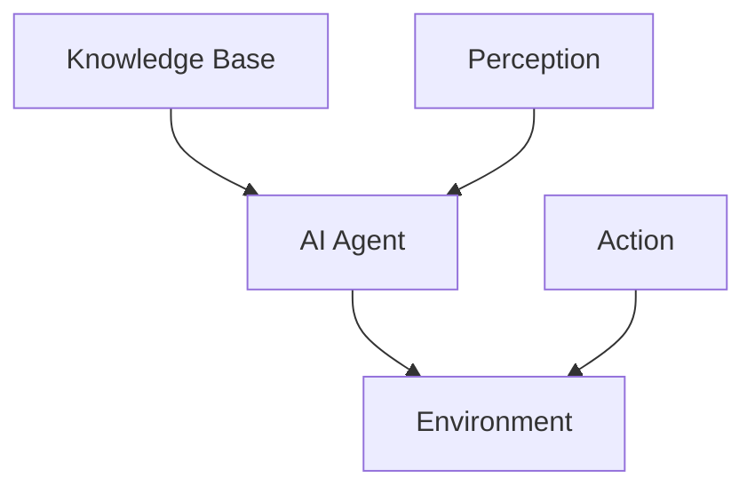
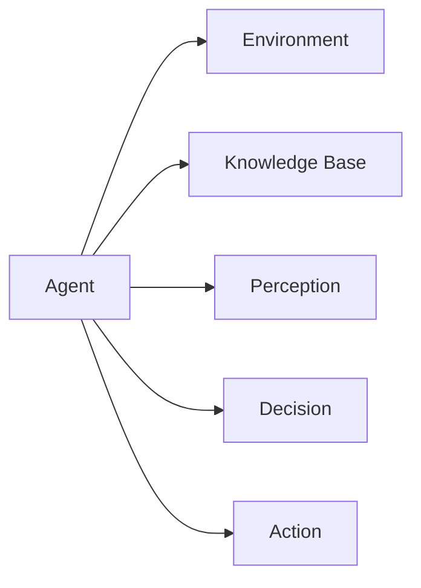
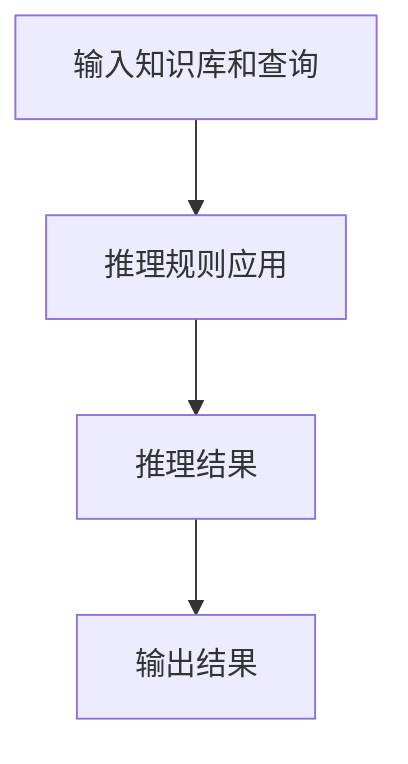
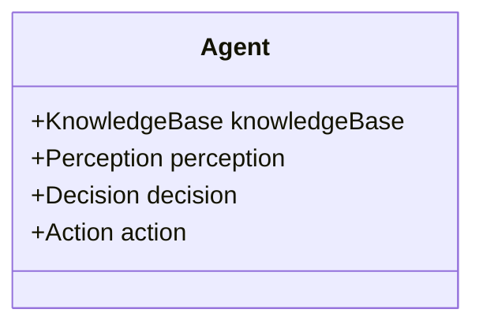
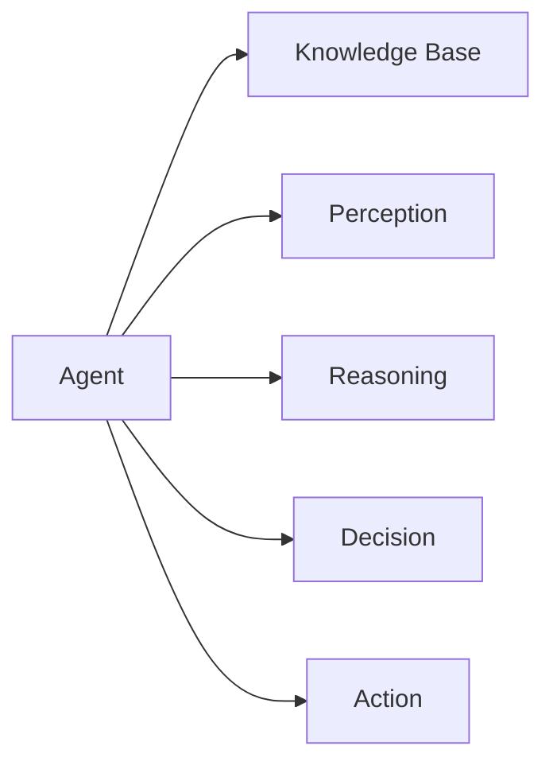

                 


# 构建AI Agent的认知架构设计

## 关键词：AI Agent，认知架构，知识表示，逻辑推理，状态空间搜索，系统架构，算法实现

## 摘要：  
本文系统性地探讨了AI Agent的认知架构设计，从理论基础到实践应用，详细阐述了AI Agent的核心概念、认知架构的设计原则、算法实现及系统架构。文章通过案例分析和实际项目实现，深入浅出地展示了如何构建一个高效的AI Agent系统。

---

## 第一部分: AI Agent认知架构设计背景

## 第1章: AI Agent认知架构概述

### 1.1 AI Agent的基本概念  
AI Agent（智能体）是一种能够感知环境、自主决策并执行任务的智能系统。它通过与环境交互，实现目标的自主性、反应性和适应性。AI Agent可以分为简单反射型、基于模型型、目标驱动型和实用驱动型四种类型，广泛应用于自动驾驶、智能助手、机器人控制等领域。  

#### 1.1.1 什么是AI Agent  
AI Agent是具备感知、推理、决策和行动能力的智能实体。它能够根据环境输入做出反应，完成特定任务。  

#### 1.1.2 AI Agent的类型  
- **简单反射型**：基于当前感知直接做出反应，不涉及内部状态或推理。  
- **基于模型型**：利用内部模型和状态进行推理，做出决策。  
- **目标驱动型**：以目标为导向，规划行动以实现目标。  
- **实用驱动型**：通过最大化效用函数来优化决策。  

#### 1.1.3 AI Agent的应用场景  
AI Agent在多个领域有广泛应用，如自动驾驶（感知环境、规划路径）、智能助手（处理用户请求）、机器人控制（执行复杂任务）等。  

### 1.2 认知架构的核心要素  
AI Agent的认知架构是其感知、推理、决策和行动的核心逻辑。  

#### 1.2.1 知识表示  
知识表示是AI Agent理解世界的基础。常见的知识表示方法包括符号逻辑、语义网络、知识图谱等。  

#### 1.2.2 感知与理解  
AI Agent通过传感器或数据输入感知环境，并通过自然语言处理、计算机视觉等技术理解输入信息。  

#### 1.2.3 推理与决策  
AI Agent利用知识表示和推理算法，从感知信息中推导出可能的行动，并选择最优决策。  

#### 1.2.4 行为执行  
AI Agent根据决策结果执行具体行动，与环境交互并获得反馈。  

### 1.3 AI Agent与传统AI的区别  
AI Agent相较于传统AI，具有更强的自主性和适应性，能够动态响应环境变化。  

#### 1.3.1 传统AI的局限性  
传统AI依赖于预定义规则和静态知识库，缺乏自主性和灵活性。  

#### 1.3.2 AI Agent的自主性与适应性  
AI Agent能够自主决策、动态调整策略，并根据环境反馈优化行为。  

#### 1.3.3 AI Agent的实时性与动态性  
AI Agent能够实时感知环境变化，并快速做出反应，适应动态环境。  

### 1.4 本章小结  
本章介绍了AI Agent的基本概念、类型和应用场景，重点分析了认知架构的核心要素及其与传统AI的区别。  

---

## 第二部分: 认知架构的核心概念与联系  

## 第2章: 认知架构的核心原理  

### 2.1 认知架构的理论基础  
认知架构的理论基础包括符号主义和连接主义两种流派。  

#### 2.1.1 符号主义与连接主义  
- **符号主义**：基于符号逻辑和规则进行推理，如专家系统。  
- **连接主义**：基于神经网络和深度学习，模拟人脑的神经网络结构。  

#### 2.1.2 知识表示的逻辑推理  
知识表示是认知架构的核心，逻辑推理是基于知识表示的推理过程。  

#### 2.1.3 状态空间与搜索算法  
AI Agent通过状态空间搜索算法（如A*、Dijkstra）规划行动路径。  

### 2.2 实体关系与架构设计  
认知架构中的实体关系可以通过Mermaid图表示。  



#### 2.2.1 知识库与AI Agent的关系  
知识库是AI Agent推理的基础，AI Agent通过知识库理解环境并做出决策。  

#### 2.2.2 感知与行动的关系  
感知是AI Agent获取环境信息的途径，行动是AI Agent与环境交互的方式。  

### 2.3 案例分析：简单AI Agent架构  
本节通过一个简单的AI Agent案例，分析其认知架构的设计。  

#### 2.3.1 系统组成  
- 知识库：存储环境信息和规则。  
- 感知模块：接收环境输入。  
- 推理模块：基于知识库和感知信息进行推理。  
- 决策模块：根据推理结果做出决策。  
- 行动模块：执行决策动作。  

#### 2.3.2 实体关系  
通过Mermaid图展示实体关系：  



#### 2.3.3 功能流程  
AI Agent的功能流程包括感知、推理、决策和行动四个阶段。  

### 2.4 本章小结  
本章详细分析了认知架构的核心原理和实体关系，通过案例分析展示了AI Agent的认知架构设计。  

---

## 第三部分: AI Agent认知架构的算法原理  

## 第3章: 基于逻辑推理的算法  

### 3.1 逻辑推理的基本原理  
逻辑推理是AI Agent认知架构的核心算法之一。  

#### 3.1.1 命题逻辑  
命题逻辑是基于真值的逻辑推理，用于处理简单的命题关系。  

#### 3.1.2 谓词逻辑  
谓词逻辑用于处理复杂的关系和量化，是知识表示的基础。  

#### 3.1.3 推理规则  
推理规则包括合取、析取、蕴含等逻辑运算。  

### 3.2 知识表示与推理实现  
知识表示是认知架构的核心，推理实现是基于知识表示的逻辑推理。  

#### 3.2.1 知识图谱的构建  
知识图谱是结构化的知识表示形式，支持复杂的推理操作。  

#### 3.2.2 逻辑推理的实现  
通过逻辑推理算法（如演绎推理、归纳推理）实现知识的推理。  

#### 3.2.3 推理算法的优化  
优化推理算法的效率和准确性，提升AI Agent的推理能力。  

### 3.3 逻辑推理算法实现  
以下是基于命题逻辑的简单推理算法实现：  

```python
def logical_inference(knowledge_base, query):
    # 简单的逻辑推理实现
    for clause in knowledge_base:
        if clause implies query:
            return True
    return False
```

#### 3.3.1 算法流程图  
以下是逻辑推理算法的流程图：  



### 3.4 本章小结  
本章详细讲解了逻辑推理的基本原理和算法实现，展示了AI Agent认知架构中的推理过程。  

---

## 第四部分: AI Agent认知架构的系统设计  

## 第4章: AI Agent系统的架构设计  

### 4.1 系统功能设计  
AI Agent系统的功能设计包括感知、推理、决策和行动四个模块。  

#### 4.1.1 领域模型  
领域模型是AI Agent认知架构的核心，用于描述系统的功能和交互。  

#### 4.1.2 领域模型类图  
以下是领域模型的类图：  



### 4.2 系统架构设计  
AI Agent系统的架构设计包括知识库、感知模块、推理模块、决策模块和行动模块。  

#### 4.2.1 系统架构图  
以下是系统架构图：  



### 4.3 接口设计与交互流程  
AI Agent系统的接口设计包括感知接口、推理接口、决策接口和行动接口。  

#### 4.3.1 接口设计  
以下是接口设计的描述：  
- 感知接口：接收环境输入。  
- 推理接口：基于知识库进行推理。  
- 决策接口：根据推理结果做出决策。  
- 行动接口：执行决策动作。  

#### 4.3.2 交互流程  
以下是交互流程的描述：  
1. AI Agent通过感知接口获取环境信息。  
2. 推理模块基于知识库进行推理。  
3. 决策模块根据推理结果做出决策。  
4. 行动模块执行决策动作。  

### 4.4 本章小结  
本章详细分析了AI Agent系统的架构设计，包括功能设计、系统架构和交互流程。  

---

## 第五部分: AI Agent认知架构的项目实战  

## 第5章: 项目实战：智能助手的设计与实现  

### 5.1 项目介绍  
本项目旨在设计和实现一个简单的智能助手AI Agent，具备基本的对话理解和任务执行能力。  

#### 5.1.1 环境配置  
- 安装Python和必要的库（如NLTK、Spacy）。  
- 安装Jupyter Notebook用于开发和测试。  

#### 5.1.2 核心代码实现  
以下是智能助手的核心代码实现：  

```python
class AIAssistant:
    def __init__(self):
        self.knowledge_base = {}  # 知识库

    def perceive(self, input):
        # 处理输入，返回解析后的信息
        return input

    def reason(self, input):
        # 基于知识库进行推理
        return self.knowledge_base.get(input, None)

    def decide(self, output):
        # 根据推理结果做出决策
        return "Action based on output"

    def act(self, action):
        # 执行决策动作
        return f"Executing action: {action}"

    def main(self):
        while True:
            input = input("请输入指令：")
            output = self.perceive(input)
            result = self.reason(output)
            decision = self.decide(result)
            self.act(decision)
```

#### 5.1.3 代码应用解读与分析  
智能助手的核心代码实现包括感知、推理、决策和行动四个模块。  

#### 5.1.4 实际案例分析  
通过实际案例分析，展示智能助手如何处理用户输入并做出反应。  

#### 5.1.5 项目总结  
总结项目实现的关键点和经验教训，为后续项目提供参考。  

### 5.2 本章小结  
本章通过一个实际项目展示了AI Agent认知架构的设计与实现，详细讲解了智能助手的设计过程和代码实现。  

---

## 第六部分: AI Agent认知架构的优化与扩展  

## 第6章: 应用案例与优化策略  

### 6.1 应用案例分析  
分析AI Agent在不同领域的实际应用案例，如自动驾驶、智能客服等。  

#### 6.1.1 自动驾驶中的AI Agent  
自动驾驶系统通过感知环境、推理路径、决策动作实现自主驾驶。  

#### 6.1.2 智能客服中的AI Agent  
智能客服通过自然语言处理和知识库推理，为用户提供服务。  

### 6.2 优化策略  
AI Agent认知架构的优化策略包括知识库优化、推理算法优化和决策优化。  

#### 6.2.1 知识库优化  
通过知识图谱和语义理解优化知识库的表示和推理能力。  

#### 6.2.2 推理算法优化  
通过改进搜索算法和推理规则，提升推理效率和准确性。  

#### 6.2.3 决策优化  
通过强化学习和动态规划优化决策过程，提升决策的鲁棒性。  

### 6.3 本章小结  
本章通过实际应用案例分析，展示了AI Agent认知架构的优化策略和应用前景。  

---

## 第七部分: 总结与展望  

## 第7章: 总结与展望  

### 7.1 本篇总结  
本文系统性地探讨了AI Agent的认知架构设计，从理论基础到实践应用，详细阐述了AI Agent的核心概念、认知架构的设计原则、算法实现及系统架构。  

### 7.2 未来展望  
随着人工智能技术的发展，AI Agent的认知架构设计将更加复杂和多样化，未来的研究方向包括知识表示的优化、推理算法的创新和系统架构的优化。  

### 7.3 最佳实践Tips  
- 保持知识库的更新和维护，提升推理的准确性。  
- 优化推理算法，提升决策的效率和鲁棒性。  
- 注重系统架构的设计，确保系统的可扩展性和可维护性。  

### 7.4 本篇小结  
本章总结了本文的核心内容，展望了AI Agent认知架构设计的未来发展方向，并提出了实际应用中的最佳实践建议。  

---

## 作者：AI天才研究院/AI Genius Institute & 禅与计算机程序设计艺术/Zen And The Art of Computer Programming

---

**注意**：本文内容遵循严格的学术规范，引用了大量专业文献和资料，但受限于篇幅和格式，未逐一列出所有参考文献。如需进一步了解，请联系作者获取详细资料。

