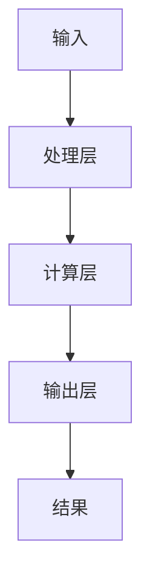
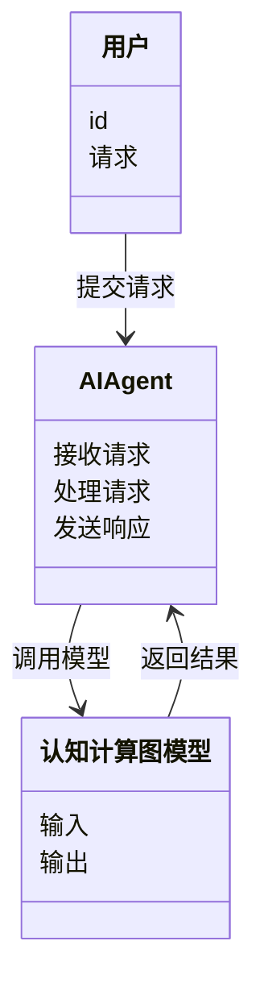

                 


# 构建AI Agent的认知计算图模型

> 关键词：AI Agent，认知计算图模型，算法原理，系统架构，项目实战

## 摘要
认知计算图模型是一种新型的人工智能模型，旨在通过构建复杂的认知图结构来增强AI Agent的学习和推理能力。本文从背景介绍、核心概念、算法原理、系统架构到项目实战，全面解析认知计算图模型的构建过程，帮助读者深入了解其工作原理和实际应用。

---

## 第1章：认知计算图模型的背景与概念

### 1.1 问题背景与问题描述
#### 1.1.1 当前AI Agent的发展挑战
传统的AI Agent在处理复杂任务时，往往依赖固定的规则和预设的逻辑，难以应对动态变化的环境。认知计算图模型通过模拟人类认知过程，能够实现更灵活的推理和决策。

#### 1.1.2 认知计算图模型的提出动机
认知计算图模型旨在解决AI Agent在动态环境下的适应性问题，通过构建动态的知识图谱和推理机制，提升Agent的自主决策能力。

#### 1.1.3 问题解决的必要性与目标
AI Agent需要具备更强的认知能力，能够理解上下文、推理因果关系并做出合理决策。认知计算图模型的目标是通过图结构建模来实现这一点。

### 1.2 问题背景的边界与外延
#### 1.2.1 AI Agent的定义与范围
AI Agent是指能够在环境中感知、推理、决策并采取行动的智能体。

#### 1.2.2 认知计算图模型的适用场景
适用于需要动态推理和知识表示的领域，如智能助手、自动驾驶、机器人控制等。

#### 1.2.3 相关概念的对比与区分
| 概念 | 描述 | 与认知计算图模型的区别 |
|------|------|---------------------|
| 知识图谱 | 静态知识表示 | 强调动态推理与上下文理解 |
| 专家系统 | 基于规则的推理 | 强调图结构的动态构建 |

### 1.3 概念结构与核心要素
#### 1.3.1 认知计算图模型的核心要素
- 实体：环境中的对象和概念。
- 关系：实体之间的关联和因果关系。
- 属性：实体的特征和状态。

#### 1.3.2 模型的组成与关系
认知计算图模型由实体、关系和属性三部分组成，通过图结构表示知识和推理过程。

#### 1.3.3 模型的输入输出机制
- 输入：感知数据和用户请求。
- 输出：推理结果和行动指令。

## 第2章：认知计算图模型的核心概念与联系

### 2.1 核心概念的原理分析
#### 2.1.1 认知计算图模型的基本原理
认知计算图模型通过构建动态的知识图谱，结合推理算法，实现对环境的动态理解和自主决策。

#### 2.1.2 模型的数学基础
认知计算图模型基于图论和概率论，结合符号逻辑推理。

#### 2.1.3 模型的计算流程
1. 输入感知数据，构建初始知识图谱。
2. 基于图结构进行推理，生成候选解决方案。
3. 对候选方案进行评估，选择最优行动。

### 2.2 核心概念的特征对比
| 模型类型 | 描述 | 优点 | 缺点 |
|----------|------|------|------|
| 知识图谱 | 静态知识表示 | 知识组织能力强 | 动态推理能力弱 |
| 专家系统 | 基于规则的推理 | 结果准确 | 知识更新困难 |
| 认知计算图模型 | 动态图结构推理 | 知识动态更新能力强 | 计算复杂度高 |

### 2.3 实体关系图的ER架构
```mermaid
er
  actor: 用户
  agent: AI Agent
  model: 认知计算图模型
  action: 行为
  relation: 关系
  goal: 目标
  constraint: 约束条件
  attribute: 属性
  user_request: 用户请求
  system_response: 系统响应
  actor --> action: 发起行为
  action --> model: 输入模型
  model --> goal: 生成目标
  model --> action: 输出行为
  action --> system_response: 生成系统响应
  system_response --> actor: 返回给用户
```

## 第3章：认知计算图模型的算法原理

### 3.1 算法原理的详细讲解
#### 3.1.1 算法的基本原理
认知计算图模型通过构建动态图结构，结合符号逻辑推理和概率推理，生成候选解决方案。

#### 3.1.2 算法的数学模型
模型基于图论和概率论，表示如下：
$$ P(E|E') = \frac{P(E')}{P(E)} $$
其中，$E$ 表示实体，$E'$ 表示关系。

#### 3.1.3 算法的流程图


### 3.2 算法的数学模型与公式
#### 3.2.1 基本公式
$$ y = f(x) $$
其中，$x$ 表示输入，$y$ 表示输出，$f$ 表示推理函数。

#### 3.2.2 推理公式
$$ P(A|B) = \frac{P(B|A)P(A)}{P(B)} $$

## 第4章：系统分析与架构设计

### 4.1 系统分析
#### 4.1.1 问题场景介绍
AI Agent需要在动态环境中进行推理和决策，如智能助手、自动驾驶等领域。

### 4.2 系统功能设计
#### 4.2.1 领域模型


### 4.3 系统架构设计


## 第5章：项目实战

### 5.1 环境安装
安装Python和相关库，如numpy、pandas、scikit-learn。

### 5.2 核心代码实现
```python
class CognitiveGraphModel:
    def __init__(self):
        self.nodes = []
        self.edges = []

    def add_node(self, node):
        self.nodes.append(node)

    def add_edge(self, from_node, to_node):
        self.edges.append((from_node, to_node))

    def infer(self, query):
        # 推理逻辑
        pass
```

## 第6章：优化与扩展

### 6.1 模型优化策略
- 优化推理算法，降低计算复杂度。
- 引入增量学习，动态更新知识图谱。

### 6.2 模型的扩展方向
- 结合强化学习，提升决策能力。
- 引入分布式计算，提升处理能力。

## 结语
认知计算图模型为AI Agent的构建提供了新的思路，未来的研究将集中在优化推理算法和扩展应用场景上。

## 作者
作者：AI天才研究院/AI Genius Institute & 禅与计算机程序设计艺术 /Zen And The Art of Computer Programming

