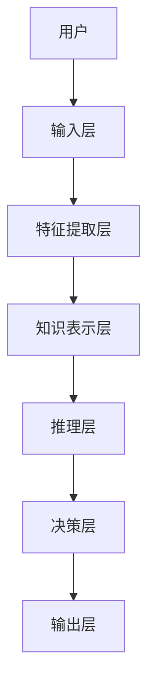
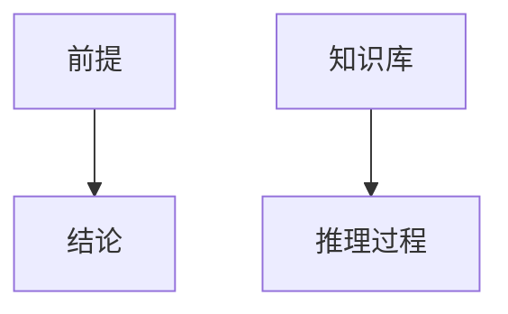
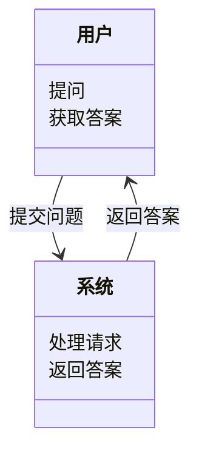

                 


# 《构建AI Agent的认知计算模型》

> **关键词**：AI Agent、认知计算、知识表示、逻辑推理、系统架构、项目实战  
> **摘要**：本文深入探讨构建AI Agent的认知计算模型，从基础概念、核心原理到系统设计和项目实战，全面解析认知计算在AI Agent中的应用。文章结合理论与实践，通过具体案例分析，帮助读者掌握认知计算模型的设计与实现。

---

# 第一部分：认知计算与AI Agent的背景介绍

## 第1章：认知计算与AI Agent概述

### 1.1 认知计算的基本概念

#### 1.1.1 认知计算的定义与特点
认知计算是一种模拟人类认知过程的计算范式，其核心目标是通过计算机系统实现类似人类的学习、推理、理解和决策能力。认知计算的特点包括：
- **知识驱动**：依赖于知识的表示与推理。
- **动态适应**：能够根据环境变化自适应调整。
- **多模态融合**：能够处理文本、图像、语音等多种数据类型。

#### 1.1.2 AI Agent的基本概念与分类
AI Agent（人工智能代理）是一种能够感知环境、自主决策并执行任务的智能实体。AI Agent可以分为以下几类：
- **简单反射型代理**：基于规则的简单响应。
- **基于模型的反射型代理**：基于内部模型进行决策。
- **目标驱动型代理**：基于目标导向的行为。
- **效用驱动型代理**：基于效用函数进行优化决策。

#### 1.1.3 认知计算与AI Agent的关联
认知计算为AI Agent提供了知识表示、推理和自适应能力的核心技术，使得AI Agent能够更好地理解和解决复杂问题。

### 1.2 AI Agent的发展历程

#### 1.2.1 从传统AI到认知计算的演进
传统AI主要依赖规则和逻辑推理，而认知计算引入了知识图谱、深度学习等技术，使得AI Agent更加智能和灵活。

#### 1.2.2 认知计算在AI Agent中的应用
认知计算技术（如自然语言处理、知识表示）在AI Agent中的应用，使得其能够理解上下文、推理意图并执行复杂任务。

#### 1.2.3 当前AI Agent技术的前沿趋势
当前，AI Agent技术正朝着多模态交互、人机协作和边缘计算方向发展。

### 1.3 认知计算与AI Agent的应用场景

#### 1.3.1 智能客服与对话系统
通过认知计算，AI Agent能够理解用户意图，提供个性化的服务。

#### 1.3.2 自动驾驶与机器人控制
认知计算帮助AI Agent做出实时决策，提高系统的安全性和效率。

#### 1.3.3 智慧城市与数据决策
认知计算驱动AI Agent分析城市数据，优化资源配置。

---

## 第2章：认知计算模型的核心要素

### 2.1 感知与理解

#### 2.1.1 数据采集与特征提取
通过传感器或API采集数据，并提取特征，例如文本中的关键词、图像中的边缘。

#### 2.1.2 自然语言处理与知识表示
使用NLP技术处理文本，构建知识图谱，表示实体及其关系。

#### 2.1.3 视觉感知与图像理解
通过计算机视觉技术，识别图像中的物体和场景。

### 2.2 推理与决策

#### 2.2.1 知识推理与逻辑推理
基于知识图谱进行推理，解决复杂问题。

#### 2.2.2 情境理解与意图识别
通过上下文理解用户意图，例如通过对话历史识别用户需求。

#### 2.2.3 多目标优化与决策树
基于多目标优化算法，构建决策树，优化决策过程。

### 2.3 学习与自适应

#### 2.3.1 监督学习与无监督学习
通过监督学习训练分类器，通过无监督学习发现数据模式。

#### 2.3.2 强化学习与自适应系统
通过强化学习，训练AI Agent在环境中学习最优策略。

#### 2.3.3 迁移学习与知识共享
通过迁移学习，将已有的知识迁移到新任务中。

---

## 第3章：认知计算模型的原理与架构

### 3.1 认知计算模型的原理

#### 3.1.1 感知层：数据输入与特征提取
AI Agent通过传感器或接口接收数据，并提取特征，例如从文本中提取关键词。

#### 3.1.2 理解层：知识表示与语义分析
将数据转换为知识表示，例如构建知识图谱，进行语义分析。

#### 3.1.3 推理层：逻辑推理与决策制定
基于知识图谱进行推理，制定决策。

### 3.2 AI Agent的核心模块

#### 3.2.1 知识库与记忆模块
存储和管理知识，例如知识图谱、数据库。

#### 3.2.2 行为决策模块
基于知识和环境信息，制定行为决策。

#### 3.2.3 交互与执行模块
与用户或环境交互，执行决策。

### 3.3 认知计算模型的属性特征对比

| 属性 | 监督学习 | 无监督学习 | 强化学习 |
|------|----------|------------|----------|
| 数据需求 | 需要标注数据 | 无标注数据 | 需要环境反馈 |
| 任务类型 | 分类、回归 | 聚类、降维 | 控制、游戏 |
| 模型复杂度 | 较低 | 较高 | 较高 |

---

## 第4章：认知计算模型的实体关系图



---

# 第二部分：认知计算模型的核心概念与联系

## 第5章：认知计算模型的算法原理

### 5.1 算法原理讲解

#### 5.1.1 知识表示与推理



#### 5.1.2 逻辑推理与数学模型

$$ P(A \land B) \rightarrow C $$

---

## 第6章：认知计算模型的系统架构设计方案

### 6.1 问题场景介绍

#### 6.1.1 项目背景
构建一个智能问答系统，帮助用户解答技术问题。

#### 6.1.2 系统功能设计



---

## 第7章：认知计算模型的项目实战

### 7.1 环境安装与配置

#### 7.1.1 安装Python环境
```bash
python --version
pip install numpy
pip install spacy
```

#### 7.1.2 安装必要的库
```bash
pip install transformers
pip install scikit-learn
```

### 7.2 系统核心实现源代码

#### 7.2.1 知识表示代码

```python
from spacy.lang.zh import Chinese
import spacy

nlp = Chinese()
doc = nlp("北京是中国的首都。")
for token in doc:
    print(token.text)
```

#### 7.2.2 推理与决策代码

```python
from transformers import pipeline

classifier = pipeline("text-classification", model="snunlp/kobert")
result = classifier("What is AI?")
print(result)
```

---

## 第8章：认知计算模型的最佳实践

### 8.1 性能优化技巧

#### 8.1.1 数据预处理
- 去除噪声数据
- 标准化数据格式

#### 8.1.2 模型调优
- 调整超参数
- 使用交叉验证

### 8.2 部署上线注意事项

#### 8.2.1 服务性能
- 使用容器化部署（Docker）
- 配置负载均衡

#### 8.2.2 安全与伦理
- 数据隐私保护
- 避免算法偏见

---

## 第9章：总结与展望

### 9.1 总结
认知计算为AI Agent提供了强大的知识处理和推理能力，使其能够更好地服务人类。

### 9.2 展望
未来，认知计算与AI Agent将在更多领域发挥重要作用，如医疗、教育和金融。

---

**作者：AI天才研究院/AI Genius Institute & 禅与计算机程序设计艺术 /Zen And The Art of Computer Programming**

