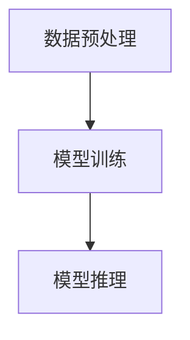
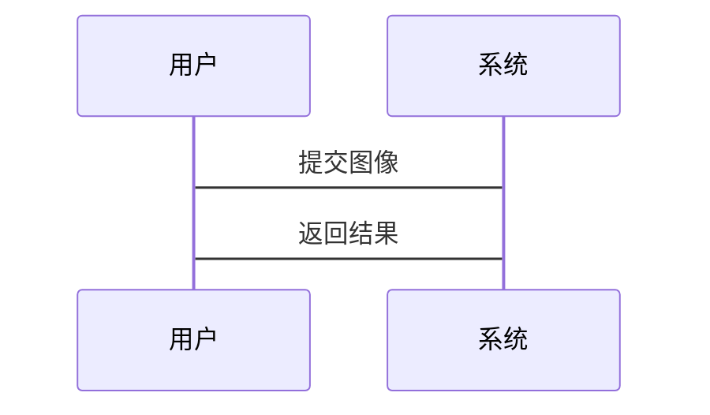

                 


# 构建AI Agent的认知计算神经网络

## 关键词：认知计算，神经网络，AI Agent，人工智能，算法实现

## 摘要：  
认知计算神经网络是构建智能AI Agent的核心技术，通过模拟人类认知过程，实现更高效、更自然的智能系统。本文从认知计算的基本概念出发，详细阐述其在AI Agent中的应用，探讨神经网络的原理与算法实现，结合实际案例，展示如何通过认知计算神经网络构建高效的AI Agent。文章内容涵盖背景介绍、核心原理、系统架构设计、项目实战及最佳实践，帮助读者全面理解认知计算神经网络在AI Agent中的重要作用。

---

# 第1章：认知计算与神经网络概述

## 1.1 认知计算的基本概念

### 1.1.1 认知科学与认知计算的定义  
认知科学是研究人类认知过程的跨学科领域，涉及心理学、神经科学、语言学和计算机科学等。认知计算则是模拟人类认知过程的计算方法，旨在通过计算机实现类似于人类的学习、推理和决策能力。

### 1.1.2 神经网络与认知计算的关系  
神经网络是认知计算的核心工具，它模拟了生物神经网络的结构和功能。通过神经网络，认知计算能够实现信息的处理、学习和记忆，从而构建具备智能的AI Agent。

### 1.1.3 认知计算的核心特征  
认知计算的核心特征包括：  
1. **自主性**：能够独立感知环境并做出决策。  
2. **学习性**：通过数据学习和优化模型。  
3. **推理能力**：能够进行逻辑推理和问题解决。  
4. **适应性**：能够适应环境的变化并自我优化。

## 1.2 AI Agent的基本概念

### 1.2.1 AI Agent的定义与分类  
AI Agent是一种智能体，能够在环境中感知并执行任务。根据智能水平，AI Agent可以分为反应式、基于模型和混合式智能体。

### 1.2.2 AI Agent的核心功能与特点  
AI Agent的核心功能包括感知、推理、决策和执行。其特点包括实时性、自主性和智能性。

### 1.2.3 认知计算神经网络在AI Agent中的作用  
认知计算神经网络为AI Agent提供了强大的感知和决策能力，使其能够处理复杂任务。

## 1.3 认知计算神经网络的背景与应用

### 1.3.1 认知计算神经网络的发展历程  
从早期的感知器模型到深度学习，认知计算神经网络经历了多次发展和改进。

### 1.3.2 认知计算神经网络的典型应用场景  
包括图像识别、自然语言处理、机器人控制等领域。

### 1.3.3 未来发展趋势与挑战  
未来，认知计算神经网络将更加注重可解释性和高效性。

---

# 第2章：认知计算神经网络的核心原理

## 2.1 认知计算神经网络的信息处理机制

### 2.1.1 神经元模型与信息处理  
神经元模型是认知计算的基础，描述了神经元如何处理和传递信息。

### 2.1.2 神经网络的层次结构  
神经网络由输入层、隐藏层和输出层组成，不同层次负责不同的信息处理任务。

### 2.1.3 认知计算的并行处理特点  
认知计算神经网络通过并行计算提高了处理效率。

## 2.2 神经网络的学习机制

### 2.2.1 监督学习与无监督学习  
监督学习通过标记数据进行训练，无监督学习则通过数据聚类实现。

### 2.2.2 强化学习与认知计算  
强化学习通过奖励机制优化决策过程。

### 2.2.3 知识表示与推理机制  
知识表示通过符号逻辑或向量表示，推理则通过逻辑推理或概率计算实现。

## 2.3 神经网络的记忆与联想机制

### 2.3.1 短期记忆与长期记忆的模拟  
短期记忆通过循环神经网络实现，长期记忆通过记忆网络实现。

### 2.3.2 联想记忆的实现原理  
联想记忆通过相似性匹配实现，常用于图像识别和自然语言处理。

### 2.3.3 网络的自适应与优化  
自适应通过调整权重和激活函数实现，优化则通过梯度下降等方法进行。

## 2.4 认知计算神经网络的数学模型

### 2.4.1 神经元的数学模型  
神经元模型可以用激活函数和权重矩阵表示。

### 2.4.2 神经网络的激活函数  
常用的激活函数包括Sigmoid、ReLU和tanh。

### 2.4.3 网络的权重更新公式  
权重更新公式为：$$w = w - \eta \cdot \frac{\partial L}{\partial w}$$，其中$\eta$是学习率，$L$是损失函数。

## 2.5 本章小结  
认知计算神经网络通过复杂的数学模型和算法实现信息处理、学习和推理。

---

# 第3章：AI Agent的设计与实现

## 3.1 AI Agent的定义与分类

### 3.1.1 AI Agent的基本定义  
AI Agent是一种智能体，能够感知环境并执行任务。

### 3.1.2 AI Agent的分类与特点  
根据智能水平，AI Agent分为反应式、基于模型和混合式智能体。

### 3.1.3 认知计算神经网络在AI Agent中的作用  
认知计算神经网络为AI Agent提供了强大的感知和决策能力。

## 3.2 认知计算神经网络在AI Agent中的应用

### 3.2.1 知识表示与推理  
知识表示通过符号逻辑或向量表示，推理则通过逻辑推理或概率计算实现。

### 3.2.2 感知与决策  
感知通过传感器获取信息，决策通过神经网络模型进行。

### 3.2.3 自适应与优化  
自适应通过调整权重和激活函数实现，优化则通过梯度下降等方法进行。

## 3.3 本章小结  
认知计算神经网络在AI Agent中的应用涵盖了感知、推理和决策等多个方面。

---

# 第4章：认知计算神经网络的算法实现

## 4.1 常用算法与实现方法

### 4.1.1 前馈神经网络  
前馈神经网络是最基本的神经网络结构，常用于分类任务。

### 4.1.2 循环神经网络  
循环神经网络用于处理序列数据，常用于自然语言处理。

### 4.1.3 卷积神经网络  
卷积神经网络用于图像处理，通过卷积操作提取特征。

## 4.2 神经网络的训练方法

### 4.2.1 监督学习的训练过程  
监督学习通过标记数据训练模型，常用梯度下降优化。

### 4.2.2 无监督学习的训练过程  
无监督学习通过未标记数据进行聚类分析。

### 4.2.3 强化学习的训练过程  
强化学习通过奖励机制优化决策过程。

## 4.3 神经网络的优化策略

### 4.3.1 参数调整与优化  
参数调整包括学习率和动量的设置。

### 4.3.2 正则化与Dropout技术  
正则化通过L1/L2范数防止过拟合，Dropout通过随机丢弃神经元防止过拟合。

### 4.3.3 模型压缩与加速  
模型压缩通过剪枝和知识蒸馏实现，加速则通过并行计算和量化实现。

## 4.4 本章小结  
认知计算神经网络的算法实现涵盖了多种网络结构和优化策略。

---

# 第5章：系统分析与架构设计

## 5.1 项目背景与功能需求

### 5.1.1 项目背景介绍  
构建一个基于认知计算神经网络的AI Agent，用于图像识别任务。

### 5.1.2 系统功能需求  
系统需要实现图像识别、目标检测和语义分割功能。

## 5.2 系统架构设计

### 5.2.1 系统架构概述  
系统由数据预处理模块、模型训练模块和模型推理模块组成。

### 5.2.2 系统架构图  


## 5.3 接口设计与交互流程

### 5.3.1 系统接口设计  
系统提供API接口，供其他模块调用。

### 5.3.2 交互流程图  


## 5.4 本章小结  
系统架构设计为AI Agent的实现提供了清晰的框架。

---

# 第6章：项目实战

## 6.1 环境配置与工具安装

### 6.1.1 环境配置  
需要安装Python、TensorFlow和Keras等库。

### 6.1.2 工具安装  
使用Anaconda安装虚拟环境，并安装必要的库。

## 6.2 系统核心实现

### 6.2.1 数据预处理代码  
```python
import numpy as np
import cv2

def preprocess_image(image_path):
    image = cv2.imread(image_path)
    image = cv2.resize(image, (224, 224))
    image = image / 255.0
    return image
```

### 6.2.2 神经网络模型实现  
```python
import tensorflow as tf
from tensorflow.keras import layers

model = tf.keras.Sequential([
    layers.Conv2D(32, (3,3), activation='relu', input_shape=(224, 224, 3)),
    layers.MaxPooling2D((2,2)),
    layers.Conv2D(64, (3,3), activation='relu'),
    layers.MaxPooling2D((2,2)),
    layers.Flatten(),
    layers.Dense(128, activation='relu'),
    layers.Dense(10, activation='softmax')
])
```

### 6.2.3 模型训练与优化  
```python
model.compile(optimizer='adam', loss='sparse_categorical_crossentropy', metrics=['accuracy'])
model.fit(x_train, y_train, epochs=10, batch_size=32)
```

## 6.3 项目案例分析与解读

### 6.3.1 实际案例分析  
以图像分类任务为例，展示模型的训练与推理过程。

### 6.3.2 代码应用解读  
解释每部分代码的功能和作用。

## 6.4 项目总结与经验分享

### 6.4.1 项目总结  
总结项目实现的关键步骤和注意事项。

### 6.4.2 经验分享  
分享在项目开发中的经验和教训。

## 6.5 本章小结  
项目实战展示了认知计算神经网络在AI Agent中的具体应用。

---

# 第7章：扩展与展望

## 7.1 认知计算神经网络的前沿技术

### 7.1.1 图神经网络  
图神经网络用于处理图结构数据，应用于社交网络分析和推荐系统。

### 7.1.2 联邦学习  
联邦学习通过数据协作实现模型训练，保护数据隐私。

## 7.2 挑战与未来趋势

### 7.2.1 当前面临的挑战  
包括模型可解释性、计算效率和数据隐私等问题。

### 7.2.2 未来发展趋势  
未来，认知计算神经网络将更加注重可解释性和高效性。

## 7.3 最佳实践与小结

### 7.3.1 最佳实践  
包括数据预处理、模型优化和结果分析等。

### 7.3.2 本章小结  
认知计算神经网络的发展前景广阔，但也面临诸多挑战。

---

# 第8章：附录

## 8.1 参考文献  
列出文章中引用的相关文献和资料。

## 8.2 工具推荐  
推荐常用的开发工具和框架，如TensorFlow、Keras等。

## 8.3 术语表  
解释文章中出现的专业术语和概念。

---

# 作者信息

作者：AI天才研究院/AI Genius Institute & 禅与计算机程序设计艺术 /Zen And The Art of Computer Programming

---

通过以上目录和内容规划，您可以逐步完成整篇文章的撰写，确保每一部分都符合用户的要求，并且内容丰富、结构清晰。

