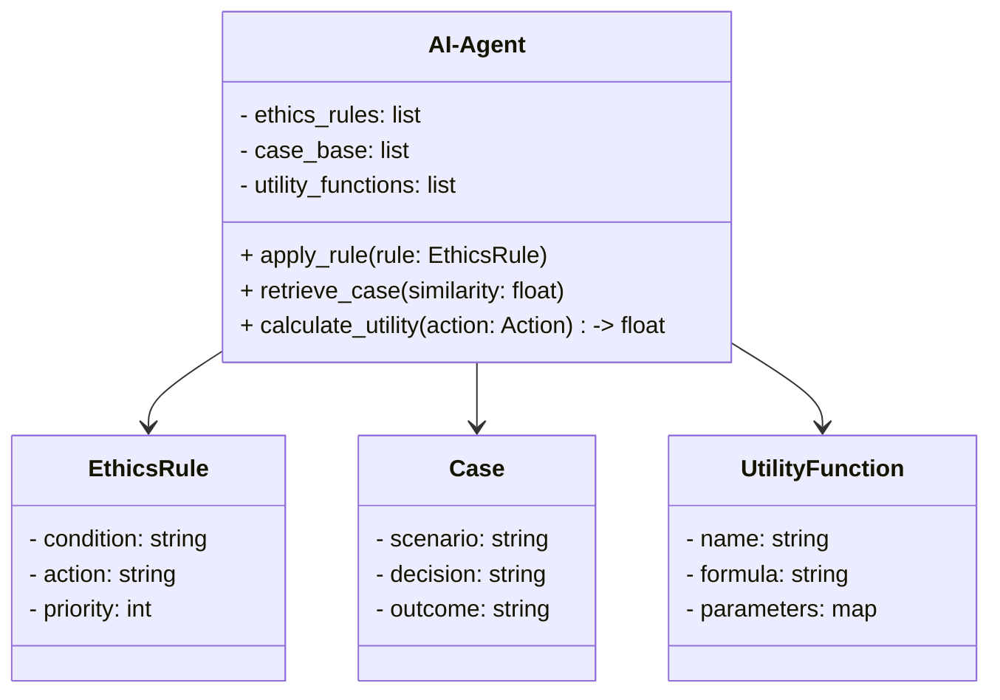
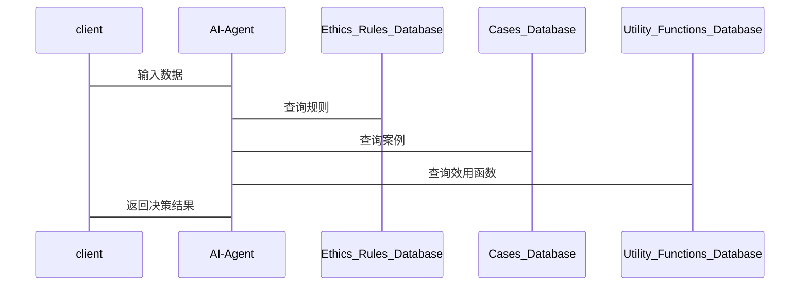

                 


# 《构建AI Agent的道德推理框架》

---

## 关键词：AI Agent，道德推理，伦理决策，框架构建，系统设计

---

## 摘要：在AI技术迅速发展的背景下，构建具备道德推理能力的AI Agent变得尤为重要。本文从AI Agent的基本概念出发，详细探讨了道德推理框架的核心原理、算法实现以及系统设计。通过实际案例分析，本文提出了一个结合规则、案例和效用推理的综合性道德推理框架，并通过Mermaid图和Python代码示例，展示了该框架的具体实现方法。最后，本文总结了构建AI Agent道德推理框架的关键点，并展望了未来的研究方向。

---

# 第一部分: AI Agent与道德推理框架的背景介绍

## 第1章: AI Agent与道德推理的背景

### 1.1 AI Agent的基本概念

#### 1.1.1 AI Agent的定义与特点

AI Agent（人工智能代理）是指能够感知环境并采取行动以实现目标的智能体。与传统程序不同，AI Agent具有以下特点：

- **自主性**：能够在没有外部干预的情况下自主决策。
- **反应性**：能够实时感知环境并做出反应。
- **目标导向**：所有行为都以实现特定目标为导向。
- **社会能力**：能够与其他AI Agent或人类进行交互和协作。

#### 1.1.2 AI Agent的分类与应用场景

AI Agent可以根据智能水平和决策方式分为以下几类：

1. **简单反射型AI Agent**：基于固定的规则对输入做出反应，适用于简单任务。
2. **基于模型的反射型AI Agent**：利用内部模型和状态进行决策，适用于复杂环境。
3. **目标驱动型AI Agent**：以特定目标为导向，主动规划行动方案。
4. **效用驱动型AI Agent**：通过最大化效用函数来做出决策。

**应用场景**：
- **自动驾驶**：AI Agent需要在复杂交通环境中做出实时决策。
- **医疗辅助决策**：AI Agent帮助医生制定治疗方案，考虑伦理和患者利益。
- **智能客服**：通过自然语言处理与用户交互，提供个性化服务。
- **智能家居**：根据用户习惯和需求自动调节设备。

#### 1.1.3 道德推理在AI Agent中的重要性

在AI Agent的决策过程中，道德推理是确保决策符合伦理标准的关键环节。例如，在自动驾驶中，AI Agent需要在紧急情况下做出道德决策，如优先救助谁。这种决策直接影响结果的正确性和社会接受度。因此，构建具备道德推理能力的AI Agent对技术发展和社会信任至关重要。

---

### 1.2 道德推理框架的定义与核心要素

#### 1.2.1 道德推理的定义与基本原理

道德推理是通过逻辑和伦理原则来判断和选择最佳行动方案的过程。它涉及以下基本原理：

1. **基于规则的推理**：根据预定义的伦理规则进行判断。
2. **基于案例的推理**：通过类比和案例分析进行推理。
3. **基于效用的推理**：通过计算不同行动的效用值来选择最优方案。

#### 1.2.2 道德推理框架的核心要素

道德推理框架由以下核心要素组成：

1. **伦理原则库**：包含如尊重、不伤害、公正等核心伦理原则。
2. **决策规则集**：定义在不同情境下的决策规则。
3. **案例库**：存储历史道德决策案例及其结果。
4. **效用函数集**：用于计算不同行动的效用值。

#### 1.2.3 道德推理框架的边界与外延

- **边界**：道德推理框架专注于AI Agent的决策过程，不涉及感知和学习阶段。
- **外延**：可以扩展至多智能体系统和分布式决策系统。

---

## 第2章: AI Agent与道德推理框架的核心概念与联系

### 2.1 AI Agent与道德推理框架的关系

#### 2.1.1 AI Agent的决策机制

AI Agent的决策机制包括以下步骤：

1. **感知环境**：通过传感器或其他数据源获取环境信息。
2. **分析信息**：对信息进行处理和分析，识别可能的行动。
3. **推理与选择**：基于道德推理框架对可能行动进行推理，选择最优方案。
4. **执行行动**：根据选择的结果执行具体行动。

#### 2.1.2 道德推理在AI Agent决策中的作用

道德推理在AI Agent的决策过程中起到关键作用，主要体现在以下几个方面：

1. **伦理判断**：确保AI Agent的决策符合伦理标准。
2. **冲突解决**：在不同伦理原则冲突时，提供解决方案。
3. **动态适应**：根据环境变化动态调整决策策略。

---

### 2.2 道德推理框架的核心原理

#### 2.2.1 基于规则的道德推理

基于规则的道德推理是一种简单直接的方法，适用于规则明确的场景。例如，在自动驾驶中，如果规则明确“优先救助行人”，AI Agent可以直接根据规则做出决策。

#### 2.2.2 基于案例的道德推理

基于案例的道德推理通过分析相似案例来推导决策。这种方法适用于复杂场景，如医疗诊断中的伦理决策。

#### 2.2.3 基于效用的道德推理

基于效用的道德推理通过计算不同行动的效用值来选择最优方案。例如，在自动驾驶中，计算不同决策的后果，选择对利益相关者损害最小的方案。

---

### 2.3 核心概念的属性对比

以下表格对比了AI Agent与道德推理框架的核心概念：

| **属性**       | **AI Agent**                     | **道德推理框架**                |
|-----------------|----------------------------------|-------------------------------|
| **核心功能**     | 感知环境并采取行动               | 推理和选择最优行动             |
| **决策方式**     | 基于规则、案例或效用             | 基于伦理原则和逻辑推理         |
| **适用场景**     | 自动驾驶、医疗、智能客服等       | 道德决策、伦理判断             |
| **依赖因素**     | 环境数据、目标函数               | 伦理规则、案例库、效用函数     |

---

## 第3章: 道德推理框架的算法原理

### 3.1 道德推理算法的概述

#### 3.1.1 基于规则的道德推理算法

基于规则的道德推理算法通过匹配规则库中的条件来选择最优规则。例如：

1. **输入**：当前环境信息。
2. **处理**：匹配规则库中的规则。
3. **输出**：选择匹配规则的行动。

#### 3.1.2 基于案例的道德推理算法

基于案例的道德推理算法通过检索相似案例进行推理。例如：

1. **输入**：当前环境信息。
2. **处理**：检索案例库中的相似案例。
3. **输出**：基于相似案例的决策结果。

#### 3.1.3 基于效用的道德推理算法

基于效用的道德推理算法通过计算不同行动的效用值选择最优方案。例如：

1. **输入**：当前环境信息。
2. **处理**：计算各行动的效用值。
3. **输出**：选择效用值最高的行动。

---

### 3.2 道德推理算法的实现步骤

#### 3.2.1 数据输入与预处理

- **数据输入**：接收环境数据和用户指令。
- **数据预处理**：清洗和格式转换，确保数据符合模型要求。

#### 3.2.2 规则匹配与案例检索

- **规则匹配**：在规则库中查找匹配的规则。
- **案例检索**：在案例库中检索相似案例。

#### 3.2.3 效用计算与结果输出

- **效用计算**：计算各行动的效用值。
- **结果输出**：选择效用值最高的行动作为输出结果。

---

### 3.3 道德推理算法的数学模型

#### 3.3.1 基于规则的数学模型

$$ R = \{r_1, r_2, ..., r_n\} $$

其中，$R$表示规则集合，每个$r_i$是一个规则。

#### 3.3.2 基于案例的数学模型

$$ S = \sum_{i=1}^{n} w_i \cdot s_i $$

其中，$S$表示相似度总和，$w_i$是权重，$s_i$是相似度。

#### 3.3.3 基于效用的数学模型

$$ U = \sum_{i=1}^{n} u_i \cdot p_i $$

其中，$U$表示总效用，$u_i$是效用权重，$p_i$是概率。

---

## 第4章: 道德推理框架的系统分析与架构设计

### 4.1 问题场景介绍

#### 4.1.1 AI Agent在医疗领域的道德推理场景

在医疗领域，AI Agent需要在有限资源的情况下，优先救治哪些患者。例如，在疫情中，AI Agent需要根据病情严重程度、患者年龄等因素进行伦理决策。

#### 4.1.2 AI Agent在自动驾驶中的道德推理场景

在自动驾驶中，AI Agent需要在紧急情况下做出道德决策，例如在不可避免的事故中，优先救助谁。

---

### 4.2 系统功能设计

#### 4.2.1 领域模型类图

使用Mermaid绘制领域模型类图：



---

### 4.3 系统架构设计

#### 4.3.1 系统架构图

使用Mermaid绘制系统架构图：

```mermaid
boxDiagram
    System {
        AI-Agent
        Ethics_Rules_Database
        Cases_Database
        Utility_Functions_Database
    }
```

---

### 4.4 接口设计

- **输入接口**：接收环境数据和用户指令。
- **输出接口**：提供决策结果和解释。

---

### 4.5 交互序列图

使用Mermaid绘制交互序列图：



---

## 第5章: 项目实战

### 5.1 环境安装

- **安装Python**：确保安装Python 3.x及以上版本。
- **安装Mermaid CLI**：用于生成图表。
- **安装Jupyter Notebook**：用于代码实现和测试。

### 5.2 系统核心实现源代码

以下是AI Agent的Python实现示例：

```python
class AIAGENT:
    def __init__(self):
        self.ethics_rules = []  # 存储伦理规则
        self.case_base = []     # 存储案例
        self.utility_functions = []  # 存储效用函数

    def apply_rule(self, rule):
        # 应用规则进行决策
        pass

    def retrieve_case(self, similarity):
        # 根据相似度检索案例
        pass

    def calculate_utility(self, action):
        # 计算行动的效用值
        pass

class ETHICSRULE:
    def __init__(self, condition, action, priority):
        self.condition = condition
        self.action = action
        self.priority = priority

class CASE:
    def __init__(self, scenario, decision, outcome):
        self.scenario = scenario
        self.decision = decision
        self.outcome = outcome

class UTILITYFUNCTION:
    def __init__(self, name, formula, parameters):
        self.name = name
        self.formula = formula
        self.parameters = parameters

# 示例代码
agent = AIAGENT()
rule = ETHICSRULE("紧急情况", "优先救助伤者", 1)
case = CASE("车祸现场", "救助儿童", "成功")
utility = UTILITYFUNCTION("紧急情况效用", "max_utility", {"weight": 0.8})
agent.ethics_rules.append(rule)
agent.case_base.append(case)
agent.utility_functions.append(utility)
```

### 5.3 代码应用解读与分析

- **AIAGENT类**：管理伦理规则、案例和效用函数。
- **ETHICSRULE类**：定义具体的伦理规则。
- **CASE类**：存储案例数据。
- **UTILITYFUNCTION类**：定义效用函数。

---

### 5.4 案例分析与实际应用

以自动驾驶为例，展示如何使用上述代码进行决策：

假设在紧急情况下，AI Agent需要决定是撞向护栏还是转向旁边的车辆。通过道德推理框架，AI Agent会考虑以下因素：

1. **规则匹配**：检查是否有相关规则，如“避免伤害人类”。
2. **案例检索**：检索类似场景的案例，如“紧急转向导致轻微碰撞”。
3. **效用计算**：计算两种行动的效用值，选择对利益相关者损害最小的方案。

---

### 5.5 项目小结

- **关键点**：
  - 确保道德推理框架的规则库、案例库和效用函数的完善性。
  - 在实际应用中，需要根据具体场景调整算法参数。
- **注意事项**：
  - 定期更新规则库和案例库，以适应社会伦理的变化。
  - 在复杂场景中，可能需要结合多种推理方法。

---

## 第6章: 最佳实践与拓展阅读

### 6.1 最佳实践

- **规则库管理**：定期更新和维护规则库，确保其符合最新伦理标准。
- **案例库优化**：增加多样化的案例，提高推理的准确性。
- **效用函数设计**：根据具体场景设计合理的效用函数，确保计算的公平性。

### 6.2 小结

本文详细探讨了构建AI Agent道德推理框架的关键点，包括核心概念、算法原理和系统设计。通过实际案例分析，展示了如何将理论应用于实践。

### 6.3 注意事项

- 道德推理框架的开发需要多学科合作，包括伦理学家、数据科学家和软件工程师。
- 在实际应用中，需考虑法律和伦理的复杂性，确保AI Agent的决策符合法律法规。

### 6.4 拓展阅读

- **推荐书籍**：
  - 《道德机器》（Moral Machines）：探讨AI系统中的道德决策问题。
  - 《人工智能：一种现代的方法》（Artificial Intelligence: A Modern Approach）：系统介绍人工智能的理论与实践。
- **推荐论文**：
  - “道德推理在自动驾驶中的应用”（Moral Reasoning in Autonomous Vehicles）
  - “基于效用的道德决策模型”（Utility-based Moral Decision Making Models）

---

## 作者

作者：AI天才研究院/AI Genius Institute & 禅与计算机程序设计艺术 /Zen And The Art of Computer Programming

---

以上是《构建AI Agent的道德推理框架》的技术博客文章的完整目录和内容框架。

