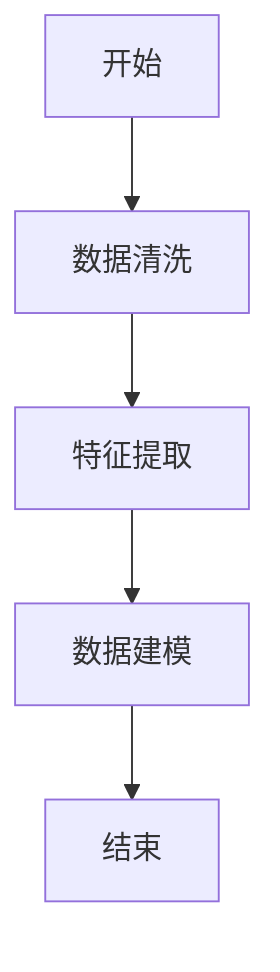
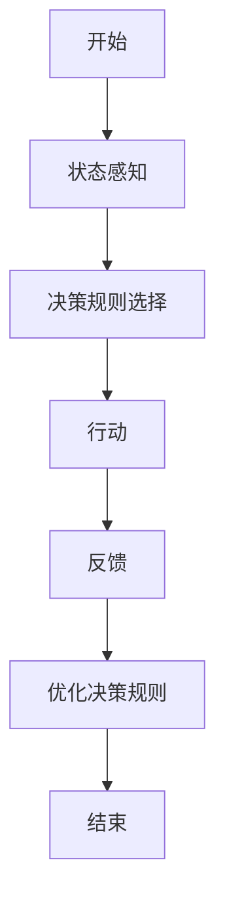
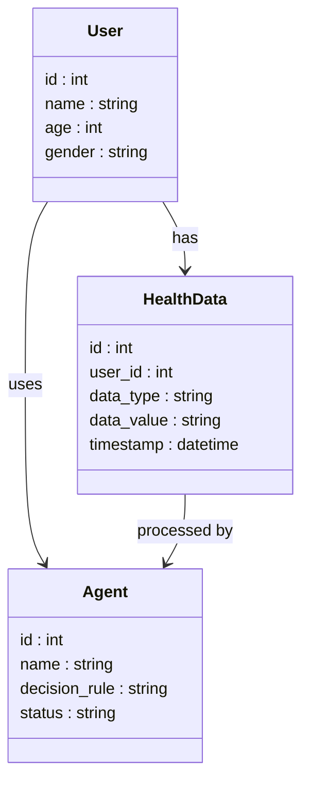
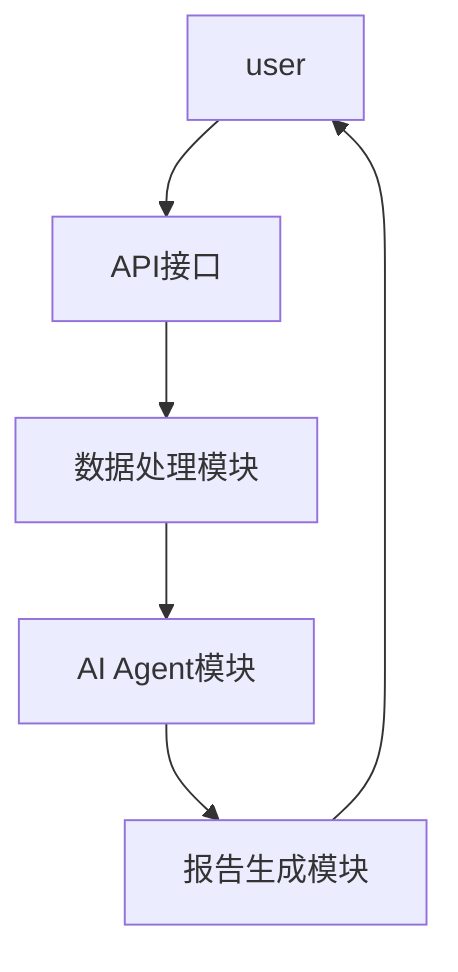

                 


# 构建AI Agent驱动的智能健康管理系统

> 关键词：AI Agent，智能健康管理系统，健康管理，人工智能，系统架构

> 摘要：本文将详细探讨如何构建一个基于AI Agent的智能健康管理系统。首先，我们将分析当前健康管理模式的局限性，并引出AI Agent在其中的应用潜力。接着，我们将深入讲解AI Agent的核心原理及其在智能健康管理系统中的作用。随后，我们将分析系统的算法原理，包括健康数据分析算法和AI Agent决策算法的实现。最后，我们将从系统架构设计、功能模块实现、接口设计和交互流程等方面，详细阐述系统的构建过程，并通过实际案例分析，展示系统的实际应用场景和效果。

---

# 第一部分：背景介绍

## 第1章：问题背景与需求分析

### 1.1 问题背景

#### 1.1.1 当前健康管理模式的局限性
传统健康管理模式主要依赖于人工记录和简单的数据统计，存在以下问题：
- 数据分散：健康数据来源多样（如穿戴设备、医疗记录、饮食日志等），难以整合。
- 数据分析复杂：手动分析大量数据耗时且容易出错。
- 个性化不足：缺乏针对个体的个性化健康建议。

#### 1.1.2 AI技术在健康管理中的应用潜力
AI技术的快速发展为健康管理带来了新的可能性：
- 数据处理能力：AI能够高效处理和分析大量健康数据。
- 个性化推荐：AI可以根据用户数据提供个性化的健康建议。
- 实时监控：AI能够实时分析健康数据，及时发现异常。

#### 1.1.3 智能健康管理系统的核心问题
智能健康管理系统需要解决以下核心问题：
- 如何高效采集和处理多源健康数据？
- 如何构建AI Agent，使其能够根据数据做出智能决策？
- 如何设计系统架构，使其具备可扩展性和可维护性？

### 1.2 问题描述

#### 1.2.1 用户健康数据的多样性与复杂性
用户健康数据包括：
- 基本信息：年龄、性别、体重等。
- 日常数据：饮食记录、运动数据、睡眠记录。
- 医疗数据：病史、用药记录、检查报告。

#### 1.2.2 健康管理的个性化需求
不同用户的健康状况和需求差异很大，例如：
- 某些用户可能需要关注体重管理，而另一些用户可能关注慢性病控制。

#### 1.2.3 系统功能与性能的平衡
系统需要在功能丰富性和性能稳定性之间找到平衡点。

### 1.3 问题解决

#### 1.3.1 AI Agent在健康管理中的作用
AI Agent可以实现以下功能：
- 数据采集与整合：自动收集用户的健康数据。
- 数据分析：利用机器学习算法对数据进行分析。
- 智能决策：根据分析结果生成个性化建议。

#### 1.3.2 智能健康管理系统的目标与价值
目标：
- 提供个性化的健康管理服务。
- 实现实时健康监测和预警。
- 帮助用户养成良好的健康习惯。

价值：
- 提高用户的健康水平。
- 降低医疗成本。
- 提升用户的满意度。

#### 1.3.3 系统边界与外延
系统边界：
- 输入：用户健康数据、用户指令。
- 输出：个性化建议、健康报告。
- 界面：用户界面、API接口。

外延：
- 可扩展性：支持更多健康数据源的接入。
- 可扩展性：支持更多健康应用场景。

---

## 第2章：核心概念与联系

### 2.1 AI Agent的基本原理

#### 2.1.1 AI Agent的定义与特点
AI Agent是一个智能实体，能够感知环境并采取行动以实现目标。其特点包括：
- 智能性：能够理解数据并做出决策。
- 自主性：能够在没有人工干预的情况下运行。
- 反应性：能够实时响应环境变化。

#### 2.1.2 AI Agent的核心属性与特征对比
| 属性       | 传统算法         | AI Agent          |
|------------|------------------|-------------------|
| 决策方式     | 基于规则         | 基于数据驱动       |
| 学习能力     | 无               | 有                 |
| 适应性       | 无               | 有                 |

#### 2.1.3 AI Agent与传统算法的区别
AI Agent能够根据环境反馈进行自我优化，而传统算法需要人工干预才能调整。

### 2.2 智能健康管理系统的核心要素

#### 2.2.1 用户健康数据的结构化与标准化
健康数据需要进行结构化处理，例如将文本数据转化为结构化数据，以便AI Agent能够理解和分析。

#### 2.2.2 AI Agent的决策逻辑与规则
AI Agent需要根据健康数据制定决策规则，例如：
- 如果用户的BMI指数过高，则建议减少热量摄入。
- 如果用户的睡眠质量差，则建议调整作息时间。

#### 2.2.3 系统功能模块的构成
系统功能模块包括：
- 数据采集模块：负责采集用户的健康数据。
- 数据分析模块：对数据进行分析并生成健康报告。
- 决策模块：根据分析结果制定个性化建议。

### 2.3 核心概念的ER实体关系图

```mermaid
erDiagram
    user {
        id : int
        name : string
        age : int
        gender : string
        health_data : HealthData
    }
    health_data {
        id : int
        user_id : int
        data_type : string
        data_value : string
        timestamp : datetime
    }
    agent {
        id : int
        name : string
        decision_rule : string
        status : string
    }
    user --> health_data : has
    user --> agent : uses
    health_data --> agent : processed by
```

---

## 第3章：算法原理

### 3.1 智能健康数据分析算法

#### 3.1.1 算法介绍
健康数据分析算法包括：
- 数据清洗：去除噪声数据。
- 数据特征提取：提取关键特征。
- 数据建模：构建预测模型。

#### 3.1.2 算法实现

```python
import pandas as pd
from sklearn.tree import DecisionTreeClassifier

# 数据清洗
data = pd.read_csv('health_data.csv')
data = data.dropna()

# 特征提取
X = data[['age', 'weight', 'height']]
y = data['health_status']

# 数据建模
model = DecisionTreeClassifier()
model.fit(X, y)
```

#### 3.1.3 算法流程图



### 3.2 AI Agent决策算法

#### 3.2.1 算法介绍
AI Agent决策算法包括：
- 基于规则的决策树。
- 基于强化学习的策略优化。

#### 3.2.2 算法实现

```python
import numpy as np

# 决策树模型
class DecisionTreeAgent:
    def __init__(self):
        self.rules = []

    def learn(self, data):
        # 假设数据已经预处理好
        pass

    def decide(self, input):
        # 根据规则进行决策
        return '建议减少热量摄入'

# 强化学习模型
class QLearningAgent:
    def __init__(self, actions):
        self.Q = {}
        self.actions = actions

    def choose_action(self, state):
        # 选择动作
        pass

    def learn(self, state, action, reward):
        # 更新Q值
        pass
```

#### 3.2.3 算法流程图



---

## 第4章：系统分析与架构设计

### 4.1 系统功能设计

#### 4.1.1 领域模型



### 4.2 系统架构设计

#### 4.2.1 系统架构图



### 4.3 接口设计

#### 4.3.1 系统接口

- 数据接口：负责数据的导入和导出。
- API接口：提供给其他系统调用的接口。

### 4.4 交互流程

#### 4.4.1 交互流程图


---

## 第5章：项目实战

### 5.1 环境安装

#### 5.1.1 安装Python

```bash
python --version
pip install --upgrade pip
```

#### 5.1.2 安装依赖库

```bash
pip install numpy pandas scikit-learn
```

### 5.2 系统核心实现

#### 5.2.1 数据采集模块

```python
import csv

def collect_data(user_id):
    with open(f'user_{user_id}_data.csv', 'w') as f:
        writer = csv.writer(f)
        writer.writerow(['timestamp', 'heart_rate', 'temperature'])
        for i in range(10):
            writer.writerow([i, 75 + i, 36.5 + i * 0.1])
```

#### 5.2.2 数据分析模块

```python
import pandas as pd
from sklearn.tree import DecisionTreeClassifier

def analyze_data(data_path):
    data = pd.read_csv(data_path)
    X = data[['age', 'weight', 'height']]
    y = data['health_status']
    model = DecisionTreeClassifier()
    model.fit(X, y)
    return model
```

#### 5.2.3 AI Agent模块

```python
class AIAssistant:
    def __init__(self):
        self.model = None

    def train(self, data):
        # 假设数据已经预处理好
        pass

    def give_advice(self, user_data):
        # 根据模型生成建议
        return '建议进行适量运动'
```

### 5.3 案例分析

#### 5.3.1 案例背景

假设用户A的健康数据如下：
- 年龄：30岁
- 体重：80kg
- BMI指数：28

#### 5.3.2 系统输出

AI Agent根据数据生成建议：
- 建议用户减少热量摄入，增加运动量。

### 5.4 项目小结

通过实际案例分析，我们可以看到AI Agent在智能健康管理系统中的巨大潜力。系统的实现不仅能够提高用户的健康水平，还能降低医疗成本。

---

## 第6章：总结与展望

### 6.1 最佳实践

- 数据的多样性和准确性是系统的核心，必须重视数据的采集和处理。
- 系统的可扩展性和可维护性需要在设计阶段就考虑进去。
- 用户的隐私保护是系统设计中不可忽视的重要部分。

### 6.2 小结

本文详细探讨了如何构建一个基于AI Agent的智能健康管理系统，涵盖了系统的背景、核心概念、算法原理、系统架构设计和项目实战等部分。

### 6.3 注意事项

- 系统的实时性和响应速度需要重点关注。
- 数据的隐私和安全保护是系统设计中的重要部分。

### 6.4 拓展阅读

- 《机器学习实战》
- 《深度学习》
- 《自然语言处理入门》

---

作者：AI天才研究院/AI Genius Institute & 禅与计算机程序设计艺术/Zen And The Art of Computer Programming

