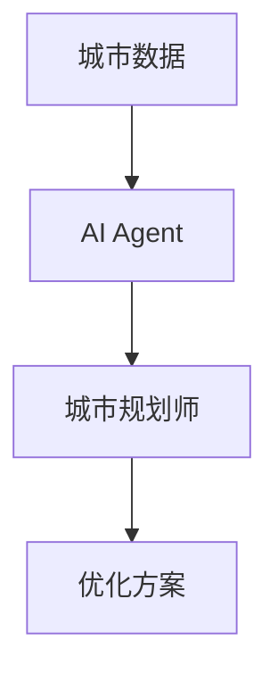
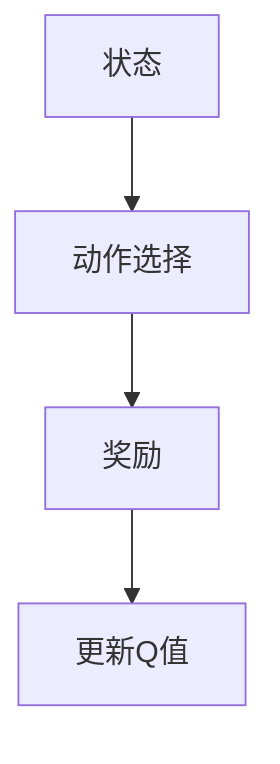
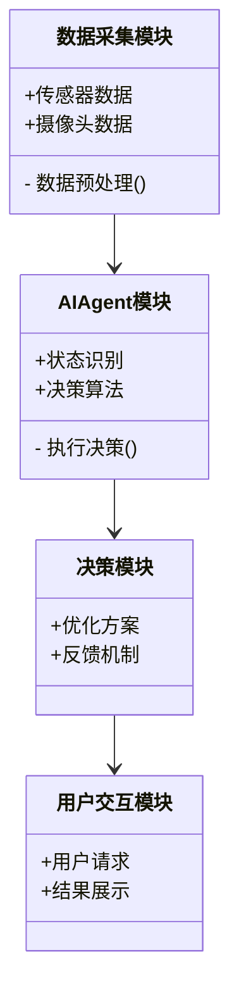
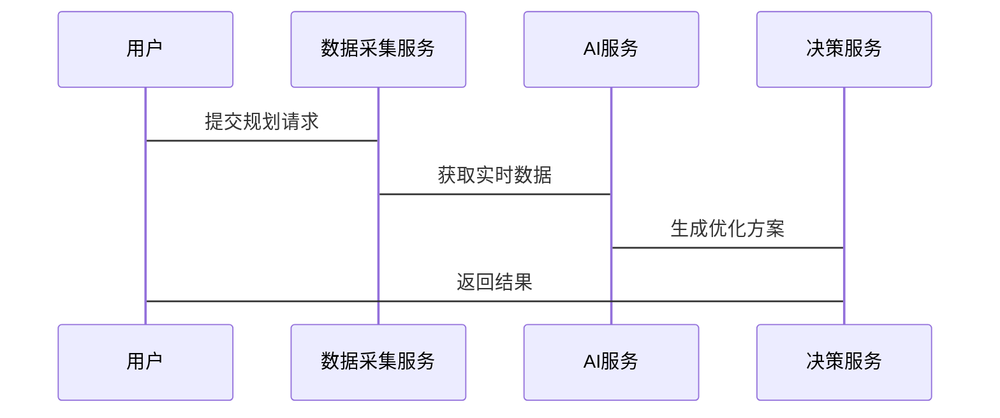

                 


# 构建AI Agent驱动的智能城市规划系统

## 关键词：AI Agent、智能城市规划、强化学习、系统架构、项目实战

## 摘要：
本文详细探讨了如何利用AI Agent构建智能城市规划系统，涵盖了从理论到实践的各个方面。通过分析AI Agent的核心概念、算法原理、系统架构设计以及实际案例，本文为读者提供了一套完整的解决方案，帮助他们在城市规划中高效地应用AI技术。

---

# 第一部分: 背景介绍

## 第1章: AI Agent驱动的智能城市规划系统概述

### 1.1 问题背景
#### 1.1.1 城市化带来的挑战
随着城市化进程的加快，城市面临着交通拥堵、资源分配不均、环境污染等一系列问题。传统的城市规划方法依赖人工经验，效率低下且难以应对复杂多变的动态需求。

#### 1.1.2 传统城市规划的局限性
- 数据量大，处理复杂。
- 人工经验有限，难以覆盖所有场景。
- 无法实时响应城市变化。

#### 1.1.3 AI Agent在城市规划中的作用
AI Agent（智能体）能够通过数据感知、自主决策和持续优化，帮助城市规划者更高效地解决问题，提升城市运行效率。

### 1.2 问题描述
#### 1.2.1 智慧城市的需求
智慧城市建设需要实时数据处理、动态优化和智能化决策支持。

#### 1.2.2 AI Agent在城市规划中的具体应用
- 交通流量优化。
- 公共资源分配。
- 应急响应规划。

#### 1.2.3 系统的目标与意义
构建AI Agent驱动的城市规划系统，旨在提高城市运行效率，降低资源浪费，提升居民生活质量。

### 1.3 问题解决
#### 1.3.1 AI Agent的核心功能
- 数据感知：通过传感器、摄像头等设备采集城市数据。
- 自主决策：基于数据进行分析，制定优化方案。
- 持续优化：根据反馈不断调整策略。

#### 1.3.2 系统的模块化设计
- 数据采集模块。
- AI Agent模块。
- 决策模块。
- 用户交互模块。

#### 1.3.3 边界与外延
- 适用范围：交通、资源分配等领域。
- 扩展方向：环境监测、能源管理等。

### 1.4 概念结构与核心要素
- 数据采集与处理。
- AI Agent的决策机制。
- 用户交互界面。

---

# 第二部分: 核心概念与联系

## 第2章: AI Agent的核心原理与城市规划的结合

### 2.1 AI Agent的核心原理
AI Agent通过感知、决策和执行三个阶段，实现自主问题解决。

### 2.2 AI Agent与传统自动化的对比
| 属性 | AI Agent | 传统自动化 |
|------|-----------|-------------|
| 感知 | 具备       | 无           |
| 决策 | 自主       | 预定义       |
| 执行 | 可调整     | 固定流程     |

### 2.3 系统实体关系图


---

# 第三部分: 算法原理讲解

## 第3章: 强化学习在AI Agent中的应用

### 3.1 强化学习的基本原理
强化学习通过试错机制，优化AI Agent的决策策略。

### 3.2 强化学习流程图


### 3.3 强化学习数学模型
$$ Q(s,a) = (1-\alpha)Q(s,a) + \alpha(r + \gamma \max Q(s',a')) $$

### 3.4 Python代码示例
```python
import numpy as np

class QLearningAgent:
    def __init__(self, state_space, action_space, alpha=0.1, gamma=0.9):
        self.state_space = state_space
        self.action_space = action_space
        self.alpha = alpha
        self.gamma = gamma
        self.q_table = np.zeros((state_space, action_space))

    def choose_action(self, state):
        if np.random.random() < 0.9:
            return np.argmax(self.q_table[state, :])
        else:
            return np.random.randint(self.action_space)

    def update_q(self, state, action, reward, next_state):
        self.q_table[state, action] = self.q_table[state, action] * (1 - self.alpha) + self.alpha * (reward + self.gamma * np.max(self.q_table[next_state, :]))
```

### 3.5 实际案例分析
通过一个简单的交通信号灯优化案例，展示强化学习的应用。

---

# 第四部分: 系统分析与架构设计方案

## 第4章: 系统架构设计

### 4.1 项目背景
介绍AI Agent驱动的城市规划系统的开发背景和目标。

### 4.2 系统功能设计


### 4.3 系统架构设计
采用微服务架构，展示各个服务的交互关系。

### 4.4 系统接口设计
定义数据采集接口、AI决策接口等。

### 4.5 系统交互流程图


---

# 第五部分: 项目实战

## 第5章: 项目实战与案例分析

### 5.1 环境搭建
- 安装Python、TensorFlow、Flask等工具。

### 5.2 系统核心实现
提供AI Agent模块的源代码，并解释代码的功能。

### 5.3 代码应用场景
展示如何将代码应用于交通信号灯优化。

### 5.4 案例分析
通过实际案例，详细讲解系统的运行过程和结果。

### 5.5 项目小结
总结项目开发的经验和教训。

---

# 第六部分: 最佳实践

## 第6章: 最佳实践与注意事项

### 6.1 最佳实践
- 数据质量的重要性。
- 模型的可解释性。
- 系统的可扩展性。

### 6.2 小结
回顾全书内容，强调AI Agent在城市规划中的重要性。

### 6.3 注意事项
- 数据隐私保护。
- 模型的泛化能力。

### 6.4 拓展阅读
推荐相关书籍和论文，供读者深入学习。

---

# 作者：AI天才研究院 & 禅与计算机程序设计艺术

