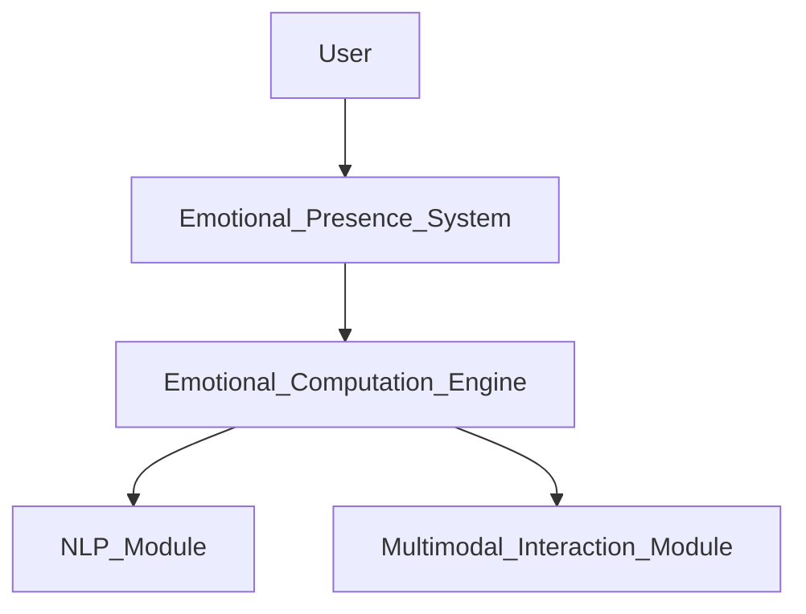
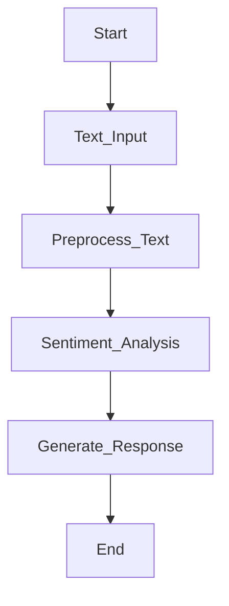
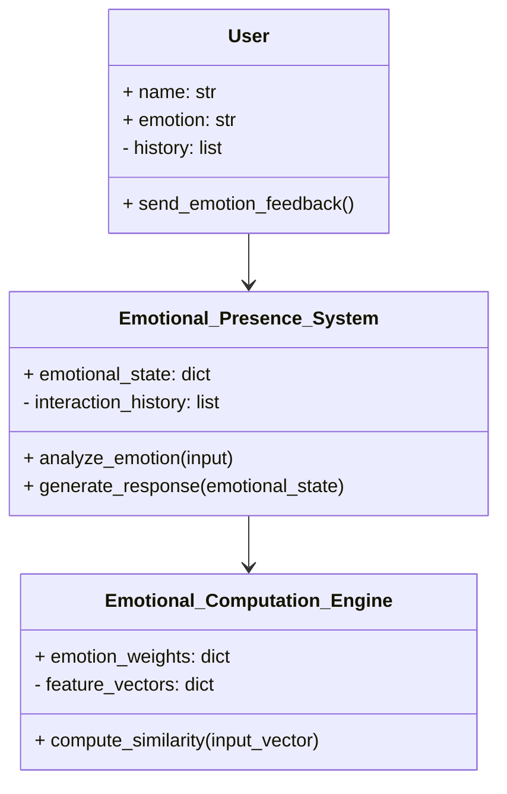
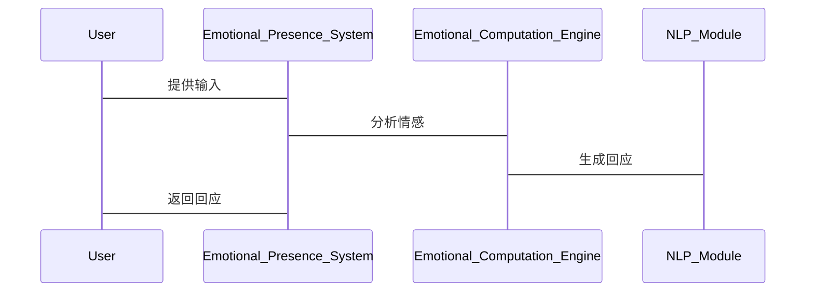

                 


# 构建AI Agent驱动的智能情感陪伴系统

> 关键词：AI Agent, 智能情感陪伴, 自然语言处理, 多模态交互, 情感计算

> 摘要：本文详细探讨了构建AI Agent驱动的智能情感陪伴系统的各个方面，从核心概念到算法原理，再到系统架构和项目实战，为读者提供全面的技术指导。

---

## 第一章: 背景介绍

### 1.1 问题背景
传统的人机交互方式缺乏情感支持，用户在与机器互动时往往感到冰冷和缺乏反馈。随着AI技术的发展，情感陪伴系统逐渐成为可能，通过AI Agent提供情感支持和心理疏导。

### 1.2 问题描述
情感陪伴系统需要具备理解用户情感、提供情感反馈和进行多模态交互的能力。现有技术在情感计算和自然语言处理方面仍有不足，无法满足用户深层次的情感需求。

### 1.3 问题解决思路
引入AI Agent，结合情感计算和多模态交互技术，构建一个能够理解并回应用户情感需求的系统。通过自然语言处理和情感分析，系统可以识别用户情绪并做出适当的回应。

### 1.4 系统边界与外延
系统功能包括情感陪伴、信息交互和反馈优化。外延方面，系统可与其他AI系统协同工作，扩展功能和应用场景。

### 1.5 核心概念结构
系统由用户、情感陪伴系统、情感计算引擎和多模态交互模块组成，形成一个完整的生态体系。

---

## 第二章: 核心概念与原理

### 2.1 AI Agent的定义与分类
AI Agent是具备自主决策和交互能力的智能体，分为简单反射型、基于模型的反应型、目标驱动型和实用驱动型。情感陪伴系统主要使用目标驱动型AI Agent。

### 2.2 情感计算与自然语言处理
情感计算通过分析用户的情绪状态，提供情感反馈。自然语言处理用于理解用户的语言输入，提取情感信息。

### 2.3 多模态交互技术
多模态交互结合文本、语音、图像等多种输入方式，提升用户体验。情感陪伴系统需要处理多种数据类型，以提供更丰富的反馈。

### 2.4 ER实体关系图


---

## 第三章: 算法原理

### 3.1 情感分析算法流程


### 3.2 情感相似度计算公式
$$ \text{similarity} = \frac{\sum_{i=1}^{n} w_i \cdot f_i}{\sqrt{\sum_{i=1}^{n} w_i^2} \cdot \sqrt{\sum_{i=1}^{n} f_i^2}} $$
其中，\(w_i\) 是情感词的权重，\(f_i\) 是情感特征的值。

### 3.3 Python代码实现
```python
import numpy as np

def calculate_similarity(vector1, vector2):
    numerator = np.sum(vector1 * vector2)
    denominator = np.sqrt(np.sum(vector1**2)) * np.sqrt(np.sum(vector2**2))
    return numerator / denominator

# 示例向量
vector_a = np.array([1, 2, 3])
vector_b = np.array([4, 5, 6])
similarity = calculate_similarity(vector_a, vector_b)
print(similarity)
```

---

## 第四章: 系统分析与架构设计

### 4.1 问题场景介绍
用户通过文本、语音或图像与系统互动，系统根据用户情感状态提供相应的反馈。

### 4.2 系统功能设计


### 4.3 系统架构设计


### 4.4 系统接口设计
系统提供API接口，支持文本、语音和图像输入，返回情感分析结果和生成的回应。

### 4.5 交互流程图


---

## 第五章: 项目实战

### 5.1 环境安装
安装Python、TensorFlow、NLTK和相关库，配置开发环境。

### 5.2 核心代码实现
```python
import tensorflow as tf
from tensorflow.keras import layers

model = tf.keras.Sequential([
    layers.Dense(64, activation='relu'),
    layers.Dense(1, activation='sigmoid')
])

model.compile(optimizer='adam', loss='binary_crossentropy', metrics=['accuracy'])
model.fit(x_train, y_train, epochs=10, batch_size=32)
```

### 5.3 案例分析
通过具体案例展示系统如何分析用户情感并生成适当的回应，分析系统的准确性和响应速度。

---

## 第六章: 最佳实践

### 6.1 经验总结
数据质量、算法优化和用户体验是关键因素。需要不断优化模型，并收集用户反馈以改进系统。

### 6.2 注意事项
保护用户隐私，确保数据安全。在设计交互界面时，注重用户体验，避免技术复杂性影响使用。

### 6.3 拓展阅读
推荐相关书籍和论文，深入学习情感计算和多模态交互技术。

---

## 作者：AI天才研究院

本文由AI天才研究院撰写，转载请注明出处。

