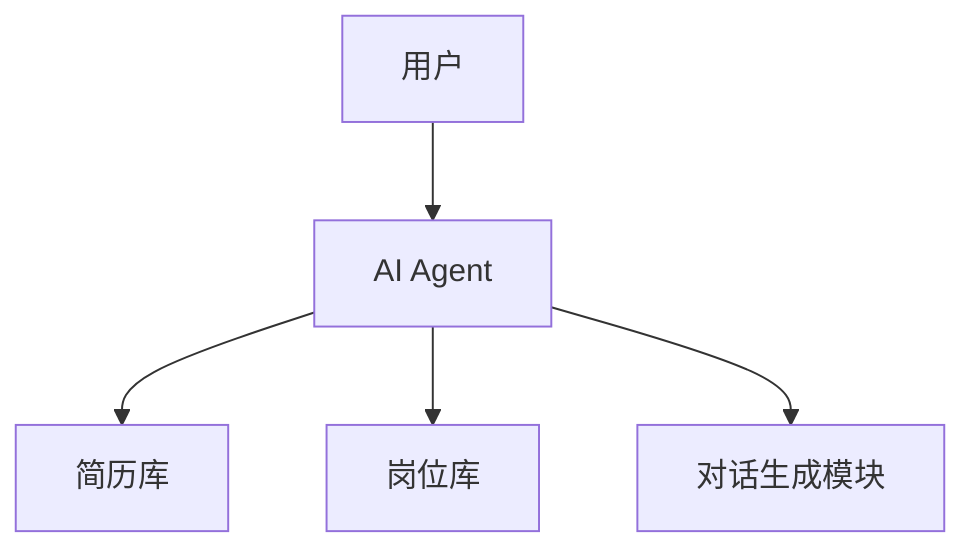
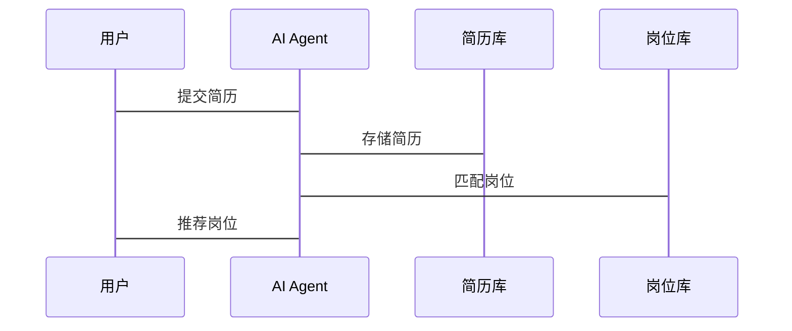

                 


# 构建AI Agent驱动的智能招聘系统

## 关键词：AI Agent, 智能招聘系统, 招聘流程优化, 自然语言处理, 知识图谱

## 摘要：  
随着人工智能技术的飞速发展，AI Agent（人工智能代理）在各个领域的应用日益广泛。智能招聘系统作为企业人力资源管理的重要组成部分，正逐步通过AI Agent技术实现招聘流程的智能化和自动化。本文将深入探讨AI Agent在智能招聘系统中的核心作用，分析其在简历筛选、面试安排、岗位匹配等方面的优势，结合具体应用场景，详细讲解AI Agent的算法原理、系统架构设计以及实际项目实现。通过本文的阅读，读者将能够全面理解如何利用AI Agent构建高效、智能的招聘系统，从而为企业节省时间和成本，提升招聘效率和质量。

---

# 第1章: AI Agent与智能招聘系统概述

## 1.1 AI Agent的基本概念

### 1.1.1 AI Agent的定义与特点  
AI Agent（人工智能代理）是指能够感知环境、自主决策并执行任务的智能实体。它具备以下特点：  
- **自主性**：能够在没有人工干预的情况下独立完成任务。  
- **反应性**：能够实时感知环境变化并做出相应的反应。  
- **目标导向**：通过设定目标来驱动行为和决策。  
- **学习能力**：能够通过数据学习和优化自身的行为模式。  

### 1.1.2 AI Agent的核心功能与应用场景  
AI Agent的核心功能包括：  
- **感知环境**：通过传感器或数据输入获取环境信息。  
- **决策制定**：基于感知信息，利用算法做出最优决策。  
- **执行任务**：根据决策结果执行具体的操作。  

AI Agent的应用场景广泛，包括智能招聘系统、智能客服、自动驾驶等。

### 1.1.3 智能招聘系统的发展历程  
智能招聘系统经历了以下几个阶段：  
1. **传统招聘阶段**：依赖人工筛选简历和安排面试。  
2. **自动化招聘阶段**：引入简单的自动化工具，如简历筛选工具。  
3. **智能化招聘阶段**：利用AI技术实现简历匹配、岗位推荐和智能面试安排。  

---

## 1.2 AI Agent在招聘中的作用

### 1.2.1 提高招聘效率的关键点  
AI Agent通过自动化简历筛选、岗位匹配和面试安排，显著提高招聘效率。  

### 1.2.2 AI Agent在简历筛选中的应用  
AI Agent能够基于自然语言处理技术，自动解析简历内容，并与岗位要求进行匹配，从而提高简历筛选的准确率。  

### 1.2.3 AI Agent在面试安排中的优化  
AI Agent可以根据面试官的时间安排和候选人的时间偏好，智能安排最优的面试时间，减少协调成本。

---

## 1.3 智能招聘系统的现状与挑战

### 1.3.1 当前招聘系统的主要痛点  
- 简历筛选耗时耗力，人工成本高。  
- 岗位匹配不精准，导致候选人流失率高。  
- 面试安排复杂，难以快速响应。  

### 1.3.2 AI技术在招聘中的潜力  
- 提高简历筛选的精准度和效率。  
- 实现岗位与候选人的智能匹配。  
- 提供个性化的候选人推荐服务。  

### 1.3.3 智能招聘系统的未来趋势  
- AI Agent将逐步取代传统的人工招聘流程。  
- 招聘系统将更加智能化和个性化。  

---

# 第2章: AI Agent的核心原理与技术

## 2.1 AI Agent的核心原理

### 2.1.1 AI Agent的感知机制  
AI Agent通过传感器或数据输入获取环境信息，例如简历内容、岗位要求等。  

### 2.1.2 AI Agent的决策机制  
AI Agent基于感知信息，利用算法做出最优决策。例如，基于协同过滤算法的岗位匹配。  

### 2.1.3 AI Agent的执行机制  
AI Agent根据决策结果执行具体的操作，例如发送面试邀请邮件。  

---

## 2.2 自然语言处理在AI Agent中的应用

### 2.2.1 NLP技术的基本原理  
自然语言处理（NLP）是AI Agent实现文本理解和生成的核心技术。  

### 2.2.2 招聘场景中的文本理解  
AI Agent通过NLP技术理解简历和岗位描述的内容，提取关键词和关键信息。  

### 2.2.3 基于NLP的对话生成  
AI Agent能够通过NLP技术生成自然的对话，与候选人进行交流，例如安排面试时间。  

---

## 2.3 知识图谱与招聘信息的关联

### 2.3.1 知识图谱的基本概念  
知识图谱是一种结构化的数据表示方式，用于描述实体之间的关系。  

### 2.3.2 招聘信息的知识表示  
AI Agent将招聘信息转化为知识图谱的形式，便于后续的智能匹配和分析。  

### 2.3.3 知识图谱在简历匹配中的应用  
AI Agent利用知识图谱实现简历与岗位的智能匹配，提高招聘效率。  

---

# 第3章: AI Agent驱动的招聘流程智能化

## 3.1 招聘流程的智能化改造

### 3.1.1 简历筛选的智能化  
AI Agent通过NLP技术和知识图谱实现简历的自动解析和精准匹配。  

### 3.1.2 面试安排的自动化  
AI Agent能够智能安排面试时间，减少人工协调成本。  

### 3.1.3 招聘数据分析的智能化  
AI Agent通过数据分析技术，生成招聘报告，帮助企业优化招聘策略。  

---

## 3.2 AI Agent在简历筛选中的具体应用

### 3.2.1 基于NLP的简历解析  
AI Agent通过NLP技术解析简历内容，提取关键词和关键信息。  

### 3.2.2 基于知识图谱的简历匹配  
AI Agent利用知识图谱实现简历与岗位的智能匹配，提高匹配准确率。  

### 3.2.3 简历质量评估的智能化  
AI Agent能够自动评估简历的质量，帮助企业筛选出优质的候选人。  

---

## 3.3 AI Agent在面试安排中的具体应用

### 3.3.1 面试时间的智能安排  
AI Agent根据面试官和候选人的时间偏好，智能安排最优的面试时间。  

### 3.3.2 面试流程的自动化管理  
AI Agent能够自动发送面试邀请、提醒邮件，并跟踪面试状态。  

### 3.3.3 面试结果的智能分析  
AI Agent通过分析面试结果，生成招聘报告，帮助企业优化招聘策略。  

---

# 第4章: AI Agent驱动的招聘系统算法原理

## 4.1 基于协同过滤算法的岗位匹配

### 4.1.1 协同过滤算法的基本原理  
协同过滤算法通过分析用户行为和偏好，推荐相似的岗位。  

### 4.1.2 招聘场景中的协同过滤实现  
AI Agent通过协同过滤算法，实现简历与岗位的智能匹配。  

---

## 4.2 基于生成对抗网络的对话生成

### 4.2.1 生成对抗网络的基本原理  
生成对抗网络（GAN）是一种深度学习模型，用于生成逼真的数据。  

### 4.2.2 招聘场景中的对话生成  
AI Agent通过GAN技术，生成自然的对话，与候选人进行交流。  

---

## 4.3 基于知识图谱的简历解析

### 4.3.1 知识图谱的基本结构  
知识图谱由实体和关系组成，用于描述信息的结构化表示。  

### 4.3.2 招聘场景中的知识图谱构建  
AI Agent通过构建知识图谱，实现简历和岗位的智能匹配。  

---

## 4.4 算法实现与优化

### 4.4.1 协同过滤算法的实现  
```python
def collaborative_filtering(user_id, job_id):
    # 获取用户的相似用户
    similar_users = get_similar_users(user_id)
    # 获取相似用户的岗位偏好
    similar_jobs = get_preferred_jobs(similar_users)
    # 返回推荐的岗位
    return similar_jobs
```

### 4.4.2 生成对抗网络的实现  
```python
def generator(x):
    # 生成器网络
    pass

def discriminator(x):
    # 判别器网络
    pass

def trainGAN():
    # GAN训练过程
    pass
```

---

# 第5章: AI Agent驱动的智能招聘系统架构设计

## 5.1 系统功能设计

### 5.1.1 系统模块划分  
- 用户模块：包括候选人和面试官。  
- 数据模块：包括简历库和岗位库。  
- AI Agent模块：包括简历解析、岗位匹配和对话生成。  

### 5.1.2 系统功能设计  
- 简历上传与解析  
- 岗位推荐与匹配  
- 智能面试安排  

---

## 5.2 系统架构设计

### 5.2.1 系统架构图  


### 5.2.2 系统接口设计  
- API接口：`POST /api/upload_resume`  
- 返回格式：JSON  

---

## 5.3 系统交互流程

### 5.3.1 系统交互图  


---

# 第6章: 项目实战

## 6.1 环境搭建

### 6.1.1 安装Python环境  
```bash
pip install python3
```

### 6.1.2 安装依赖库  
```bash
pip install numpy
pip install tensorflow
```

---

## 6.2 核心代码实现

### 6.2.1 简历解析模块  
```python
def parse_resume(resume_text):
    # 使用NLP技术解析简历内容
    pass
```

### 6.2.2 岗位匹配模块  
```python
def match_job(resume_info, job_info):
    # 基于知识图谱的岗位匹配
    pass
```

### 6.2.3 对话生成模块  
```python
def generate_dialogue(context):
    # 基于生成对抗网络生成对话
    pass
```

---

## 6.3 实际案例分析

### 6.3.1 案例背景  
某企业需要招聘Python开发工程师，AI Agent帮助筛选简历并推荐合适的候选人。  

### 6.3.2 案例分析  
AI Agent通过解析简历内容，匹配岗位要求，推荐了3名合适的候选人。  

---

## 6.4 项目小结  
通过本项目，读者可以掌握AI Agent在智能招聘系统中的具体实现方法，包括简历解析、岗位匹配和对话生成。

---

# 第7章: 总结与展望

## 7.1 总结  
本文详细介绍了AI Agent在智能招聘系统中的核心作用，分析了其在简历筛选、岗位匹配和面试安排中的应用。  

## 7.2 展望  
未来，AI Agent技术将在智能招聘系统中发挥更大的作用，招聘流程将更加智能化和个性化。  

---

## 7.3 最佳实践 Tips  

- **数据质量**：确保招聘系统的数据质量，以提高匹配的准确率。  
- **算法优化**：不断优化AI Agent的算法，提高系统的性能。  
- **用户体验**：注重用户体验设计，提升候选人的使用体验。  

---

作者：AI天才研究院/AI Genius Institute & 禅与计算机程序设计艺术 /Zen And The Art of Computer Programming

